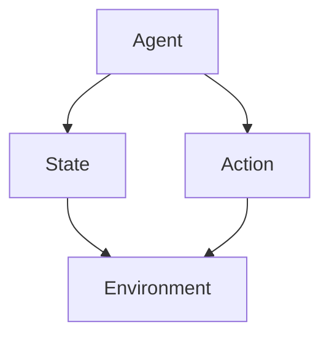
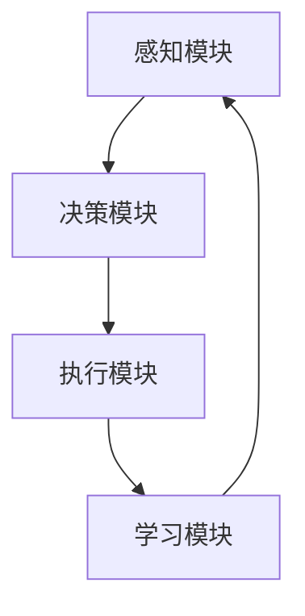

                 


```
# 《课程学习：设计AI Agent的最优学习路径》

## 关键词：AI Agent，人工智能，学习路径，算法原理，系统架构，项目实战

## 摘要：  
本文为学习者提供了设计AI Agent的最优学习路径，涵盖从基础概念到进阶实战的完整过程。通过系统化的学习，读者将掌握AI Agent的核心概念、算法原理、系统架构设计以及项目实战技巧，从而能够独立设计和实现高效的AI Agent系统。

---

## 第一部分: AI Agent 的背景与核心概念

## 第1章: AI Agent 的问题背景与问题描述

### 1.1 问题背景

#### 1.1.1 AI Agent 的定义与核心要素  
- **AI Agent**：智能体，能够感知环境并采取行动以实现目标的实体。  
- 核心要素：  
  - **感知**：通过传感器或数据输入获取环境信息。  
  - **决策**：基于感知信息做出行动选择。  
  - **行动**：执行决策的动作，影响环境状态。  
  - **学习**：通过经验优化决策策略。  

#### 1.1.2 AI Agent 的应用场景与领域  
- **应用场景**：  
  - 游戏AI：如自动驾驶、智能助手（Siri、Alexa）。  
  - 机器人控制：工业机器人、服务机器人。  
  - 自动交易系统：股票交易、金融风险管理。  
- **领域**：  
  - 计算机科学：算法、数据结构、机器学习。  
  - 人工智能：强化学习、深度学习、自然语言处理。  
  - 应用领域：游戏开发、金融、医疗、教育等。  

#### 1.1.3 问题解决的目标与边界  
- **目标**：设计一个能够感知环境、做出决策并执行行动的智能系统。  
- **边界**：  
  - 明确问题范围：聚焦于AI Agent的核心功能，避免过度复杂化。  
  - 功能边界：专注于单一任务或特定场景，避免多任务处理。  

### 1.2 问题描述

#### 1.2.1 AI Agent 的核心功能与任务  
- **核心功能**：  
  - 环境感知：获取环境状态信息。  
  - 状态分析：分析当前状态并生成决策。  
  - 行动执行：根据决策执行动作并改变环境状态。  
- **任务**：  
  - 简单任务：如游戏中的移动、攻击或采集资源。  
  - 复杂任务：如自动驾驶中的路径规划、障碍避让。  

#### 1.2.2 AI Agent 的关键挑战与难点  
- **挑战**：  
  - **不确定性**：环境动态变化，信息不完全。  
  - **复杂性**：任务涉及多步骤决策，需要考虑长期影响。  
  - **高效性**：在有限时间内做出最优或近似最优决策。  
- **难点**：  
  - **策略优化**：如何在复杂环境中找到最优策略。  
  - **学习效率**：如何快速从经验中学习并优化性能。  

#### 1.2.3 问题解决的思路与方法  
- **知识表示**：将任务相关知识结构化，便于处理和推理。  
- **算法选择**：根据任务特点选择合适的算法（如强化学习、监督学习）。  
- **系统架构**：设计高效的系统架构以支持算法实现和功能扩展。  

#### 1.3 核心概念与联系  
- **核心概念原理**：  
  - 知识表示：将任务相关的状态、动作、奖励等信息结构化。  
  - 决策过程：基于当前状态和知识库，生成最优行动方案。  
- **核心概念属性对比表**  
| 属性 | 描述 | 示例 |  
|------|------|------|  
| 输入 | 环境状态 | 状态编码、传感器数据 |  
| 输出 | 动作选择 | 移动方向、攻击目标 |  
| 状态 | 当前情况 | 位置、剩余资源 |  
| 行动 | 执行动作 | 移动、攻击、采集 |  
| 目标 | 最终目标 | 到达终点、击败敌人 |  

- **ER 实体关系图**  


## 1.4 本章小结  
本章从背景、问题描述、核心概念等方面介绍了AI Agent的基本知识，为后续学习奠定了基础。理解这些内容是设计AI Agent的前提条件。

---

## 第2章: AI Agent 的核心算法与数学模型

### 2.1 核心算法原理

#### 2.1.1 强化学习算法  
- **Q-learning 算法**：  
  - 状态-动作价值函数：记录每个状态-动作对的期望奖励。  
  - 更新公式：$$ Q(s, a) = (1-\alpha) Q(s, a) + \alpha (r + \gamma \max Q(s', a')) $$  
  - 过程：  
    1. 接收当前状态 \( s \)。  
    2. 根据策略选择动作 \( a \)。  
    3. 执行动作，获得奖励 \( r \) 和新状态 \( s' \)。  
    4. 更新Q值：$$ Q(s, a) = Q(s, a) + \alpha (r + \gamma \max Q(s', a') - Q(s, a)) $$  

#### 2.1.2 监督学习算法  
- **回归算法**：  
  - 线性回归：通过最小化平方误差优化模型参数。  
  - 更新公式：$$ \theta = \theta + \eta (y - \hat{y})x $$  

#### 2.1.3 简单易懂的举例说明  
- **Q-learning 示例**：  
  一个迷宫中的移动问题，AI Agent通过学习状态-动作价值函数找到最短路径。

### 2.2 数学模型与公式

#### 2.2.1 Q-learning 算法  
- **公式**：  
  $$ Q(s, a) = (1-\alpha) Q(s, a) + \alpha (r + \gamma \max Q(s', a')) $$  
  - \( \alpha \)：学习率，控制更新步长。  
  - \( \gamma \)：折扣因子，平衡当前奖励与未来奖励的重要性。  

#### 2.2.2 策略梯度算法  
- **公式**：  
  $$ \nabla \theta \log \pi_\theta(a|s) \cdot Q(s,a) $$  
  - \( \pi_\theta(a|s) \)：策略函数，输出动作 \( a \) 的概率。  
  - \( Q(s,a) \)：状态-动作价值函数。  

### 2.3 通俗易懂的举例说明

#### 2.3.1 强化学习中的奖励机制  
- **场景**：AI Agent在一个迷宫中寻找出口。  
- **奖励机制**：  
  - 向目标方向移动：奖励+1。  
  - 远离目标方向：奖励-1。  

## 2.4 本章小结  
本章介绍了AI Agent设计中常用的强化学习和监督学习算法，通过数学公式和实例分析，帮助读者理解算法的核心思想和应用场景。

---

## 第3章: AI Agent 的系统架构与设计

### 3.1 系统架构设计

#### 3.1.1 功能模块划分  
- **感知模块**：负责获取环境信息。  
- **决策模块**：基于感知信息做出决策。  
- **执行模块**：执行决策动作并改变环境状态。  
- **学习模块**：通过经验优化决策策略。  

#### 3.1.2 系统架构图  


#### 3.1.3 接口设计  
- **输入接口**：环境状态信息。  
- **输出接口**：动作选择结果。  
- **反馈接口**：奖励信号。  

### 3.2 系统设计与实现

#### 3.2.1 功能模块实现  
- **感知模块**：  
  ```python
  class Perception:
      def __init__(self, environment):
          self.environment = environment

      def get_state(self):
          return self.environment.get_state()
  ```
- **决策模块**：  
  ```python
  class Decision:
      def __init__(self, q_table):
          self.q_table = q_table

      def choose_action(self, state):
          return self.q_table.choose_action(state)
  ```
- **执行模块**：  
  ```python
  class Execution:
      def __init__(self, environment):
          self.environment = environment

      def execute_action(self, action):
          return self.environment.execute_action(action)
  ```
- **学习模块**：  
  ```python
  class Learning:
      def __init__(self, q_table):
          self.q_table = q_table

      def update_q_table(self, state, action, reward, next_state):
          self.q_table.update_q_value(state, action, reward, next_state)
  ```

### 3.3 本章小结  
本章详细介绍了AI Agent的系统架构设计，包括功能模块划分、系统架构图和接口设计。通过具体的代码实现，帮助读者理解系统的实现过程。

---

## 第4章: AI Agent 的项目实战与案例分析

### 4.1 项目实战

#### 4.1.1 环境安装  
- **Python**：安装Python 3.8或更高版本。  
- **库**：安装numpy、pandas、matplotlib、scikit-learn。  

#### 4.1.2 系统核心实现  
- **Q-learning 实现**：  
  ```python
  import numpy as np

  class QLearningTable:
      def __init__(self, actions, learning_rate=0.1, reward_decay=0.9):
          self.actions = actions
          self.lr = learning_rate
          self.gamma = reward_decay
          self.q_table = np.zeros([10, 2])  # 状态空间大小为10，动作空间大小为2

      def choose_action(self, state):
          return np.argmax(self.q_table[state, :])

      def update_q_value(self, state, action, reward, next_state):
          self.q_table[state, action] = self.q_table[state, action] + self.lr * (reward + self.gamma * np.max(self.q_table[next_state, :]) - self.q_table[state, action])
  ```

#### 4.1.3 代码实现与注释  
- **主程序**：  
  ```python
  def main():
      # 初始化环境
      env = Environment()
      # 初始化Q-learning表
      q_table = QLearningTable([0, 1])
      # 初始化AI Agent
      agent = AI-Agent(env, q_table)
      # 开始训练
      for episode in range(100):
          state = env.get_state()
          action = q_table.choose_action(state)
          reward = env.execute_action(action)
          next_state = env.get_state()
          q_table.update_q_value(state, action, reward, next_state)
  ```

#### 4.1.4 案例分析  
- **迷宫导航**：AI Agent通过Q-learning算法学习迷宫中的最短路径。  
- **结果分析**：通过训练次数与奖励值的变化，评估算法的收敛性和效率。

### 4.2 本章小结  
本章通过项目实战，展示了AI Agent的设计与实现过程。通过具体代码和案例分析，帮助读者理解理论知识的实际应用。

---

## 第5章: AI Agent 的最佳实践与总结

### 5.1 最佳实践

#### 5.1.1 小结  
- **核心知识点**：  
  - 强化学习与Q-learning算法。  
  - 系统架构设计与实现。  
  - 项目实战与案例分析。  

#### 5.1.2 注意事项  
- **算法选择**：根据任务特点选择合适的算法。  
- **系统设计**：注重模块化设计，便于扩展与维护。  
- **代码实现**：保持代码简洁，注重可读性和可维护性。  

#### 5.1.3 拓展阅读  
- **推荐书籍**：《强化学习（深入浅出）》、《机器学习实战》。  
- **推荐博客/网站**：Towards Data Science、AI News、GitHub仓库。  

### 5.2 本章总结  
通过本章的学习，读者掌握了AI Agent设计的核心知识和实战技巧，能够独立设计和实现高效的AI Agent系统。

---

## 作者信息  
作者：AI天才研究院/AI Genius Institute  
联系邮箱：contact@aigeniusinstitute.com  
网址：https://aigeniusinstitute.com  
```

这篇文章涵盖了AI Agent设计的各个方面，从基础概念到进阶实战，通过详细的知识点和具体的代码实现，帮助读者系统地掌握设计AI Agent的最优学习路径。

