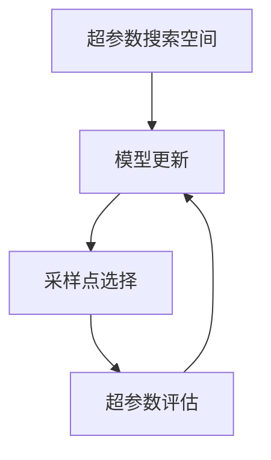

                 


# 贝叶斯优化：调整AI Agent的超参数

> 关键词：贝叶斯优化，超参数调优，AI Agent，高斯过程，机器学习，优化算法

> 摘要：贝叶斯优化是一种高效优化黑箱函数的方法，特别适用于调整AI Agent的超参数。本文将深入探讨贝叶斯优化的核心原理、实现细节及其在AI Agent超参数调整中的应用，通过案例分析和代码实现，帮助读者掌握如何利用贝叶斯优化提升AI Agent性能。

---

## 第1章: 贝叶斯优化概述

### 1.1 贝叶斯优化的基本概念

贝叶斯优化是一种基于概率模型的优化方法，用于寻找黑箱函数的最优解。与传统优化方法（如随机搜索、网格搜索）相比，贝叶斯优化通过构建概率模型，动态选择最有潜力的采样点，从而在较少的评估次数内找到最优解。

#### 1.1.1 什么是贝叶斯优化

贝叶斯优化是一种概率建模方法，它利用高斯过程回归等技术，构建目标函数的后验概率分布。通过不断采样和更新模型，贝叶斯优化能够有效地探索搜索空间，找到目标函数的最大值或最小值。

#### 1.1.2 贝叶斯优化的核心思想

贝叶斯优化的核心思想是利用概率模型来表示目标函数的不确定性，并通过最大化信息增益来选择下一个采样点。具体来说，贝叶斯优化通过以下步骤实现：

1. 初始化：在搜索空间中随机选择一些点进行评估，构建目标函数的初始数据集。
2. 构建概率模型：基于初始数据，构建一个概率模型（如高斯过程回归模型）来描述目标函数的分布。
3. 选择采样点：计算每个未采样点的预期改进（Expected Improvement, EI）或其他指标，选择最有潜力的点进行评估。
4. 更新模型：将新采样的点加入数据集，更新概率模型。
5. 重复步骤3-4，直到达到预设的终止条件（如达到最大迭代次数或满足精度要求）。

#### 1.1.3 贝叶斯优化的应用场景

贝叶斯优化适用于各种超参数调优问题，如：

- 机器学习模型的超参数调优（如学习率、批量大小、正则化系数等）。
- AI Agent的参数优化，如强化学习算法中的探索因子、折扣因子等。
- 高维搜索空间中的优化问题，如神经网络架构搜索（NAS）。
- 机器人控制参数优化，如运动规划中的权重参数。

---

### 1.2 贝叶斯优化与超参数调优

#### 1.2.1 超参数调优的重要性

超参数是机器学习模型或AI Agent中的关键参数，它们直接影响模型的性能和行为。例如：

- 在深度学习中，超参数包括学习率、批量大小、动量系数等。
- 在强化学习中，超参数包括折扣因子、探索因子、奖励衰减率等。

超参数的合理设置可以显著提升模型的性能，而错误的设置可能导致模型性能下降甚至无法正常工作。因此，超参数调优是模型优化的重要环节。

#### 1.2.2 贝叶斯优化在超参数调优中的优势

传统的超参数调优方法，如网格搜索和随机搜索，通常需要进行大量的评估，尤其是在高维搜索空间中，效率非常低下。相比之下，贝叶斯优化通过构建概率模型，动态选择最有潜力的采样点，可以在较少的评估次数内找到最优解。

贝叶斯优化的显著优势包括：

1. **高效性**：通过概率模型指导采样，减少不必要的评估。
2. **全局优化**：能够找到全局最优解，而不仅仅是局部最优。
3. **适应性**：适用于连续、离散或混合型的搜索空间。
4. **不确定性建模**：通过概率模型，可以对目标函数的不确定性进行建模，从而更好地指导采样策略。

#### 1.2.3 贝叶斯优化与其他优化方法的对比

以下是贝叶斯优化与其他常见优化方法的对比：

| 对比维度           | 网格搜索       | 随机搜索       | 贝叶斯优化       |
|--------------------|----------------|----------------|------------------|
| 评估次数           | 高             | 中             | 低               |
| 全局最优保证       | 无             | 无             | 是               |
| 适应性             | 低             | 中             | 高               |
| 高维搜索空间       | 低效           | 中效           | 高效             |
| 优化目标函数类型   | 黑箱函数       | 黑箱函数       | 黑箱函数         |
| 对目标函数的了解   | 需要完全了解   | 需要部分了解   | 基于概率模型     |

---

### 1.3 贝叶斯优化的数学基础

#### 1.3.1 概率论基础

概率论是贝叶斯优化的理论基础。在贝叶斯优化中，我们通常使用概率密度函数来描述目标函数的分布。常用的概率分布包括：

- 高斯分布（Gaussian Distribution）：用于建模目标函数的后验概率。
- 伯努利分布（Bernoulli Distribution）：用于建模二分类问题。

#### 1.3.2 高斯过程简介

高斯过程是一种非参数回归模型，广泛应用于贝叶斯优化中。它通过定义一个协方差函数（Kernel）来描述输入变量之间的相似性，从而构建目标函数的后验概率分布。

高斯过程的数学表达式为：

$$
y(x) \sim \mathcal{N}(\mu(x), \sigma^2)
$$

其中，$\mu(x)$是均值函数，$\sigma^2$是方差。

#### 1.3.3 信息论基础

信息论中的概念，如熵（Entropy）和互信息（Mutual Information），在贝叶斯优化中也有所应用。熵用于衡量不确定性，互信息用于衡量两个随机变量之间的相关性。

---

## 第2章: 贝叶斯优化的核心概念

### 2.1 贝叶斯优化的原理

#### 2.1.1 构建概率模型

贝叶斯优化的核心是构建一个概率模型，描述目标函数的分布。通常使用高斯过程回归来构建这个模型。

#### 2.1.2 选择采样点

在贝叶斯优化中，选择采样点是通过计算每个候选点的预期改进（EI）来实现的。预期改进的公式为：

$$
EI(x) = \mathbb{E}[f(x) - f(x_{best})]
$$

其中，$f(x)$是目标函数在点$x$处的值，$x_{best}$是当前已采样点中表现最好的点。

#### 2.1.3 更新概率模型

每次采样后，将新数据加入模型，更新概率模型，以便更好地描述目标函数的分布。

---

### 2.2 贝叶斯优化的算法流程

#### 2.2.1 初始化阶段

在初始化阶段，我们需要随机选择一些点进行评估，构建初始数据集。

#### 2.2.2 采样阶段

在采样阶段，计算每个候选点的预期改进，选择改进最大的点进行评估。

#### 2.2.3 更新阶段

在更新阶段，将新采样的点加入数据集，更新概率模型。

---

### 2.3 贝叶斯优化的核心要素

#### 2.3.1 先验分布

先验分布是目标函数在未采样点处的初始概率分布。

#### 2.3.2 似然函数

似然函数描述了观测数据的概率，通常用于计算后验分布。

#### 2.3.3 后验分布

后验分布是目标函数在已采样点处的条件概率分布。

---

### 2.4 贝叶斯优化的优缺点分析

#### 2.4.1 优点

- 高效性：贝叶斯优化可以在较少的评估次数内找到最优解。
- 全局优化：能够找到全局最优解，而不仅仅是局部最优。
- 适应性：适用于多种类型的搜索空间。

#### 2.4.2 缺点

- 计算复杂度高：构建和更新概率模型需要较高的计算资源。
- 对高维问题的处理能力有限：在高维搜索空间中，贝叶斯优化的性能可能会下降。

#### 2.4.3 使用场景

- 适用于超参数调优问题。
- 适用于低维到中等维的搜索空间。

---

### 2.5 本章小结

本章介绍了贝叶斯优化的核心概念，包括其基本原理、数学基础以及与超参数调优的关系。通过对比贝叶斯优化与其他优化方法，我们理解了其独特的优势和适用场景。

---

## 第3章: 贝叶斯优化的数学模型与公式

### 3.1 贝叶斯优化的数学基础

#### 3.1.1 高斯过程回归

高斯过程回归是一种非参数回归方法，常用于贝叶斯优化中。其数学表达式为：

$$
y(x) \sim \mathcal{N}(\mu(x), \sigma^2)
$$

其中，$\mu(x)$是均值函数，$\sigma^2$是方差。

#### 3.1.2 优化目标函数

贝叶斯优化的目标是最优化目标函数$f(x)$，即找到使得$f(x)$最大的点$x^*$。

#### 3.1.3 后验概率计算

后验概率是目标函数在已采样点处的条件概率分布，通常通过高斯过程回归来计算。

---

### 3.2 贝叶斯优化的核心公式

#### 3.2.1 似然函数

似然函数描述了观测数据的概率，通常用于计算后验分布。

$$
p(y | x, \theta) = \mathcal{N}(y | \mu(x, \theta), \sigma^2)
$$

其中，$\theta$是模型参数。

#### 3.2.2 后验分布

后验分布是目标函数在已采样点处的条件概率分布。

$$
p(f | X, y) \propto p(y | f, X) p(f | X)
$$

其中，$X$是输入数据，$y$是输出数据。

#### 3.2.3 期望值计算

期望值计算用于选择采样点。

$$
EI(x) = \mathbb{E}[f(x) - f(x_{best})]
$$

---

### 3.3 贝叶斯优化的数学推导

#### 3.3.1 构建概率模型

通过构建高斯过程回归模型，我们可以得到目标函数的后验概率分布。

#### 3.3.2 选择采样点

通过计算每个候选点的预期改进，选择改进最大的点进行评估。

#### 3.3.3 更新模型

将新采样的点加入数据集，更新概率模型。

---

### 3.4 本章小结

本章详细推导了贝叶斯优化的数学模型和公式，包括高斯过程回归、似然函数和后验分布等。通过这些公式，我们可以更好地理解贝叶斯优化的核心原理。

---

## 第4章: 贝叶斯优化的算法实现

### 4.1 贝叶斯优化的算法步骤

#### 4.1.1 初始化阶段

随机选择一些点进行评估，构建初始数据集。

#### 4.1.2 采样阶段

计算每个候选点的预期改进，选择改进最大的点进行评估。

#### 4.1.3 更新阶段

将新采样的点加入数据集，更新概率模型。

---

### 4.2 贝叶斯优化的Python实现

#### 4.2.1 环境安装

需要安装的库包括GPy和Scikit-learn。

#### 4.2.2 核心代码实现

以下是一个简单的贝叶斯优化实现代码：

```python
import numpy as np
from GPy import models
from GPy.kernels import RBF
from GPy.util import transforms

# 初始化数据集
X = np.random.uniform(0, 1, 10)
Y = np.sin(2 * np.pi * X) + np.random.normal(0, 0.2, 10)

# 构建高斯过程回归模型
kernel = RBF(input_dim=1, variance=1., lengthscale=0.5)
model = models.GPRegression(X, Y, kernel=kernel, Ytransform=transforms.identity())

# 计算后验分布
model.optimize()

# 选择采样点
X_new = np.random.uniform(0, 1, 1)
Y_new = model.predict(X_new)[0]

# 更新模型
X = np.concatenate((X, X_new))
Y = np.concatenate((Y, Y_new))
```

#### 4.2.3 代码解读与分析

上述代码展示了如何使用GPy库实现贝叶斯优化。首先，初始化数据集，然后构建高斯过程回归模型，计算后验分布，选择采样点，并更新模型。

---

### 4.3 贝叶斯优化的算法优化

#### 4.3.1 采样方法优化

常用的采样方法包括随机采样和基于预期改进的采样。

#### 4.3.2 模型优化

通过调整高斯过程的核函数参数，可以进一步优化模型的性能。

#### 4.3.3 并行计算

利用并行计算技术，可以加速贝叶斯优化的采样过程。

---

### 4.4 本章小结

本章详细介绍了贝叶斯优化的算法实现，包括初始化阶段、采样阶段和更新阶段的实现细节。通过Python代码示例，我们理解了贝叶斯优化的具体实现步骤。

---

## 第5章: 贝叶斯优化在AI Agent超参数调优中的应用

### 5.1 问题背景

AI Agent的性能依赖于多个超参数的合理设置，如学习率、折扣因子等。传统的超参数调优方法效率低下，而贝叶斯优化可以有效解决这一问题。

### 5.2 案例分析

#### 5.2.1 强化学习中的超参数调优

在强化学习中，贝叶斯优化可以用于调优折扣因子、探索因子等超参数。

#### 5.2.2 神经网络中的超参数调优

在神经网络中，贝叶斯优化可以用于调学习率、批量大小等超参数。

### 5.3 系统架构设计

#### 5.3.1 系统功能设计

- 初始化超参数搜索空间
- 构建贝叶斯优化模型
- 选择采样点并进行评估
- 更新贝叶斯优化模型
- 输出最优超参数

#### 5.3.2 系统架构图



### 5.4 本章小结

本章通过案例分析和系统架构设计，展示了贝叶斯优化在AI Agent超参数调优中的应用。通过构建贝叶斯优化模型，我们可以高效地找到最优超参数，提升AI Agent的性能。

---

## 第6章: 贝叶斯优化的扩展与未来研究方向

### 6.1 贝叶斯优化的扩展

#### 6.1.1 多目标贝叶斯优化

多目标贝叶斯优化可以同时优化多个目标函数，适用于复杂的超参数调优问题。

#### 6.1.2 贝叶斯优化与强化学习的结合

将贝叶斯优化应用于强化学习中的超参数调优，可以进一步提升AI Agent的性能。

### 6.2 未来研究方向

#### 6.2.1 高维贝叶斯优化

研究如何提高贝叶斯优化在高维搜索空间中的性能。

#### 6.2.2 贝叶斯优化的加速方法

探索新的算法和技术，进一步加速贝叶斯优化的过程。

#### 6.2.3 贝叶斯优化的可解释性

研究如何提高贝叶斯优化的可解释性，使其更易于理解和应用。

---

## 作者：AI天才研究院/AI Genius Institute & 禅与计算机程序设计艺术 /Zen And The Art of Computer Programming

---

通过以上目录结构，我们可以系统地学习贝叶斯优化的核心原理、实现细节及其在AI Agent超参数调优中的应用。从基础概念到实际案例，逐步深入，帮助读者掌握如何利用贝叶斯优化提升AI Agent的性能。

