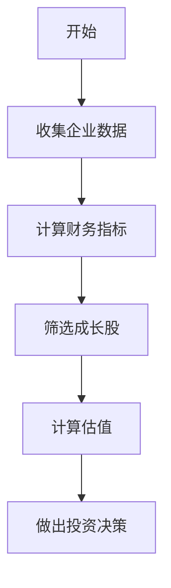

                 

# 费雪到现代：成长型投资的发展

## 关键词：
- 成长型投资
- 费雪
- 股票投资
- 价值投资
- 投资策略

## 摘要：
本文系统性地探讨了成长型投资的发展历程，从费雪的经典理念到现代的量化分析，深入解析了成长型投资的核心概念、数学模型、算法原理和实际应用。通过对比分析、案例研究和系统架构设计，揭示了成长型投资在不同历史阶段的演变与创新，为投资者提供了理论与实践相结合的深度指导。

---

# 第一部分: 成长型投资的背景与核心概念

---

## 第1章: 成长型投资的起源与发展

### 1.1 成长型投资的定义与特点
#### 1.1.1 成长型投资的定义
成长型投资是一种以企业成长潜力为核心的投资策略，旨在通过投资于具备持续增长能力的企业，实现长期资本增值。其核心在于识别那些能够在未来一段时间内实现收入和利润快速增长的企业。

#### 1.1.2 成长型投资的核心特点
- **长期视角**：关注企业的长期增长潜力，而非短期收益。
- **高增长预期**：投资于收入增长率高于行业平均水平的企业。
- **高风险高回报**：成长型投资通常伴随着较高的波动性和风险。
- **注重基本面**：通过分析企业的财务状况、盈利能力和发展潜力来筛选投资标的。

#### 1.1.3 成长型投资与价值投资的区别
| 方面       | 成长型投资                     | 价值投资                     |
|------------|-------------------------------|-------------------------------|
| 核心目标   | 寻找具备高增长潜力的企业       | 寻找价格低于内在价值的企业   |
| 关注点     | 企业的成长性和未来潜力       | 企业的当前价值与市场价格的差异 |
| 适用场景   | 高成长行业或新兴市场         | 成熟行业或周期性低谷行业     |
| 风险水平   | 较高                         | 较低                         |

---

### 1.2 成长型投资的起源
#### 1.2.1 费雪的成长型投资理念
菲利普·费雪（Philip Fisher）是成长型投资的鼻祖，他在20世纪提出了“成长股”概念。他认为，投资者应该投资于那些具备以下特征的企业：
- 长期增长潜力。
- 管理层具备卓越的决策能力和道德品质。
- 产品或服务具备独特的竞争优势。

#### 1.2.2 现代成长型投资的发展
随着金融市场的不断发展，成长型投资逐渐从传统的基本面分析向量化分析和大数据应用转型。现代投资者不仅关注企业的财务指标，还利用技术手段（如机器学习）来筛选和评估成长股。

#### 1.2.3 成长型投资的演变与创新
- **传统成长型投资**：以费雪为代表，侧重于企业的基本面分析。
- **量化成长型投资**：利用大数据和算法进行选股。
- **科技驱动的成长型投资**：投资于人工智能、大数据等新兴科技领域的企业。

---

### 1.3 成长型投资的边界与外延
#### 1.3.1 成长型投资的适用场景
- 初创期或快速成长期的企业。
- 高科技行业或新兴市场。
- 经济周期上升阶段。

#### 1.3.2 成长型投资的局限性
- 高波动性：成长股的价格波动较大。
- 高风险：部分成长股可能因市场环境变化而大幅下跌。
- 需要较高的投研能力：筛选成长股需要深入的行业研究和财务分析。

#### 1.3.3 成长型投资与其他投资策略的关系
- **互补关系**：成长型投资与价值投资可以结合使用，前者关注未来增长，后者关注当前低估。
- **竞争关系**：在某些市场环境下，成长型投资可能与趋势投资（如技术分析）产生竞争。

---

### 1.4 成长型投资的核心要素
#### 1.4.1 成长股的定义与特征
成长股是指那些收入和利润增长率高于行业平均水平的股票。其特征包括：
- 收入增长率高。
- 净利润率不断提升。
- 财务状况健康，现金流充裕。

#### 1.4.2 成长型投资的选股标准
| 指标         | 选股标准                     |
|--------------|------------------------------|
| 收入增长率   | > 行业平均水平               |
| 净利润率      | 逐年提升                    |
| 市盈率（P/E）| < 行业平均水平               |
| 市净率（P/B）| < 行业平均水平               |

#### 1.4.3 成长型投资的风险管理
- **分散投资**：避免过度集中于单一行业或企业。
- **动态调整**：定期评估投资组合，及时调整持仓。
- **风险管理模型**：利用VaR（Value at Risk）等工具控制投资风险。

---

## 第2章: 成长型投资的核心概念与联系

### 2.1 成长型投资的核心概念
#### 2.1.1 成长股的财务指标分析
- **收入增长率**：$收入增长率 = \frac{\text{本期收入} - \text{上期收入}}{\text{上期收入}} \times 100\%$。
- **净利润率**：$净利润率 = \frac{\text{净利润}}{\text{收入}} \times 100\%$。
- **ROE（净资产收益率）**：$ROE = \frac{\text{净利润}}{\text{净资产}} \times 100\%$。

#### 2.1.2 成长型企业的竞争优势
| 竞争优势类型 | 具体表现                   |
|--------------|----------------------------|
| 技术优势     | 拥有专利技术或研发能力   |
| 市场优势     | 高市场份额或品牌影响力   |
| 资源优势     | 独特的原材料供应或成本优势 |

#### 2.1.3 成长型投资的长期视角
成长型投资强调企业的未来增长潜力，而非当前的盈利能力。这种长期视角要求投资者具备耐心和信心，能够在市场波动中保持投资策略的稳定性。

---

### 2.2 成长型投资的核心原理
#### 2.2.1 成长型投资的逻辑框架
1. 筛选具备高增长潜力的企业。
2. 评估企业的财务健康状况。
3. 综合考虑市场环境和行业趋势。
4. 构建多元化的投资组合。

#### 2.2.2 成长型投资的数学模型
##### 成长股筛选公式：
$$ \text{筛选条件} = \text{收入增长率} > 15\% \land \text{净利润率} > 10\% \land \text{ROE} > 15\% $$

##### 估值模型：
$$ \text{合理估值} = \text{市盈率} \times \text{净利润} $$

#### 2.2.3 成长型投资的决策流程

---

### 2.3 成长型投资与相关概念的对比
#### 2.3.1 成长型投资与价值投资的对比
| 方面       | 成长型投资                     | 价值投资                     |
|------------|-------------------------------|-------------------------------|
| 核心目标   | 寻找高增长企业                 | 寻找低估企业                 |
| 关注点     | 企业的未来增长潜力             | 企业的当前价值与市场价格的差异 |
| 适用场景   | 高成长行业或新兴市场         | 成熟行业或周期性低谷行业     |

#### 2.3.2 成长型投资与趋势投资的对比
| 方面       | 成长型投资                     | 趋势投资                     |
|------------|-------------------------------|-------------------------------|
| 核心目标   | 寻找具备长期增长潜力的企业     | 把握市场的短期趋势           |
| 分析方法   | 基本面分析                    | 技术分析                    |
| 风险水平   | 较高                         | 较高                         |

---

## 第3章: 成长型投资的数学模型与算法原理

---

通过以上目录结构，我们可以看到本文将从成长型投资的背景、核心概念、数学模型、系统分析、项目实战等多方面展开详细探讨，确保读者能够全面理解成长型投资的理论与实践。

