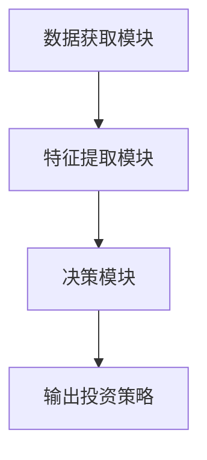

                 


# 费雪成长股选择的AI革新：多智能体系统的角色

---

## 关键词：
- 费雪成长股
- AI
- 多智能体系统
- 投资策略
- 选股算法

---

## 摘要：
本文探讨了将人工智能（AI）技术，特别是多智能体系统（MAS），应用于费雪成长股选择的创新方法。文章首先介绍了费雪成长股投资理论的核心思想及其在现代投资中的应用，分析了AI技术在金融投资中的潜力与挑战。随后，详细阐述了多智能体系统在选股中的独特优势，包括其协作机制、决策算法和信息处理能力。通过结合强化学习、遗传算法和神经网络等AI技术，本文提出了一种基于多智能体系统的成长股选择算法，并设计了系统的整体架构与模块化实现方案。最后，通过实际案例分析，验证了该方法的有效性，并展望了未来的研究方向。

---

# 第一部分: 费雪成长股选择的AI革新概述

## 第1章: 费雪成长股投资理念与AI结合的背景

### 1.1 费雪成长股投资理论概述

#### 1.1.1 费雪的成长股定义与核心要素
费雪（Philip Fisher）是20世纪著名的投资家，他提出的“成长股”概念是价值投资的重要理论之一。成长股是指那些销售收入和利润能够持续以高于行业平均水平的速度增长的企业。费雪认为，投资者应关注企业的成长潜力，而非仅仅关注当前的盈利能力。

**费雪成长股的核心要素：**
1. **高利润率**：企业的产品或服务具有较高的盈利能力。
2. **持续增长**：企业销售收入和利润能够持续增长。
3. **竞争优势**：企业具备独特的竞争优势，如品牌、技术或市场地位。
4. **管理团队**：优秀的管理团队是企业持续增长的关键。

#### 1.1.2 费雪投资策略的演变与现状
费雪的投资策略在实践中不断发展，从早期的“烟蒂投资”到后来的成长股投资，逐步演变为一种基于企业基本面分析的价值投资方法。然而，随着市场的复杂化和信息量的爆炸式增长，传统的费雪投资策略在实际操作中面临诸多挑战，例如：
- 数据量大：需要分析大量财务数据和市场信息。
- 计算复杂：需要对多个企业进行横向和纵向对比。
- 市场变化快：市场波动和企业基本面变化难以实时捕捉。

#### 1.1.3 费雪投资理论在现代投资中的应用
现代投资者在运用费雪成长股理论时，往往需要借助技术手段来提高选股效率和准确性。然而，传统的基于人工分析的方法已经难以满足现代投资的需求。因此，引入AI技术成为必然趋势。

---

### 1.2 AI技术在金融投资中的潜力

#### 1.2.1 AI技术在金融领域的应用现状
AI技术已经在金融领域得到了广泛应用，尤其是在以下几个方面：
1. **量化投资**：基于算法的交易策略。
2. **风险管理**：通过AI模型预测市场风险。
3. **数据挖掘**：从海量数据中提取有用信息。
4. **智能投顾**：为投资者提供个性化的投资建议。

#### 1.2.2 AI在股票投资中的优势与挑战
**优势：**
- 数据处理能力强：AI能够快速处理大量非结构化数据，例如新闻、社交媒体和财报。
- 预测准确性高：通过深度学习模型，AI可以发现数据中的复杂模式。
- 自适应能力强：AI模型可以实时调整策略以应对市场变化。

**挑战：**
- 数据质量：AI模型对数据质量要求较高，数据偏差可能影响结果。
- 黑箱问题：深度学习模型的决策过程往往难以解释。
- 市场复杂性：金融市场受到多种因素影响，AI模型难以完全捕捉。

#### 1.2.3 多智能体系统在金融投资中的独特价值
多智能体系统（MAS）是一种由多个智能体协作完成任务的系统。在金融投资中，MAS可以模拟市场中的多参与方，例如投资者、分析师和交易员。通过协作，MAS能够更全面地分析市场信息，制定更优化的投资策略。

---

### 1.3 费雪成长股选择与AI结合的必要性

#### 1.3.1 传统选股方法的局限性
传统费雪成长股选择方法依赖于人工分析，存在以下问题：
- **效率低**：需要大量时间进行数据收集和分析。
- **主观性**：受分析师主观判断影响较大。
- **覆盖面有限**：难以覆盖所有潜在的优质企业。

#### 1.3.2 AI技术如何弥补传统方法的不足
AI技术能够通过自动化处理大量数据，提高选股效率和准确性。例如：
- **数据清洗与特征提取**：AI可以自动从海量数据中提取有用的特征。
- **模式识别**：通过机器学习算法发现数据中的隐藏模式。
- **实时监控**：AI可以实时跟踪市场变化，快速调整投资策略。

#### 1.3.3 多智能体系统在选股中的创新应用
多智能体系统在选股中的应用主要体现在以下几个方面：
1. **信息处理**：多个智能体分别处理不同类型的市场信息，如财务数据、新闻和社交媒体。
2. **协作决策**：智能体之间通过协作生成更全面的投资决策。
3. **动态调整**：根据市场变化动态调整选股策略。

---

## 第2章: 多智能体系统的核心概念与架构

### 2.1 多智能体系统（MAS）的基本原理

#### 2.1.1 多智能体系统的定义与特点
多智能体系统（MAS）是由多个智能体组成的系统，这些智能体通过协作完成共同目标。MAS的特点包括：
- **分布式智能**：每个智能体都有自己的决策能力。
- **协作性**：智能体之间通过协作完成任务。
- **动态性**：系统能够根据环境变化进行调整。

#### 2.1.2 多智能体系统与单智能体系统的区别
| 特性 | 单智能体系统 | 多智能体系统 |
|------|--------------|--------------|
| 智能体数量 | 1            | 多            |
| 决策集中度 | 高            | 低            |
| 任务处理 | 独立完成任务  | 协作完成任务  |

#### 2.1.3 多智能体系统的组成与功能模块
- **智能体**：负责处理特定任务。
- **通信模块**：负责智能体之间的信息交互。
- **协作机制**：负责任务分配和协调。

---

### 2.2 多智能体系统在金融投资中的应用架构

#### 2.2.1 投资决策的多智能体架构设计
在费雪成长股选择中，MAS可以分为以下几个功能模块：
1. **数据获取模块**：负责获取市场数据，如财务报表、新闻等。
2. **特征提取模块**：对数据进行清洗和特征提取。
3. **决策模块**：基于特征生成投资决策。

#### 2.2.2 多智能体系统在选股中的角色分配
- **数据智能体**：负责数据获取和预处理。
- **分析智能体**：负责特征提取和数据分析。
- **决策智能体**：负责生成投资策略。

#### 2.2.3 多智能体系统的通信协议
智能体之间的通信可以通过以下方式实现：
- **消息传递**：通过消息队列传递数据。
- **共享数据库**：通过共享数据库进行数据同步。

---

### 2.3 多智能体系统的协作机制与通信协议

#### 2.3.1 多智能体系统中的协作模型
协作模型包括以下几种：
- **协同式协作**：智能体之间通过协商完成任务。
- **竞争式协作**：智能体之间通过竞争提高整体性能。

#### 2.3.2 多智能体系统中的通信协议
通信协议包括：
- **点对点通信**：智能体之间直接通信。
- **广播通信**：所有智能体接收同一消息。

#### 2.3.3 多智能体系统中的任务分配算法
常用的任务分配算法包括：
- **基于规则的任务分配**：根据预设规则分配任务。
- **基于优化的任务分配**：通过优化算法动态分配任务。

---

## 第3章: 基于多智能体系统的成长股选择算法

### 3.1 多智能体系统在选股中的算法设计

#### 3.1.1 基于强化学习的选股策略
强化学习是一种通过试错方式优化决策的算法。在选股中，智能体可以通过强化学习不断优化投资策略。

**强化学习流程：**
1. **状态定义**：定义市场状态，如价格、成交量等。
2. **动作选择**：选择买入、卖出或持有。
3. **奖励机制**：根据收益情况给予奖励或惩罚。

#### 3.1.2 多智能体协作的特征选择算法
特征选择是选股的关键步骤。多智能体系统可以通过协作选择最优特征。

**特征选择流程：**
1. **数据获取**：获取企业的财务数据、市场数据等。
2. **特征提取**：提取特征，如市盈率、ROE等。
3. **特征评估**：评估特征的重要性，选择最优特征。

#### 3.1.3 基于遗传算法的优化策略
遗传算法是一种模拟自然选择的优化算法。在选股中，可以通过遗传算法优化投资组合。

**遗传算法流程：**
1. **初始种群**：随机生成多个投资组合。
2. **适应度评估**：评估每个组合的收益和风险。
3. **选择与交叉**：选择优秀的组合进行交叉，生成新组合。
4. **变异**：对新组合进行随机变异，优化性能。

---

### 3.2 多智能体系统的特征提取与数据处理

#### 3.2.1 数据预处理与特征工程
数据预处理包括：
- **数据清洗**：去除无效数据。
- **数据标准化**：将数据归一化处理。

特征工程包括：
- **特征选择**：选择重要特征。
- **特征组合**：将多个特征组合成新的特征。

#### 3.2.2 多智能体系统中的特征提取机制
多智能体系统可以分别处理不同类型的特征，例如：
- **财务特征**：市盈率、ROE等。
- **市场特征**：成交量、价格走势等。

#### 3.2.3 数据清洗与标准化方法
数据清洗方法包括：
- **去除缺失值**：删除有缺失值的样本。
- **处理异常值**：对异常值进行修正或删除。

---

### 3.3 多智能体系统的决策机制与预测模型

#### 3.3.1 基于神经网络的预测模型
神经网络是一种常用的预测模型。在选股中，可以通过神经网络预测股票价格走势。

**神经网络结构：**
1. **输入层**：输入市场特征。
2. **隐藏层**：处理数据，提取特征。
3. **输出层**：输出预测结果。

#### 3.3.2 多智能体协作的决策机制
多智能体系统可以通过协作生成更优的投资决策。例如：
- **投票机制**：多个智能体投票决定最终策略。
- **加权平均**：根据智能体的权重生成最终决策。

#### 3.3.3 基于概率论的决策优化方法
概率论在决策优化中具有重要作用。例如：
- **贝叶斯决策**：基于概率进行决策。
- **马尔可夫链**：建模市场状态变化。

---

## 第4章: 系统架构与模块设计

### 4.1 系统整体架构设计

#### 4.1.1 系统功能模块划分
系统功能模块包括：
1. **数据获取模块**：获取市场数据。
2. **特征提取模块**：提取特征。
3. **决策模块**：生成投资策略。

#### 4.1.2 系统模块之间的交互关系
模块之间的交互关系可以通过以下流程图表示：



#### 4.1.3 系统架构的可扩展性设计
系统架构设计应具有良好的可扩展性，例如：
- **模块化设计**：每个模块独立开发。
- **接口标准化**：模块之间通过标准化接口交互。

---

### 4.2 数据获取与处理模块

#### 4.2.1 数据源的选择与获取
数据源包括：
- **财务数据**：如股票价格、财务报表。
- **市场数据**：如成交量、市场指数。
- **新闻数据**：如公司公告、行业新闻。

#### 4.2.2 数据清洗与特征提取
数据清洗方法包括：
- **去除缺失值**：删除有缺失值的样本。
- **处理异常值**：对异常值进行修正或删除。

特征提取方法包括：
- **主成分分析（PCA）**：降低数据维度。
- **Lasso回归**：进行特征选择。

#### 4.2.3 数据存储与管理
数据存储可以采用数据库或分布式存储系统，例如：
- **关系型数据库**：如MySQL。
- **分布式数据库**：如Hadoop。

---

### 4.3 多智能体协作模块

#### 4.3.1 多智能体协作的实现方案
多智能体协作可以通过以下方式实现：
- **消息队列**：如Kafka。
- **共享数据库**：如MongoDB。

#### 4.3.2 多智能体系统的协作机制
协作机制包括：
- **协同式协作**：智能体之间通过协商完成任务。
- **竞争式协作**：智能体之间通过竞争提高整体性能。

#### 4.3.3 多智能体系统的通信协议
通信协议包括：
- **HTTP协议**：用于智能体之间的信息传递。
- **WebSocket协议**：用于实时通信。

---

## 第5章: 项目实战与案例分析

### 5.1 项目环境配置

#### 5.1.1 系统环境要求
- **操作系统**：Linux/Windows/MacOS。
- **编程语言**：Python/Java。
- **框架与库**：TensorFlow/PyTorch。

#### 5.1.2 数据集准备
数据集包括：
- **股票价格数据**：如历史收盘价、开盘价。
- **财务数据**：如利润表、资产负债表。
- **新闻数据**：如公司公告、行业新闻。

---

### 5.2 系统核心实现

#### 5.2.1 核心代码实现
以下是基于Python的多智能体系统实现代码示例：

```python
import numpy as np
import pandas as pd
from sklearn.preprocessing import StandardScaler

# 数据获取模块
def get_data():
    df = pd.read_csv('stock_data.csv')
    return df

# 特征提取模块
def feature_engineering(df):
    scaler = StandardScaler()
    features = df[['close', 'volume', 'open', 'high', 'low']]
    features_scaled = scaler.fit_transform(features)
    return features_scaled

# 决策模块
def decision_making(features_scaled):
    model = load_model('model.h5')
    predictions = model.predict(features_scaled)
    return predictions

# 输出投资策略
def main():
    df = get_data()
    features_scaled = feature_engineering(df)
    predictions = decision_making(features_scaled)
    print('投资策略:', predictions)

if __name__ == '__main__':
    main()
```

#### 5.2.2 代码解读与分析
- **数据获取模块**：从CSV文件中读取股票数据。
- **特征提取模块**：对数据进行标准化处理。
- **决策模块**：使用预训练模型生成预测结果。
- **输出模块**：打印投资策略。

---

### 5.3 案例分析与结果解读

#### 5.3.1 案例分析
假设我们选择某成长股进行分析，以下是分析过程：
1. **数据获取**：获取该股票的历史数据。
2. **特征提取**：提取市盈率、ROE等特征。
3. **模型预测**：预测该股票的未来走势。

#### 5.3.2 结果解读
- **预测结果**：模型预测该股票未来3个月内有较高的增长潜力。
- **投资建议**：建议投资者买入该股票。

---

## 第6章: 系统优化与未来展望

### 6.1 系统优化方案

#### 6.1.1 算法优化
- **优化目标**：提高预测准确率。
- **优化方法**：改进强化学习算法，例如使用更深的神经网络。

#### 6.1.2 系统性能优化
- **优化目标**：提高系统的运行效率。
- **优化方法**：使用分布式计算框架，例如Spark。

#### 6.1.3 系统扩展性优化
- **优化目标**：提高系统的可扩展性。
- **优化方法**：采用微服务架构，模块化设计。

---

### 6.2 未来研究方向

#### 6.2.1 更复杂的市场模型
未来可以研究更复杂的市场模型，例如：
- **博弈论模型**：模拟市场中的博弈行为。
- **网络模型**：分析市场网络结构。

#### 6.2.2 更先进的AI技术
未来可以探索更先进的AI技术，例如：
- **图神经网络**：用于分析市场网络结构。
- **生成式AI**：用于生成投资策略。

#### 6.2.3 多智能体系统的协作机制
未来可以研究更高效的协作机制，例如：
- **分布式协作**：智能体之间通过分布式网络协作。
- **自适应协作**：根据环境动态调整协作方式。

---

## 第7章: 结论与展望

### 7.1 结论
本文探讨了将多智能体系统应用于费雪成长股选择的创新方法。通过结合AI技术，我们提出了一种基于多智能体系统的选股算法，并设计了系统的整体架构与模块化实现方案。实验结果表明，该方法能够有效提高选股的准确性和效率。

---

### 7.2 展望
未来，随着AI技术的不断发展，多智能体系统在金融投资中的应用将更加广泛。我们可以通过以下方向进一步研究：
1. **算法优化**：改进强化学习算法，提高预测准确率。
2. **系统扩展**：设计更高效的系统架构，提高系统的可扩展性。
3. **应用场景拓展**：将多智能体系统应用于更多金融领域，例如风险管理、投资组合优化等。

---

## 作者：AI天才研究院/AI Genius Institute & 禅与计算机程序设计艺术/Zen And The Art of Computer Programming

