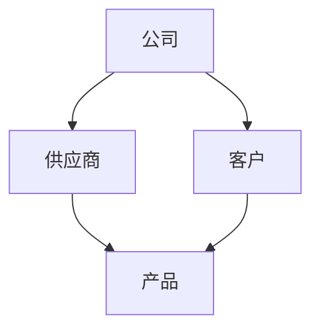
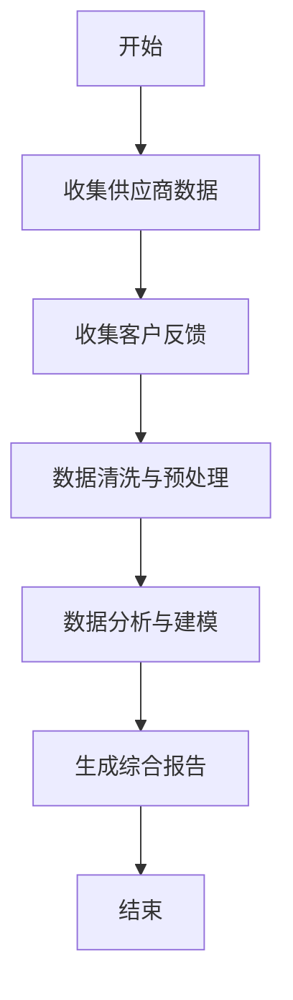
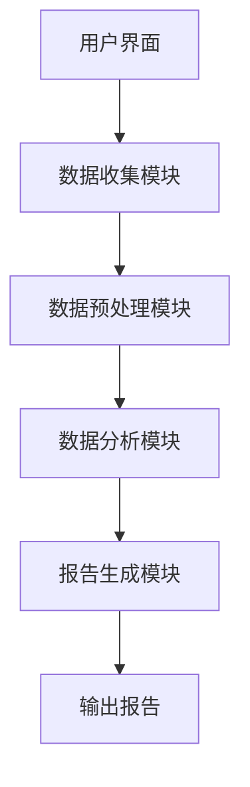
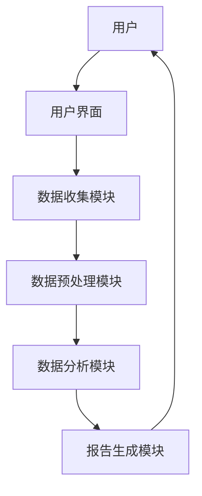

                 


```markdown
# 费雪的供应商客户调研：360度了解公司

## 关键词
- 费雪调研方法
- 供应商调研
- 客户调研
- 企业基本面分析
- 价值投资

## 摘要
费雪的供应商客户调研是一种通过深入分析公司与其供应商和客户之间的关系，来全面评估公司基本面的方法。这种方法能够帮助投资者和企业管理者更好地理解公司的运营状况、供应链管理、客户满意度以及市场地位。本文将从背景、核心概念、算法原理、系统架构、实战案例等多个方面详细阐述费雪调研方法，并通过具体实例展示其在实际应用中的价值。

---

# 第1章: 费雪调研方法的背景与发展

## 1.1 费雪调研方法的起源与发展
### 1.1.1 费雪调研方法的起源
费雪调研方法是由著名价值投资者菲利普·费雪（Philip Fisher）提出的一种公司基本面分析方法。这种方法的核心在于通过深入研究公司的供应商和客户，全面了解公司的运营状况和市场地位。

### 1.1.2 费雪调研方法的核心理念
费雪认为，一家公司的价值不仅仅体现在其财务报表上，还体现在其供应链管理和客户关系上。通过分析供应商和客户的反馈，可以更全面地评估公司的竞争优势和潜在风险。

### 1.1.3 费雪调研方法的现代发展
随着信息技术的发展，费雪调研方法逐渐从传统的面对面访谈扩展到利用大数据和人工智能技术进行分析，使得调研过程更加高效和精准。

---

## 1.2 费雪调研方法的核心要素
### 1.2.1 供应商调研的核心要素
- 供应商的稳定性：分析公司与供应商的合作时间、合同条款以及供应商的声誉。
- 供应商的议价能力：评估供应商是否具备议价能力，以及公司对供应商的依赖程度。
- 供应商的产品质量：通过供应商提供的产品或服务的质量，评估公司的供应链管理能力。

### 1.2.2 客户调研的核心要素
- 客户的满意度：通过客户反馈、投诉记录等数据，评估客户对公司的满意度。
- 客户的忠诚度：分析客户的留存率、复购率以及客户对公司的依赖程度。
- 客户的市场地位：评估客户在行业中的地位，以及客户对公司业务的影响力。

### 1.2.3 供应商与客户调研的关联性
- 供应商和客户的共同特征：分析供应商和客户之间的共同特征，评估公司业务的稳定性和扩展性。
- 供应商和客户的网络效应：通过供应商和客户的网络效应，评估公司业务的协同效应和扩展潜力。

---

## 1.3 费雪调研方法的背景介绍
### 1.3.1 问题背景
传统的公司分析方法往往侧重于财务数据，而忽视了公司与供应商和客户之间的关系。这种片面的分析方法难以全面评估公司的竞争优势和潜在风险。

### 1.3.2 问题描述
企业经营不仅仅依赖于财务数据，还需要关注供应链管理和客户关系。仅通过财务数据进行分析，难以全面了解公司的经营状况和市场地位。

### 1.3.3 问题解决
费雪调研方法通过分析供应商和客户的反馈，弥补了传统分析方法的不足，提供了更全面的公司基本面分析。

### 1.3.4 费雪调研方法的边界与外延
- 费雪调研方法适用于所有行业，但特别适用于供应链管理和客户关系复杂的行业。
- 费雪调研方法可以与其他分析方法结合使用，如财务分析、市场分析等。

### 1.3.5 核心概念结构与组成
- 核心概念：供应商调研、客户调研。
- 关联概念：公司基本面分析、价值投资。

---

# 第2章: 费雪调研方法的核心概念与联系

## 2.1 费雪调研方法的核心原理
### 2.1.1 供应商调研的原理
通过分析供应商的稳定性、议价能力和产品质量，评估公司的供应链管理能力。

### 2.1.2 客户调研的原理
通过分析客户的满意度、忠诚度和市场地位，评估公司的客户关系管理能力。

### 2.1.3 供应商与客户调研的综合分析
通过综合分析供应商和客户的反馈，评估公司的竞争优势和潜在风险。

---

## 2.2 费雪调研方法的核心概念对比
### 2.2.1 不同调研方法的特征对比
| 调研方法 | 重点 | 优点 | 缺点 |
|----------|------|------|------|
| 财务分析 | 财务数据 | 数据准确 | 忽略了非财务因素 |
| 市场分析 | 市场趋势 | 了解市场动态 | 难以评估公司内部管理 |
| 费雪调研 | 供应商和客户 | 全面评估公司基本面 | 数据收集复杂 |

### 2.2.2 费雪调研方法的独特性
费雪调研方法的独特性在于通过分析供应商和客户的反馈，评估公司内部管理能力和外部市场地位。

---

## 2.3 费雪调研方法的ER实体关系图


---

# 第3章: 费雪调研方法的算法原理

## 3.1 费雪调研方法的算法流程


---

## 3.2 费雪调研算法的Python实现
### 3.2.1 数据清洗与预处理
```python
import pandas as pd

# 读取供应商和客户数据
supplier_data = pd.read_csv('suppliers.csv')
customer_data = pd.read_csv('customers.csv')

# 数据清洗：处理缺失值和异常值
supplier_data.dropna(inplace=True)
customer_data.drop_duplicates(inplace=True)
```

### 3.2.2 数据分析与建模
```python
from sklearn.metrics import pairwise_distances

# 计算供应商和客户之间的相似性
supplier_customer_similarity = pairwise_distances(supplier_data, customer_data)

# 生成综合报告
report = pd.DataFrame({
    '供应商': supplier_data['name'],
    '客户': customer_data['name'],
    '相似性': supplier_customer_similarity
})
```

---

## 3.3 费雪调研算法的数学模型
### 3.3.1 供应商和客户相似性计算
$$ \text{相似性} = \sum_{i=1}^{n} (w_i \cdot x_i) $$
其中，\( w_i \) 是权重，\( x_i \) 是特征值。

### 3.3.2 综合评分模型
$$ \text{综合评分} = \sum_{j=1}^{m} (a_j \cdot s_j) $$
其中，\( a_j \) 是评分权重，\( s_j \) 是评分项。

---

# 第4章: 费雪调研方法的系统架构设计

## 4.1 问题场景介绍
费雪调研方法需要一个高效的系统来支持供应商和客户的调研数据收集、分析和报告生成。

---

## 4.2 系统功能设计
### 4.2.1 数据收集模块
- 供应商和客户信息录入
- 数据清洗与预处理

### 4.2.2 数据分析模块
- 供应商和客户相似性计算
- 综合评分模型

### 4.2.3 报告生成模块
- 生成综合报告

---

## 4.3 系统架构设计


---

## 4.4 系统接口设计
### 4.4.1 数据接口
- 输入：供应商和客户数据
- 输出：清洗后的数据

### 4.4.2 分析接口
- 输入：清洗后的数据
- 输出：相似性计算结果

---

## 4.5 系统交互流程


---

# 第5章: 费雪调研方法的项目实战

## 5.1 环境安装
```bash
pip install pandas sklearn mermaid
```

---

## 5.2 核心代码实现
### 5.2.1 数据清洗与预处理
```python
import pandas as pd

# 读取供应商和客户数据
supplier_data = pd.read_csv('suppliers.csv')
customer_data = pd.read_csv('customers.csv')

# 数据清洗：处理缺失值和异常值
supplier_data.dropna(inplace=True)
customer_data.drop_duplicates(inplace=True)
```

### 5.2.2 数据分析与建模
```python
from sklearn.metrics import pairwise_distances

# 计算供应商和客户之间的相似性
supplier_customer_similarity = pairwise_distances(supplier_data, customer_data)

# 生成综合报告
report = pd.DataFrame({
    '供应商': supplier_data['name'],
    '客户': customer_data['name'],
    '相似性': supplier_customer_similarity
})
```

---

## 5.3 实际案例分析
### 5.3.1 案例背景
假设我们有一家科技公司，需要分析其供应商和客户的关系。

### 5.3.2 数据分析
通过分析供应商和客户的相似性，发现某些供应商和客户之间存在较高的相似性，可能意味着公司存在一定的市场风险。

---

## 5.4 项目小结
通过费雪调研方法，我们可以更全面地了解公司的供应链管理和客户关系，从而做出更明智的投资决策。

---

# 第6章: 费雪调研方法的总结与最佳实践

## 6.1 总结
费雪调研方法通过分析供应商和客户的反馈，提供了更全面的公司基本面分析。这种方法不仅可以帮助投资者做出更明智的投资决策，还可以帮助企业优化供应链管理和客户关系。

## 6.2 最佳实践 tips
- 数据收集要全面：确保收集到的供应商和客户数据尽可能全面。
- 数据分析要深入：通过数据分析模型，深入挖掘数据背后的意义。
- 报告生成要清晰：生成的报告要清晰明了，便于理解和应用。

## 6.3 未来展望
随着大数据和人工智能技术的发展，费雪调研方法将更加高效和精准，为企业和投资者提供更有力的支持。

---

# 作者：AI天才研究院/AI Genius Institute & 禅与计算机程序设计艺术 /Zen And The Art of Computer Programming
```

