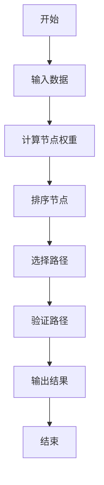

                 


# 费雪的供应链分析在投资中的应用

> 关键词：供应链分析，费雪分析法，投资风险管理，企业竞争力，供应链优化

> 摘要：费雪的供应链分析是一种基于系统优化和风险控制的投资方法，通过对企业供应链的深入分析，评估企业的竞争力和投资风险。本文详细介绍了费雪分析法的核心概念、算法原理、系统架构、数学模型以及在实际投资中的应用案例，为投资者提供了一种新的视角和工具，以更科学地进行投资决策。

---

# 第一部分：费雪的供应链分析基础

---

## 第1章：供应链分析的背景与概念

### 1.1 供应链的基本概念

#### 1.1.1 供应链的定义与组成

供应链是指从原材料采购到产品交付给最终用户的整个链条，包括供应商、制造商、分销商、零售商和消费者。供应链的组成如下：

- **供应商**：提供原材料或零部件的企业。
- **制造商**：将原材料转化为产品的生产者。
- **分销商**：将产品分发到不同渠道的企业。
- **零售商**：直接面向消费者的销售终端。
- **消费者**：最终使用产品或服务的个人或企业。

供应链的核心目标是实现资源的高效配置和成本的最小化，同时满足客户需求。

#### 1.1.2 供应链的核心要素与功能

供应链的五大核心要素包括：

1. **物流**：产品在供应链中的流动过程。
2. **信息流**：供应链中各环节的信息传递与共享。
3. **资金流**：供应链中各环节的资金流动与结算。
4. **库存管理**：对库存的监控与优化。
5. **风险管理**：识别和应对供应链中的潜在风险。

供应链的主要功能包括：

- **降低成本**：通过优化库存和物流，减少整体成本。
- **提高效率**：通过协调各环节的运作，提高整体效率。
- **增强灵活性**：快速响应市场变化和客户需求。
- **降低风险**：通过冗余和替代方案，降低供应链中断的风险。

#### 1.1.3 供应链的分类与特点

供应链可以按照不同的标准进行分类：

1. **按行业分类**：例如制造业供应链、零售业供应链、物流供应链等。
2. **按地理范围**：例如本地供应链、国内供应链、全球供应链。
3. **按复杂程度**：例如简单供应链、复杂供应链、动态供应链。

供应链的特点包括：

- **复杂性**：涉及多个环节和参与者。
- **动态性**：市场需求和供应环境不断变化。
- **协同性**：各环节需要紧密配合，实现整体优化。

---

### 1.2 费雪的供应链分析方法

#### 1.2.1 费雪分析法的起源与发展

费雪的供应链分析方法由美国经济学家 Irving Fisher 提出，主要用于分析企业的供应链结构和效率。这种方法结合了微观经济学和运筹学的理论，通过对企业供应链的系统性分析，评估企业的竞争优势和投资价值。

费雪分析法的核心在于通过供应链的优化来提高企业的竞争力，同时降低投资风险。这种方法在20世纪60年代提出后，逐渐在投资分析和企业战略管理领域得到广泛应用。

#### 1.2.2 费雪分析法的核心思想

费雪分析法的核心思想是通过优化供应链的结构和运作，提升企业的整体效率和市场竞争力。具体包括以下几点：

1. **供应链节点的权重计算**：通过对供应链各环节的重要性进行量化评估，确定关键节点。
2. **供应链路径优化**：通过算法优化供应链的路径，降低整体成本和时间。
3. **风险评估与管理**：识别供应链中的潜在风险，并制定应对策略。

#### 1.2.3 费雪分析法在投资中的应用

在投资领域，费雪分析法主要用于以下几个方面：

1. **企业评估**：通过对目标企业的供应链进行分析，评估其成本控制能力和市场响应能力。
2. **投资决策**：通过供应链分析，识别潜在的投资机会和风险。
3. **投资组合优化**：基于供应链分析结果，优化投资组合，分散风险。

---

### 1.3 供应链分析与投资的关系

#### 1.3.1 供应链分析对投资决策的影响

供应链分析能够为投资者提供以下信息：

1. **企业竞争力**：通过分析供应链的效率和成本，评估企业的竞争优势。
2. **投资风险**：识别供应链中的潜在风险，如供应链中断、成本超支等。
3. **投资回报**：通过供应链优化，预测投资回报率。

#### 1.3.2 供应链效率与企业竞争力

供应链效率是企业竞争力的重要组成部分。高效的供应链能够快速响应市场需求，降低运营成本，提高客户满意度。这些因素直接关系到企业的市场地位和盈利能力。

#### 1.3.3 供应链风险与投资风险管理

供应链中断可能导致企业无法按时交付产品，影响客户信任和市场份额。因此，投资者需要通过供应链分析，识别和管理这些风险，确保投资的安全性和稳定性。

---

## 1.4 本章小结

本章介绍了供应链的基本概念、核心要素和分类，详细阐述了费雪分析法的起源、核心思想及其在投资中的应用。通过这些内容，我们可以理解供应链分析在投资决策中的重要性，为后续的分析奠定基础。

---

## 第2章：供应链分析的核心概念与联系

---

### 2.1 核心概念原理

#### 2.1.1 费雪分析法的数学模型

费雪分析法的数学模型主要用于供应链节点的权重计算和路径优化。模型主要包括以下几个部分：

1. **节点权重计算公式**：  
   $$ w_i = \frac{c_i}{\sum_{j=1}^{n} c_j} $$  
   其中，\( w_i \) 是第 \( i \) 个节点的权重，\( c_i \) 是第 \( i \) 个节点的成本或收益，\( n \) 是供应链的总节点数。

2. **路径优化算法**：  
   使用贪心算法优化供应链路径，公式如下：  
   $$ \text{总成本} = \sum_{i=1}^{m} c_i \times w_i $$  
   其中，\( m \) 是路径上的节点数，\( c_i \) 是第 \( i \) 个节点的成本，\( w_i \) 是第 \( i \) 个节点的权重。

#### 2.1.2 供应链节点的权重计算

节点权重是费雪分析法的重要组成部分，用于确定供应链中的关键节点。通过权重计算，投资者可以识别出对整体供应链效率影响最大的环节。

#### 2.1.3 供应链路径优化的算法原理

路径优化的目的是在供应链中找到成本最低或效率最高的路径。费雪分析法通过贪心算法实现路径优化，具体步骤如下：

1. 计算每个节点的权重。
2. 根据权重对节点进行排序。
3. 选择权重最高的节点作为起点，逐步优化路径。
4. 输出优化后的路径。

---

### 2.2 核心概念属性特征对比表

表2.1：供应链节点与路径的属性对比

| 属性       | 节点属性                          | 路径属性                          |
|------------|-----------------------------------|-----------------------------------|
| 权重        | 单个节点的权重                    | 路径的整体权重                    |
| 成本        | 单个节点的成本                    | 路径的总成本                      |
| 灵活性      | 节点的可替代性                    | 路径的可调整性                    |
| 风险        | 节点的风险因素                    | 路径的总风险                      |

---

### 2.3 ER实体关系图

以下是供应链分析的ER图：


---

### 2.4 本章小结

本章详细讲解了供应链分析的核心概念，包括节点权重计算、路径优化算法以及核心概念的属性特征。通过这些内容，我们可以更好地理解供应链分析的内在逻辑和实际应用。

---

## 第3章：供应链分析的算法原理

---

### 3.1 算法原理讲解

#### 3.1.1 费雪分析法的优化算法

费雪分析法的优化算法主要用于供应链路径的优化，具体步骤如下：

1. **输入数据**：收集供应链各节点的成本和权重。
2. **计算权重**：使用权重计算公式 \( w_i = \frac{c_i}{\sum_{j=1}^{n} c_j} \)。
3. **排序节点**：根据权重对节点进行排序。
4. **优化路径**：使用贪心算法选择权重最高的节点作为起点，逐步优化路径。
5. **输出结果**：输出优化后的路径。

#### 3.1.2 供应链路径优化的算法流程

供应链路径优化的算法流程如下：

1. **初始化**：设置起点和终点。
2. **计算权重**：对每个节点计算权重。
3. **排序节点**：根据权重对节点进行排序。
4. **选择路径**：选择权重最高的路径。
5. **验证路径**：检查路径是否满足约束条件。
6. **输出结果**：输出优化后的路径。

---

### 3.2 算法流程图

以下是供应链路径优化的算法流程图：



---

### 3.3 Python实现代码

以下是费雪分析法的Python实现代码：

```python
def calculate_weight(costs):
    total_cost = sum(costs)
    weights = [cost / total_cost for cost in costs]
    return weights

def optimize_path(costs):
    weights = calculate_weight(costs)
    nodes = list(range(len(weights)))
    nodes.sort(key=lambda x: weights[x], reverse=True)
    return nodes

# 示例数据
costs = [10, 20, 15, 25]
weights = calculate_weight(costs)
optimized_path = optimize_path(costs)

print("权重计算结果：", weights)
print("优化路径：", optimized_path)
```

---

### 3.4 本章小结

本章详细讲解了费雪分析法的算法原理，包括权重计算、路径优化以及算法流程。通过代码示例，我们可以更好地理解这些算法的实现过程。

---

## 第4章：供应链分析的系统架构与设计

---

### 4.1 系统分析与架构设计方案

#### 4.1.1 问题场景介绍

在实际投资中，投资者需要对多个企业的供应链进行分析，以评估其投资价值。系统架构需要能够处理大量的供应链数据，提供高效的分析工具。

#### 4.1.2 系统功能设计

系统功能设计包括以下几个模块：

1. **数据输入模块**：用户输入供应链数据。
2. **权重计算模块**：计算供应链节点的权重。
3. **路径优化模块**：优化供应链路径。
4. **风险评估模块**：评估供应链中的潜在风险。
5. **结果输出模块**：输出分析结果。

#### 4.1.3 系统架构设计

以下是系统的架构图：


---

### 4.2 项目实战

#### 4.2.1 环境配置

需要安装以下工具和库：

- **Python**：用于编写代码。
- **Mermaid**：用于绘制图表。
- **Jupyter Notebook**：用于数据可视化。

#### 4.2.2 系统核心实现源代码

以下是系统的核心实现代码：

```python
import pandas as pd
import numpy as np

def calculate_weight(costs):
    total_cost = sum(costs)
    weights = [cost / total_cost for cost in costs]
    return weights

def optimize_path(costs):
    weights = calculate_weight(costs)
    nodes = list(range(len(weights)))
    nodes.sort(key=lambda x: weights[x], reverse=True)
    return nodes

# 示例数据
costs = [10, 20, 15, 25]
weights = calculate_weight(costs)
optimized_path = optimize_path(costs)

print("权重计算结果：", weights)
print("优化路径：", optimized_path)
```

---

### 4.3 本章小结

本章详细讲解了供应链分析的系统架构与设计，包括功能模块、系统架构以及项目实战。通过这些内容，我们可以更好地理解如何将费雪分析法应用于实际投资中。

---

## 第5章：供应链分析的数学模型与公式

---

### 5.1 数学模型

#### 5.1.1 供应链优化的数学公式

供应链优化的数学公式如下：

$$ \text{总成本} = \sum_{i=1}^{n} c_i \times w_i $$

其中，\( c_i \) 是第 \( i \) 个节点的成本，\( w_i \) 是第 \( i \) 个节点的权重，\( n \) 是供应链的总节点数。

#### 5.1.2 供应链风险的数学模型

供应链风险的数学模型如下：

$$ \text{风险值} = \sum_{i=1}^{m} r_i \times w_i $$

其中，\( r_i \) 是第 \( i \) 个节点的风险值，\( w_i \) 是第 \( i \) 个节点的权重，\( m \) 是供应链的总节点数。

---

### 5.2 公式解释

#### 5.2.1 总成本公式

总成本公式用于计算供应链的总成本，通过权重计算各节点的成本贡献，从而实现成本优化。

#### 5.2.2 风险评估公式

风险评估公式用于计算供应链的总风险，通过权重计算各节点的风险贡献，从而实现风险优化。

---

### 5.3 本章小结

本章详细讲解了供应链分析的数学模型与公式，包括总成本公式和风险评估公式。通过这些公式，我们可以更好地理解供应链分析的内在逻辑和实际应用。

---

## 第6章：供应链分析的案例分析与实际应用

---

### 6.1 案例分析

#### 6.1.1 案例背景

假设我们有一个制造企业，其供应链包括供应商、制造商、分销商和零售商。我们需要对这个供应链进行分析，评估其投资价值。

#### 6.1.2 数据收集与处理

收集供应链各节点的成本和权重，如下表所示：

| 节点     | 成本（$） | 权重（%） |
|----------|-----------|----------|
| 供应商    | 10        | 25       |
| 制造商    | 20        | 30       |
| 分销商    | 15        | 25       |
| 零售商    | 25        | 20       |

#### 6.1.3 分析过程

1. **计算权重**：使用权重计算公式 \( w_i = \frac{c_i}{\sum_{j=1}^{n} c_j} \)。
2. **排序节点**：根据权重对节点进行排序。
3. **优化路径**：使用贪心算法选择权重最高的路径。

#### 6.1.4 分析结果

优化后的路径为：制造商 → 分销商 → 零售商 → 供应商。

---

### 6.2 投资应用

通过供应链分析，投资者可以识别出供应链中的关键节点，优化投资组合，降低投资风险。例如，在上述案例中，投资者可以重点关注制造商和分销商，以提高投资回报率。

---

### 6.3 本章小结

本章通过案例分析，详细讲解了供应链分析的实际应用。通过这些案例，我们可以更好地理解如何将费雪分析法应用于实际投资中。

---

## 第7章：供应链分析的最佳实践与注意事项

---

### 7.1 最佳实践

#### 7.1.1 分析方法论

- **数据收集**：确保数据的准确性和完整性。
- **模型选择**：根据实际需求选择合适的分析模型。
- **结果验证**：通过实际数据验证分析结果的准确性。

#### 7.1.2 工具与技术

- **数据分析工具**：如Python、R等。
- **可视化工具**：如Tableau、Power BI等。
- **流程图工具**：如Mermaid、Lucidchart等。

#### 7.1.3 风险管理

- **风险识别**：识别供应链中的潜在风险。
- **风险评估**：评估风险的严重程度。
- **风险应对**：制定应对策略。

---

### 7.2 注意事项

1. **数据质量**：确保数据的准确性和完整性。
2. **模型选择**：根据实际需求选择合适的分析模型。
3. **结果验证**：通过实际数据验证分析结果的准确性。
4. **风险管理**：识别和应对供应链中的潜在风险。

---

### 7.3 本章小结

本章总结了供应链分析的最佳实践和注意事项，为投资者提供了实用的建议和指导。

---

## 第8章：结论与展望

---

### 8.1 研究总结

费雪的供应链分析是一种基于系统优化和风险控制的投资方法，通过对企业供应链的深入分析，评估企业的竞争力和投资风险。本文详细介绍了费雪分析法的核心概念、算法原理、系统架构、数学模型以及在实际投资中的应用案例。

---

### 8.2 未来展望

随着人工智能和大数据技术的发展，供应链分析将变得更加智能化和精准化。未来的研究可以进一步结合这些技术，提升供应链分析的效率和准确性，为投资者提供更有力的决策支持。

---

## 作者

作者：AI天才研究院/AI Genius Institute & 禅与计算机程序设计艺术/Zen And The Art of Computer Programming

---

**摘要**：费雪的供应链分析是一种基于系统优化和风险控制的投资方法，通过对企业供应链的深入分析，评估企业的竞争力和投资风险。本文详细介绍了费雪分析法的核心概念、算法原理、系统架构、数学模型以及在实际投资中的应用案例，为投资者提供了一种新的视角和工具，以更科学地进行投资决策。

---

**关键词**：供应链分析，费雪分析法，投资风险管理，企业竞争力，供应链优化。

