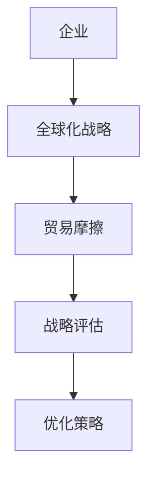
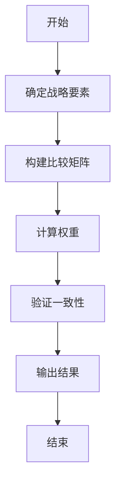
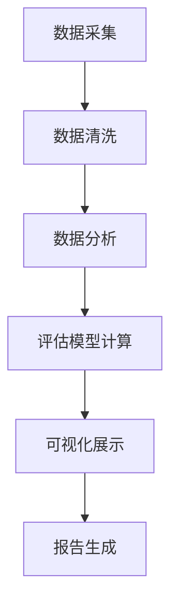

                 

---

# 《费雪的全球化战略评估：贸易摩擦背景下的新思考》

## 作者：AI天才研究院

---

## 关键词：全球化战略、贸易摩擦、战略评估、系统工程、层次分析法、费雪模型

---

## 摘要：  
在全球化深入发展的今天，贸易摩擦已成为影响企业全球化战略的重要因素。本文从费雪的全球化战略出发，结合贸易摩擦的背景，提出了一套系统化的战略评估方法。通过层次分析法构建评估模型，并结合实际案例分析，为企业应对贸易摩擦提供了新的思路和方法。

---

## 第一部分：背景与核心概念

### 第1章：全球化战略评估的背景与问题背景

#### 1.1 费雪全球化战略的核心概念  
全球化战略评估是指对企业在全球市场中的战略布局进行全面分析，以应对各种外部挑战。费雪的全球化战略强调在不同市场中的本地化适应和全球资源整合。  

**贸易摩擦的现状**：当前，全球贸易摩擦频发，主要表现为关税壁垒、供应链中断和地缘政治冲突。这些摩擦对企业的全球化战略提出了新的挑战。  

**费雪全球化战略的独特性**：费雪模型强调在全球化过程中，企业需要灵活调整战略，以应对不同的贸易摩擦。  

#### 1.2 贸易摩擦的成因与影响  
**贸易摩擦的成因**：  
- 经济利益冲突：不同国家的经济利益差异导致贸易争端。  
- 政治因素：地缘政治冲突加剧贸易摩擦。  
- 供应链问题：疫情和地缘政治影响导致供应链不稳定。  

**贸易摩擦的影响**：  
- 增加企业成本：关税壁垒和供应链中断导致成本上升。  
- 风险增加：地缘政治风险加剧，企业面临更多不确定性。  
- 市场扩展受阻：贸易摩擦限制了企业的市场扩展能力。  

#### 1.3 费雪全球化战略的核心问题  
- **战略目标**：在全球市场中实现可持续发展。  
- **挑战**：应对贸易摩擦带来的不确定性。  
- **边界与外延**：全球化战略的实施范围和限制条件。  

**核心要素**：  
- 战略目标：市场扩展、成本优化、风险管理。  
- 实施路径：本地化适应、全球资源整合、供应链优化。  
- 评估指标：市场渗透率、成本降低比例、风险可控性。  

### 第2章：费雪全球化战略的核心概念与联系

#### 2.1 核心概念原理  
- **全球化战略评估的理论基础**：系统工程和复杂性科学。  
- **贸易摩擦的影响机制**：通过增加成本和不确定性影响企业战略。  
- **系统性分析框架**：从经济、政治、文化等多维度分析全球化战略。  

#### 2.2 核心概念属性特征对比  

| 战略目标       | 贸易摩擦影响       | 战略评估指标       |
|----------------|-------------------|-------------------|
| 市场扩展       | 关税壁垒增加      | 市场渗透率         |
| 成本优化       | 供应链中断        | 成本降低比例       |
| 风险管理       | 地缘政治风险       | 风险可控性         |

#### 2.3 ER实体关系图（Mermaid流程图）

---

## 第二部分：全球化战略评估的算法原理

### 第3章：费雪全球化战略评估的算法原理

#### 3.1 算法原理概述  
费雪全球化战略评估的核心算法基于层次分析法（AHP），用于确定各战略要素的权重。  

**输入**：全球化战略的各要素及权重。  
**输出**：各要素对战略目标的影响程度。  

#### 3.2 算法流程图（Mermaid流程图）

#### 3.3 数学模型和公式  

**层次分析法的核心公式**：  
$$ AHP权重计算：w_i = \frac{a_{ij}}{\sum_{j}a_{ij}} $$  
其中，$a_{ij}$为比较矩阵中的元素，$w_i$为第i个要素的权重。  

**评估模型**：  
$$ 评估得分 = \sum w_i \times s_i $$  
其中，$s_i$为各要素的评分。  

#### 3.4 实际案例分析  
以中美贸易摩擦为例，构建比较矩阵并计算权重，评估不同市场进入策略的影响。

---

### 第4章：全球化战略评估的系统工程方法

#### 4.1 系统工程方法简介  
系统工程方法强调从整体出发，分步骤解决问题。  

#### 4.2 全球化战略评估的系统架构  

#### 4.3 系统功能分析  
- **数据采集**：收集全球市场数据。  
- **数据分析**：应用层次分析法进行评估。  
- **可视化展示**：生成图表和报告。  

---

## 第三部分：项目实战与总结

### 第5章：全球化战略评估的系统实现

#### 5.1 环境搭建  
- **工具安装**：安装Python、Pandas、Matplotlib等工具。  

#### 5.2 核心功能实现  
- **数据清洗**：处理缺失值和异常值。  
- **数据分析**：应用层次分析法计算权重。  
- **可视化展示**：生成评估报告。  

#### 5.3 实际案例分析  
以中美贸易摩擦为例，详细分析并提出优化建议。

### 第6章：总结与展望

#### 6.1 全文总结  
本文提出了基于层次分析法的全球化战略评估方法，为企业应对贸易摩擦提供了新思路。  

#### 6.2 未来研究方向  
- 探索更多算法在战略评估中的应用。  
- 研究地缘政治风险的量化方法。  

#### 6.3 注意事项和最佳实践  
- 数据质量是评估的关键，需确保数据准确。  
- 结合实际情况调整模型参数。  

---

## 结语  

全球化战略评估是一个复杂但重要的任务。本文通过系统工程方法和层次分析法，为企业应对贸易摩擦提供了新的思路。未来，随着技术的发展，全球化战略评估将更加精准和高效。

---

## 作者简介  

**AI天才研究院**：专注于人工智能与计算机科学领域的研究，致力于为企业提供创新的技术解决方案。

