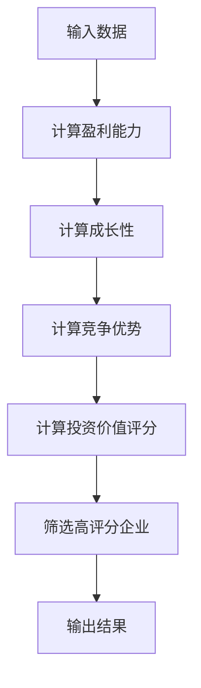
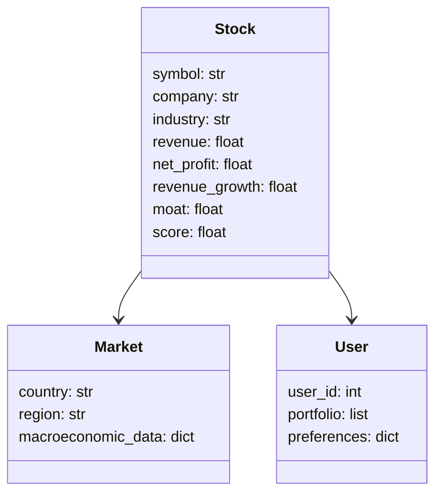
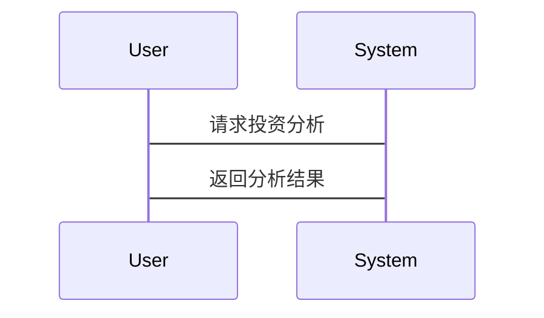

                 


# 费雪的全球视野：如何在国际市场中寻找机会

## 关键词：费雪投资理念、全球化、国际市场、投资机会、股票分析、投资策略、风险管理

## 摘要：本文从费雪的投资理念出发，探讨如何在全球市场中寻找投资机会。通过分析费雪的核心概念、算法原理、系统架构以及实际案例，本文详细阐述了如何在国际市场上应用费雪的理念，帮助投资者制定有效的投资策略，提升投资回报。

---

## 第一部分: 费雪的全球视野与投资理念

### 第1章: 费雪投资理念的全球视野

#### 1.1 费雪投资理念的核心思想

##### 1.1.1 费雪投资理念的起源与背景

费雪的投资理念源于20世纪的投资实践，他强调长期投资和深入研究企业的基本面。费雪认为，投资者应选择那些具有强大竞争优势、良好管理团队和持续增长潜力的企业。在全球化背景下，这种理念更加重要，因为企业在全球市场中的表现直接反映了其竞争力。

##### 1.1.2 费雪对全球市场的独特见解

费雪认为，全球化为投资者提供了更多机会，但也带来了更多挑战。他强调，投资者需要关注企业的全球竞争优势，包括市场份额、成本控制、技术创新等方面。此外，他还指出，不同国家和地区的经济周期和政策变化也会影响企业的表现。

##### 1.1.3 费雪投资理念的现代应用

随着全球经济的深度融合，费雪的理念在现代投资中得到了广泛应用。投资者通过分析企业的全球供应链、市场需求和政策环境，可以更好地把握投资机会。费雪的理念还被整合到量化投资和大数据分析中，进一步提升了投资决策的科学性和精准性。

#### 1.2 费雪的选股标准与全球市场分析

##### 1.2.1 企业质量的全球视角

费雪认为，企业的质量是投资成功的关键。在全球市场中，投资者需要关注企业的全球市场份额、品牌影响力和技术创新能力。例如，苹果公司在全球市场的成功，很大程度上得益于其强大的品牌和技术优势。

##### 1.2.2 行业地位与竞争优势

在全球市场中，企业的行业地位和竞争优势尤为重要。费雪强调，投资者应选择那些在行业内具有领先地位的企业，因为这些企业更容易在激烈的竞争中胜出。例如，亚马逊在全球电子商务市场的领先地位，使其成为长期投资的理想选择。

##### 1.2.3 管理层质量与企业治理

费雪认为，管理层的质量和企业治理结构是决定企业长期表现的重要因素。在全球市场中，投资者需要关注企业的治理结构、管理层的稳定性以及公司的透明度。例如，日本的丰田公司以其高效的治理结构和稳定的管理层著称，成为长期投资的典范。

#### 1.3 费雪投资理念的成功案例

##### 1.3.1 全球市场中的经典投资案例

费雪的投资理念在全球市场中取得了许多成功案例。例如，他在20世纪70年代投资的可口可乐公司，在全球市场的扩张中取得了巨大成功。可口可乐的全球供应链和品牌影响力使其成为费雪理念的典型成功案例。

##### 1.3.2 费雪理念在不同经济周期的表现

费雪的理念在不同经济周期中表现各异。例如，在经济衰退期间，具有强大竞争优势的企业更容易生存和增长，因此是投资的理想选择。而在经济繁荣时期，投资者需要更加谨慎，选择那些具有持续增长潜力的企业。

##### 1.3.3 费雪理念的局限性与改进方向

尽管费雪的理念在实践中取得了巨大成功，但也存在一定的局限性。例如，全球化背景下，一些地区的政治和经济政策变化可能对企业的表现产生重大影响。因此，投资者需要结合具体情况，对费雪的理念进行适当调整和改进。

### 第2章: 全球化背景下的投资机会分析

#### 2.1 全球化对企业的影响

##### 2.1.1 全球化对企业利润的影响

全球化促进了跨国贸易和投资，为企业提供了更大的市场空间和更低的生产成本。然而，全球化也带来了更大的竞争压力和不确定性。例如，中国企业的全球化战略在全球市场中取得了显著成功，但也面临来自其他国家的竞争压力。

##### 2.1.2 全球化对企业竞争优势的重塑

在全球化背景下，企业的竞争优势需要重新评估。企业需要在技术创新、成本控制、品牌影响力等方面具备更强的优势，才能在全球市场中脱颖而出。例如，韩国的三星公司在技术创新和品牌建设方面取得了显著成功。

##### 2.1.3 全球化背景下的行业趋势分析

全球化促进了行业的深度融合和技术创新。例如，信息技术行业在全球市场的快速发展，为投资者提供了大量机会。投资者需要关注行业的长期趋势，选择那些具有持续增长潜力的企业。

#### 2.2 全球市场中的行业选择

##### 2.2.1 高成长行业的识别

在全球市场中，高成长行业通常是那些需求增长快、技术创新活跃的行业。例如，科技、医疗、清洁能源等行业具有较高的成长潜力。投资者需要通过深入分析行业的市场容量、增长速度和竞争格局，选择那些具有持续增长潜力的行业。

##### 2.2.2 高壁垒行业的优势

高壁垒行业在全球市场中具有较强的竞争优势。例如，专利保护的制药行业、具有技术壁垒的高端制造业等领域，具有较高的进入壁垒，能够在竞争中保持优势地位。

##### 2.2.3 全球化供应链的影响

全球化供应链的优化能够降低企业的生产成本，提高效率。然而，供应链的全球化也带来了更大的风险，例如供应链中断可能对企业的生产和利润造成重大影响。投资者需要关注企业的供应链管理能力，选择那些具有稳定供应链的企业。

#### 2.3 全球经济周期与投资机会

##### 2.3.1 经济周期对投资机会的影响

在全球经济周期中，不同的经济阶段为企业提供了不同的投资机会。例如，在经济衰退期间，具有强大竞争优势的企业更容易生存和增长，因此是投资的理想选择。而在经济繁荣时期，投资者需要更加谨慎，选择那些具有持续增长潜力的企业。

##### 2.3.2 不同经济周期下的投资策略

在全球经济周期中，投资者需要根据经济环境的变化调整投资策略。例如，在经济衰退期间，投资者应更加关注企业的财务健康状况和竞争优势；在经济繁荣时期，投资者应关注企业的增长潜力和创新能力。

##### 2.3.3 全球经济趋势的预测与分析

全球经济趋势的预测与分析是投资者制定投资策略的重要依据。例如，全球经济的数字化转型为科技行业提供了大量机会；全球气候变化为清洁能源行业带来了增长潜力。投资者需要关注全球经济趋势的变化，及时调整投资策略。

### 第3章: 费雪理念与现代投资工具的结合

#### 3.1 现代投资工具的全球视角

##### 3.1.1 ETF与指数基金的全球配置

现代投资工具的全球视角为投资者提供了更多的选择。例如，通过投资全球股票指数基金（ETF），投资者可以轻松实现全球资产配置，分散风险，同时享受全球经济的增长红利。

##### 3.1.2 全球股票市场的分散投资

分散投资是现代投资的重要原则。通过在全球不同地区投资股票，投资者可以降低市场风险，同时把握全球经济的增长机会。例如，投资新兴市场股票基金可以享受新兴经济体的高速增长。

##### 3.1.3 跨国公司的投资机会

跨国公司的投资机会在全球市场中尤为重要。跨国公司通常具有强大的全球供应链和品牌影响力，能够在不同国家和市场中实现增长。例如，跨国科技公司如苹果、微软在全球市场中的表现优异。

#### 3.2 数据分析与全球投资决策

##### 3.2.1 数据驱动的全球市场分析

现代投资工具依赖于数据分析。通过分析全球市场的宏观经济数据、行业趋势和企业基本面数据，投资者可以做出更科学的投资决策。例如，通过分析全球经济数据，投资者可以预测未来经济趋势，调整投资策略。

##### 3.2.2 全球经济指标的解读

全球经济指标是投资者制定投资策略的重要依据。例如，GDP增长率、通胀率、利率等指标的变化直接影响市场的走势。投资者需要关注这些指标的变化，及时调整投资策略。

##### 3.2.3 费雪理念与大数据分析的结合

大数据分析为费雪理念的全球应用提供了新的工具。通过分析全球企业的财务数据、市场表现和行业趋势，投资者可以更深入地了解企业的基本面，从而做出更明智的投资决策。

#### 3.3 费雪理念在量化投资中的应用

##### 3.3.1 量化策略的全球视角

量化策略的全球视角为投资者提供了新的投资机会。通过分析全球市场的数据，投资者可以制定基于量化模型的投资策略，实现自动化和系统化的投资决策。

##### 3.3.2 费雪理念与因子投资的结合

因子投资是量化投资的重要方法。通过将费雪的理念融入因子投资模型，投资者可以筛选出具有强大竞争优势和持续增长潜力的企业。例如，基于企业盈利能力和成长性的因子模型可以帮助投资者筛选出优质的投资标的。

##### 3.3.3 全球市场中的因子分析

在全球市场中，因子分析可以帮助投资者识别具有持续增长潜力的企业。例如，通过分析企业的ROE（净资产收益率）、增长性和管理质量等因子，投资者可以筛选出具有长期投资价值的企业。

---

## 第二部分: 费雪理念的算法实现与系统分析

### 第4章: 费雪理念的算法实现

#### 4.1 费雪投资策略的算法模型

##### 4.1.1 算法模型的核心思想

费雪投资策略的算法模型基于企业的基本面分析，通过筛选具有强大竞争优势和持续增长潜力的企业。模型的核心思想是通过量化企业的财务指标和行业趋势，实现自动化和系统化的投资决策。

##### 4.1.2 算法模型的输入与输出

算法模型的输入包括企业的财务数据（如收入、利润、增长率等）、行业趋势数据和宏观经济数据。输出是企业的投资价值评分和投资建议。

##### 4.1.3 算法模型的数学公式

费雪投资策略的算法模型可以通过以下数学公式进行描述：

$$
\text{投资价值评分} = \alpha \times \text{盈利能力} + \beta \times \text{成长性} + \gamma \times \text{竞争优势}
$$

其中，$\alpha$、$\beta$、$\gamma$是权重系数，根据具体情况调整。

#### 4.2 算法实现的代码示例

##### 4.2.1 数据获取与预处理

```python
import pandas as pd
import numpy as np

# 获取全球股票数据
data = pd.read_csv('global_stock_data.csv')

# 数据预处理
data = data.dropna()
data = pd.get_dummies(data)
```

##### 4.2.2 费雪策略的筛选逻辑

```python
def fisher_strategy(data):
    # 计算盈利能力
    profitability = data['net_profit'] / data['revenue']
    
    # 计算成长性
    growth = data['revenue_growth'] 
    
    # 计算竞争优势
    competitive_adv = data['moat'] 
    
    # 计算投资价值评分
    score = 0.5 * profitability + 0.3 * growth + 0.2 * competitive_adv
    
    # 筛选高评分企业
    selected = data[score > data['score_threshold']]
    
    return selected
```

##### 4.2.3 算法流程图



#### 4.3 算法模型的优化与改进

##### 4.3.1 算法优化

通过调整权重系数和引入更多的财务指标，可以进一步优化算法模型。例如，引入企业的债务水平和现金流指标，可以更全面地评估企业的财务健康状况。

##### 4.3.2 算法改进

引入机器学习算法，如随机森林和神经网络，可以提高模型的预测精度和鲁棒性。通过训练模型，可以更好地识别企业的投资价值。

---

## 第三部分: 系统分析与架构设计

### 第5章: 系统分析与架构设计

#### 5.1 问题场景介绍

在全球市场中，投资者需要一个高效的系统来分析和筛选投资标的。该系统需要具备数据获取、分析、筛选和监控功能，帮助投资者制定科学的投资策略。

#### 5.2 系统功能设计

##### 5.2.1 领域模型设计



##### 5.2.2 系统架构设计


##### 5.2.3 接口设计

系统接口设计包括数据获取接口、分析接口和用户界面接口。例如，投资者可以通过API获取全球股票数据，通过分析接口筛选出符合费雪理念的企业，通过用户界面查看投资结果。

##### 5.2.4 交互流程图



---

## 第四部分: 项目实战与案例分析

### 第6章: 项目实战

#### 6.1 环境安装与配置

##### 6.1.1 安装Python环境

安装Python 3.8及以上版本，安装必要的库，如Pandas、NumPy、Matplotlib等。

##### 6.1.2 安装数据分析工具

安装Jupyter Notebook或其他数据分析工具，便于数据清洗和分析。

##### 6.1.3 获取全球股票数据

通过API获取全球股票数据，例如使用Yahoo Finance API。

#### 6.2 系统核心实现

##### 6.2.1 数据清洗与预处理

```python
import pandas as pd

# 读取数据
data = pd.read_csv('global_stock_data.csv')

# 删除缺失值
data = data.dropna()

# 转换为虚拟变量
data = pd.get_dummies(data)
```

##### 6.2.2 费雪策略的实现

```python
def fisher_strategy(data):
    # 计算盈利能力
    profitability = data['net_profit'] / data['revenue']
    
    # 计算成长性
    growth = data['revenue_growth']
    
    # 计算竞争优势
    competitive_adv = data['moat']
    
    # 计算投资价值评分
    score = 0.5 * profitability + 0.3 * growth + 0.2 * competitive_adv
    
    # 筛选高评分企业
    selected = data[score > data['score_threshold']]
    
    return selected
```

##### 6.2.3 算法实现与验证

通过编写代码实现费雪策略的筛选逻辑，并通过实际数据进行验证。例如，使用历史数据验证模型的预测精度和投资收益。

#### 6.3 实际案例分析

##### 6.3.1 数据分析与结果展示

通过分析实际案例数据，展示模型的筛选结果和投资建议。例如，分析苹果公司在全球市场中的表现，验证费雪策略的有效性。

##### 6.3.2 投资结果分析

通过对比实际投资结果与预期收益，评估模型的准确性和鲁棒性。例如，计算投资组合的收益率、风险指标等。

#### 6.4 项目小结

总结项目实施过程中的经验教训，提出改进建议。例如，进一步优化算法模型，引入更多的财务指标和宏观经济数据，提高模型的预测精度。

---

## 第五部分: 最佳实践与拓展阅读

### 第7章: 最佳实践

#### 7.1 小结

费雪的投资理念在全球市场中具有重要的应用价值。通过结合现代投资工具和数据分析技术，投资者可以更好地实现全球资产配置和风险控制。

#### 7.2 注意事项

投资者在应用费雪理念时，需要注意以下几点：关注企业的基本面，注重长期投资，分散投资风险，及时调整投资策略。

#### 7.3 拓展阅读

推荐投资者阅读以下书籍和资源，进一步深入学习费雪的投资理念和现代投资技术：

1. 《彼得·林奇的投资哲学》
2. 《价值投资实战》
3. 《量化投资入门》
4. 《全球投资策略》

---

## 作者：AI天才研究院/AI Genius Institute & 禅与计算机程序设计艺术 /Zen And The Art of Computer Programming

---

以上是《费雪的全球视野：如何在国际市场中寻找机会》的技术博客文章，涵盖了从费雪投资理念的全球视角到算法实现与系统分析的各个方面，结合实际案例和项目实战，为投资者提供了全面的指导和深入的分析。希望本文能够帮助读者更好地理解费雪的投资理念，并在全球市场中找到更多的投资机会。

