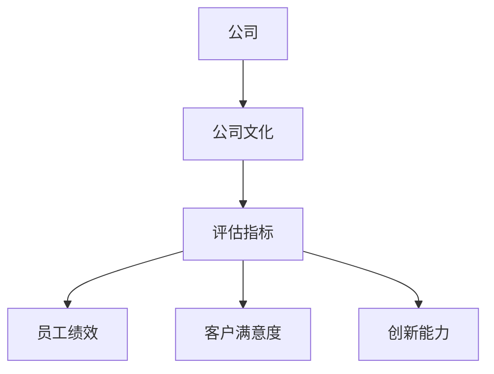
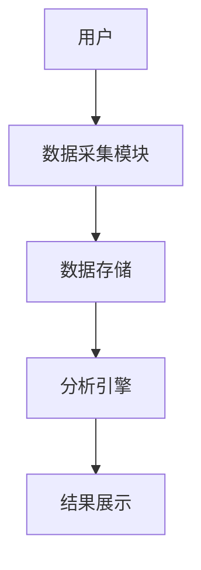

                 


# 费雪的公司文化评估：长期成功的基石

## 关键词：
- 公司文化评估
- 费雪理论
- 长期成功
- 企业文化管理
- 投资评估方法

## 摘要：
本文探讨了公司文化评估在企业长期成功中的关键作用，重点介绍了菲利普·费雪的公司文化评估理论。文章从背景、核心概念、算法原理、系统架构、项目实战到最佳实践，详细分析了如何通过评估公司文化来确保企业长期成功。

---

## 第一部分：背景介绍

### 第1章：公司文化评估的背景与重要性

#### 1.1 公司文化评估的定义与边界
- 1.1.1 公司文化的定义：公司文化是指企业在长期经营中形成的 shared values, beliefs, and practices。
- 1.1.2 公司文化评估的边界与外延：评估范围包括企业内部的所有相关因素，如领导风格、员工价值观、沟通方式等。
- 1.1.3 公司文化评估的核心要素组成：包括领导力、员工参与度、团队协作、创新精神等。

#### 1.2 公司文化评估的重要性
- 1.2.1 公司文化对企业长期发展的意义：良好的公司文化能够提升员工的忠诚度和创造力，促进企业长期发展。
- 1.2.2 公司文化对员工绩效的影响：积极的文化氛围能够提高员工的工作效率和满意度。
- 1.2.3 公司文化在企业并购中的作用：文化兼容性是企业并购成功的关键因素之一。

#### 1.3 费雪的公司文化评估理论基础
- 1.3.1 费雪的成长投资理念：费雪强调投资于具有持续成长潜力的公司，而公司文化是决定成长能力的关键因素。
- 1.3.2 费雪对公司文化评估的贡献：提出了系统化的文化评估方法，包括管理层风格、员工参与度、客户满意度等多个维度。
- 1.3.3 费雪理论的适用性与局限性：适用于成长型企业，但在快速变化的环境中可能需要动态调整。

---

## 第二部分：核心概念与联系

### 第2章：公司文化评估的核心要素

#### 2.1 核心概念的原理
- 公司文化评估的核心在于识别和量化影响企业绩效的关键文化因素。

#### 2.2 核心要素对比表格
| 评估维度 | 定义 | 重要性 |
|----------|------|--------|
| 领导力   | 领导者的风格和决策方式 | 极高，影响团队方向和动力 |
| 员工参与度 | 员工对工作的投入程度 | 高，直接影响生产力和创新 |
| 团队协作 | 团队内部的合作程度 | 中高，影响项目执行效率 |
| 创新精神 | 员工的创新意识和能力 | 高，推动企业持续发展 |

#### 2.3 实体关系图


---

## 第三部分：算法原理讲解

### 第3章：费雪文化评估算法的实现

#### 3.1 数据收集与预处理
- 数据来源：员工满意度调查、客户反馈、管理层评估等。
- 数据清洗：去除无效数据，处理异常值。

#### 3.2 费雪评估模型的构建
- 使用加权评分法，根据各个维度的重要性和表现打分。
- 公式：文化指数 = Σ (权重_i × 评分_i)

#### 3.3 评估结果分析
- 根据文化指数将企业分为优秀、良好、一般、较差四个等级。

#### 3.4 代码实现
```python
def fisher_culture_score(weights, scores):
    return sum(w * s for w, s in zip(weights, scores))

weights = [0.3, 0.25, 0.2, 0.15, 0.1]
scores = [0.8, 0.7, 0.6, 0.5, 0.4]
print(fisher_culture_score(weights, scores))  # 输出文化指数
```

#### 3.5 结果可视化
- 使用柱状图展示各维度评分，帮助管理层直观了解文化现状。

---

## 第四部分：系统分析与架构设计

### 第4章：文化评估系统的架构与实现

#### 4.1 问题场景介绍
- 系统目标：开发一个能够自动评估公司文化的在线工具。
- 项目介绍：基于费雪理论，构建一个用户友好的文化评估平台。

#### 4.2 系统功能设计
- 数据采集模块：收集员工、客户等反馈数据。
- 分析引擎：应用费雪模型计算文化指数。
- 用户界面：直观展示评估结果和改进建议。

#### 4.3 系统架构设计


#### 4.4 接口设计与交互流程
- API接口：提供RESTful API，方便第三方集成。
- 交互流程：用户输入数据，系统处理并返回评估结果。

---

## 第五部分：项目实战

### 第5章：基于费雪模型的文化评估实战

#### 5.1 项目环境安装
- 安装Python、数据处理库（Pandas、NumPy）、可视化库（Matplotlib）。

#### 5.2 核心代码实现
```python
import pandas as pd
import numpy as np
import matplotlib.pyplot as plt

def calculate_culture_index(df, weights):
    return np.dot(df.values, weights)

weights = [0.3, 0.25, 0.2, 0.15, 0.1]
data = {'维度1': [0.8, 0.7, 0.6], '维度2': [0.7, 0.6, 0.5]}
df = pd.DataFrame(data)
index = calculate_culture_index(df, weights)
print(index)
```

#### 5.3 项目结果分析
- 可视化结果：使用柱状图展示各维度评分。
- 文化指数：计算得出的文化指数值。

#### 5.4 实际案例分析
- 案例背景：某科技公司希望优化企业文化。
- 评估结果：文化指数为0.65，属于良好水平，建议加强创新文化。

---

## 第六部分：最佳实践

### 第6章：文化评估的实战经验总结

#### 6.1 小结
- 费雪的文化评估方法在实践中被证明是有效的，但需要根据企业实际情况调整权重。

#### 6.2 注意事项
- 数据收集要全面且真实，避免偏见。
- 结果分析要结合企业具体情况，避免表面化。

#### 6.3 拓展阅读
- 推荐书籍：《成长股投资》、《企业文化：现代企业的精神支柱》。
- 在线资源：推荐相关博客和视频教程。

---

## 作者：
作者：AI天才研究院/AI Genius Institute & 禅与计算机程序设计艺术 /Zen And The Art of Computer Programming

