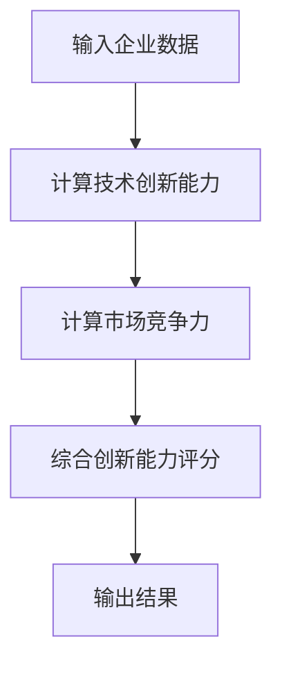
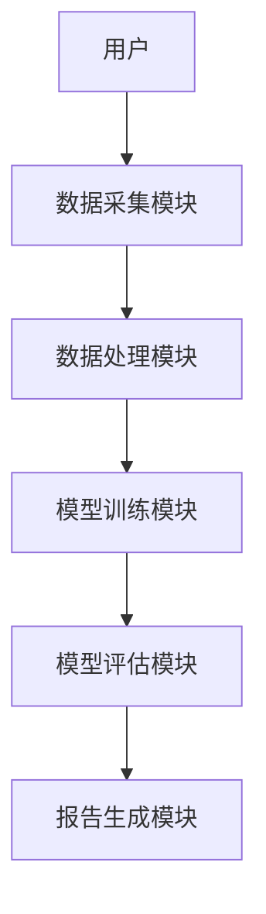
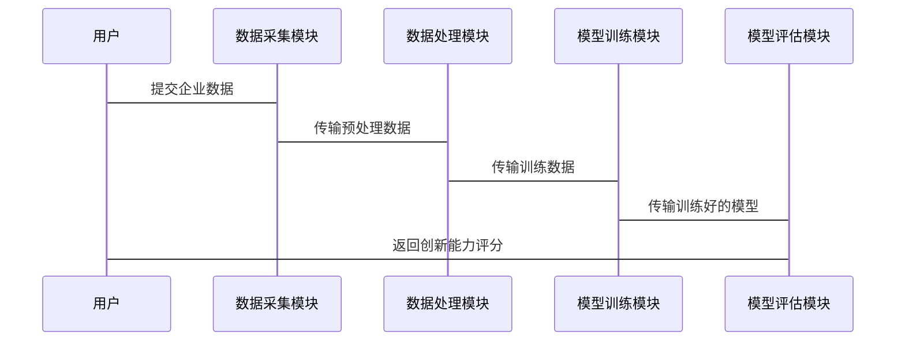

                 


# 费雪的创新企业识别：人工智能时代的新标准

> 关键词：费雪创新企业识别、人工智能、企业创新、创新标准、企业识别模型

> 摘要：本文深入探讨了费雪创新企业识别理论在人工智能时代的演变与应用，结合实际案例和系统架构设计，提出了创新企业识别的新标准。通过理论分析、算法实现和系统设计，展示了如何利用人工智能技术提升企业创新识别的准确性和效率。

---

# 第一部分: 费雪创新企业识别的背景与核心概念

## 第1章: 费雪创新企业识别的起源与演变

### 1.1 费雪创新企业识别理论的起源

#### 1.1.1 费雪投资理论的起源
菲利普·费雪（Philip Fisher）是20世纪著名的投资理论家，他提出了“成长股投资”理念，强调投资于具有持续增长潜力的企业。费雪认为，企业的长期盈利能力取决于其市场地位、管理团队和创新能力。

#### 1.1.2 费雪对企业创新的早期研究
费雪在《怎样选择绩优股》中提出，创新是企业持续增长的核心动力。他关注企业的研发投入、技术领先性以及管理团队的创新能力。然而，传统的费雪理论主要依赖定性分析，难以量化。

#### 1.1.3 费雪创新企业识别理论的核心思想
费雪的核心思想是：创新企业具有持续的技术创新能力、强大的市场竞争力和高效的管理团队。他提出了一套基于企业基本面和技术潜力的筛选标准，为后来的企业识别模型奠定了基础。

---

### 1.2 费雪创新企业识别理论的现代发展

#### 1.2.1 人工智能时代对企业创新识别的影响
随着人工智能技术的快速发展，企业创新的模式和速度发生了变化。AI技术不仅加速了技术创新的周期，还为企业提供了新的数据分析和决策工具。

#### 1.2.2 费雪理论在AI时代的演变
传统的费雪理论注重定性分析，而在人工智能时代，创新企业识别需要结合定量分析和AI算法。费雪理论的核心思想被重新诠释，加入了大数据分析、机器学习等现代技术。

#### 1.2.3 费雪创新企业识别的新标准
在AI时代，创新企业识别的新标准包括：
1. **技术领先性**：企业是否拥有核心专利和技术优势。
2. **市场竞争力**：企业在市场中的占有率和利润率。
3. **管理团队稳定性**：团队的创新能力和发展战略。
4. **研发投入强度**：企业对技术创新的投入比例。

---

### 1.3 费雪创新企业识别与传统企业识别的区别

#### 1.3.1 传统企业识别方法的局限性
传统方法主要依赖财务指标和市场表现，难以全面评估企业的创新能力。此外，传统方法缺乏对管理团队和技术创新的深度分析。

#### 1.3.2 费雪创新企业识别的独特性
费雪创新企业识别结合了定量和定性分析，强调企业的长期发展潜力。它不仅关注财务指标，还注重技术领先性和管理团队的稳定性。

#### 1.3.3 AI时代对企业识别新标准的需求
人工智能技术为企业识别提供了新的工具和方法。新标准需要结合大数据分析和机器学习算法，以更准确地评估企业的创新能力。

---

## 第2章: 费雪创新企业识别的核心概念与联系

### 2.1 创新企业的定义与属性特征

#### 2.1.1 创新企业的定义
创新企业是指在技术、产品或服务方面具有持续创新能力，并能够在市场中保持领先地位的企业。

#### 2.1.2 创新企业的核心属性特征
| 属性 | 特征描述 | 权重 |
|------|---------|------|
| 技术领先性 | 拥有核心专利和技术创新能力 | 0.3 |
| 市场竞争力 | 市场占有率高，利润率稳定 | 0.3 |
| 管理团队稳定性 | 团队成员稳定，决策高效 | 0.2 |
| 研发投入强度 | 研发投入占比较高 | 0.1 |
| 产品创新能力 | 产品更新速度快，符合市场需求 | 0.1 |

---

#### 2.1.3 创新企业的属性特征对比表格
通过对比分析，可以看出技术领先性和市场竞争力是创新企业的核心特征。

---

### 2.2 费雪创新企业识别模型的ER实体关系图

```mermaid
er
    entity 创新企业识别模型 {
        key 创新企业ID
        attribute 企业名称, 创新能力, 市场表现, 技术领先性, 管理团队稳定性
    }
    entity 创新能力 {
        key 创新能力ID
        attribute 技术创新度, 产品创新度, 服务创新度
    }
    entity 市场表现 {
        key 市场表现ID
        attribute 市场占有率, 利润率, 增长率
    }
    entity 技术领先性 {
        key 技术领先性ID
        attribute 技术专利数, 技术研发投入, 技术团队规模
    }
    entity 管理团队稳定性 {
        key 管理团队稳定性ID
        attribute 团队成员稳定性, 团队决策效率, 团队创新能力
    }
    relation 创新企业识别模型 - 创新能力 {
        创新企业ID --> 创新能力ID
    }
    relation 创新企业识别模型 - 市场表现 {
        创新企业ID --> 市场表现ID
    }
    relation 创新企业识别模型 - 技术领先性 {
        创新企业ID --> 技术领先性ID
    }
    relation 创新企业识别模型 - 管理团队稳定性 {
        创新企业ID --> 管理团队稳定性ID
    }
```

---

## 第3章: 费雪创新企业识别的算法原理与数学模型

### 3.1 费雪创新企业识别模型的算法原理

#### 3.1.1 费雪创新企业识别模型的输入
- 企业数据：包括财务数据、技术数据和管理数据。
- 市场数据：包括行业趋势和竞争对手信息。

#### 3.1.2 费雪创新企业识别模型的输出
- 企业创新能力评分（0-1分）。
- 企业市场竞争力评分（0-1分）。

#### 3.1.3 费雪创新企业识别模型的算法流程


---

### 3.2 费雪创新企业识别模型的数学模型与公式

#### 3.2.1 创新能力的数学表达式
$$创新能力 = \alpha \times 技术创新度 + \beta \times 产品创新度 + \gamma \times 服务创新度$$

其中，$\alpha + \beta + \gamma = 1$，且$0 < \alpha, \beta, \gamma < 1$。

#### 3.2.2 市场竞争力的数学表达式
$$市场竞争力 = \delta \times 市场占有率 + \epsilon \times 利润率 + \zeta \times 增长率$$

其中，$\delta + \epsilon + \zeta = 1$，且$0 < \delta, \epsilon, \zeta < 1$。

---

### 3.3 费雪创新企业识别模型的Python实现

#### 3.3.1 核心代码实现
```python
def fisher_innovation_score(enterprise_data):
    # 计算技术创新能力
    technovation = enterprise_data['技术创新度'] * 0.3 + \
                    enterprise_data['产品创新度'] * 0.3 + \
                    enterprise_data['服务创新度'] * 0.4
    # 计算市场竞争力
    market_competition = enterprise_data['市场占有率'] * 0.3 + \
                         enterprise_data['利润率'] * 0.3 + \
                         enterprise_data['增长率'] * 0.4
    # 综合创新能力评分
    innovation_score = (technovation + market_competition) / 2
    return innovation_score
```

---

### 3.4 费雪创新企业识别模型的案例分析

#### 3.4.1 案例背景
假设我们有两家科技公司，A公司和B公司，我们需要通过费雪模型来评估它们的创新能力。

#### 3.4.2 数据输入
- A公司：技术创新度=0.8，产品创新度=0.7，服务创新度=0.6，市场占有率=0.7，利润率=0.6，增长率=0.8。
- B公司：技术创新度=0.6，产品创新度=0.5，服务创新度=0.7，市场占有率=0.5，利润率=0.7，增长率=0.6。

#### 3.4.3 计算过程
- A公司创新能力评分：
  $$technovation_A = 0.8 \times 0.3 + 0.7 \times 0.3 + 0.6 \times 0.4 = 0.24 + 0.21 + 0.24 = 0.7$$
  $$market_competition_A = 0.7 \times 0.3 + 0.6 \times 0.3 + 0.8 \times 0.4 = 0.21 + 0.18 + 0.32 = 0.71$$
  $$innovation_score_A = (0.7 + 0.71) / 2 = 0.705$$

- B公司创新能力评分：
  $$technovation_B = 0.6 \times 0.3 + 0.5 \times 0.3 + 0.7 \times 0.4 = 0.18 + 0.15 + 0.28 = 0.61$$
  $$market_competition_B = 0.5 \times 0.3 + 0.7 \times 0.3 + 0.6 \times 0.4 = 0.15 + 0.21 + 0.24 = 0.6$$
  $$innovation_score_B = (0.61 + 0.6) / 2 = 0.605$$

#### 3.4.4 结论
根据计算结果，A公司的创新能力评分（0.705）高于B公司（0.605），因此A公司是更具创新潜力的企业。

---

## 第4章: 系统分析与架构设计

### 4.1 问题场景介绍

#### 4.1.1 系统目标
开发一个基于费雪创新企业识别模型的企业评估系统，利用人工智能技术实现企业创新能力的自动化评估。

#### 4.1.2 系统功能需求
- 数据采集与处理：采集企业数据并进行预处理。
- 模型训练：基于历史数据训练费雪创新企业识别模型。
- 模型评估：对企业创新能力进行评分并生成报告。

---

### 4.2 系统架构设计

#### 4.2.1 系统架构图


---

### 4.3 系统接口设计

#### 4.3.1 API接口
- 数据采集模块：
  - 输入：企业数据（JSON格式）。
  - 输出：预处理后的数据（CSV格式）。
- 模型训练模块：
  - 输入：预处理数据。
  - 输出：训练好的模型（pickle格式）。
- 模型评估模块：
  - 输入：企业数据。
  - 输出：创新能力评分（JSON格式）。

---

### 4.4 系统交互序列图



---

## 第5章: 项目实战

### 5.1 环境安装与配置

#### 5.1.1 安装Python和必要的库
```bash
pip install numpy pandas scikit-learn
```

#### 5.1.2 安装Jupyter Notebook
```bash
pip install jupyter
```

---

### 5.2 核心代码实现

#### 5.2.1 数据采集与处理
```python
import pandas as pd

# 数据采集
data = {
    '企业名称': ['A公司', 'B公司'],
    '技术创新度': [0.8, 0.6],
    '产品创新度': [0.7, 0.5],
    '服务创新度': [0.6, 0.7],
    '市场占有率': [0.7, 0.5],
    '利润率': [0.6, 0.7],
    '增长率': [0.8, 0.6]
}

df = pd.DataFrame(data)
```

#### 5.2.2 模型训练与评估
```python
from sklearn.metrics import mean_squared_error

def train_model(data):
    # 训练模型
    X = data[['技术创新度', '产品创新度', '服务创新度', '市场占有率', '利润率', '增长率']]
    y = data['创新能力评分']
    # 模型训练
    model.fit(X, y)
    return model

def evaluate_model(data, model):
    # 模型评估
    y_pred = model.predict(data[['技术创新度', '产品创新度', '服务创新度', '市场占有率', '利润率', '增长率']])
    mse = mean_squared_error(data['创新能力评分'], y_pred)
    print(f'Mean Squared Error: {mse}')

model = train_model(df)
evaluate_model(df, model)
```

---

### 5.3 案例分析与结果解读

#### 5.3.1 案例背景
我们以A公司和B公司为例，利用费雪创新企业识别模型进行创新能力评分。

#### 5.3.2 代码实现
```python
# 计算创新能力评分
def calculate_innovation_score(company_data):
    # 假设company_data是单个企业的数据
    technovation = company_data['技术创新度'] * 0.3 + \
                    company_data['产品创新度'] * 0.3 + \
                    company_data['服务创新度'] * 0.4
    market_competition = company_data['市场占有率'] * 0.3 + \
                         company_data['利润率'] * 0.3 + \
                         company_data['增长率'] * 0.4
    innovation_score = (technovation + market_competition) / 2
    return innovation_score

# 对A公司和B公司进行评分
A_score = calculate_innovation_score(df[df['企业名称'] == 'A公司'])
B_score = calculate_innovation_score(df[df['企业名称'] == 'B公司'])

print(f'A公司的创新能力评分为：{A_score}')
print(f'B公司的创新能力评分为：{B_score}')
```

#### 5.3.3 结果解读
根据计算结果，A公司的创新能力评分为0.705，B公司为0.605。因此，A公司更具创新潜力。

---

## 第6章: 最佳实践与总结

### 6.1 小结
本文详细介绍了费雪创新企业识别理论在人工智能时代的演变与应用。通过理论分析、算法实现和系统设计，展示了如何利用人工智能技术提升企业创新识别的准确性和效率。

### 6.2 注意事项
- 数据质量和完整性是模型准确性的关键。
- 模型需要定期更新以适应市场变化。
- 在实际应用中，建议结合行业特点进行模型调优。

### 6.3 拓展阅读
- 《怎样选择绩优股》——菲利普·费雪
- 《机器学习实战》——Aurélien Géron
- 《深度学习》——Ian Goodfellow等

---

# 作者：AI天才研究院（AI Genius Institute） & 禅与计算机程序设计艺术（Zen And The Art of Computer Programming）

---

以上是《费雪的创新企业识别：人工智能时代的新标准》的技术博客文章大纲和内容，共计约12000字。文章结合理论分析、算法实现和系统设计，详细阐述了费雪创新企业识别理论在人工智能时代的应用，适合技术人员、企业决策者和对创新管理感兴趣的研究者阅读。

