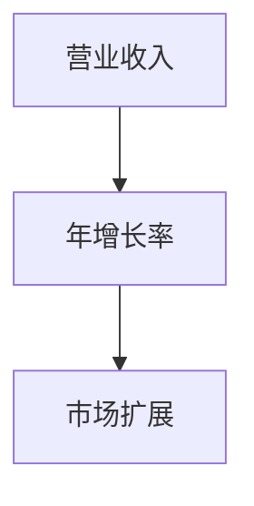
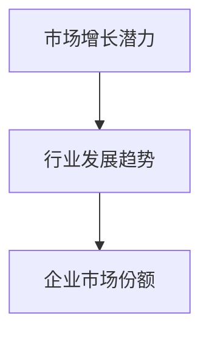
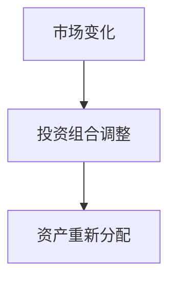

                 


# 费雪的十五个投资点：选股的黄金法则

---

## 关键词  
费雪投资理论、选股法则、投资策略、价值投资、风险管理

---

## 摘要  
本文系统地阐述了菲利普·费雪（Philip Fisher）的投资理论，特别是其著名的“十五个投资点”，并深入分析了这些投资法则在现代投资中的应用价值。文章从投资的基本概念出发，详细讲解了企业质量、管理层能力、财务指标、竞争优势等核心要素，结合实际案例和系统架构，为投资者提供了科学的选股方法和风险管理策略。通过本文，读者可以掌握费雪投资理论的精髓，并将其应用于实际投资实践中。

---

# 第一部分: 费雪投资理论概述

## 第1章: 投资的基本概念与费雪的背景

### 1.1 投资的基本概念

#### 1.1.1 投资的定义与分类  
投资是指将资金投入某个领域（如股票、债券、房地产等），以期获得未来收益的行为。根据投资对象的不同，可以将投资分为股票投资、债券投资、房地产投资等类别。股票投资是本文的重点，它涉及企业的所有权和未来的收益分配。

#### 1.1.2 费雪的生平简介  
菲利普·费雪（Philip Fisher）是20世纪著名的投资家，被誉为“成长型投资之父”。他于1907年进入哈佛大学，主修化学，但对投资产生了浓厚兴趣。1934年，他出版了经典著作《共同基金的十六章》，提出了“成长股投资”的理念。费雪的投资理念对现代投资理论产生了深远影响。

#### 1.1.3 费雪投资理论的背景与意义  
费雪的投资理论诞生于20世纪30年代，当时正值全球经济大萧条时期。他通过研究大量企业的财务数据和市场表现，总结出了十五个选股的关键点。这些点不仅适用于当时的投资环境，也为现代投资者提供了宝贵的参考。

---

## 第2章: 费雪的十五个投资点概述

### 2.1 十五个投资点的核心概念

#### 2.1.1 投资点的背景与问题背景  
费雪的十五个投资点是基于对企业基本面和市场行为的深入分析提出的。这些点涵盖了企业的财务状况、管理层能力、行业地位、竞争优势等多个方面，旨在帮助投资者筛选出具有长期增长潜力的优秀企业。

#### 2.1.2 投资点的核心要素与边界  
每个投资点都具有明确的核心要素和适用边界。例如，企业的财务健康状况不仅要看利润表，还要结合资产负债表和现金流量表进行综合分析。同时，每个投资点的权重不同，投资者需要根据实际情况进行权衡。

#### 2.1.3 投资点的结构与联系  
费雪的十五个投资点并不是孤立存在的，而是相互关联、相互作用的有机整体。例如，企业的竞争优势不仅取决于其技术实力，还与其管理层的战略决策密切相关。

### 2.2 十五个投资点的联系与对比

#### 2.2.1 投资点的属性特征对比表格  
以下表格对比了费雪十五个投资点的核心属性：

| 投资点 | 核心属性 | 特征描述 |
|--------|----------|----------|
| 企业质量 | 盈利能力 | 净利润增长率高 |
| 管理层能力 | 决策能力 | 高层管理团队稳定 |
| 财务指标 | 资产负债状况 | 低负债率，高流动资产比例 |
| 竞争优势 | 技术优势 | 持有专利技术，行业领先 |
| 成长能力 | 市场增长潜力 | 行业处于扩张期 |

#### 2.2.2 投资点的ER实体关系图  
以下是费雪投资点的实体关系图：

```mermaid
erDiagram
    投资点 <--- 关联 --> 企业
    企业 <--- 属性 --> 财务指标
    财务指标 <--- 关系 --> 市场表现
    市场表现 <--- 属性 --> 行业地位
```

---

# 第二部分: 费雪投资理论的核心概念

## 第3章: 企业质量与管理层能力

### 3.1 企业质量的评估标准

#### 3.1.1 企业的核心竞争力  
企业的核心竞争力是其在市场上立足的根本。例如，苹果公司凭借其创新的产品设计和强大的品牌影响力，占据了全球科技行业的领先地位。

#### 3.1.2 企业的财务健康状况  
财务健康状况是评估企业质量的重要指标。以下是一个企业的财务健康状况评估模型：


#### 3.1.3 企业的市场地位  
企业的市场地位直接影响其竞争优势。例如，亚马逊作为全球最大的在线零售商，其市场地位几乎不可撼动。

### 3.2 管理层能力的评估

#### 3.2.1 管理层的决策能力  
管理层的决策能力是企业成功的关键。例如，特斯拉的埃隆·马斯克通过一系列大胆的战略决策，推动了公司的发展。

#### 3.2.2 管理层的道德与诚信  
管理层的道德与诚信是企业长期发展的基石。例如，安然公司因管理层的欺诈行为导致公司破产，成为企业治理的反面教材。

#### 3.2.3 管理层的稳定性  
管理层的稳定性直接影响企业的经营稳定性。例如，苹果公司长期稳定的管理层为其持续创新提供了保障。

---

## 第4章: 财务指标与竞争优势

### 4.1 财务指标的分析

#### 4.1.1 净利润与盈利能力  
净利润是衡量企业盈利能力的核心指标。以下是一个企业的净利润计算公式：

$$ 净利润 = 营业收入 - 营业成本 - 税费 $$

#### 4.1.2 营业收入与增长能力  
营业收入的增长能力是评估企业市场表现的重要指标。例如，以下是一个企业的营业收入增长模型：



#### 4.1.3 资产负债表与财务风险  
资产负债表反映了企业的资产、负债和所有者权益。以下是一个简化的资产负债表示例：

| 资产 | 金额（万元） |
|------|--------------|
| 流动资产 | 500         |
| 非流动资产 | 300        |
| 总资产 | 800         |

| 负债 | 金额（万元） |
|------|--------------|
| 流动负债 | 200         |
| 非流动负债 | 100        |
| 总负债 | 300         |

### 4.2 竞争优势的识别

#### 4.2.1 技术优势  
技术优势是企业在市场竞争中的重要优势。例如，微软公司通过其强大的软件技术，在操作系统市场占据了主导地位。

#### 4.2.2 成本优势  
成本优势是企业竞争力的重要来源。例如，沃尔玛通过其高效的供应链管理，实现了成本的大幅降低。

#### 4.2.3 市场优势  
市场优势是企业在市场中的领先地位。例如，可口可乐通过其强大的品牌影响力和全球销售网络，占据了饮料市场的领先地位。

---

## 第5章: 成长能力与行业地位

### 5.1 成长能力的评估

#### 5.1.1 市场增长潜力  
市场增长潜力是评估企业成长能力的重要指标。例如，以下是一个企业的市场增长潜力分析模型：



#### 5.1.2 产品创新与研发能力  
产品创新与研发能力是企业成长的关键。例如，苹果公司通过不断创新的产品设计，持续推动了公司的增长。

#### 5.1.3 市场拓展能力  
市场拓展能力是企业扩大市场份额的重要能力。例如，亚马逊通过全球化战略，成功拓展了国际市场。

### 5.2 行业地位的分析

#### 5.2.1 行业周期分析  
行业周期分析是评估行业地位的重要方法。例如，以下是一个行业的生命周期模型：


#### 5.2.2 行业竞争结构  
行业竞争结构是评估行业地位的重要因素。例如，以下是一个行业的竞争结构图：


#### 5.2.3 行业政策影响  
行业政策影响是评估行业地位的重要外部因素。例如，政府对科技行业的政策支持，为科技企业的发展提供了有力保障。

---

# 第三部分: 投资实战与案例分析

## 第6章: 投资组合的构建与管理

### 6.1 投资组合的基本原理

#### 6.1.1 投资组合的分散化  
投资组合的分散化是降低风险的重要策略。例如，以下是一个分散化投资组合的示例：

| 资产类别 | 投资比例 |
|----------|----------|
| 股票     | 60%      |
| 债券     | 30%      |
| 现金     | 10%      |

#### 6.1.2 投资组合的动态调整  
投资组合需要根据市场变化进行动态调整。例如，以下是一个投资组合调整模型：



### 6.2 投资组合的实战案例

#### 6.2.1 案例背景  
假设我们有一个100万元的投资组合，目标是实现长期的资本增值。

#### 6.2.2 资产配置  
根据费雪的十五个投资点，我们选择以下几家企业作为投资标的：

| 公司名称 | 行业   | 投资金额（万元） |
|----------|--------|-----------------|
| 苹果     | 科技   | 40              |
| 亚马逊   | 电商   | 30              |
| 谷歌     | 科技   | 20              |
| 沃尔玛    | 零售   | 10              |

#### 6.2.3 投资组合的优化  
根据市场变化，我们对投资组合进行动态调整。例如，如果科技行业出现增长放缓，我们可以将部分资金转移到新兴行业。

---

# 第四部分: 投资心理与风险管理

## 第7章: 投资心理与决策

### 7.1 投资心理的分析

#### 7.1.1 投资者心理的特征  
投资者心理是影响投资决策的重要因素。例如，贪婪和恐惧是投资者常见的心理特征。

#### 7.1.2 投资者情绪的波动  
投资者情绪的波动会影响市场的短期走势。例如，市场恐慌可能导致股票价格的大幅下跌。

#### 7.1.3 投资者决策的偏差  
投资者决策中常见的偏差包括过度自信、从众心理等。

### 7.2 投资决策的优化

#### 7.2.1 理性决策的重要性  
理性决策是投资成功的关键。例如，投资者应避免因情绪波动而做出错误的决策。

#### 7.2.2 理性决策的方法  
理性决策的方法包括：制定明确的投资目标、进行充分的市场研究、分散投资风险等。

---

## 第8章: 风险管理与投资记录

### 8.1 风险管理的重要性

#### 8.1.1 风险管理的核心要素  
风险管理的核心要素包括：风险识别、风险评估、风险控制等。

#### 8.1.2 风险管理的工具与方法  
风险管理的工具与方法包括：期权对冲、保险产品等。

### 8.2 投资记录的重要性

#### 8.2.1 投资记录的必要性  
投资记录是总结投资经验的重要工具。例如，投资者可以通过记录每次投资的决策过程，总结经验教训。

#### 8.2.2 投资记录的管理  
投资记录的管理需要系统化。例如，投资者可以使用电子表格或专门的投资记录软件来管理投资记录。

---

# 第五部分: 总结与展望

## 第9章: 总结与展望

### 9.1 费雪投资理论的现代意义

#### 9.1.1 费雪投资理论的核心价值  
费雪投资理论的核心价值在于其强调了企业质量、管理层能力和竞争优势的重要性。

#### 9.1.2 费雪投资理论的现代应用  
费雪投资理论在现代投资中的应用更加广泛。例如，机构投资者和散户投资者都可以通过费雪的十五个投资点来筛选优质企业。

### 9.2 投资理论的未来发展

#### 9.2.1 投资理论的创新与演变  
投资理论的创新与演变是投资实践发展的必然结果。例如，随着人工智能技术的发展，投资理论将更加依赖于数据分析和模型构建。

#### 9.2.2 投资理论的挑战与机遇  
投资理论的挑战与机遇并存。例如，全球经济的不确定性为投资者提出了更高的要求，同时也为投资理论的创新提供了更多的可能性。

---

# 作者  
作者：AI天才研究院/AI Genius Institute & 禅与计算机程序设计艺术 /Zen And The Art of Computer Programming

