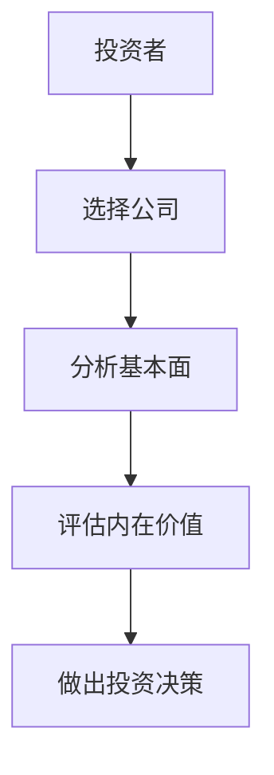
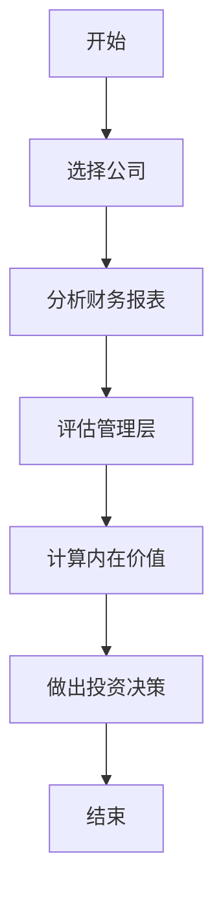
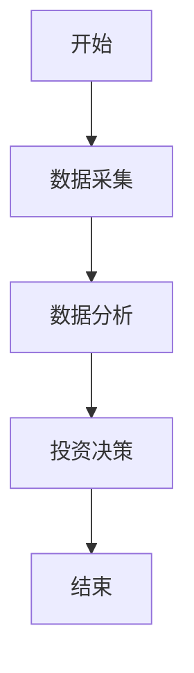
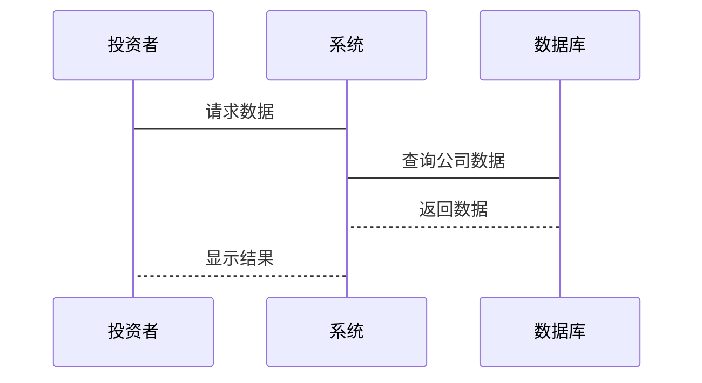

                 


# 费雪的十五个投资要点：选股的艺术

---

## 关键词  
- 费雪投资要点  
- 选股艺术  
- 投资原理  
- 数学模型  
- 系统架构  

---

## 摘要  
本文详细解析了费雪的十五个投资要点，从背景介绍到实际应用，结合数学模型和系统架构，全面剖析选股的艺术。文章首先介绍了投资的基本概念和费雪的背景，随后深入分析了每个投资要点的核心原理和特征，结合实际案例和数学公式，展示如何在实践中应用这些要点。最后，通过系统架构设计和项目实战，帮助读者掌握投资分析的完整流程。

---

# 第一部分: 费雪投资要点的背景与概述

## 第1章: 投资的基础与重要性  

### 1.1 投资的基本概念  
#### 1.1.1 投资的定义与分类  
投资是指将资金投入某个领域以获得未来收益的行为。根据投资对象的不同，可以分为股票、债券、房地产等多种类型。  
#### 1.1.2 投资的基本原则  
投资的核心原则包括分散投资、长期持有和价值投资。  
#### 1.1.3 投资与财务自由的关系  
通过合理的投资，个人可以实现财富的增值和财务自由。  

### 1.2 费雪投资理论的背景  
#### 1.2.1 费雪的生平简介  
菲利普·费雪（Philip Fisher）是20世纪著名的投资专家，以其价值投资理论闻名。  
#### 1.2.2 费雪投资理论的提出背景  
费雪的投资理论在20世纪中期提出，强调长期投资和对公司基本面的深入分析。  
#### 1.2.3 费雪理论在现代投资中的地位  
尽管时间流逝，费雪的投资理论至今仍被广泛应用于投资实践中。  

### 1.3 费雪的十五个投资要点概述  
#### 1.3.1 投资要点的核心思想  
费雪的十五个投资要点围绕公司基本面分析展开，强调选择具有强大竞争优势和良好管理的公司。  
#### 1.3.2 投资要点的分类与结构  
要点分为公司分析、行业分析和市场分析三大类。  
#### 1.3.3 投资要点的实际应用价值  
这些要点为投资者提供了系统的选股框架，帮助其做出更明智的投资决策。  

---

# 第二部分: 费雪投资要点的核心概念与联系

## 第2章: 核心概念的原理与特征  

### 2.1 费雪投资要点的核心原理  
#### 2.1.1 投资的内在价值理论  
内在价值是公司未来现金流的现值，是选股的核心依据。  
#### 2.1.2 费雪公式的核心逻辑  
$$ V = \sum_{t=1}^{n} \frac{CF_t}{(1 + r)^t} $$  
其中，\( V \) 是内在价值，\( CF_t \) 是第 \( t \) 年的现金流，\( r \) 是折现率。  

### 2.2 核心概念的特征对比  
#### 2.2.1 费雪投资要点的属性特征  
| 特性 | 描述 |  
|------|------|  
| 长期性 | 强调长期投资 |  
| 基础性 | 依赖公司基本面 |  
| 选择性 | 筛选优质公司 |  

#### 2.2.2 不同投资方法的对比分析  
- **价值投资**：寻找被市场低估的股票。  
- **成长投资**：投资于高成长性的公司。  
- **趋势投资**：跟随市场趋势进行交易。  

#### 2.2.3 费雪投资要点与其他理论的联系  
费雪理论与格雷厄姆的价值投资理论有相似之处，但更注重公司的成长性和管理能力。  

### 2.3 实体关系图与流程图  
#### 2.3.1 投资决策的ER实体关系图  
```mermaid
erd
    投资者 -> 公司: 持有
    公司 -> 行业: 所属
    行业 -> 市场: 参与
```

#### 2.3.2 费雪投资模型的Mermaid流程图  


---

# 第三部分: 费雪投资要点的数学模型与算法原理

## 第3章: 费雪公式与数学模型  

### 3.1 费雪公式的数学推导  
#### 3.1.1 费雪公式的latex公式表示  
$$ V = \sum_{t=1}^{n} \frac{CF_t}{(1 + r)^t} $$  
其中，\( CF_t \) 是第 \( t \) 年的现金流，\( r \) 是折现率，\( n \) 是投资期限。  

#### 3.1.2 费雪公式的详细推导过程  
内在价值的计算需要对未来现金流进行折现，考虑资金的时间价值。  

#### 3.1.3 公式的实际应用案例  
假设某公司未来5年的现金流分别为100万、120万、140万、160万、180万，折现率为8%。计算其内在价值：  
$$ V = \frac{100}{1.08} + \frac{120}{1.08^2} + \frac{140}{1.08^3} + \frac{160}{1.08^4} + \frac{180}{1.08^5} $$  

### 3.2 投资决策的算法原理  
#### 3.2.1 投资决策的算法流程图  


#### 3.2.2 算法的数学模型与实现  
```python
def calculate_intrinsic_value(cash_flows, discount_rate):
    present_value = 0
    for t, cf in enumerate(cash_flows):
        present_value += cf / (1 + discount_rate) ** t
    return present_value

cash_flows = [100, 120, 140, 160, 180]
discount_rate = 0.08
intrinsic_value = calculate_intrinsic_value(cash_flows, discount_rate)
print(f"内在价值为：{intrinsic_value}")
```

---

# 第四部分: 投资系统分析与架构设计

## 第4章: 投资分析系统的架构设计  

### 4.1 投资分析系统的功能设计  
#### 4.1.1 系统功能模块划分  
- 数据采集模块：收集公司财务数据。  
- 数据分析模块：计算内在价值。  
- 投资决策模块：基于分析结果做出决策。  

#### 4.1.2 系统功能的领域模型Mermaid类图  


#### 4.1.3 系统功能的流程图设计  


### 4.2 系统架构设计  
#### 4.2.1 系统架构的Mermaid架构图  


#### 4.2.2 系统架构的分层设计  
- 用户界面层：展示数据。  
- 业务逻辑层：处理投资决策。  
- 数据访问层：与数据库交互。  

### 4.3 系统交互设计  
#### 4.3.1 系统交互的Mermaid序列图  


---

# 第五部分: 费雪投资要点的项目实战

## 第5章: 项目实战与案例分析  

### 5.1 环境安装与配置  
#### 5.1.1 投资分析工具的安装  
安装Python和相关库（如Pandas、NumPy）。  

#### 5.1.2 数据源的获取与配置  
从股票数据库获取目标公司的财务数据。  

#### 5.1.3 系统环境的优化  
配置Jupyter Notebook和数据可视化工具。  

### 5.2 项目核心实现  
#### 5.2.1 核心代码实现  
```python
import pandas as pd
import numpy as np

def calculate_intrinsic_value(cash_flows, discount_rate):
    present_value = 0
    for t, cf in enumerate(cash_flows):
        present_value += cf / (1 + discount_rate) ** t
    return present_value

# 示例数据
cash_flows = [100, 120, 140, 160, 180]
discount_rate = 0.08
intrinsic_value = calculate_intrinsic_value(cash_flows, discount_rate)
print(f"内在价值为：{intrinsic_value}")
```

#### 5.2.2 代码解读与分析  
上述代码计算了公司未来5年的内在价值，展示了如何应用费雪公式进行投资决策。  

### 5.3 实际案例分析  
#### 5.3.1 案例背景介绍  
选择一家科技公司，分析其财务数据。  

#### 5.3.2 数据分析与计算  
使用费雪公式计算其内在价值，与当前股价进行对比。  

#### 5.3.3 投资决策建议  
根据分析结果，给出是否投资的建议。  

### 5.4 系统优化建议  
#### 5.4.1 系统性能优化  
优化数据处理流程，提高计算效率。  

#### 5.4.2 系统功能扩展  
增加风险评估模块，提升系统的全面性。  

---

# 总结  

费雪的十五个投资要点为选股艺术提供了系统的框架。通过本文的分析，读者可以掌握投资的核心原理、数学模型和系统架构，从而在实际投资中做出更明智的决策。投资需要长期学习和实践，希望本文能为读者提供有价值的参考。

---

## 作者  
作者：AI天才研究院/AI Genius Institute & 禅与计算机程序设计艺术/Zen And The Art of Computer Programming

