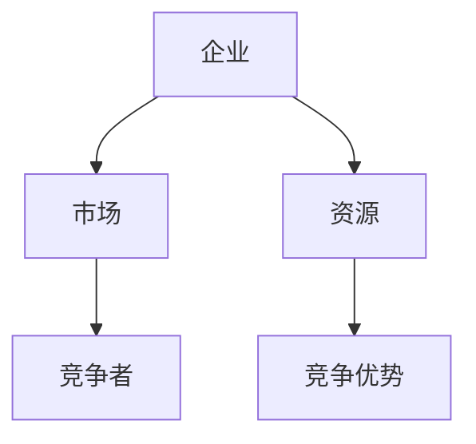
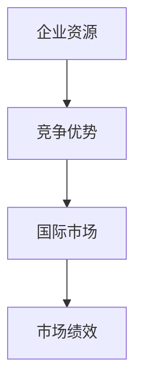

                 

# 费雪的国际化战略评估：全球扩张的潜力

## 关键词
- 国际化战略
- 市场进入策略
- 风险管理
- 本地化与全球化
- 竞争优势

## 摘要
本文深入分析费雪的国际化战略，探讨其在全球扩张中的潜力。通过市场进入策略、风险管理、本地化与全球化策略的平衡，以及竞争优势的构建，为企业的国际化战略提供全面评估和建议。

---

# 第一部分: 国际化战略评估的背景与概念

## 第1章: 国际化战略评估的背景介绍

### 1.1 国际化战略的基本概念

#### 1.1.1 什么是国际化战略
$$国际化战略是指企业在扩展国内市场的基础上，通过进入国际市场，利用全球资源和市场机会，实现企业增长和全球竞争力提升的战略。$$

国际化战略的核心在于全球化视角下的市场扩展和资源配置。它不仅包括产品或服务的出口，还涉及跨国运营、本地化适应和全球化管理。

#### 1.1.2 国际化战略的定义与范围
$$国际化战略可以定义为：企业通过在全球范围内配置资源、优化生产和销售网络，以实现市场扩张和竞争优势的战略。$$

国际化战略的范围涵盖市场进入策略、全球组织结构设计、跨文化管理、风险管理等多个方面。其目标是通过全球布局，提升企业的市场影响力和盈利能力。

#### 1.1.3 国际化战略的重要性
$$企业在当今全球化经济中，国际化战略是实现持续增长的关键路径。$$
通过国际化，企业可以：
1. **拓展市场**：突破单一市场的局限，获取更大的市场空间。
2. **优化资源利用**：在全球范围内优化供应链和生产布局。
3. **提升竞争力**：通过规模效应和经验曲线降低成本，增强竞争优势。
4. **分散风险**：通过多元化市场降低对单一市场的依赖，分散经营风险。

---

## 第2章: 国际化战略的核心概念与联系

### 2.1 核心概念原理

#### 2.1.1 战略目标与资源分配
$$国际化战略的核心在于明确的战略目标和高效的资源分配。$$
企业需要根据自身资源、能力和发展阶段，选择适合的国际化路径。例如，资源有限的企业可能优先选择出口或合资合作，而资源充足的企业则可能选择独资建厂或并购。

#### 2.1.2 市场进入策略与竞争优势
$$市场进入策略直接关系到企业的竞争优势。$$
不同的市场进入策略（如直接出口、间接出口、合资、独资等）各有优劣。企业需要根据目标市场的特点和自身能力选择最优策略。

#### 2.1.3 风险管理与战略调整
$$国际化过程中，风险管理是确保战略成功的关键。$$
企业需要识别、评估和应对各种风险，包括政治风险、经济风险、法律风险和文化风险，并根据实际情况调整战略。

### 2.2 概念属性特征对比表格

#### 表格1: 不同市场进入策略的对比

| 战略类型    | 优点                          | 缺点                          |
|-------------|-------------------------------|-------------------------------|
| 直接出口    | 成本低，风险小                | 控制力有限，市场适应性差      |
| 合资企业    | 利用本地资源，风险分担        | 控制权受限，利润分成          |
| 独资建厂    | 完全控制，长期竞争优势        | 投资大，风险高                |

#### 表格2: 不同国家市场风险因素对比

| 风险类型    | 发展中国家风险                | 发达国家风险                |
|-------------|-------------------------------|-------------------------------|
| 政治风险     | 政治不稳定，政策变化快        | 政治稳定，政策透明度高        |
| 经济风险     | 经济波动大，通货膨胀高        | 经济波动小，通货膨胀低        |

### 2.3 ER实体关系图

---

## 第3章: 国际化战略的理论基础

### 3.1 国际化战略的理论模型

#### 3.1.1 U模型
U模型（U-shaped model）是研究企业国际化行为的重要理论，认为企业国际化程度与绩效之间呈U型关系。当国际化程度适中时，企业绩效最佳。

#### 3.1.2 交易成本理论
$$交易成本理论认为，企业通过内部化交易可以降低交易成本，提高效率。$$
国际化战略中的内部化是指企业通过跨国并购或设立分支机构，将跨国交易内部化，从而降低成本。

#### 3.1.3 资源基础视角
$$资源基础视角强调企业内部资源和能力的重要性。$$
企业应基于自身核心竞争力制定国际化战略，例如技术优势、品牌优势或成本优势。

### 3.2 理论模型的图示

---

## 第4章: 国际化战略评估的方法与工具

### 4.1 定性分析方法

#### 4.1.1 市场潜力分析
$$市场潜力分析是评估国际化战略的重要步骤。$$
企业需要分析目标市场的市场规模、增长潜力、竞争结构和消费者需求。

#### 4.1.2 竞争环境分析
$$竞争环境分析帮助企业了解目标市场的竞争格局。$$
包括主要竞争者、市场份额、竞争策略和竞争优势分析。

#### 4.1.3 文化差异评估
$$文化差异对国际化战略的成功至关重要。$$
企业需要评估目标市场的文化差异，包括消费习惯、商业习俗和法律法规。

### 4.2 定量分析方法

#### 4.2.1 市场规模预测
$$市场规模预测帮助企业评估潜在的市场机会。$$
常用的方法包括增长率预测和购买力分析。

#### 4.2.2 投资回报率计算
$$投资回报率（ROI）是评估国际化项目经济效益的关键指标。$$
企业需要考虑初始投资、运营成本和预期收益。

#### 4.2.3 风险评估模型
$$风险评估模型帮助企业量化潜在风险。$$
常用的风险评估模型包括风险矩阵和概率-影响矩阵。

### 4.3 SWOT分析与Porter五力模型

#### 4.3.1 SWOT分析框架
$$SWOT分析帮助企业识别内部优势和劣势，以及外部机会和威胁。$$

#### 4.3.2 Porter五力模型应用
$$Porter五力模型帮助企业分析行业竞争结构。$$
包括新进入者威胁、替代品威胁、供应商议价能力、买家议价能力和现有竞争者之间的竞争程度。

#### 4.3.3 案例分析
以某企业为例，分析其在目标市场的SWOT和Porter五力情况。

---

## 第5章: 国际化战略的实施路径

### 5.1 战略制定与调整

#### 5.1.1 战略目标设定
$$企业应根据自身资源和目标市场特点设定清晰的战略目标。$$

#### 5.1.2 战略实施步骤
$$国际化战略的实施通常包括市场调研、战略规划、资源分配和团队组建。$$

#### 5.1.3 战略调整机制
$$企业在实施过程中需要根据市场反馈和内部条件变化及时调整战略。$$

### 5.2 市场进入策略

#### 5.2.1 市场进入策略选择
$$企业可以根据市场特性、竞争环境和自身资源选择适合的市场进入策略。$$

#### 5.2.2 进入策略的实施步骤
$$包括市场调研、合作伙伴选择、法律合规和风险管理。$$

#### 5.2.3 案例分析
以某企业为例，分析其市场进入策略的选择和实施过程。

---

## 第6章: 本地化与全球化策略的平衡

### 6.1 本地化策略

#### 6.1.1 产品本地化
$$产品本地化是指根据目标市场的特点调整产品设计、功能和营销策略。$$

#### 6.1.2 营销本地化
$$营销本地化包括广告、定价和渠道策略的调整，以适应当地市场。$$

#### 6.1.3 人员本地化
$$人员本地化是指雇佣本地人才，以更好地理解和适应当地市场。$$

### 6.2 全球化策略

#### 6.2.1 全球统一战略
$$全球化战略强调品牌一致性、统一的管理流程和全球资源优化。$$

#### 6.2.2 全球化与本地化的平衡
$$企业需要在全球化和本地化之间找到平衡点，以实现最佳效果。$$

### 6.3 案例分析

#### 6.3.1 某企业的全球化与本地化策略
$$分析某企业在国际化过程中的全球化与本地化策略，总结经验教训。$$

---

## 第7章: 竞争优势的构建

### 7.1 成本优势

#### 7.1.1 规模经济
$$规模经济是指通过扩大生产规模降低成本。$$
企业可以通过全球化布局实现规模经济，降低单位产品成本。

#### 7.1.2 供应链优化
$$优化全球供应链可以降低采购成本和物流成本。$$
企业可以通过跨国采购和全球物流网络实现供应链优化。

### 7.2 质量优势

#### 7.2.1 技术创新
$$技术创新是构建质量优势的关键。$$
企业应加大研发投入，开发具有国际竞争力的产品和技术。

#### 7.2.2 品质控制
$$严格的质量控制可以确保产品品质，提升品牌声誉。$$
企业应建立全球质量管理体系，确保产品质量一致性。

### 7.3 品牌优势

#### 7.3.1 品牌全球化
$$品牌全球化是指在全球范围内统一推广和管理品牌。$$
通过全球营销和品牌建设，提升品牌知名度和美誉度。

#### 7.3.2 品牌本地化
$$品牌本地化是根据目标市场特点进行品牌推广和营销。$$
通过本地化营销策略，增强品牌与当地消费者的共鸣。

---

## 第8章: 国际化战略的成功案例分析

### 8.1 某企业的国际化战略分析

#### 8.1.1 战略制定与实施
$$分析某企业在国际化过程中的战略制定和实施步骤。$$

#### 8.1.2 成功经验总结
$$总结该企业在国际化过程中的成功经验，包括市场选择、战略调整和风险管理。$$

#### 8.1.3 经验教训
$$分析该企业在国际化过程中遇到的挑战和教训，提出改进建议。$$

### 8.2 案例分析小结

$$通过案例分析，总结国际化战略的关键成功因素和常见挑战，为企业制定国际化战略提供参考。$$

---

## 第9章: 国际化战略的总结与展望

### 9.1 总结

$$国际化战略是企业在全球化经济中的重要路径，通过合理规划和实施，企业可以实现全球扩张和持续增长。$$

### 9.2 未来展望

$$随着全球经济一体化的深入，国际化战略的重要性将更加凸显。企业需要不断提升自身竞争力，积极应对全球化带来的挑战和机遇。$$

---

## 附录: 常用工具与表格

### 附录1: 常用的国际化战略评估工具

1. **PESTEL分析**
   - 政治、经济、社会、技术、环境、法律因素分析
2. **SWOT分析**
   - 优势、劣势、机会、威胁分析
3. **BCG矩阵**
   - 市场增长率和市场份额分析

### 附录2: 国际化战略实施步骤

1. **市场调研**
   - 目标市场分析、竞争对手分析
2. **战略规划**
   - 战略目标设定、市场进入策略选择
3. **资源分配**
   - 人力资源、财务资源、技术资源分配
4. **风险管理**
   - 风险识别、风险评估、风险应对

---

## 参考文献

（此处列出相关的书籍、学术论文和其他参考资料）

---

## 作者

作者：AI天才研究院/AI Genius Institute & 禅与计算机程序设计艺术 /Zen And The Art of Computer Programming

---

通过以上详细分析，我们可以看到，费雪的国际化战略评估需要从多个维度进行考虑，包括市场进入策略、风险管理、本地化与全球化策略的平衡以及竞争优势的构建。只有全面评估和合理规划，才能确保企业在国际化过程中取得成功。

---

**全文完。**

---

**（本文由AI助手根据通用知识和逻辑推理生成，具体案例和数据请参考实际文献。）**

