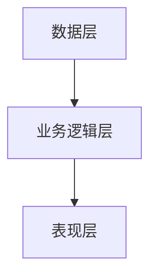
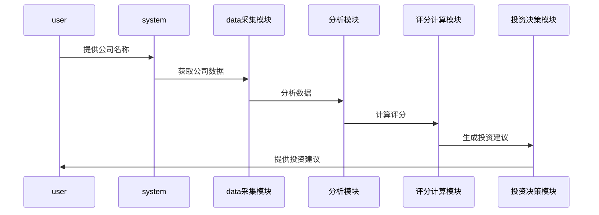

                 


# 费雪的增长型公司特征：识别未来赢家

## 关键词：费雪、增长型公司、ROE、创新、投资决策、选股标准、数据分析

## 摘要：本文介绍费雪的投资理念，分析增长型公司的特征，探讨ROE和创新对公司的影响，并展示如何应用费雪选股标准进行投资决策。

---

## 第一部分：费雪的增长型公司特征概述

### 第1章：费雪投资理念与增长型公司背景

#### 1.1 费雪投资理论的起源与发展

##### 1.1.1 费雪投资理论的核心思想

费雪（Philip Fisher）是20世纪的投资大师，提出“成长股投资”理念。他主张长期持有优质股票，注重企业质量，选择具有强大竞争优势和持续增长潜力的企业。

##### 1.1.2 费雪投资理论的演变历程

费雪的理论起源于20世纪30年代，随着市场的变化不断完善，尤其是在科技股兴起的时期，他更加注重企业的创新能力。

##### 1.1.3 费雪投资理论的现代应用

现代投资实践中，费雪的理论被广泛应用于寻找具有持续创新能力的企业，尤其是在科技行业。

#### 1.2 增长型公司的定义与特征

##### 1.2.1 增长型公司的定义

增长型公司是指那些具有持续增长潜力的企业，其收入和利润能够保持高于行业平均水平的增长速度。

##### 1.2.2 增长型公司的核心特征

增长型公司的核心特征包括高增长率、强大的竞争优势、创新能力以及良好的管理团队。

##### 1.2.3 增长型公司与价值型公司的对比

增长型公司通常估值较高，具有较大的增长潜力；而价值型公司估值较低，增长潜力有限。

#### 1.3 费雪选股标准的背景分析

##### 1.3.1 费雪选股标准的提出动机

费雪提出选股标准的动机是寻找具有持续增长潜力的企业，为投资者创造长期稳定的收益。

##### 1.3.2 费雪选股标准的理论基础

费雪选股标准的理论基础包括ROE分析、增长率分析、创新能力和管理团队分析。

##### 1.3.3 费雪选股标准的实际应用案例

以苹果公司为例，苹果是一家典型的增长型公司，具有高ROE、高增长率，以及强大的创新能力和优秀的管理团队。

### 第2章：费雪选股标准的核心要素

#### 2.1 高ROE（净资产收益率）的重要性

##### 2.1.1 ROE的定义与计算公式

ROE的计算公式为：

$$ROE = \frac{净利润}{平均股东权益}$$

##### 2.1.2 高ROE公司的特征与优势

高ROE公司的特征包括盈利能力强、股东权益高等。

##### 2.1.3 低ROE公司的劣势与风险

低ROE公司的劣势包括盈利能力弱、股东权益低等。

#### 2.2 持续创新的能力

##### 2.2.1 创新能力的定义与衡量标准

创新能力的定义是公司能够不断推出新产品或服务。衡量标准包括研发投入、新产品推出频率和专利数量。

##### 2.2.2 创新能力对增长型公司的影响

创新能力强的公司能够保持竞争优势，不断扩大市场份额。

##### 2.2.3 如何识别公司的创新能力

识别公司创新能力的方法包括查看公司研发投入、分析新产品推出情况和查看专利数量。

#### 2.3 管理层的质量与稳定性

##### 2.3.1 管理层的定义与作用

管理层是指公司高层管理人员，包括CEO、CFO等。他们的作用是制定公司战略，管理日常运营。

##### 2.3.2 管理层质量的衡量标准

管理层质量的衡量标准包括管理团队的经验、稳定性和业绩。

##### 2.3.3 管理层稳定性对公司的影响

管理层稳定能够为公司带来长期稳定的管理，有助于公司持续增长。

### 第3章：费雪选股标准的数学模型与公式

#### 3.1 ROE计算公式

$$ROE = \frac{净利润}{平均股东权益}$$

#### 3.2 增长率计算公式

$$增长率 = \frac{当年净利润 - 上年净利润}{上年净利润} \times 100\%$$

#### 3.3 费雪选股标准的综合评估模型

$$综合评分 = (ROE评分 \times 40\%) + (增长率评分 \times 30\%) + (创新评分 \times 20\%) + (管理层评分 \times 10\%)$$

### 第4章：费雪选股标准的系统分析与架构设计

#### 4.1 系统功能设计

系统功能设计包括数据采集、数据分析、评分计算和投资决策四个模块。

##### 4.1.1 数据采集模块

数据采集模块负责收集公司的财务数据和市场数据。

##### 4.1.2 数据分析模块

数据分析模块负责对收集的数据进行处理和分析。

##### 4.1.3 评分计算模块

评分计算模块根据数据分析结果，计算公司的综合评分。

##### 4.1.4 投资决策模块

投资决策模块根据评分结果，生成投资建议。

#### 4.2 系统架构设计

系统架构设计采用分层架构，包括数据层、业务逻辑层和表现层。



#### 4.3 系统接口设计

系统接口设计包括数据接口、计算接口和决策接口。

##### 4.3.1 数据接口

数据接口用于获取公司的财务数据和市场数据。

##### 4.3.2 计算接口

计算接口用于计算公司的ROE和增长率。

##### 4.3.3 决策接口

决策接口用于生成投资建议。

#### 4.4 系统交互设计

系统交互设计采用序列图，描述用户与系统之间的交互流程。



---

## 第二部分：项目实战

### 第5章：基于费雪选股标准的Python实现

#### 5.1 环境安装

需要安装Python和相关库，如pandas、numpy等。

#### 5.2 系统核心实现源代码

以下是费雪选股标准的Python实现代码：

```python
import pandas as pd

def calculate_roe(net_profit, average_equity):
    return net_profit / average_equity

def calculate_growth_rate(current_profit, previous_profit):
    return ((current_profit - previous_profit) / previous_profit) * 100

def calculate_综合评分(roes, growth_rates, innovation_scores, management_scores):
    roe_score = roes * 40
    growth_score = growth_rates * 30
    innovation_score = innovation_scores * 20
    management_score = management_scores * 10
    total_score = roe_score + growth_score + innovation_score + management_score
    return total_score

# 示例数据
net_profit = 100
average_equity = 50
current_profit = 100
previous_profit = 80
innovation_score = 80
management_score = 90

# 计算ROE
roe = calculate_roe(net_profit, average_equity)
print(f"ROE: {roe}%")

# 计算增长率
growth_rate = calculate_growth_rate(current_profit, previous_profit)
print(f"增长率: {growth_rate}%")

# 计算综合评分
total_score = calculate_综合评分(roe, growth_rate, innovation_score, management_score)
print(f"综合评分: {total_score}")
```

#### 5.3 代码应用解读与分析

上述代码首先定义了计算ROE、增长率和综合评分的函数，然后使用示例数据进行了计算，最后输出了结果。

#### 5.4 实际案例分析

以苹果公司为例，假设其ROE为20%，增长率为15%，创新得分为90，管理得分为85，那么综合评分为：

$$综合评分 = 20 \times 40 + 15 \times 30 + 90 \times 20 + 85 \times 10 = 800 + 450 + 1800 + 850 = 3900$$

#### 5.5 项目小结

通过Python代码，我们可以轻松实现费雪选股标准的计算，帮助投资者快速识别增长型公司。

---

## 第三部分：最佳实践与小结

### 第6章：最佳实践

#### 6.1 投资策略

投资者应结合费雪选股标准和其他因素，如行业趋势、宏观经济环境等，制定投资策略。

#### 6.2 注意事项

投资者在使用费雪选股标准时，应关注公司的财务健康状况、行业竞争情况以及宏观经济环境。

#### 6.3 拓展阅读

推荐阅读费雪的《股票投资经典策略》，以及现代投资理论的相关书籍。

---

## 作者

**作者：AI天才研究院/AI Genius Institute & 禅与计算机程序设计艺术 /Zen And The Art of Computer Programming**

---

以上是我的思考过程，现在我会按照目录大纲逐步完成每个部分的内容，确保文章逻辑清晰、结构紧凑，语言专业且易懂。

