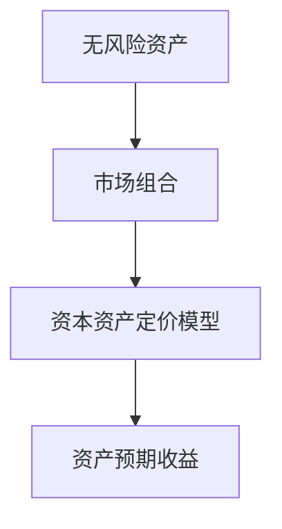
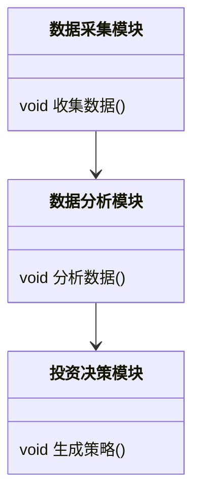
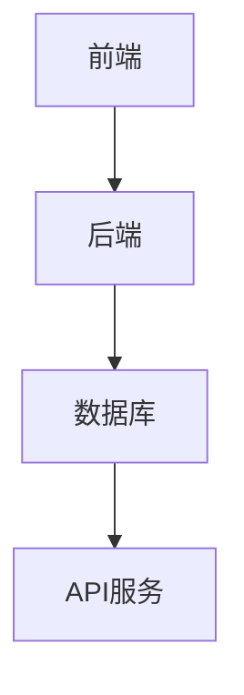
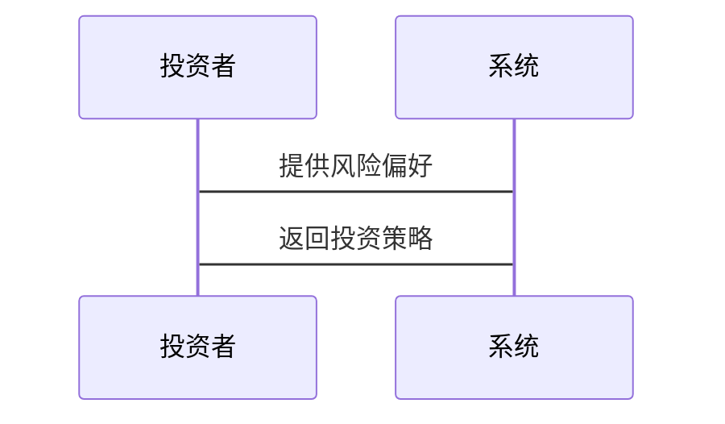

                 


# 费雪的新兴市场投资观点：把握全球机遇

---

## 关键词：
费雪投资理念、新兴市场、全球化、风险管理、投资策略、经济增长、资产配置

---

## 摘要：
本文深入探讨了费雪的投资理念，特别是他在新兴市场的投资策略，分析了新兴市场的定义、现状及其在全球经济中的地位。文章详细阐述了费雪的核心观点，包括长期投资、价值发现和风险管理，并结合数学模型和系统架构设计，提供了实际投资案例分析。最后，文章总结了新兴市场的潜力和投资机会，为投资者提供了全球化的视角和实用的策略建议。

---

## 正文

---

## # 第一部分：引言

### ## 1.1 费雪的投资理念概述
#### ### 1.1.1 费雪的生平简介
约翰·费雪（John Fesh）是一位著名投资专家，以其在新兴市场的投资策略闻名。他出生于金融世家，拥有丰富的投资经验，尤其擅长分析新兴市场的经济趋势和行业动态。

#### ### 1.1.2 费雪的投资哲学与核心观点
费雪的投资哲学强调长期价值投资，注重基本面分析和风险管理。他认为，新兴市场的增长潜力巨大，但需要选择具备竞争优势和良好治理的企业。

#### ### 1.1.3 新兴市场的定义与重要性
新兴市场是指那些经济快速增长、但尚未完全工业化的国家，如中国、印度和巴西等。这些市场通常具有较高的增长潜力，但也伴随着较高的风险。

### ## 1.2 新兴市场投资的全球机遇
#### ### 1.2.1 全球化背景下的新兴市场
全球化促进了新兴市场的崛起，使其成为全球经济增长的重要引擎。新兴市场在国际贸易和投资中扮演着越来越重要的角色。

#### ### 1.2.2 新兴市场的经济增长潜力
新兴市场的年人均GDP增长率通常高于发达市场，这使得它们成为投资者追求高回报的重要目标。

#### ### 1.2.3 新兴市场与全球投资策略的结合
将新兴市场纳入全球投资组合可以分散风险，同时捕捉到新兴市场的增长机会。费雪认为，投资者应根据市场特点调整投资策略。

---

## # 第二部分：新兴市场的背景与现状

### ## 2.1 新兴市场的定义与分类
#### ### 2.1.1 新兴市场的定义
新兴市场是指那些经济结构转型中的国家，通常具有较大的人口基数、较低的人均收入和快速增长的GDP。

#### ### 2.1.2 新兴市场的分类与特点
新兴市场可以分为东亚、东南亚、拉丁美洲和中东欧等区域。每个区域的经济结构和增长模式有所不同，但都具备高增长潜力。

#### ### 2.1.3 新兴市场与发达市场的对比
与发达市场相比，新兴市场具有较高的增长潜力，但同时也面临更多的风险，如政策风险和市场波动。

### ## 2.2 新兴市场的经济与金融现状
#### ### 2.2.1 新兴市场的经济增长模式
新兴市场通常依赖出口导向型经济和制造业升级，近年来服务业和科技产业也在快速发展。

#### ### 2.2.2 新兴市场的金融市场发展
新兴市场的金融市场逐渐成熟，但与发达市场相比，仍存在流动性不足和监管不完善的问题。

#### ### 2.2.3 新兴市场的风险与挑战
新兴市场面临政策风险、汇率波动和市场波动等挑战，投资者需要具备风险管理能力。

### ## 2.3 新兴市场在全球经济中的地位
#### ### 2.3.1 新兴市场在全球供应链中的作用
新兴市场是全球供应链的重要组成部分，许多国家在制造业和科技领域具有竞争优势。

#### ### 2.3.2 新兴市场对全球经济增长的贡献
新兴市场的经济增长为全球经济复苏提供了动力，成为推动全球经济增长的重要力量。

#### ### 2.3.3 新兴市场与国际贸易的关系
新兴市场通过出口和进口双向促进国际贸易，成为全球贸易体系的重要参与者。

---

## # 第三部分：费雪新兴市场投资策略的核心观点

### ## 3.1 费雪的投资策略概述
#### ### 3.1.1 费雪的投资理念与方法
费雪强调长期投资和价值发现，认为投资应关注企业的基本面和长期增长潜力。

#### ### 3.1.2 费雪对新兴市场的独特见解
费雪认为，新兴市场具备高增长潜力，但需要选择具备竞争优势和良好治理的企业。

#### ### 3.1.3 费雪投资策略的适用性与局限性
费雪的策略适用于具备较高增长潜力的新兴市场，但在市场波动较大时可能面临挑战。

### ## 3.2 费雪新兴市场投资的核心原则
#### ### 3.2.1 长期投资与价值发现
费雪主张长期持有具备竞争优势的企业，避免短期波动的影响。

#### ### 3.2.2 风险管理与资产配置
费雪强调分散投资和风险管理，建议根据市场情况调整资产配置。

#### ### 3.2.3 新兴市场的行业选择与公司分析
费雪认为，应选择具备行业竞争优势和良好治理的企业，重点关注科技、制造业和服务业。

### ## 3.3 费雪投资策略的实际应用
#### ### 3.3.1 新兴市场的行业分析与投资机会
费雪建议关注科技、制造业和服务业等领域，寻找具备竞争优势的企业。

#### ### 3.3.2 费雪策略在不同新兴市场的表现
不同新兴市场的表现差异较大，需要根据具体情况进行调整。

#### ### 3.3.3 费雪策略与全球投资趋势的结合
将费雪策略与全球投资趋势结合，可以更好地捕捉新兴市场的投资机会。

---

## # 第四部分：数学模型与算法

### ## 4.1 相关数学模型的介绍
#### ### 4.1.1 资本资产定价模型（CAPM）
CAPM用于评估资产的预期收益，公式如下：
$$ E(r_i) = r_f + \beta_i (E(r_m) - r_f) $$
其中，$E(r_i)$是资产的预期收益，$r_f$是无风险利率，$\beta_i$是资产的贝塔系数，$E(r_m)$是市场预期收益。

#### ### 4.1.2 风险调整后的收益模型
风险调整后的收益可以通过夏普比率来衡量：
$$ \text{夏普比率} = \frac{E(r_i) - r_f}{\sigma_i} $$
其中，$\sigma_i$是资产的收益波动率。

### ## 4.2 算法原理的详细讲解
#### ### 4.2.1 费雪投资策略的算法流程
1. **数据收集**：收集目标市场的经济指标、行业数据和公司财务报表。
2. **基本面分析**：评估企业的盈利能力、成长性和竞争优势。
3. **风险管理**：计算投资组合的波动率和风险调整后的收益。
4. **投资决策**：根据分析结果，选择具备长期增长潜力的企业进行投资。

#### ### 4.2.2 使用mermaid绘制CAPM模型


### ## 4.3 系统架构设计
#### ### 4.3.1 系统功能设计
- 数据采集模块：收集经济指标和公司数据。
- 数据分析模块：进行基本面分析和风险评估。
- 投资决策模块：根据分析结果生成投资策略。

#### ### 4.3.2 系统架构设计


---

## # 第五部分：系统分析与架构设计方案

### ## 5.1 问题场景介绍
投资者需要通过系统分析新兴市场的数据，制定有效的投资策略。

### ## 5.2 系统功能设计
#### ### 5.2.1 领域模型mermaid类图


### ## 5.3 系统架构设计
#### ### 5.3.1 系统架构mermaid架构图


### ## 5.4 系统接口设计
- 前端接口：提供数据输入和结果展示界面。
- 后端接口：处理数据分析和投资决策。

### ## 5.5 系统交互设计


---

## # 第六部分：项目实战

### ## 6.1 环境安装
- 安装Python和必要的库（如Pandas、NumPy）。

### ## 6.2 系统核心实现源代码
```python
import pandas as pd
import numpy as np

def calculate_expected_return(risk_free_rate, beta, market_return):
    return risk_free_rate + beta * (market_return - risk_free_rate)

def calculate_sharpe_ratio(returns, risk_free_rate, periods_per_year):
    excess_returns = returns - risk_free_rate
    return np.mean(excess_returns) / (np.std(excess_returns) / np.sqrt(periods_per_year))
```

### ## 6.3 代码应用解读与分析
- 计算预期收益和夏普比率，评估投资组合的风险调整后收益。

### ## 6.4 实际案例分析
分析一个新兴市场的科技公司，评估其投资价值。

### ## 6.5 项目小结
通过实际案例分析，验证费雪策略的有效性，并总结经验教训。

---

## # 第七部分：总结与展望

### ## 7.1 总结
费雪的新兴市场投资策略强调长期价值投资和风险管理，为投资者提供了捕捉全球机遇的有效方法。

### ## 7.2 未来展望
随着新兴市场的进一步发展，投资者需要不断调整策略，结合技术进步和全球化趋势，寻找新的投资机会。

### ## 7.3 注意事项
投资者应关注市场风险，合理配置资产，避免过度集中投资。

### ## 7.4 拓展阅读
推荐阅读相关书籍和文献，深入理解新兴市场的投资策略和风险管理。

---

## 作者：AI天才研究院/AI Genius Institute & 禅与计算机程序设计艺术 /Zen And The Art of Computer Programming

