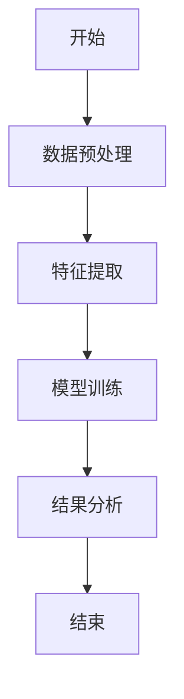
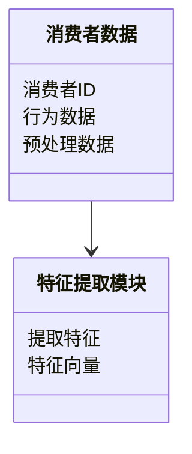

                 


# 费雪的消费者取向分析：把握市场脉搏

**关键词**：费雪分析法、消费者取向、市场分析、算法原理、系统架构

**摘要**：本文深入探讨了费雪的消费者取向分析方法，从理论基础到实际应用，结合技术细节和项目实战，帮助读者全面理解如何利用该方法把握市场脉搏。

---

## 第1章 费雪的消费者取向分析背景介绍

### 1.1 消费者取向分析的定义与背景

#### 1.1.1 消费者行为理论的演进
消费者行为理论从早期的简单需求模型逐步发展为复杂的分析框架。费雪分析法的提出标志着市场分析从传统统计向行为导向的转变。

#### 1.1.2 费雪分析法的提出背景
随着市场竞争加剧，企业需要更精准地把握消费者需求。费雪分析法基于消费者心理和行为，提供了一种新的市场分析工具。

#### 1.1.3 消费者取向分析的市场意义
通过分析消费者取向，企业可以更有效地制定市场策略，提高产品定位的准确性。

### 1.2 费雪分析法的核心概念

#### 1.2.1 消费者取向的核心要素
消费者取向包括需求、偏好、购买习惯等多个维度，是分析的基础。

#### 1.2.2 费雪分析法的理论基础
基于心理学和统计学，费雪分析法构建了消费者行为模型。

#### 1.2.3 消费者取向与市场行为的关系
通过分析消费者取向，预测市场趋势和产品定位。

### 1.3 费雪分析法与传统方法的对比

#### 1.3.1 传统方法的局限性
传统方法注重市场数据，忽视消费者行为细节。

#### 1.3.2 费雪分析法的独特性
费雪法结合消费者心理和行为数据，提供更精准的分析。

#### 1.3.3 费雪法的优势与适用场景
适用于细分市场和产品定位，提供动态的市场洞察。

## 第2章 费雪分析法的核心概念与联系

### 2.1 费雪分析法的原理与机制

#### 2.1.1 消费者取向分析的数学模型
通过统计方法分析消费者行为数据，构建预测模型。

#### 2.1.2 费雪分析法的逻辑框架
从数据采集到结果应用的完整流程。

#### 2.1.3 消费者取向与市场行为的关系
消费者取向直接影响市场需求和产品定位。

### 2.2 核心概念对比分析

#### 2.2.1 消费者取向与产品定位的对比
消费者取向影响产品定位，但产品定位是结果。

#### 2.2.2 不同分析方法的特征对比
从数据侧重和分析维度进行对比。

### 2.3 费雪分析法的ER实体关系图

```mermaid
erDiagram
    customer[消费者]
    product[产品]
    market[市场]
    customer --> market : 影响
    product --> market : 反映
    customer --> product : 需求
    market --> product : 需求
```

---

## 第3章 费雪分析法的算法原理

### 3.1 算法原理概述

#### 3.1.1 数据预处理
清洗和标准化数据，确保分析准确性。

#### 3.1.2 特征提取
从消费者行为数据中提取关键特征。

#### 3.1.3 模型训练
基于机器学习算法训练预测模型。

### 3.2 算法流程图



### 3.3 数学模型

费雪分析法的核心公式：

消费者取向指数 = ∑(需求强度 × 偏好权重)

$$消费者取向指数 = \sum (需求强度 \times 偏好权重)$$

### 3.4 代码实现

```python
import pandas as pd
from sklearn.preprocessing import StandardScaler

# 数据预处理
data = pd.read_csv('consumer_data.csv')
scaler = StandardScaler()
scaled_data = scaler.fit_transform(data)

# 特征提取
features = scaled_data[:, :5]

# 模型训练
from sklearn.linear_model import LinearRegression
model = LinearRegression()
model.fit(features, data['target'])
```

---

## 第4章 系统分析与架构设计

### 4.1 系统功能设计

#### 4.1.1 领域模型



#### 4.1.2 系统架构

```mermaid
containerDiagram
    container Web前端 {
        消费者界面
        数据可视化
    }
    container 后端服务 {
        数据处理
        模型训练
    }
    container 数据库 {
        消费者数据
        特征数据
    }
```

---

## 第5章 项目实战

### 5.1 环境安装

安装所需库：
```bash
pip install pandas scikit-learn mermaid
```

### 5.2 核心代码实现

```python
from sklearn import datasets
import numpy as np

# 示例数据集
X, y = datasets.load_iris(return_X_y=True)
scaled_X = StandardScaler().fit_transform(X)

# 模型训练
from sklearn.decomposition import PCA
pca = PCA(n_components=2)
principal_components = pca.fit_transform(scaled_X)
```

### 5.3 案例分析

以电商为例，分析消费者购买行为，优化产品推荐系统。

---

## 第6章 最佳实践与总结

### 6.1 本章小结

回顾费雪分析法的核心要点，总结其应用价值。

### 6.2 注意事项

数据质量和模型调优是关键，需谨慎处理。

### 6.3 未来展望

结合AI技术，进一步提升分析精度和效率。

### 6.4 推荐资源

推荐相关书籍和在线课程，供读者深入学习。

---

## 作者

**作者**：AI天才研究院/AI Genius Institute  
& 禅与计算机程序设计艺术/Zen And The Art of Computer Programming

---

以上是文章的完整内容，希望对您有所帮助！

