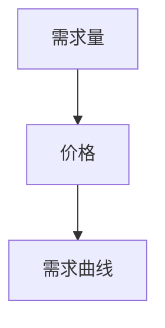
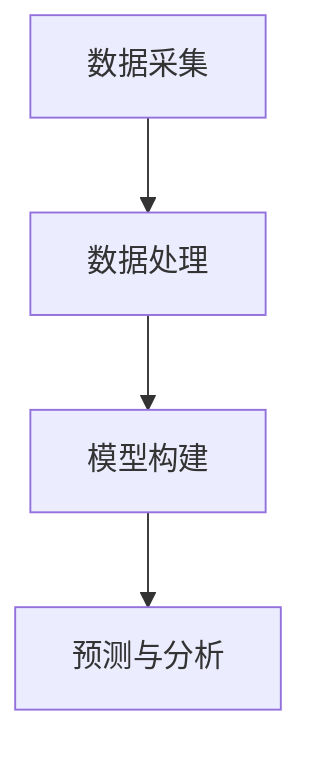
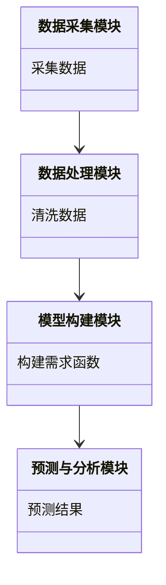

                 


# 费雪的消费者行为分析：预测产品成功

## 关键词：
费雪消费者行为分析，需求预测模型，消费者决策过程，效用函数，产品成功预测，数据分析，系统架构设计

## 摘要：
费雪的消费者行为分析是一种基于数学模型和系统化方法的理论框架，用于预测产品成功并优化市场策略。本文从费雪的消费者行为分析的背景、核心模型、系统设计、项目实战等多个维度展开，详细阐述了如何利用费雪理论预测产品成功。通过实际案例分析和系统架构设计，本文为读者提供了从理论到实践的完整指南。

---

# 第1章: 费雪的消费者行为分析基础

## 1.1 消费者行为分析的背景与核心概念

### 1.1.1 消费者行为分析的定义与背景
消费者行为分析是研究消费者在购买、使用和评价产品或服务时的行为模式和决策过程的学科。它通过分析消费者的偏好、需求、动机和行为，帮助企业预测市场趋势，优化产品设计和营销策略。

费雪（Fisher）的消费者行为分析是一种基于效用理论的模型，强调消费者选择的核心是最大化效用。这种分析方法在经济学和市场营销领域具有重要地位，尤其是在预测产品成功方面。

### 1.1.2 费雪的消费者行为理论背景
费雪的消费者行为理论主要基于以下假设：
1. 消费者是理性的，追求效用最大化。
2. 消费者的决策基于对产品或服务的偏好和需求。
3. 市场环境（如价格、竞争）会影响消费者的决策过程。

费雪理论的核心在于将消费者行为转化为数学模型，通过定量分析预测消费者的选择。

### 1.1.3 消费者行为分析的现实意义
在现代商业环境中，消费者行为分析是企业制定市场策略的重要工具。通过分析消费者行为，企业可以更好地理解市场需求，优化产品设计，制定有效的定价策略，并预测产品成功的可能性。

---

## 1.2 费雪的消费者行为分析框架

### 1.2.1 费雪的消费者行为分析模型
费雪的消费者行为分析模型将消费者的选择过程分为以下几个阶段：
1. 需求识别：消费者识别自己的需求。
2. 信息搜索：消费者收集与产品相关的信息。
3. 评估与选择：消费者根据偏好和效用评估产品。
4. 购买决策：消费者做出最终购买决策。
5. 消费体验：消费者使用产品并形成反馈。

### 1.2.2 消费者决策过程的核心要素
- **需求**：消费者的核心需求和偏好。
- **效用**：消费者对产品的满意程度。
- **价格敏感性**：消费者对价格变化的敏感程度。
- **品牌忠诚度**：消费者对品牌的偏好和忠诚度。

### 1.2.3 费雪理论与传统消费者行为理论的对比
传统消费者行为理论更关注消费者的心理和行为因素，而费雪理论则强调数学模型和效用函数的应用。两者结合可以更全面地分析消费者行为。

---

# 第2章: 费雪的消费者行为分析模型

## 2.1 费雪需求函数的核心原理

### 2.1.1 需求函数的数学表达式
费雪的需求函数可以表示为：
$$ Q = f(P, I, T) $$
其中，\( Q \) 是需求量，\( P \) 是价格，\( I \) 是收入，\( T \) 是其他影响因素（如偏好、品牌等）。

### 2.1.2 需求函数的图形化解释
需求函数可以通过需求曲线（如图2.1所示）来直观表示。



### 2.1.3 需求函数的参数解释
- 价格弹性：消费者对价格变化的敏感程度。
- 收入弹性：消费者需求对收入变化的敏感程度。

## 2.2 消费者效用函数的构建

### 2.2.1 效用函数的定义与属性
效用函数是消费者对产品或服务的满意程度的度量。常见的效用函数形式包括线性效用函数和非线性效用函数。

### 2.2.2 费雪效用函数的构建方法
费雪效用函数通常基于消费者的选择行为，通过最大化效用函数来预测消费者的选择。

### 2.2.3 效用函数的优化与应用
效用函数的优化可以通过拉格朗日乘数法等数学方法实现。

---

# 第3章: 费雪消费者行为分析的数学模型

## 3.1 需求预测的数学模型

### 3.1.1 需求预测的公式与应用
需求预测公式：
$$ Q = \alpha P + \beta I + \gamma T $$
其中，\( \alpha \)、\( \beta \)、\( \gamma \) 是回归系数。

### 3.1.2 需求预测的案例分析
以智能手机市场为例，通过数据拟合需求函数，预测不同价格下的需求量。

## 3.2 消费者选择的优化模型

### 3.2.1 消费者选择的数学模型
消费者选择模型：
$$ \max U(x) \quad \text{subject to} \quad x \in \mathcal{X} $$

### 3.2.2 消费者选择的优化算法
通过梯度下降法优化效用函数，找到消费者最优选择。

---

# 第4章: 系统分析与架构设计

## 4.1 消费者行为分析系统的功能设计

### 4.1.1 系统功能模块划分
- 数据采集模块
- 数据处理模块
- 模型构建模块
- 预测与分析模块

### 4.1.2 系统功能流程图


## 4.2 系统架构设计

### 4.2.1 系统架构的分层设计
- 数据层：存储消费者数据。
- 业务逻辑层：实现数据处理和模型计算。
- 用户界面层：展示分析结果。

### 4.2.2 系统架构的模块化设计


---

# 第5章: 项目实战与案例分析

## 5.1 项目环境与工具安装

### 5.1.1 开发环境的搭建
- 操作系统：Windows/Mac/Linux
- 开发工具：Python、Jupyter Notebook

### 5.1.2 数据采集工具的安装
- 数据采集工具：BeautifulSoup、requests

## 5.2 项目核心实现

### 5.2.1 数据清洗与预处理
使用Python代码清洗数据：
```python
import pandas as pd
data = pd.read_csv('consumer_data.csv')
data.dropna(inplace=True)
```

### 5.2.2 数据分析与建模
构建需求函数：
```python
from sklearn.linear_model import LinearRegression
model = LinearRegression()
model.fit(X, y)
```

### 5.2.3 模型验证与优化
通过交叉验证优化模型参数。

## 5.3 实际案例分析
以某电子产品市场为例，通过费雪模型预测产品需求量。

---

# 第6章: 总结与最佳实践

## 6.1 费雪消费者行为分析的核心总结
- 费雪理论的核心是效用最大化。
- 消费者行为分析的关键是数据驱动的预测。

## 6.2 最佳实践与注意事项
- 数据质量是模型准确性的重要保证。
- 模型优化需要结合实际业务场景。

---

# 作者：AI天才研究院 & 禅与计算机程序设计艺术

---

以上是文章的完整内容，涵盖了从理论到实践的各个方面，通过详细的分析和实际案例，帮助读者理解如何利用费雪的消费者行为分析预测产品成功。

