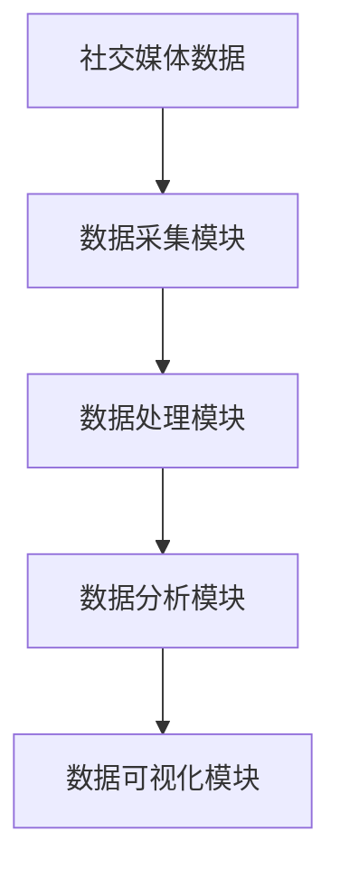

                 


# 费雪的消费者行为研究：社交媒体时代的新方法

> **关键词**：消费者行为研究、费雪消费理论、社交媒体、数据挖掘、机器学习

> **摘要**：本文系统地探讨了费雪的消费者行为研究在社交媒体时代的最新进展与方法。从费雪的经典消费理论出发，结合社交媒体的特点，分析了社交媒体对消费者行为的影响及其研究的挑战。通过数学建模、数据挖掘和机器学习等技术，提出了在社交媒体环境下消费者行为分析的新方法，并通过实际案例展示了这些方法的应用。

---

# 第一部分: 费雪的消费者行为研究基础

## 第1章: 消费者行为研究的背景与意义

### 1.1 消费者行为研究的定义与核心概念

消费者行为研究是研究消费者在购买、使用和处置产品或服务时的决策过程和行为模式。费雪（Irving Fisher）是消费理论的重要奠基人之一，他的消费理论为现代消费者行为研究奠定了基础。

#### 1.1.1 消费者行为的定义
消费者行为是指消费者在购买、使用和处置商品或服务时表现出的所有行为和决策过程。这些行为受到消费者心理、社会环境和市场因素的影响。

#### 1.1.2 费雪的消费者行为理论
费雪的消费理论强调了利息和资本在消费决策中的作用。他提出了消费函数的概念，认为消费是收入的函数，并提出了著名的费雪方程式，即 $$i = \frac{P}{1 + i}$$，其中 \(i\) 是利息率，\(P\) 是本金。

#### 1.1.3 社交媒体时代消费者行为的特殊性
社交媒体的普及使得消费者行为更加复杂化。消费者不仅通过社交媒体获取信息，还通过发布评论、点赞、分享等方式影响他人的消费决策。

---

### 1.2 社交媒体时代消费者行为研究的必要性

#### 1.2.1 社交媒体对消费者行为的影响
社交媒体改变了消费者的决策过程。消费者在购买前会通过社交媒体获取信息、阅读评论，并参考其他用户的体验。

#### 1.2.2 当代消费者行为研究的新挑战
社交媒体时代，消费者行为数据量大、类型多样，传统的研究方法已难以应对。此外，数据隐私和伦理问题也对研究提出了新的挑战。

#### 1.2.3 研究消费者行为对企业的实际意义
理解消费者行为可以帮助企业制定更有效的市场策略，优化产品设计，提高客户满意度。

---

### 1.3 本书的研究目标与方法

#### 1.3.1 本书的研究目标
本文旨在探讨社交媒体时代消费者行为研究的新方法，结合费雪的消费理论，提出适用于社交媒体环境的分析框架。

#### 1.3.2 研究方法的选择
本文采用定性与定量相结合的方法，结合理论分析、数据挖掘和机器学习技术，对社交媒体环境下的消费者行为进行深入研究。

#### 1.3.3 本书的结构安排
本文分为六个部分，涵盖背景介绍、理论基础、方法论、技术应用、案例分析和系统设计等内容。

---

## 第2章: 费雪的消费者行为研究理论

### 2.1 费雪的消费理论概述

#### 2.1.1 费雪的消费理论核心观点
费雪认为，消费是收入的函数，且利息率是资本资产定价的核心因素。他的消费理论为现代消费者行为研究提供了重要理论基础。

#### 2.1.2 费雪需求法则
费雪的需求法则指出，消费者的需求不仅受到价格的影响，还受到收入和偏好的影响。需求函数可以表示为：
$$ Q = Q(P, I, T) $$
其中，\(Q\) 是需求量，\(P\) 是价格，\(I\) 是收入，\(T\) 是偏好的时间因素。

#### 2.1.3 费雪的消费函数模型
费雪的消费函数模型是：
$$ C = f(Y, r) $$
其中，\(C\) 是消费，\(Y\) 是收入，\(r\) 是利率。

---

### 2.2 费雪的消费者行为理论的现代发展

#### 2.2.1 费雪理论的现代延伸
现代消费理论将费雪的消费函数扩展到动态环境中，考虑了消费者的时间偏好和不确定性。

#### 2.2.2 数理经济学视角下的消费者行为分析
通过数理经济学的方法，可以将消费者行为建模为优化问题，例如：
$$ \max_{x} U(x) \text{ s.t. } p \cdot x \leq I $$
其中，\(U(x)\) 是效用函数，\(p\) 是价格向量，\(I\) 是收入。

#### 2.2.3 费雪理论在社交媒体时代的应用
社交媒体时代，消费者行为的复杂性要求我们将费雪的消费理论与大数据分析相结合，通过数据挖掘技术提取消费者行为的规律。

---

## 第3章: 社交媒体时代消费者行为的新特点

### 3.1 社交媒体对消费者行为的影响

#### 3.1.1 社交媒体如何改变消费者决策过程
社交媒体提供了丰富的信息来源，消费者可以通过社交媒体获取产品评论、比较价格，甚至直接与品牌互动。

#### 3.1.2 社交媒体对消费者偏好的影响
社交媒体上的社交网络和群体影响使得消费者的偏好更加多样化，同时也更容易受到社交圈的影响。

#### 3.1.3 社交媒体对消费者行为模式的重塑
社交媒体使得消费者行为从传统的单向购买行为转变为互动式的行为模式，消费者不仅是购买者，还是信息的创造者和传播者。

---

### 3.2 社交媒体时代消费者行为研究的挑战

#### 3.2.1 数据量与数据复杂度的增加
社交媒体产生了海量的数据，包括文本、图像、视频等多种数据类型，数据处理的复杂性显著增加。

#### 3.2.2 消费者隐私与数据伦理问题
在社交媒体时代，消费者行为研究需要处理大量个人数据，如何保护消费者隐私成为一个重要问题。

#### 3.2.3 研究方法的创新需求
传统的统计方法难以处理社交媒体数据的复杂性，需要引入新的分析方法，如机器学习和自然语言处理技术。

---

## 第4章: 费雪消费者行为研究的数学模型与分析方法

### 4.1 费雪消费函数的数学模型

#### 4.1.1 费雪消费函数的基本公式
费雪的消费函数可以表示为：
$$ C = a + bY $$
其中，\(C\) 是消费，\(Y\) 是收入，\(a\) 和 \(b\) 是参数。

#### 4.1.2 消费函数的参数估计
通过回归分析可以估计消费函数的参数。例如，使用最小二乘法估计 \(a\) 和 \(b\)：
$$ \hat{a} = \bar{C} - b\bar{Y} $$
$$ \hat{b} = \frac{\sum (Y_i - \bar{Y})(C_i - \bar{C})}{\sum (Y_i - \bar{Y})^2} $$

#### 4.1.3 消费函数的应用实例
以某公司的销售数据为例，假设收入 \(Y\) 和消费 \(C\) 的数据如下：

| 收入 \(Y\) | 消费 \(C\) |
|------------|------------|
| 1000       | 800        |
| 2000       | 1600       |
| 3000       | 2400       |

通过回归分析，可以得到：
$$ \hat{C} = 0 + 0.8Y $$

---

### 4.2 现代消费者行为分析的数学方法

#### 4.2.1 回归分析在消费者行为研究中的应用
回归分析可以用于分析消费者行为的影响因素，例如：
$$ C = a + bP + cI + \epsilon $$
其中，\(C\) 是消费，\(P\) 是价格，\(I\) 是收入，\(\epsilon\) 是误差项。

#### 4.2.2 聚类分析与消费者细分
聚类分析可以将消费者分为不同的群体，例如基于购买频率、消费金额等变量进行聚类。

#### 4.2.3 时间序列分析在消费行为预测中的应用
时间序列分析可以用于预测未来的消费行为，例如使用ARIMA模型进行预测。

---

## 第5章: 基于社交媒体数据的消费者行为分析

### 5.1 社交媒体数据的采集与处理

#### 5.1.1 数据采集方法
可以通过API接口或网络爬虫从社交媒体平台获取数据。

#### 5.1.2 数据清洗与预处理
需要对数据进行去重、填充缺失值、去除噪声数据等处理。

#### 5.1.3 数据存储与管理
可以使用数据库（如MySQL）或大数据平台（如Hadoop）进行数据存储和管理。

---

### 5.2 社交媒体数据的分析与建模

#### 5.2.1 文本挖掘与情感分析
可以通过自然语言处理技术对社交媒体上的文本进行情感分析，例如使用TF-IDF提取关键词，或使用词云可视化。

#### 5.2.2 社交网络分析
可以通过图论方法分析社交媒体上的社交网络，例如使用节点表示消费者，边表示消费者之间的互动。

#### 5.2.3 用户行为序列分析
可以通过序列分析方法研究用户的购买行为序列，例如使用马尔可夫链模型。

---

## 第6章: 消费者行为分析的系统架构与实现

### 6.1 系统架构设计

#### 6.1.1 系统功能模块划分
系统可以划分为数据采集模块、数据处理模块、数据分析模块和数据可视化模块。

#### 6.1.2 系统数据流设计
数据从社交媒体平台采集，经过清洗和预处理后，进入数据分析模块进行建模，最后在可视化模块呈现结果。

#### 6.1.3 系统架构图


---

### 6.2 系统实现细节

#### 6.2.1 数据采集模块实现
使用Python的`requests`库或`BeautifulSoup`库进行网页数据采集。

#### 6.2.2 数据处理模块实现
使用Pandas库进行数据清洗和预处理，例如：
```python
import pandas as pd

data = pd.read_csv('data.csv')
data.dropna(inplace=True)
data['date'] = pd.to_datetime(data['date'])
```

#### 6.2.3 数据分析模块实现
使用Scikit-learn库进行机器学习模型训练，例如：
```python
from sklearn.tree import DecisionTreeClassifier

model = DecisionTreeClassifier()
model.fit(X_train, y_train)
```

#### 6.2.4 数据可视化模块实现
使用Matplotlib或Seaborn进行数据可视化，例如：
```python
import matplotlib.pyplot as plt

plt.bar(x, y)
plt.xlabel('X轴')
plt.ylabel('Y轴')
plt.show()
```

---

## 第7章: 项目实战

### 7.1 环境安装与配置

#### 7.1.1 安装Python
```bash
python --version
pip install --upgrade pip
```

#### 7.1.2 安装依赖库
```bash
pip install numpy pandas matplotlib scikit-learn
```

---

### 7.2 系统核心实现源代码

#### 7.2.1 数据采集模块
```python
import requests
from bs4 import BeautifulSoup

url = 'https://example.com'
response = requests.get(url)
soup = BeautifulSoup(response.text, 'html.parser')
data = []
for item in soup.find_all('div', class_='item'):
    data.append({
        'title': item.find('h2').text,
        'price': item.find('p').text
    })
print(data)
```

#### 7.2.2 数据处理模块
```python
import pandas as pd

df = pd.DataFrame(data)
df['price'] = df['price'].astype(float)
df['category'] = df['title'].apply(lambda x: x.split()[0])
```

#### 7.2.3 数据分析模块
```python
from sklearn.cluster import KMeans

X = df[['price', 'category']]
model = KMeans(n_clusters=3)
model.fit(X)
df['cluster'] = model.predict(X)
```

#### 7.2.4 数据可视化模块
```python
import matplotlib.pyplot as plt

plt.scatter(X['price'], X['category'], c=df['cluster'])
plt.xlabel('Price')
plt.ylabel('Category')
plt.show()
```

---

## 第8章: 最佳实践与小结

### 8.1 小结

本文系统地探讨了费雪的消费者行为研究在社交媒体时代的最新进展与方法。通过结合经典消费理论与现代数据分析技术，提出了适用于社交媒体环境的消费者行为分析框架。

---

### 8.2 注意事项

在实际应用中，需要注意数据隐私和伦理问题，确保合法合规地进行消费者行为研究。

---

### 8.3 拓展阅读

推荐阅读以下书籍和文章：
- 《消费者行为学》
- 《数据挖掘与机器学习》
- 《社交媒体数据分析》

---

# 作者：AI天才研究院 & 禅与计算机程序设计艺术

---

**声明：本文为AI天才研究院（AI Genius Institute）原创内容，转载请注明出处。**

