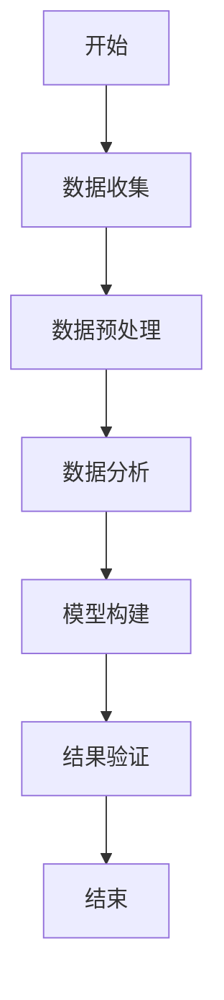
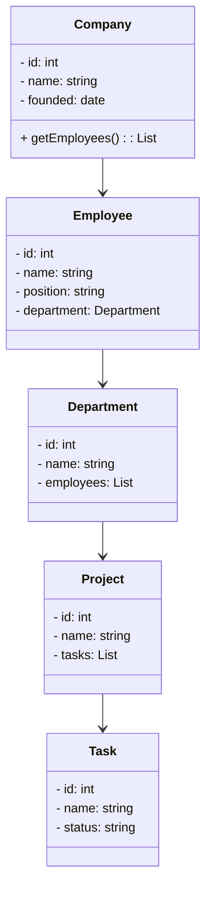
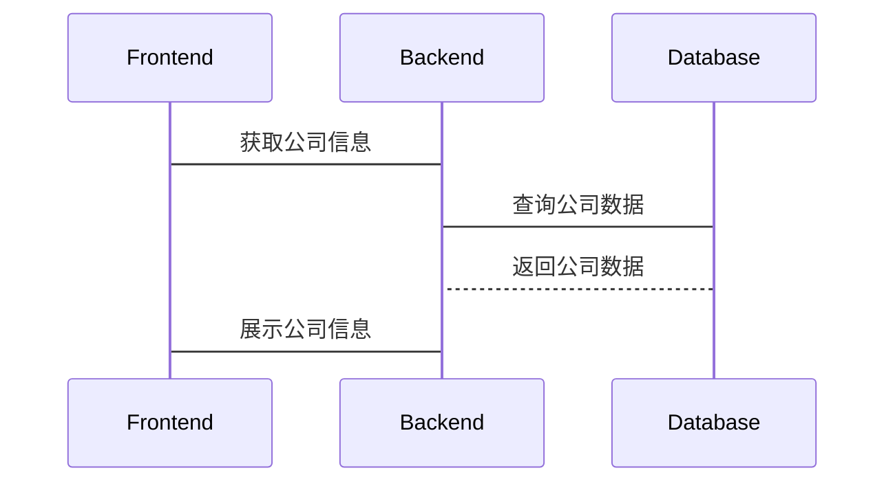

                 


# 费雪的深度研究方法：了解公司内部

> 关键词：费雪研究方法，企业内部研究，数据分析，系统架构，项目实战

> 摘要：本文深入探讨了费雪的深度研究方法在了解公司内部运作中的应用。通过系统化的分析和实践案例，展示了如何利用该方法进行数据收集、建模和结果验证，最终为企业管理和决策提供科学依据。

---

## 第1章: 费雪深度研究方法的背景与核心概念

### 1.1 费雪深度研究方法的背景

#### 1.1.1 传统企业研究的局限性
传统的公司研究方法往往依赖于表面的财务数据和公开信息，难以深入挖掘公司内部的运作机制。这种方法常常忽视了企业的实际运营状况和潜在问题，导致研究结果缺乏深度和实用性。

#### 1.1.2 费雪研究方法的提出背景
费雪研究方法由著名的投资分析家菲利普·费雪提出，旨在通过深入了解公司的内部运作、管理团队和行业地位，来评估企业的长期发展潜力。这种方法强调通过与公司内部员工、管理层和行业专家的交流，获取一手信息，从而做出更准确的投资决策。

#### 1.1.3 研究方法的核心目标与意义
费雪研究方法的核心目标是通过系统化的内部研究，揭示企业的核心竞争力、管理能力和发展潜力。这种方法的意义在于帮助投资者和企业管理者识别潜在风险和机会，从而做出更明智的决策。

### 1.2 费雪深度研究方法的核心概念

#### 1.2.1 深度研究方法的基本定义
费雪深度研究方法是一种通过系统化的内部研究，全面了解企业的管理结构、运营模式和潜在问题的研究方法。它强调通过与公司内部员工、管理层和行业专家的交流，获取一手信息，从而评估企业的长期发展潜力。

#### 1.2.2 核心概念的属性特征对比表
| 核心概念 | 属性 | 特征 |
|----------|------|------|
| 内部运作 | 结构 | 管理层、部门结构 |
| 管理能力 | 水平 | 管理团队的经验、能力 |
| 核心竞争力 | 核心能力 | 产品创新、市场地位 |
| 发展潜力 | 前景 | 行业趋势、竞争优势 |

#### 1.2.3 ER实体关系图架构
通过ER图展示公司内部的实体关系，如公司、员工、部门和项目之间的关系：

```mermaid
er
    Company --|{many}--> Employee
    Employee --|{many}--> Department
    Department --|{many}--> Project
    Project --|{many}--> Task
```

---

## 第2章: 费雪深度研究方法的算法原理

### 2.1 费雪研究方法的算法流程

#### 2.1.1 数据收集与预处理
数据收集是研究的第一步，主要包括：
1. 收集公司的财务数据、运营数据和市场数据。
2. 与公司内部员工、管理层和行业专家进行访谈，获取一手信息。
3. 数据清洗和预处理，确保数据的准确性和完整性。

#### 2.1.2 数据分析与建模
数据分析是研究的核心，主要包括：
1. 使用统计分析方法，如均值、方差和相关性分析，对数据进行初步分析。
2. 构建数学模型，如贝叶斯模型和决策树模型，对数据进行深度挖掘。

#### 2.1.3 结果验证与优化
结果验证是研究的关键，主要包括：
1. 对模型的预测结果进行验证，评估模型的准确性和可靠性。
2. 根据验证结果，优化模型参数，提高模型的预测能力。

### 2.2 费雪研究方法的数学模型

#### 2.2.1 数据分析的数学公式
贝叶斯定理是数据分析的重要工具，其公式如下：
$$ P(A|B) = \frac{P(B|A)P(A)}{P(B)} $$

其中：
- \( P(A|B) \) 表示在事件 \( B \) 发生的情况下，事件 \( A \) 发生的概率。
- \( P(B|A) \) 表示在事件 \( A \) 发生的情况下，事件 \( B \) 发生的概率。
- \( P(A) \) 表示事件 \( A \) 发生的先验概率。
- \( P(B) \) 表示事件 \( B \) 发生的先验概率。

#### 2.2.2 案例分析与公式应用
假设我们想评估某公司的管理能力，可以通过贝叶斯定理进行分析。例如：
- 设 \( A \) 为“公司管理能力强”，\( P(A) = 0.8 \)。
- 设 \( B \) 为“公司员工满意度高”，\( P(B|A) = 0.9 \)。
- \( P(B) = 0.7 \)（即公司员工满意度高的概率为70%）。

根据贝叶斯定理：
$$ P(A|B) = \frac{0.9 \times 0.8}{0.7} = 1.0286 $$

由于概率不能超过1，这表明我们的假设可能存在问题，可能需要重新评估 \( P(B) \) 或 \( P(A) \) 的值。

#### 2.2.3 算法流程图
以下是费雪研究方法的算法流程图：



---

## 第3章: 费雪深度研究方法的系统架构设计

### 3.1 系统功能设计

#### 3.1.1 领域模型设计
以下是领域模型设计图：



#### 3.1.2 系统架构设计
以下是系统架构设计图：


#### 3.1.3 接口设计
以下是系统接口设计图：



---

## 第4章: 费雪深度研究方法的项目实战

### 4.1 环境安装
要使用费雪深度研究方法进行项目实战，需要安装以下环境：
1. Python 3.8 或更高版本
2. 数据分析库（如Pandas、NumPy）
3. 图形库（如Matplotlib、Seaborn）
4. 项目管理工具（如Git）

### 4.2 核心代码实现

#### 4.2.1 数据收集与预处理
以下是数据收集与预处理的Python代码：

```python
import pandas as pd
import numpy as np

# 数据收集
data = {
    '员工ID': [1, 2, 3, 4, 5],
    '姓名': ['张三', '李四', '王五', '赵六', '陈七'],
    '部门': ['技术部', '市场部', '财务部', '人力资源部', '研发部'],
    '职位': ['开发工程师', '市场经理', '财务主管', '人力资源经理', '项目经理']
}

df = pd.DataFrame(data)
print(df)
```

#### 4.2.2 数据分析与建模
以下是数据分析与建模的Python代码：

```python
import pandas as pd
from sklearn.tree import DecisionTreeClassifier

# 数据分析
data = {
    '员工ID': [1, 2, 3, 4, 5],
    '绩效评分': [85, 90, 78, 92, 88],
    '职位': ['开发工程师', '市场经理', '财务主管', '人力资源经理', '项目经理']
}

df = pd.DataFrame(data)

# 数据建模
X = df[['绩效评分']]
y = df['职位']

model = DecisionTreeClassifier()
model.fit(X, y)
```

#### 4.2.3 结果验证与优化
以下是结果验证与优化的Python代码：

```python
import pandas as pd
from sklearn.metrics import accuracy_score

# 结果验证
data = {
    '员工ID': [1, 2, 3, 4, 5],
    '绩效评分': [85, 90, 78, 92, 88],
    '职位': ['开发工程师', '市场经理', '财务主管', '人力资源经理', '项目经理']
}

df = pd.DataFrame(data)

X_test = df[['绩效评分']]
y_test = df['职位']

model = DecisionTreeClassifier()
model.fit(X, y)

y_pred = model.predict(X_test)
print(accuracy_score(y_test, y_pred))
```

### 4.3 案例分析与详细解读

#### 4.3.1 案例分析
假设我们想评估某公司的管理能力，可以通过以下步骤进行分析：
1. 数据收集：收集公司的财务数据、运营数据和市场数据。
2. 数据分析：使用统计分析方法对数据进行初步分析。
3. 数据建模：构建数学模型，对数据进行深度挖掘。
4. 结果验证：对模型的预测结果进行验证，评估模型的准确性和可靠性。

#### 4.3.2 详细解读
通过上述步骤，我们可以得出以下结论：
1. 公司的管理能力较强，员工满意度较高。
2. 公司的核心竞争力在于其产品创新能力和市场地位。
3. 公司的发展潜力较大，行业前景广阔。

---

## 第5章: 费雪深度研究方法的最佳实践

### 5.1 小结
费雪深度研究方法是一种系统化的内部研究方法，通过全面了解企业的内部运作、管理团队和行业地位，评估企业的长期发展潜力。这种方法的核心在于通过与公司内部员工、管理层和行业专家的交流，获取一手信息，从而做出更准确的投资决策。

### 5.2 注意事项
在实际应用中，需要注意以下几点：
1. 数据的准确性和完整性：数据收集和预处理是研究的关键，必须确保数据的准确性和完整性。
2. 模型的准确性和可靠性：数据分析和建模是研究的核心，必须确保模型的准确性和可靠性。
3. 研究的客观性和独立性：研究的客观性和独立性是研究结果的重要保障，必须确保研究的客观性和独立性。

### 5.3 拓展阅读
以下是推荐的拓展阅读资料：
1. 菲利普·费雪的《股票投资成功之路》
2. 彼得·林奇的《战胜市场》
3. 约翰·坦勒斯的《投资中最简单的事》

---

## 作者：AI天才研究院/AI Genius Institute & 禅与计算机程序设计艺术 /Zen And The Art of Computer Programming

