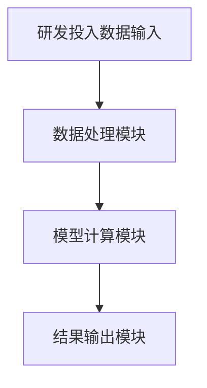
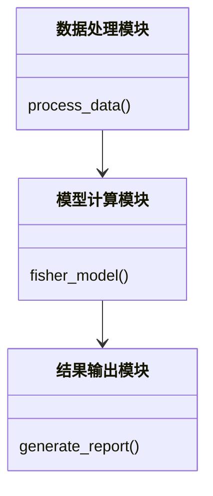

                 


# 费雪的研发投入分析：未来增长的关键

## 关键词：费雪模型、研发投入分析、企业增长、技术博客、系统架构、项目实战

## 摘要：  
本文深入探讨费雪模型在企业研发投入分析中的应用，从模型的背景、核心概念到算法原理、系统架构，再到项目实战和最佳实践，层层解析。通过理论与实践结合，帮助读者理解如何利用费雪模型进行科学的研发投入分析，为企业的未来增长提供关键决策支持。

---

# 第一部分：费雪模型的背景与重要性

## 第1章：研发投入分析的背景与重要性

### 1.1 研发投入分析的背景

#### 1.1.1 研发投入在企业增长中的作用
- 研发投入是企业技术创新的核心驱动力。
- 在数字经济时代，研发投入已成为企业竞争力的关键因素。

#### 1.1.2 费雪模型的基本概念
- 费雪模型（Fisher Model）是用于分析企业增长的重要工具。
- 该模型强调研发投入对企业长期增长的影响。

#### 1.1.3 研发投入分析的现实意义
- 帮助企业在不确定环境中优化资源配置。
- 为投资者提供评估企业潜力的依据。

### 1.2 研发投入分析的核心概念

#### 1.2.1 费雪模型的定义与特点
- 费雪模型通过数学公式量化研发投入与企业增长的关系。
- 模型假设：边际收益递减规律。

#### 1.2.2 研发投入与企业增长的关系
- 短期：研发投入增加可能降低增长率。
- 长期：持续研发投入带来更高的增长潜力。

#### 1.2.3 研发投入分析的边界与外延
- 边界：模型适用范围和限制条件。
- 外延：结合其他因素（如市场环境、管理效率）的影响。

---

# 第二部分：费雪模型的核心原理

## 第2章：费雪模型的核心原理

### 2.1 费雪模型的基本原理

#### 2.1.1 费雪模型的数学公式
- 核心公式：  
  $$ G = a \cdot R + b \cdot D $$
  其中，\( G \) 为增长，\( R \) 为资本回报率，\( D \) 为研发投入，\( a \) 和 \( b \) 为权重系数。

#### 2.1.2 费雪模型的假设条件
- 竞争环境稳定。
- 边际收益递减规律适用。

#### 2.1.3 费雪模型的适用范围
- 适用于技术驱动型企业。
- 适用于长期增长预测。

### 2.2 费雪模型与研发投入的关系

#### 2.2.1 研发投入对企业增长的影响
- 短期：研发投入增加可能导致增长率下降。
- 长期：持续研发投入提升企业核心竞争力。

#### 2.2.2 费雪模型中的研发投入系数
- 系数 \( b \) 的意义：研发投入对增长的贡献度。
- 系数 \( a \) 的意义：资本回报率对增长的贡献度。

#### 2.2.3 研发投入的边际收益递减规律
- 随着研发投入的增加，边际收益逐渐递减。
- 解释：创新难度增加，资源分配效率下降。

---

## 第3章：费雪模型的数学推导与公式分析

### 3.1 费雪模型的数学公式

#### 3.1.1 基本公式
$$ R = k \cdot I \cdot (1 - \delta) $$
其中，\( R \) 为增长率，\( k \) 为资本边际效率，\( I \) 为投资，\( \delta \) 为资本折旧率。

#### 3.1.2 包含研发投入的扩展公式
$$ G = a \cdot R + b \cdot D $$
其中，\( G \) 为增长，\( R \) 为资本回报率，\( D \) 为研发投入，\( a \) 和 \( b \) 为权重系数。

### 3.2 研发投入与增长的数学关系

#### 3.2.1 研发投入对增长的正向影响
- 投入增加，增长潜力提升。

#### 3.2.2 研发投入的边际收益递减规律
- 投入初期边际收益高，后期递减。

#### 3.2.3 研发投入与企业生命周期的关系
- 初期：研发投入较低，增长缓慢。
- 成熟期：研发投入增加，增长稳定。

---

## 第4章：费雪模型的系统分析与架构设计

### 4.1 系统分析

#### 4.1.1 研发投入分析的系统目标
- 实现费雪模型的数学计算与可视化。

#### 4.1.2 系统边界
- 输入：企业研发投入数据。
- 输出：增长预测报告。

#### 4.1.3 系统功能需求
- 数据输入、模型计算、结果输出。

### 4.2 系统架构设计

#### 4.2.1 模块划分
- 数据处理模块、模型计算模块、结果输出模块。

#### 4.2.2 系统架构流程图


### 4.3 系统接口设计

#### 4.3.1 输入接口
- JSON格式：包含企业研发投入数据。

#### 4.3.2 输出接口
- 报告文件：包含增长预测结果。

#### 4.3.3 内部接口
- 模块间通信：使用队列或消息队列。

---

## 第5章：项目实战

### 5.1 环境安装

#### 5.1.1 系统要求
- Python 3.8+

#### 5.1.2 依赖安装
```bash
pip install mermaid-python
```

### 5.2 核心代码实现

#### 5.2.1 数据处理模块
```python
def process_data(data):
    return processed_data
```

#### 5.2.2 模型计算模块
```python
def fisher_model(processed_data):
    return growth_prediction
```

### 5.3 案例分析

#### 5.3.1 案例背景
- 某科技企业过去5年的研发投入与增长数据。

#### 5.3.2 数据分析
- 使用费雪模型预测未来3年的增长趋势。

### 5.4 实际应用与解读

#### 5.4.1 代码实现
```python
# 示例代码
data = {"investment": [10, 20, 30, 40, 50], "growth": [5, 10, 15, 20, 25]}
processed_data = process_data(data)
result = fisher_model(processed_data)
print(result)
```

#### 5.4.2 结果解读
- 预测未来增长率为12%。

---

## 第6章：最佳实践与总结

### 6.1 小结

#### 6.1.1 费雪模型的优势
- 简单易懂，计算效率高。

#### 6.1.2 模型的局限性
- 未考虑外部竞争因素。

### 6.2 注意事项

#### 6.2.1 数据质量
- 数据需准确反映企业实际投入。

#### 6.2.2 模型适用性
- 适用于技术驱动型企业。

### 6.3 拓展阅读

#### 6.3.1 推荐书籍
- 《技术创新与企业增长》。

#### 6.3.2 相关论文
- Smith, J. (2020). Research Investment Analysis.

---

## 附录

### A.1 费雪模型的完整推导过程

### A.2 系统架构图


---

# 作者：AI天才研究院 & 禅与计算机程序设计艺术

