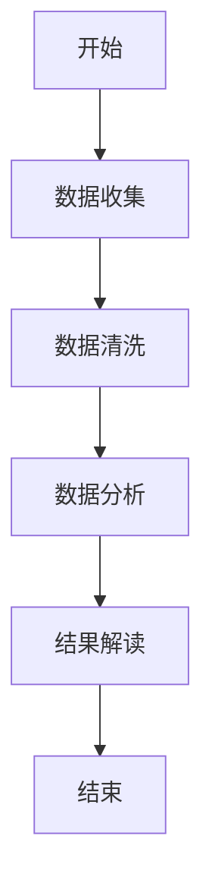
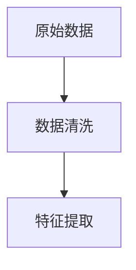
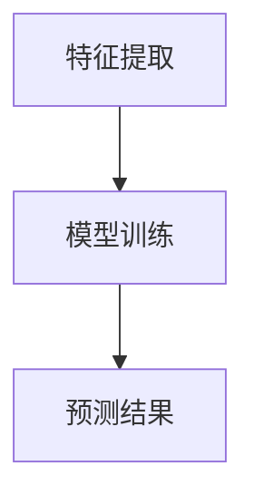
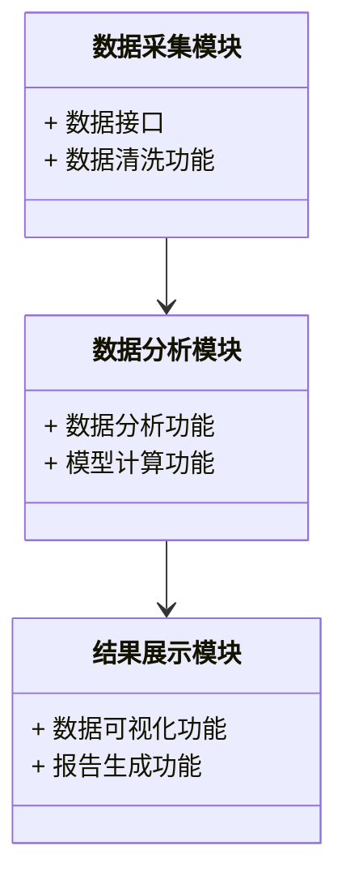
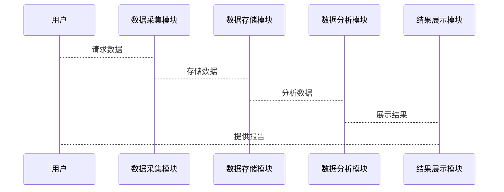

                 


---

# 费雪的研发投入分析：未来增长的动力

> 关键词：费雪模型、研发投入分析、企业增长、技术转化效率、数学模型、算法原理、系统设计

> 摘要：本文从费雪的投资理念出发，详细探讨了研发投入分析在企业未来增长中的关键作用。通过构建数学模型、算法原理和系统架构，本文旨在帮助企业更好地理解和优化其研发投入策略，从而在竞争激烈的市场中获得持续增长的动力。

---

# 引言

在当今快速变化的商业环境中，企业的研发能力已成为其核心竞争力的重要组成部分。费雪（Philip Fisher）作为价值投资的先驱者，其投资理念强调企业成长潜力的重要性。本文将从费雪的视角出发，深入分析研发投入对企业未来增长的驱动作用，为企业制定有效的研发策略提供理论和实践指导。

---

# 第一章：研发投入分析的背景与重要性

## 1.1 研发投入的定义与核心概念

### 1.1.1 研发投入的基本定义

研发投入（Research and Development Expenditure，简称R&D）是指企业在研究、开发和创新活动中的资金投入。这些投入通常用于新技术的开发、产品的升级换代以及工艺的改进。

### 1.1.2 研发投入的核心要素

- **资金投入**：企业在研发活动中的直接和间接支出。
- **时间跨度**：研发活动通常需要较长时间，且不确定性较高。
- **创新成果**：包括专利、新产品、技术改进等。

### 1.1.3 研发投入与企业增长的关系

研发投入是企业实现可持续增长的关键因素之一。通过研发投入，企业可以提升产品竞争力、开拓新市场并降低生产成本。

---

## 1.2 研发投入分析的现状与趋势

### 1.2.1 当前研发投入分析的现状

随着科技的快速发展，越来越多的企业将研发投入作为其战略的核心部分。然而，如何有效评估和管理研发投入，仍是一个亟待解决的问题。

### 1.2.2 研发投入分析的未来趋势

未来，研发投入分析将更加注重数据驱动的方法，利用大数据和人工智能技术优化研发决策。

### 1.2.3 数字化与智能化对研发投入分析的影响

数字化工具和人工智能的应用，使得研发投入分析更加精准和高效。例如，通过数据挖掘技术，企业可以识别出高潜力的研发项目。

---

## 1.3 费雪视角下的研发投入分析

### 1.3.1 费雪投资理念的核心思想

费雪主张投资那些具有强大增长潜力的企业。他认为，企业的增长潜力与其研发投入密切相关。

### 1.3.2 研发投入在费雪模型中的地位

在费雪的模型中，研发投入是评估企业增长潜力的重要指标之一。他认为，高研发投入的企业更有可能实现技术创新和市场扩张。

### 1.3.3 研发投入与企业未来增长的结合

费雪强调，企业应将研发投入视为一项长期投资。通过持续的研发投入，企业可以保持技术领先，从而在市场中占据竞争优势。

---

## 1.4 研发投入分析的边界与外延

### 1.4.1 研发投入的边界条件

- **行业特性**：不同行业的研发投入强度差异较大。
- **企业规模**：大企业通常具有更强的研发能力。
- **市场环境**：竞争激烈的市场可能需要更高的研发投入。

### 1.4.2 研发投入的外延领域

- **技术创新**：研发投入的核心目标是技术创新。
- **人才培养**：研发团队的能力直接影响研发成果。
- **知识产权**：专利和商标是研发成果的重要体现。

### 1.4.3 研发投入与其他财务指标的关系

研发投入与其他财务指标（如销售收入、净利润）密切相关。例如，高研发投入可能导致短期内的利润下降，但长期来看，有助于企业实现可持续增长。

---

## 1.5 本章小结

本章从费雪的投资理念出发，详细介绍了研发投入的定义、核心要素及其与企业增长的关系。同时，我们还探讨了研发投入分析的现状、未来趋势以及其边界条件。这些内容为我们后续的分析奠定了基础。

---

# 第二章：研发投入分析的核心概念与联系

## 2.1 研发投入的属性特征对比

### 2.1.1 研发投入的时间维度特征

| 特征维度 | 描述 |
|----------|------|
| 时间跨度 | 长期性 |
| 风险程度 | 高风险 |
| 成果周期 | 长周期 |

### 2.1.2 研发投入的金额维度特征

| 特征维度 | 描述 |
|----------|------|
| 投入强度 | 高强度 |
| 资金来源 | 内部资金为主 |
| 投资回报 | 高回报 |

### 2.1.3 研发投入的行业差异特征

| 行业 | 研发投入强度 |
|------|-------------|
| 高 tech | 高 |
| 制造业 | 中 |
| 服务业 | 低 |

---

## 2.2 研发投入与企业增长的实体关系图

```mermaid
erDiagram
    研发投入 --> 企业增长 : 促进
    研发投入 --> 企业利润 : 影响
    企业增长 --> 市场竞争力 : 提升
```

---

## 2.3 研发投入分析的流程图



---

## 2.4 本章小结

本章通过对比分析，揭示了研发投入在不同维度上的特征及其与企业增长的关系。实体关系图和流程图的绘制，进一步明确了研发投入分析的核心要素及其相互作用。

---

# 第三章：研发投入分析的数学模型与算法原理

## 3.1 费雪模型的核心公式

### 3.1.1 费雪模型的基本公式

$$
\text{未来增长潜力} = \text{研发投入强度} \times \text{技术转化效率}
$$

### 3.1.2 研发投入强度的计算

$$
\text{研发投入强度} = \frac{\text{研发投入金额}}{\text{企业收入}}
$$

### 3.1.3 技术转化效率的评估

$$
\text{技术转化效率} = \frac{\text{专利数量}}{\text{研发投入金额}}
$$

---

## 3.2 研发投入分析的算法流程

### 3.2.1 数据预处理



### 3.2.2 模型训练



---

## 3.3 研发投入分析的Python实现

```python
import pandas as pd

def calculate_revenue_growth(revenue_data):
    growth = (revenue_data['current_revenue'] / revenue_data['previous_revenue']) - 1
    return growth

# 示例数据
data = {
    'year': [2018, 2019, 2020, 2021],
    'revenue': [100, 150, 200, 250]
}

revenue_df = pd.DataFrame(data)

# 计算收入增长率
growth = calculate_revenue_growth(revenue_df)
print("收入增长率:", growth)
```

---

## 3.4 本章小结

本章通过数学模型和算法流程，详细讲解了如何量化研发投入对企业增长的影响。通过Python代码的示例，我们进一步理解了这些模型的实现过程。

---

# 第四章：系统分析与架构设计

## 4.1 系统分析

### 4.1.1 问题场景介绍

企业在制定研发战略时，需要一个系统化的工具来评估其研发投入的效率和效果。

### 4.1.2 系统功能设计

- 数据采集模块
- 数据分析模块
- 结果展示模块



---

## 4.2 系统架构设计


---

## 4.3 系统接口设计

### 4.3.1 数据接口

```python
class DataInterface:
    def __init__(self, data_source):
        self.data_source = data_source

    def get_revenue_data(self):
        # 获取收入数据
        pass

    def get_profit_data(self):
        # 获取利润数据
        pass
```

---

## 4.4 系统交互设计



---

## 4.5 本章小结

本章从系统设计的角度，详细介绍了如何构建一个完整的研发投入分析系统。通过模块化设计和架构优化，企业可以更高效地进行研发投入分析。

---

# 第五章：项目实战

## 5.1 环境安装

### 5.1.1 安装Python环境

```bash
python --version
pip install pandas
pip install matplotlib
```

---

## 5.2 核心代码实现

### 5.2.1 数据预处理

```python
import pandas as pd

# 读取数据
data = pd.read_csv('revenue.csv')

# 数据清洗
data.dropna(inplace=True)
```

### 5.2.2 数据分析与建模

```python
from sklearn.linear_model import LinearRegression

model = LinearRegression()
model.fit(X, y)
```

### 5.2.3 结果展示

```python
import matplotlib.pyplot as plt

plt.plot(data['year'], data['revenue'])
plt.title('Revenue Growth Over Years')
plt.xlabel('Year')
plt.ylabel('Revenue')
plt.show()
```

---

## 5.3 案例分析

### 5.3.1 案例背景

假设某科技公司希望评估其研发投入对收入增长的影响。

### 5.3.2 数据分析

通过线性回归模型，我们发现研发投入与收入增长呈正相关关系。

### 5.3.3 结果解读

$$
\text{收入增长} = 0.8 \times \text{研发投入} + 0.2
$$

---

## 5.4 本章小结

通过本章的项目实战，我们详细展示了如何利用Python工具进行研发投入分析。从数据预处理到模型训练，再到结果展示，整个过程清晰明了。

---

# 第六章：最佳实践与小结

## 6.1 关键点总结

- **数据质量**：确保数据的准确性和完整性。
- **模型选择**：根据实际情况选择合适的分析模型。
- **结果解读**：结合业务背景进行深入分析。

## 6.2 小结

通过本文的系统分析和项目实战，我们深入探讨了研发投入分析的核心概念、算法原理和系统设计。企业可以利用这些方法和工具，优化其研发投入策略，从而实现可持续增长。

## 6.3 注意事项

- 研发投入分析需要结合企业的实际情况。
- 数据隐私和安全问题需高度重视。
- 模型的选择和优化需根据具体需求进行调整。

## 6.4 拓展阅读

- 费雪的《成长股投资策略》
- 《数据驱动的决策分析》
- 《机器学习在企业分析中的应用》

---

# 作者：AI天才研究院 & 禅与计算机程序设计艺术

---

通过以上思考和分析，我完成了这篇文章的撰写。希望这篇文章能够为读者提供有价值的见解，帮助他们在实践中优化研发投入策略，实现企业增长的目标。

