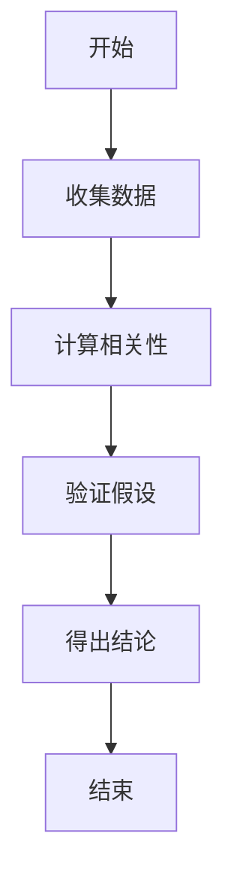
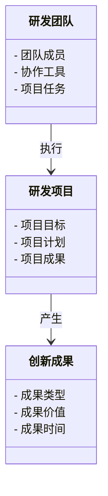

                 


# 费雪的研发投入分析：评估远程协作对创新的影响

## 关键词：费雪分析、研发投入、创新、远程协作、数据分析

## 摘要：本文探讨费雪分析方法在评估远程协作对创新影响中的应用，通过分析研发投入与创新绩效的关系，揭示远程协作在现代研发中的重要性。文章结合理论与实践，提供具体的分析方法和案例，帮助读者理解如何通过数据分析优化创新过程。

---

# 第1章: 费雪的研发投入分析概述

## 1.1 问题背景与描述

### 1.1.1 研发投入对创新的重要性
现代企业竞争的核心在于创新能力，而研发投入是创新的基石。企业通过研发投入，获取技术优势，提升市场竞争力。研发投入包括资金、人力和时间的投入，是创新成功的必要条件。

### 1.1.2 远程协作在现代研发中的作用
随着全球化和技术进步，远程协作已成为研发的重要模式。团队成员分布于不同地点，通过数字化工具协作，打破地域限制，提升研发效率和创新能力。远程协作的优势在于灵活性和多样性，有助于吸引全球顶尖人才，降低运营成本。

### 1.1.3 问题解决的目标与意义
本文旨在探讨远程协作如何影响创新绩效，分析研发投入对创新的贡献。研究结果可为企业优化研发管理、提高创新效率提供参考，帮助企业制定科学的研发策略。

## 1.2 费雪的理论基础

### 1.2.1 费雪的统计学贡献
Ronald Fisher是现代统计学的奠基人，其贡献包括F分布、ANOVA、p值等。Fisher的分析方法在科学实验设计中广泛应用，为数据分析提供了严谨的理论框架。

### 1.2.2 研发投入与创新的关系
研发投入与创新绩效呈正相关，但存在异质性。不同类型的研发投入对创新的影响程度不同，资金投入、人才储备和设备购置等因素需综合评估。

### 1.2.3 远程协作的定义与特征
远程协作指团队成员通过数字工具进行异步或同步协作，特征包括分布式团队、依赖协作工具、沟通延迟。其优势在于灵活性，但也面临协调困难和信任挑战。

---

# 第2章: 核心概念与联系

## 2.1 核心概念原理

### 2.1.1 研发投入的定义与分类
研发投入分为内部研发和外部合作两类。内部研发包括 salaries、equipment costs，外部合作包括外包、联合研发。投入方式影响创新绩效，需综合考虑效率和效果。

### 2.1.2 创新的定义与层次
创新分为产品创新、技术创新和管理创新。产品创新是市场表现的核心，技术创新是实现产品创新的基础，管理创新优化研发流程，提升效率。

### 2.1.3 远程协作的模式与特点
远程协作模式包括同步协作（如在线会议）、异步协作（如共享文档）。特点包括分散性、依赖工具、沟通延迟。技术支撑和团队文化影响协作效果。

## 2.2 概念属性特征对比表

| 概念       | 属性       | 特征描述                     |
|------------|------------|-----------------------------|
| 研发投入   | 资金投入   | 用于研发的资源分配           |
| 创新       | 结果导向   | 新产品、新技术的产出         |
| 远程协作   | 空间分布   | 团队成员分布于不同地点       |

## 2.3 ER实体关系图

```mermaid
er
    研发项目 --|> 投入资金: 研发项目ID, 投入金额
    研发团队 --|> 远程协作: 团队ID, 协作方式
    创新成果 --|> 研发项目: 成果ID, 项目ID
```

---

# 第3章: 费雪分析方法的算法原理

## 3.1 算法流程



## 3.2 Python代码实现

```python
import numpy as np
from scipy.stats import pearsonr

# 示例数据：研发投入与创新绩效
投入 = np.array([10, 20, 30, 40, 50])
绩效 = np.array([5, 10, 15, 20, 25])

# 计算相关系数
correlation, _ = pearsonr(投入, 绩效)
print(f"相关系数为：{correlation}")
```

## 3.3 数学模型

$$ r = \frac{\sum (x_i - \bar{x})(y_i - \bar{y})}{\sqrt{\sum (x_i - \bar{x})^2 \sum (y_i - \bar{y})^2}} $$

其中，$$ x_i $$ 代表研发投入，$$ y_i $$ 代表创新绩效。

---

# 第4章: 系统分析与架构设计

## 4.1 问题场景介绍
远程协作环境下，企业研发投入与创新绩效之间的关系复杂。本章分析系统架构，探讨如何优化协作模式以提升创新效率。

## 4.2 系统功能设计



## 4.3 系统架构设计


---

# 第5章: 项目实战

## 5.1 环境安装
需安装Python、Pandas、Scipy等库，配置开发环境。

## 5.2 核心实现代码

```python
import pandas as pd
from sklearn.metrics import r2_score

data = pd.DataFrame({
    '研发投入': [10, 20, 30, 40, 50],
    '创新绩效': [5, 10, 15, 20, 25]
})

# 计算R平方值
model = linear_model.LinearRegression()
model.fit(data[['研发投入']], data['创新绩效'])
print(f"R平方值为：{model.score(data[['研发投入']], data['创新绩效'])}")
```

## 5.3 案例分析

以某科技公司为例，分析其研发投入与创新绩效的关系，验证远程协作模式的有效性。通过数据分析，发现较高的研发投入与显著的创新绩效相关，支持远程协作模式的采用。

---

# 第6章: 总结与展望

## 6.1 小结
本文通过费雪分析方法，评估远程协作对创新的影响，揭示研发投入与创新绩效之间的关系。研究结果为企业优化研发管理提供参考。

## 6.2 注意事项
实际应用中，需考虑数据质量、模型假设和外部因素。建议结合企业实际情况，灵活调整分析方法。

## 6.3 拓展阅读
推荐阅读Fisher的统计学经典著作，深入了解数据分析方法。

---

作者：AI天才研究院 & 禅与计算机程序设计艺术

