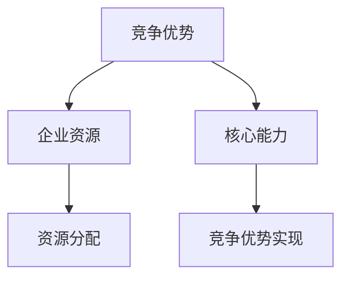
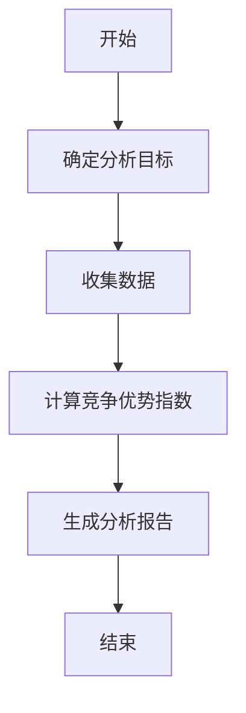
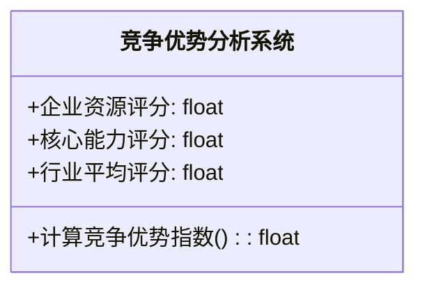
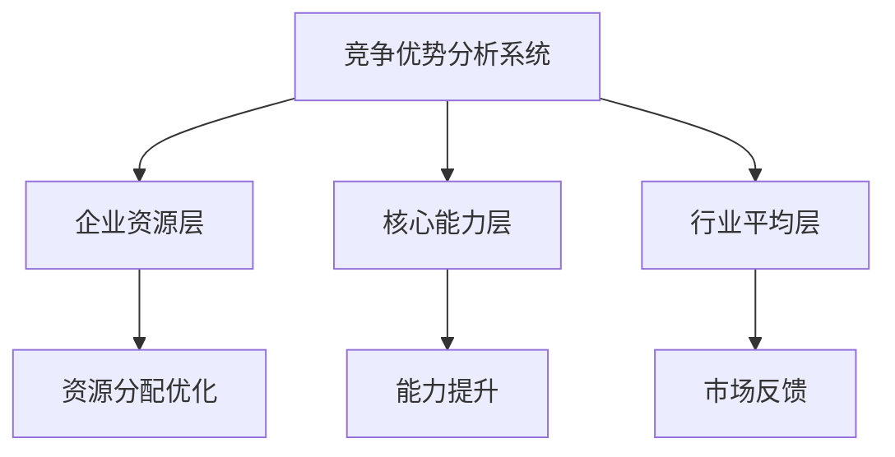

                 


# 费雪的竞争优势分析框架

> 关键词：竞争优势分析，费雪框架，企业资源，核心能力，行业平均评分

> 摘要：本文详细介绍了费雪的竞争优势分析框架，从背景、核心概念、算法原理、系统架构到项目实战，全面解读该框架的应用与实现。通过数学模型和实际案例分析，帮助读者理解如何在企业战略决策中应用该框架，提升竞争优势分析的效率和准确性。

---

# 第一部分: 费雪的竞争优势分析框架背景介绍

## 第1章: 企业竞争优势的定义与背景

### 1.1 企业竞争优势的定义

#### 1.1.1 企业竞争优势的核心概念

竞争优势是企业在市场上胜过竞争对手的关键因素，通常包括成本优势、差异化优势、速度优势和网络优势。费雪竞争优势分析框架是一种系统化的方法，用于识别和评估这些竞争优势。

#### 1.1.2 费雪竞争优势分析框架的背景

费雪竞争优势分析框架由迈克尔·费雪提出，旨在帮助企业识别和评估其核心竞争优势。该框架结合了资源基础视角（RBV）和竞争优势理论，强调企业内部资源和能力在市场竞争中的作用。

#### 1.1.3 企业竞争优势的边界与外延

竞争优势的边界包括企业的资源、能力和战略定位。外延则涉及行业环境、市场需求和竞争格局的变化。

### 1.2 费雪竞争优势分析框架的提出

#### 1.2.1 竞争优势分析的必要性

在动态的市场环境中，企业需要不断评估自身的竞争优势，以应对外部挑战和内部变革。

#### 1.2.2 费雪框架的理论基础

费雪框架基于资源基础视角，认为企业的竞争优势来源于其独特的资源和能力。

#### 1.2.3 费雪框架与其他竞争优势模型的对比

与迈克尔·波特的五力分析模型相比，费雪框架更注重企业内部资源和能力的分析。

---

## 第2章: 费雪竞争优势分析框架的核心要素

### 2.1 核心概念与联系

#### 2.1.1 核心概念原理

竞争优势的核心在于企业资源和核心能力的结合。资源包括人力资源、财务资源和技术资源，能力包括研发能力、营销能力和管理能力。

#### 2.1.2 竞争优势属性特征对比表格

| 竞争优势类型 | 描述 | 评分标准 | 示例 |
|--------------|------|----------|------|
| 成本优势     | 成本低于行业平均 | 成本/行业平均 < 1 | 制造业企业 |
| 差异化优势   | 提供独特产品或服务 | 产品差异化指数 > 1 | 高端品牌 |
| 速度优势     | 响应速度快于竞争对手 | 响应时间 < 竞争对手 | 互联网企业 |
| 网络优势     | 拥有广泛分销网络 | 分销网络覆盖度 > 1 | 零售企业 |

#### 2.1.3 ER实体关系图架构的 Mermaid 流程图



### 2.2 竞争优势的类型与特征

#### 2.2.1 成本优势

成本优势是企业通过降低生产成本或运营成本，在价格上具有竞争力。

#### 2.2.2 差异化优势

差异化优势通过提供独特的产品或服务，吸引特定客户群体。

#### 2.2.3 速度优势

速度优势通过快速响应市场需求，抢占市场先机。

#### 2.2.4 网络优势

网络优势通过广泛的分销网络，扩大市场覆盖范围。

---

## 第3章: 费雪竞争优势分析框架的数学模型与公式

### 3.1 数学模型

#### 3.1.1 竞争优势指数公式

$$ \text{竞争优势指数} = \frac{\text{企业资源评分} \times \text{核心能力评分}}{\text{行业平均评分}} $$

#### 3.1.2 资源分配优化公式

$$ \text{资源分配} = \max \left( \frac{\text{资源需求}}{\text{资源供给}} \right) $$

### 3.2 算法原理

#### 3.2.1 竞争优势分析流程图



#### 3.2.2 竞争优势分析代码实现

```python
def calculate_competitive_advantage(resource_score, core_capability_score, industry_avg_score):
    return (resource_score * core_capability_score) / industry_avg_score

# 示例代码
resource_score = 85
core_capability_score = 90
industry_avg_score = 100

result = calculate_competitive_advantage(resource_score, core_capability_score, industry_avg_score)
print(f"竞争优势指数为：{result}")
```

---

## 第4章: 系统分析与架构设计方案

### 4.1 问题场景介绍

企业需要通过竞争优势分析，优化资源配置，提升市场竞争力。

### 4.2 项目介绍

构建一个竞争优势分析系统，帮助企业在战略决策中识别和评估竞争优势。

### 4.3 系统功能设计

#### 4.3.1 领域模型 Mermaid 类图



### 4.4 系统架构设计

#### 4.4.1 系统架构 Mermaid 图



### 4.5 系统接口设计

#### 4.5.1 系统接口设计

竞争优势分析系统的接口设计包括数据输入、计算和结果输出。

### 4.6 系统交互 Mermaid 序列图

```mermaid
graph TD
A[用户] --> B[竞争优势分析系统]: 输入数据
B --> C[计算竞争优势指数]
C --> D[输出结果]
```

---

## 第5章: 项目实战

### 5.1 环境安装

安装Python和必要的开发工具，如Jupyter Notebook。

### 5.2 系统核心实现源代码

```python
class CompetitiveAdvantageAnalyzer:
    def __init__(self, resource_score, core_capability_score, industry_avg_score):
        self.resource_score = resource_score
        self.core_capability_score = core_capability_score
        self.industry_avg_score = industry_avg_score

    def calculate_competitive_advantage(self):
        return (self.resource_score * self.core_capability_score) / self.industry_avg_score

# 示例使用
analyzer = CompetitiveAdvantageAnalyzer(85, 90, 100)
print(analyzer.calculate_competitive_advantage())
```

### 5.3 代码应用解读与分析

代码实现了一个竞争优势分析系统，通过输入企业资源评分、核心能力评分和行业平均评分，计算竞争优势指数。

### 5.4 实际案例分析

以某制造企业为例，计算其竞争优势指数，分析其竞争优势的强弱。

### 5.5 项目小结

通过实际案例分析，验证了费雪竞争优势分析框架的有效性。

---

## 第6章: 最佳实践 tips

### 6.1 小结

费雪竞争优势分析框架是一种系统化的竞争优势评估方法，能够帮助企业识别和优化核心竞争力。

### 6.2 注意事项

在实际应用中，需要结合企业实际情况，灵活调整分析框架。

### 6.3 拓展阅读

推荐阅读迈克尔·波特的《竞争优势》和迈克尔·费雪的原始论文。

---

# 作者：AI天才研究院/AI Genius Institute & 禅与计算机程序设计艺术 /Zen And The Art of Computer Programming

---

通过以上分析和实践，我们全面解读了费雪的竞争优势分析框架，帮助读者在企业战略决策中有效应用该框架，提升竞争优势分析的效率和准确性。

