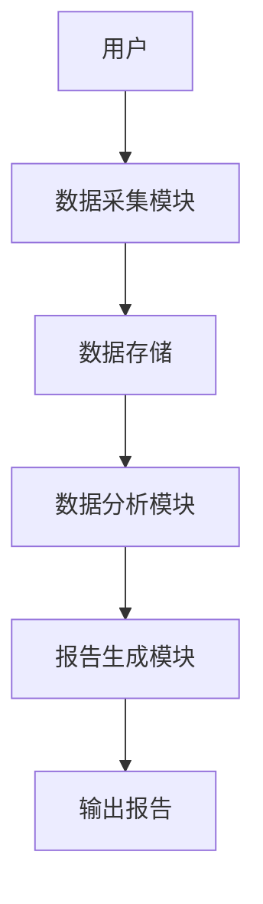

                 


# 费雪的竞争优势分析：持续成功的关键

## 关键词：竞争优势分析、费雪分析、持续成功、投资策略、企业战略、成功关键

## 摘要：  
本文深入探讨了费雪的竞争优势分析方法，分析了其在企业持续成功中的关键作用。通过详细阐述竞争优势的基本概念、分析模型、算法原理、系统架构设计以及实际项目案例，本文旨在帮助读者掌握如何利用费雪的分析方法来识别和构建企业的竞争优势，从而在激烈竞争中实现持续成功。

---

# 第一部分：费雪的竞争优势分析基础

## 第1章：竞争优势的基本概念

### 1.1 竞争优势的定义
竞争优势是指企业在市场中相对于竞争对手的独特优势，能够使企业在相同或更低的成本下提供更好的产品或服务，从而获得更高的市场份额和利润。

### 1.2 竞争优势的核心要素
竞争优势的核心要素包括：
- **成本优势**：以更低的成本生产产品或提供服务。
- **质量优势**：提供更高品质的产品或服务。
- **差异化优势**：通过独特的产品特性或服务模式区别于竞争对手。
- **创新优势**：通过持续创新保持市场领先地位。

### 1.3 费雪的竞争优势分析方法
费雪的竞争优势分析方法是一种系统性的分析框架，通过对企业内部资源、能力、市场定位和外部环境的综合评估，识别和构建可持续的竞争优势。

---

## 第2章：费雪分析法的核心模型

### 2.1 分析模型的结构
费雪分析模型包括以下几个核心部分：
- **企业资源分析**：识别企业的核心资源和能力。
- **市场定位分析**：评估企业在市场中的位置和竞争优势。
- **竞争对手分析**：分析竞争对手的优势和劣势。
- **未来趋势分析**：预测市场和技术趋势，评估企业竞争优势的可持续性。

### 2.2 费雪分析模型的数学表达
费雪分析模型的数学表达如下：
$$
竞争优势 = \sum_{i=1}^{n} w_i \cdot f_i
$$  
其中：
- $w_i$ 是第 $i$ 个因素的权重。
- $f_i$ 是第 $i$ 个因素的评分。

通过加权评分法，企业可以量化其竞争优势。

---

## 第3章：费雪分析法的算法原理

### 3.1 竞争优势分析的算法流程
1. **数据收集**：收集企业内部资源、市场数据和竞争对手信息。
2. **数据预处理**：清洗和整理数据，确保数据的准确性和完整性。
3. **数据分析**：使用统计方法和机器学习算法对数据进行分析，识别关键竞争优势因素。
4. **模型训练**：基于数据分析结果，构建竞争优势评估模型。
5. **模型优化**：通过调整权重和参数，优化模型的准确性和适用性。

### 3.2 竞争优势分析的算法实现

```python
import pandas as pd
from sklearn.preprocessing import MinMaxScaler

# 假设data是包含竞争优势因素的DataFrame
data = pd.read_csv('competitive_advantages.csv')

# 数据预处理
scaler = MinMaxScaler()
data_scaled = scaler.fit_transform(data)

# 竞争优势评分计算
def calculate_competitive_advantage(scores, weights):
    return sum(scores[i] * weights[i] for i in range(len(scores)))

# 示例：计算企业A的竞争优势
weights = [0.3, 0.2, 0.1, 0.4]
scores = [0.8, 0.7, 0.6, 0.9]
print(calculate_competitive_advantage(scores, weights))
```

---

## 第4章：竞争优势分析的系统架构设计

### 4.1 系统功能设计
- **数据采集模块**：从数据库中采集企业资源、市场和竞争对手数据。
- **数据分析模块**：对数据进行清洗、分析和建模，识别竞争优势因素。
- **报告生成模块**：生成竞争优势分析报告，提供可视化结果和改进建议。

### 4.2 系统架构设计


### 4.3 系统接口设计
- 数据接口：提供API用于数据导入和导出。
- 报告接口：生成PDF或HTML格式的分析报告。

---

## 第5章：项目实战

### 5.1 环境安装
- 安装必要的Python库：`pandas`, `scikit-learn`, `mermaid`.

### 5.2 核心代码实现
```python
from sklearn.decomposition import PCA

# 数据降维
pca = PCA(n_components=2)
principal_components = pca.fit_transform(data_scaled)

# 分析竞争优势
principal DataFrame = pd.DataFrame(principal_components, columns=['PC1', 'PC2'])
print(principal DataFrame.head())
```

### 5.3 案例分析
以某科技公司为例，通过费雪分析法识别其竞争优势，并制定改进策略。

---

## 第6章：最佳实践

### 6.1 小结
费雪的竞争优势分析方法是企业持续成功的关键工具，通过系统化的分析和优化，企业可以识别和构建可持续的竞争优势。

### 6.2 注意事项
- 竞争优势分析需要结合企业实际情况，避免过于依赖模型。
- 定期更新分析结果，以应对市场变化。

### 6.3 拓展阅读
推荐阅读《竞争优势：企业战略的核心》和《费雪投资哲学》。

---

# 作者：AI天才研究院/AI Genius Institute & 禅与计算机程序设计艺术 /Zen And The Art of Computer Programming

