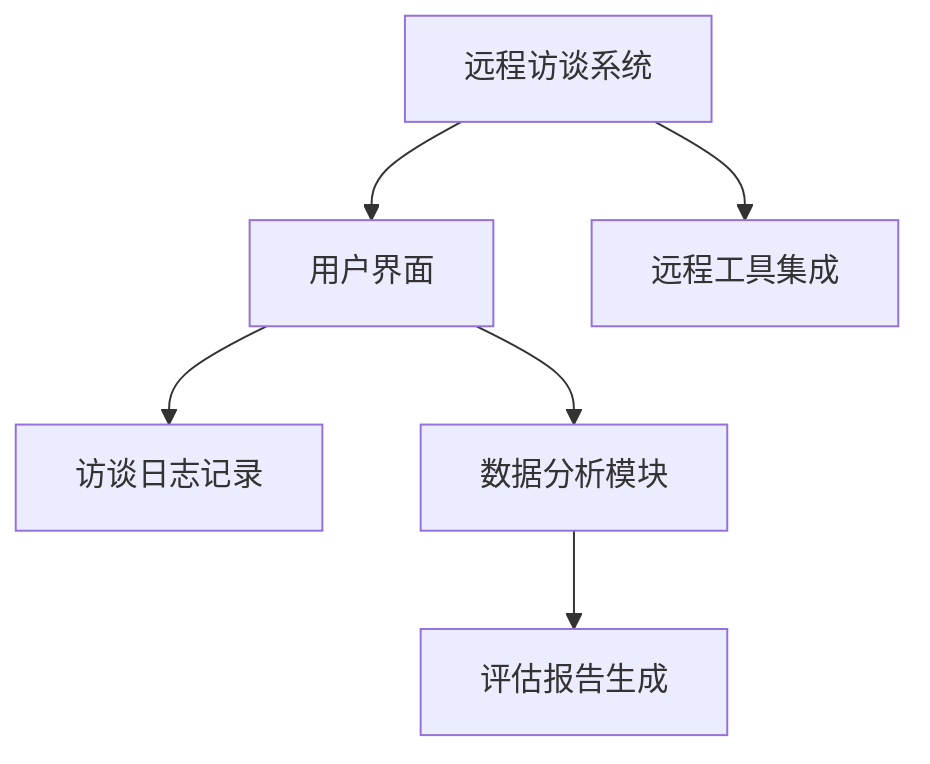
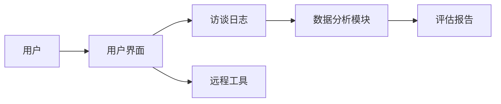

                 


# 费雪的管理层访谈技巧：远程尽职调查的新方法

---

## 关键词：  
远程尽职调查、管理层访谈、费雪访谈法、系统架构、人工智能辅助、项目实战

---

## 摘要：  
本文系统地介绍了费雪的管理层访谈技巧及其在远程尽职调查中的新方法。文章从背景介绍、核心概念、方法论、算法原理、系统架构、项目实战到最佳实践，全面剖析了如何通过科学的访谈技巧和系统设计，提升远程尽职调查的效率和准确性。通过案例分析和数学模型的构建，文章展示了如何利用人工智能辅助访谈，优化企业评估流程。

---

## 正文：

### 第1章：背景介绍

#### 1.1 费雪的管理层访谈技巧  
费雪（Benjamin Graham）是价值投资的鼻祖，他的管理层访谈技巧是企业评估的重要方法之一。通过与管理层的深入交流，投资者可以了解企业的战略、文化、管理团队的能力以及潜在的风险。  

**问题背景与目标**：  
在传统的企业评估中，面对面的访谈是主要方式。然而，随着全球化的推进和技术的进步，远程尽职调查的需求日益增加。远程访谈不仅可以降低成本，还能提高评估效率。  

**远程尽职调查的重要性**：  
远程访谈通过技术手段，突破了地域限制，使企业评估更加便捷。同时，它还能通过数据分析，提升评估的准确性和深度。  

---

#### 1.2 管理层访谈的核心要素  
**目的与意义**：  
- 评估企业管理层的能力与决策水平。  
- 发现企业潜在的问题与机会。  
- 为投资决策提供科学依据。  

**核心概念**：  
- 访谈对象：通常包括CEO、 CFO、CTO等高管。  
- 访谈内容：涵盖企业战略、财务状况、市场竞争力等方面。  

---

### 第2章：核心概念与理论框架

#### 2.1 费雪访谈法的核心概念  
**定义与特点**：  
费雪访谈法是一种通过系统性问题设计与分析，评估企业管理层的能力和企业潜在价值的方法。  

**核心要素对比表**：  

| **要素**       | **传统访谈法**                     | **费雪访谈法**                     |
|----------------|------------------------------------|------------------------------------|
| 访谈目的         | 简单了解企业情况                   | 深入评估企业价值与潜在风险         |
| 访谈对象         | 一般员工或中层管理者               | 核心高管（CEO、CFO等）             |
| 访谈方式         | 面对面交流                         | 面对面或远程访谈                   |
| 数据分析         | 无或少量                          | 结构化数据采集与分析               |

---

#### 2.2 远程尽职调查的系统模型  

**系统架构图（Mermaid）**：  



---

### 第3章：费雪访谈法的系统分析

#### 3.1 访谈前的准备工作  

**信息收集与分析**：  
在远程访谈前，需收集企业的公开数据、财务报表等，为访谈问题的设计提供依据。  

**访谈提纲设计**：  
根据企业的特点，设计结构化的访谈提纲，确保问题覆盖企业的各个方面。  

**远程工具选择**：  
选择适合的远程访谈工具（如Zoom、Microsoft Teams），并进行测试。  

---

#### 3.2 访谈过程中的技巧  

**问题设计**：  
- 开放性问题：激发管理层的思考，如“您如何看待当前的市场竞争？”  
- 封闭性问题：快速获取关键信息，如“公司未来三年的收入目标是多少？”  

**倾听与反馈**：  
通过有效的倾听和反馈，引导访谈方向，挖掘深层信息。  

**应对突发情况**：  
如网络中断或对方回答不清晰时，需迅速调整访谈策略。  

---

### 第4章：管理层能力评估模型

#### 4.1 模型构建与分析  

**数据收集与特征提取**：  
从访谈记录中提取关键词、情绪分析等特征。  

**模型选择与训练**：  
使用机器学习算法（如随机森林、支持向量机）对管理层能力进行分类。  

**模型评估**：  
通过准确率、召回率等指标评估模型性能。  

---

#### 4.2 数学模型与公式  

**评估指标公式**：  
$$\text{管理层能力评分} = \frac{\text{正面关键词数} - \text{负面关键词数}}{\text{总关键词数}} \times 100$$  

**实例分析**：  
假设某次访谈中，正面关键词数为80，负面关键词数为20，总关键词数为100，则能力评分为：$$\frac{80-20}{100} \times 100 = 80\%$$  

---

### 第5章：远程访谈系统的架构设计

#### 5.1 系统功能模块设计  

**功能模块**：  
- 用户界面：供用户发起访谈和查看报告。  
- 访谈管理：记录访谈日志和分析结果。  
- 数据分析：对访谈数据进行挖掘和评分。  

**系统架构图（Mermaid）**：  



---

### 第6章：项目实战与案例分析

#### 6.1 环境安装与工具配置  

**开发环境**：  
- 操作系统：Windows 10或更高版本。  
- 编程语言：Python 3.8及以上。  
- 第三方库：Pandas、Scikit-learn、NLTK。  

**工具安装**：  
安装Python环境和必要的库：  
```bash
pip install pandas scikit-learn nltk
```

---

#### 6.2 核心代码实现  

**访谈日志记录模块**：  
```python
import pandas as pd

# 读取访谈日志
log_file = 'interview_log.txt'
log_data = pd.read_csv(log_file, sep='\t')

# 提取关键词
positive_words = ['strategic', 'growth', 'innovation']
negative_words = ['risk', 'challenges', 'uncertainty']

# 计算评分
positive_count = log_data['transcript'].str.lower().str.contains('|'.join(positive_words)).sum()
negative_count = log_data['transcript'].str.lower().str.contains('|'.join(negative_words)).sum()
total_count = len(log_data)
score = ((positive_count - negative_count) / total_count) * 100

print(f"管理层能力评分：{score:.2f}%")
```

---

### 第7章：最佳实践与小结

#### 7.1 最佳实践  

**关键点总结**：  
- 访谈前做好充分准备。  
- 远程工具的选择与测试。  
- 结构化数据分析与模型优化。  

**注意事项**：  
- 避免信息过载，聚焦核心问题。  
- 定期更新模型，适应市场变化。  

---

## 结语：  
通过费雪的管理层访谈技巧与远程尽职调查的新方法，企业评估变得更加高效和精准。结合系统架构与人工智能辅助，未来的企业评估将更加智能化和数据驱动。

---

## 作者：  
AI天才研究院/AI Genius Institute & 禅与计算机程序设计艺术 /Zen And The Art of Computer Programming

