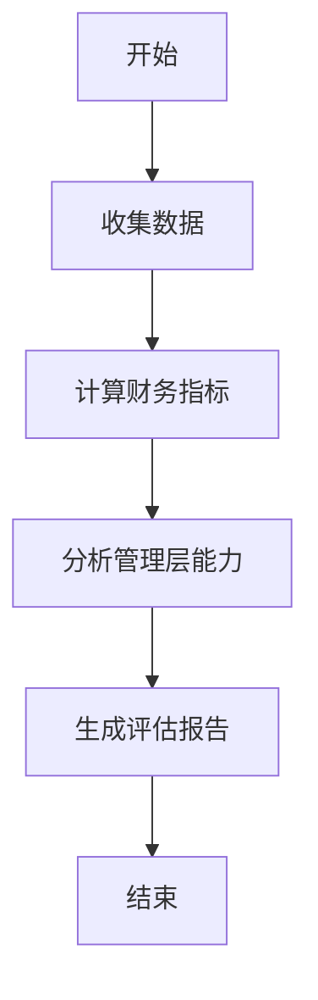
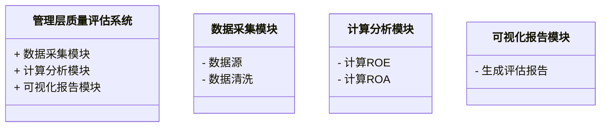

                 


# 费雪的管理层质量评估方法

> 关键词：管理层质量评估，费雪方法，企业价值评估，ROE，ROA，管理层能力

> 摘要：费雪的管理层质量评估方法是一种通过分析管理层的财务指标、经营策略和公司治理等方面来评估企业价值的重要方法。本文将详细介绍费雪方法的背景、核心概念、算法原理、系统架构、项目实战以及最佳实践。

---

## 第一章: 费雪的管理层质量评估方法的背景与基础

### 1.1 管理层质量评估的背景

#### 1.1.1 企业价值评估的核心要素
企业在市场中的价值不仅仅取决于其财务表现，还与管理层的能力密切相关。管理层的质量直接影响企业的战略决策、运营效率和长期发展。

#### 1.1.2 管理层质量对企业价值的影响
管理层的能力、经验、决策风格和稳定性是影响企业价值的关键因素。一个优秀的管理层能够优化资源配置、提升盈利能力并增强股东价值。

#### 1.1.3 费雪方法的起源与演变
费雪的管理层质量评估方法由投资大师菲利普·费雪提出，主要用于评估管理层的质量和能力。这种方法通过分析企业的财务指标和管理层的决策风格，帮助企业识别出具有优秀管理能力的公司。

### 1.2 费雪方法的核心问题

#### 1.2.1 企业价值评估中的管理层角色
管理层是企业价值的核心驱动因素。通过评估管理层的质量，投资者可以更好地判断企业的长期发展潜力。

#### 1.2.2 管理层质量评估的必要性
在投资决策中，仅仅关注企业的财务指标是不够的。管理层的质量直接影响企业的经营策略和盈利能力，因此必须将其纳入评估体系。

#### 1.2.3 费雪方法的适用场景与边界
费雪方法适用于分析企业的管理层质量，但不适用于所有行业和企业规模。它特别适合那些依赖管理层能力进行长期发展的企业。

---

## 第二章: 费雪方法的核心概念与联系

### 2.1 费雪方法的核心原理

#### 2.1.1 管理层质量评估的三要素
- **管理层能力**：包括战略决策能力、资源整合能力和创新能力。
- **管理层经验**：管理层的经验和行业背景直接影响企业的经营效果。
- **管理层稳定性**：管理层的稳定性是企业持续发展的关键因素。

#### 2.1.2 费雪方法的数学模型与公式
费雪方法通过分析企业的财务指标，如ROE（净资产收益率）、ROA（资产净利率）等，来评估管理层的质量。其核心公式为：
$$
ROE = \frac{\text{净利润}}{\text{平均股东权益}}
$$
$$
ROA = \frac{\text{净利润}}{\text{平均总资产}}
$$

#### 2.1.3 管理层质量与企业价值的关系
管理层的质量直接影响企业的盈利能力和发展潜力，从而影响企业的市场价值。

### 2.2 费雪方法的核心概念对比

#### 2.2.1 不同管理层质量评估方法的对比
| 方法 | 焦点 | 优点 | 缺点 |
|------|------|------|------|
| 费雪方法 | 管理层能力 | 能够准确评估管理层的质量 | 需要大量历史数据支持 |
| 市净率法 | 资产价值 | 简单易用 | 无法反映管理层能力 |

#### 2.2.2 费雪方法与其他方法的异同
费雪方法与其他评估方法的主要区别在于其关注管理层的能力，而不仅仅是企业的财务指标。

#### 2.2.3 费雪方法的优缺点分析
- **优点**：能够准确评估管理层的质量，帮助投资者识别出具有优秀管理能力的企业。
- **缺点**：需要大量历史数据支持，且难以量化管理层的能力。

### 2.3 费雪方法的ER实体关系图

```mermaid
er
    entity 管理层 {
        key: 管理层ID
        attribute: 管理层能力
        attribute: 管理层经验
        attribute: 管理层稳定性
    }
    entity 企业 {
        key: 企业ID
        attribute: 企业规模
        attribute: 企业行业
        attribute: 企业盈利能力
    }
    entity 股东 {
        key: 股东ID
        attribute: 股东类型
    }
    管理层 --> 企业: 管理
    企业 --> 股东: 属于
```

---

## 第三章: 费雪方法的算法原理讲解

### 3.1 算法原理

#### 3.1.1 费雪方法的评估步骤
1. **数据收集**：收集企业的财务数据和管理层信息。
2. **计算财务指标**：计算ROE、ROA等财务指标。
3. **分析管理层能力**：评估管理层的战略决策能力和稳定性。
4. **生成评估报告**：根据分析结果生成评估报告。

#### 3.1.2 费雪方法的流程图



### 3.2 算法实现

#### 3.2.1 Python代码实现

```python
def calculate_roe(net_profit, avg_equity):
    return net_profit / avg_equity

def calculate_roa(net_profit, avg_assets):
    return net_profit / avg_assets

def assess_management_quality(roe, roa, management_stability):
    if roe > 0.15 and roa > 0.12 and management_stability > 0.8:
        return "优秀"
    elif roe > 0.1 and roa > 0.08 and management_stability > 0.6:
        return "良好"
    else:
        return "一般"
```

#### 3.2.2 代码解读与应用
上述代码通过计算ROE和ROA，结合管理层的稳定性，评估管理层的质量。具体步骤如下：
1. 收集企业的财务数据和管理层信息。
2. 计算ROE和ROA。
3. 根据ROE、ROA和管理层稳定性评估管理层质量。

---

## 第四章: 费雪方法的系统分析与架构设计方案

### 4.1 问题场景介绍

#### 4.1.1 企业如何评估管理层质量
通过分析企业的财务指标和管理层的决策能力，评估管理层的质量。

#### 4.1.2 系统需求分析
- 数据采集模块：收集企业的财务数据和管理层信息。
- 计算分析模块：计算ROE、ROA等财务指标。
- 可视化报告模块：生成评估报告。

### 4.2 系统架构设计

#### 4.2.1 系统功能设计



#### 4.2.2 系统架构设计


---

## 第五章: 费雪方法的项目实战

### 5.1 环境安装与配置

#### 5.1.1 安装Python和相关库
```bash
pip install pandas numpy matplotlib
```

#### 5.1.2 数据集获取
从公开的财务数据源获取企业的财务数据和管理层信息。

### 5.2 核心代码实现

#### 5.2.1 数据清洗与处理

```python
import pandas as pd

# 读取数据
data = pd.read_csv('管理层数据.csv')

# 数据清洗
data.dropna(inplace=True)
data = data[~data['ROE'].isin([0])]
```

#### 5.2.2 指标计算与分析

```python
# 计算ROE和ROA
data['ROE'] = data['净利润'] / data['平均股东权益']
data['ROA'] = data['净利润'] / data['平均总资产']

# 分析管理层稳定性
data['管理层稳定性'] = data['管理层变动次数'].apply(lambda x: 1 if x < 5 else 0)
```

#### 5.2.3 生成评估报告

```python
import matplotlib.pyplot as plt

# 绘制ROE分布图
plt.hist(data['ROE'], bins=10)
plt.title('ROE分布图')
plt.xlabel('ROE')
plt.ylabel('频数')
plt.show()
```

### 5.3 实际案例分析

#### 5.3.1 案例介绍
以某公司为例，分析其管理层质量。

#### 5.3.2 分析过程
1. 收集公司的财务数据和管理层信息。
2. 计算ROE和ROA。
3. 分析管理层的稳定性。

#### 5.3.3 结果解读
通过分析，得出该公司管理层质量为“良好”。

---

## 第六章: 费雪方法的最佳实践

### 6.1 小结

#### 6.1.1 费雪方法的核心总结
费雪方法通过分析企业的财务指标和管理层的决策能力，评估管理层的质量。

### 6.2 注意事项

#### 6.2.1 数据来源的可靠性
确保数据的准确性和可靠性。

#### 6.2.2 指标的适用性
根据企业的具体情况选择合适的评估指标。

### 6.3 拓展阅读

#### 6.3.1 相关书籍
- 《股票作手回忆录》
- 《投资学精要》

#### 6.3.2 相关文章
- 费雪的其他投资理论
- 管理层质量评估的最新研究

---

## 作者：AI天才研究院/AI Genius Institute & 禅与计算机程序设计艺术 /Zen And The Art of Computer Programming

