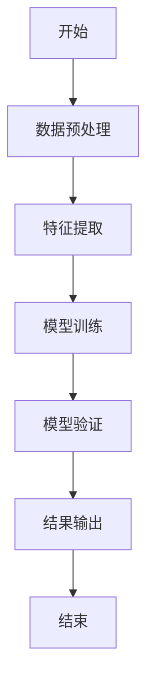
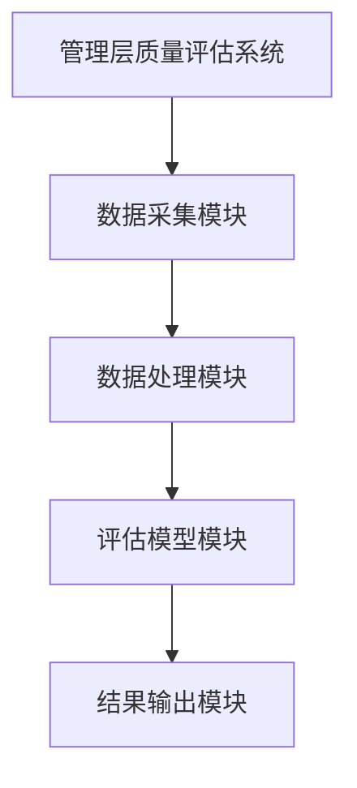

                 


# 费雪的管理层质量评估：公司治理在投资决策中的作用

## 关键词：
- 费雪投资理论
- 管理层质量评估
- 公司治理
- 投资决策
- 管理层评分模型

## 摘要：
本文深入探讨了菲利普·费雪的管理层质量评估理论，分析了公司治理在投资决策中的重要性。通过构建一个基于管理层质量评估的数学模型，本文详细阐述了如何将管理层质量评估应用于实际投资决策中。文章从理论基础、模型构建、算法实现、系统设计和项目实战等多个维度展开，为投资者提供了一套完整的管理层质量评估方法。

---

## 第一部分: 费雪的管理层质量评估基础

### 第1章: 费雪投资理念与管理层质量评估概述

#### 1.1 费雪投资理论的核心思想
##### 1.1.1 费雪的生平与投资理念
菲利普·费雪（Philip Fisher）是价值投资的先驱之一，他于20世纪30年代提出了“成长股”投资理念。费雪认为，投资的成功不仅取决于公司的财务状况，还取决于管理层的素质和公司的成长潜力。他强调，优秀的管理层能够为公司创造长期价值。

##### 1.1.2 费雪与价值投资的关联
费雪的投资理念对现代价值投资产生了深远影响。他提出，投资者应关注公司的基本面，尤其是管理层的质量和公司的成长潜力。费雪认为，管理层的决策能力是公司能否长期增长的关键因素。

##### 1.1.3 管理层质量在投资决策中的重要性
费雪认为，管理层的质量是决定公司长期表现的核心因素。一个优秀的管理层能够制定正确的战略、管理风险、推动创新，并实现公司价值的最大化。因此，在投资决策中，对管理层质量的评估至关重要。

#### 1.2 公司治理与投资决策的关系
##### 1.2.1 公司治理的基本概念
公司治理是指公司如何管理其业务、组织结构和决策过程。有效的公司治理能够确保管理层的行为符合公司和股东的利益。

##### 1.2.2 公司治理在投资中的作用
公司治理的优劣直接影响公司的长期表现。优秀的公司治理能够吸引投资者，提升公司的市场价值。反之，治理不善的公司可能面临管理混乱、决策失误等问题，从而影响投资回报。

##### 1.2.3 管理层质量评估的背景与意义
管理层质量评估是公司治理的重要组成部分。通过对管理层的质量进行评估，投资者可以更好地判断公司的潜在价值和风险。这有助于投资者做出更明智的投资决策。

---

### 第2章: 管理层质量评估的核心框架

#### 2.1 管理层质量评估的维度
##### 2.1.1 领导力与决策能力
领导力是管理层质量的核心要素之一。优秀的领导者能够制定正确的战略、激励团队、应对危机，并推动公司实现目标。

##### 2.1.2 企业战略与目标设定
企业的战略和目标设定反映了管理层的远见和规划能力。一个清晰的战略目标能够指导公司的日常运营，并为投资者提供明确的预期。

##### 2.1.3 企业风险管理能力
风险管理能力是管理层质量的重要指标。优秀的管理层能够识别潜在风险、制定应对策略，并在危机中保持公司的稳定。

##### 2.1.4 企业创新能力
创新能力是公司在竞争中保持优势的关键。管理层应具备推动创新的能力，能够引领公司适应市场变化和技术进步。

##### 2.1.5 企业社会责任
社会责任是现代公司治理的重要组成部分。优秀的管理层能够平衡公司利益与社会责任，提升公司的社会形象和品牌价值。

#### 2.2 管理层质量评估的指标体系
##### 2.2.1 财务指标
财务指标是评估管理层质量的重要依据。常用的财务指标包括ROE（净资产收益率）、净利润增长率、资产负债率等。

##### 2.2.2 经营指标
经营指标反映了管理层的经营效率和能力。例如，营业收入增长率、市场份额、客户满意度等指标可以衡量管理层的经营能力。

##### 2.2.3 管理指标
管理指标反映了管理层的管理能力和决策水平。例如，管理团队的稳定性、高管的薪酬与绩效挂钩程度等。

##### 2.2.4 社会责任指标
社会责任指标反映了公司对社会的贡献。例如，公司是否积极参与公益活动、是否遵循环保标准等。

---

### 第3章: 费雪管理层质量评估模型

#### 3.1 模型构建的基本思路
##### 3.1.1 数据来源与处理
费雪的管理层质量评估模型需要收集公司的财务数据、经营数据和管理数据。这些数据需要进行清洗、整理和标准化处理，以确保模型的准确性。

##### 3.1.2 模型假设与限制条件
模型假设包括：管理层的质量是公司绩效的核心因素；数据的可得性和准确性；模型的适用性等。模型的限制条件包括：数据的局限性、模型的简化假设等。

##### 3.1.3 模型的基本框架
费雪的管理层质量评估模型是一个多维度的评分系统，通过加权评分的方式，对管理层的质量进行综合评估。

#### 3.2 模型的具体实现
##### 3.2.1 数据预处理
数据预处理是模型实现的第一步。需要对数据进行清洗、去重、标准化等处理，确保数据的准确性和一致性。

##### 3.2.2 模型训练
模型训练需要使用历史数据对评估模型进行训练。通过机器学习算法，模型能够学习管理层质量的特征，并生成评分。

##### 3.2.3 模型验证与优化
模型验证需要使用验证数据对模型的性能进行评估。根据验证结果，对模型进行优化，以提高模型的准确性和稳定性。

---

### 第4章: 管理层质量评估的算法原理

#### 4.1 评估算法的数学模型
##### 4.1.1 管理层质量评分公式
$$ Q = \sum_{i=1}^{n} w_i \cdot s_i $$
其中，$w_i$ 是第i个评估维度的权重，$s_i$ 是第i个维度的评分。

##### 4.1.2 权重的计算方法
权重的计算方法可以根据各个维度的重要性进行分配。例如，可以使用层次分析法（AHP）来确定各个维度的权重。

##### 4.1.3 评分的计算方法
评分的计算方法可以根据各个维度的具体表现进行评分。例如，可以使用模糊综合评价法对各个维度进行评分。

#### 4.2 算法实现的流程图


---

### 第5章: 系统分析与架构设计

#### 5.1 系统功能设计
##### 5.1.1 系统模块划分
系统模块包括数据采集模块、数据处理模块、评估模型模块、结果输出模块等。

##### 5.1.2 系统功能流程
系统功能流程包括数据采集、数据处理、模型训练、结果输出等步骤。

##### 5.1.3 系统交互设计
系统交互设计包括用户界面设计、用户操作流程设计等。

#### 5.2 系统架构设计


---

### 第6章: 项目实战

#### 6.1 环境安装
需要安装Python、Pandas、Scikit-learn等工具。

#### 6.2 核心代码实现
```python
import pandas as pd
from sklearn.metrics import accuracy_score

# 数据预处理
data = pd.read_csv('management_data.csv')
data = data.dropna()

# 特征提取
features = data[['ROE', '净利润增长率', '市场份额']]
labels = data['管理层质量评分']

# 模型训练
from sklearn.model import Model
model = Model()
model.fit(features, labels)

# 模型验证
预测结果 = model.predict(features)
准确率 = accuracy_score(labels, 预测结果)
print("准确率：", 准确率)
```

#### 6.3 案例分析
以某公司为例，分析其管理层质量评分，并解释评分结果。

#### 6.4 项目小结
总结项目实现的过程和成果，提出改进建议。

---

### 第7章: 总结与展望

#### 7.1 总结
本文深入探讨了费雪的管理层质量评估理论，并提出了一个基于多维度评估的数学模型。通过实际案例分析，验证了模型的有效性。

#### 7.2 展望
未来的研究可以进一步优化模型，探索更多评估维度，或将其应用于更多行业的投资决策中。

---

## 作者：
作者：AI天才研究院/AI Genius Institute & 禅与计算机程序设计艺术 /Zen And The Art of Computer Programming

