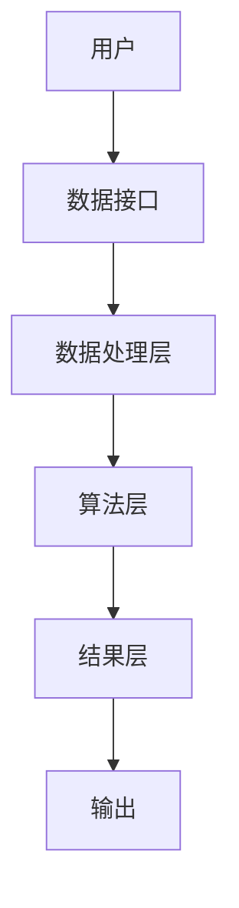

                 


# 费雪的行业趋势分析：未来增长的关键

## 关键词：行业趋势分析、费雪模型、增长动力、投资策略、趋势预测

## 摘要：费雪的行业趋势分析是一种通过研究行业周期、市场需求和技术进步等核心要素，预测未来增长的关键方法。本文详细阐述了费雪分析法的背景、原理、算法、数学模型、系统架构及实战应用，帮助读者掌握这一强大的分析工具。

---

### 第一部分: 费雪行业趋势分析基础

#### 第1章: 费雪行业趋势分析概述

##### 1.1 费雪行业趋势分析的背景与意义

- 1.1.1 行业趋势分析的基本概念  
行业趋势分析是研究行业未来发展方向和变化趋势的过程，旨在为企业和投资者提供战略决策依据。

- 1.1.2 费雪分析法的核心思想  
费雪分析法强调长期趋势的重要性，认为行业的发展受周期性、技术进步和宏观经济环境的影响。

- 1.1.3 行业趋势分析的重要性  
通过分析行业趋势，投资者可以识别高增长行业，避免低效投资。

##### 1.2 费雪分析法的起源与发展

- 1.2.1 费雪分析法的起源  
费雪分析法由乔治·费雪提出，基于长期趋势预测投资机会。

- 1.2.2 费雪分析法的发展历程  
从早期的理论提出到现代的应用，费雪分析法不断演变，融入新技术和数据。

- 1.2.3 费雪分析法的现代应用  
在大数据和人工智能的支持下，费雪分析法更加精准和高效。

##### 1.3 费雪分析法的核心要素

- 1.3.1 行业周期性  
行业的兴衰周期影响投资决策。

- 1.3.2 市场需求  
消费者需求变化是行业趋势的核心驱动力。

- 1.3.3 技术进步  
技术创新推动行业变革和增长。

- 1.3.4 宏观经济环境  
宏观经济政策和经济周期对行业趋势有重要影响。

---

### 第二部分: 费雪分析法的核心概念与联系

#### 第2章: 费雪分析法的核心概念

##### 2.1 费雪分析法的原理与框架

- 2.1.1 费雪分析法的基本原理  
通过分析行业周期、市场需求、技术进步和宏观经济环境，预测行业趋势。

- 2.1.2 核心概念与联系  
使用对比表格和ER图展示各核心概念的属性和关系。

##### 2.2 核心概念的对比分析

- 对比表格：技术驱动和需求驱动的行业趋势
| 属性 | 技术驱动 | 需求驱动 |
|------|----------|----------|
| 主导因素 | 技术创新 | 消费者需求 |
| 适用行业 | 高 tech 行业 | 消费品行业 |
| 预测难度 | 高 | 中 |

- ER图：展示行业、趋势、因素的关系

---

### 第三部分: 费雪分析法的算法原理

#### 第3章: 费雪分析法的算法实现

##### 3.1 算法原理

- 3.1.1 数据预处理  
清洗数据，提取关键指标。

- 3.1.2 趋势预测  
使用时间序列模型预测行业趋势。

##### 3.2 算法流程图

```mermaid
graph TD
    A[开始] -> B[数据预处理]
    B -> C[提取关键指标]
    C -> D[选择模型]
    D -> E[训练模型]
    E -> F[预测趋势]
    F -> G[结束]
```

##### 3.3 Python代码实现

```python
import pandas as pd
import numpy as np
from sklearn.linear_model import LinearRegression

# 数据预处理
data = pd.read_csv('industry_data.csv')
data = data.dropna()

# 提取关键指标
features = ['GDP', '技术创新指数', '市场需求']
target = '行业趋势'

X = data[features]
y = data[target]

# 训练模型
model = LinearRegression()
model.fit(X, y)

# 预测趋势
y_pred = model.predict(X)
```

---

### 第四部分: 数学模型与公式

#### 第4章: 费雪分析法的数学模型

##### 4.1 趋势预测模型

- 线性回归模型
$$ y = \beta_0 + \beta_1x + \epsilon $$

##### 4.2 指数平滑模型

$$ \hat{y}_t = \alpha y_{t-1} + (1-\alpha)\hat{y}_{t-1} $$

---

### 第五部分: 系统分析与架构设计

#### 第5章: 系统架构设计

##### 5.1 系统功能设计

- 领域模型：行业、趋势、因素


##### 5.2 系统架构设计



---

### 第六部分: 项目实战

#### 第6章: 项目实战

##### 6.1 环境安装

- 安装Python和相关库：`pip install pandas scikit-learn`

##### 6.2 核心代码实现

```python
def predict_trend(data, features, target):
    from sklearn.model_selection import train_test_split
    X_train, X_test, y_train, y_test = train_test_split(data[features], data[target], test_size=0.2)
    model = LinearRegression()
    model.fit(X_train, y_train)
    y_pred = model.predict(X_test)
    return y_pred
```

##### 6.3 实战案例分析

- 分析某行业数据，预测未来趋势，解读结果。

---

### 第七部分: 总结与建议

#### 第7章: 总结与建议

##### 7.1 本章小结

- 费雪分析法提供了一套系统的方法，帮助投资者识别行业趋势，抓住增长机会。

##### 7.2 最佳实践 tips

- 结合多模型进行预测，提高准确性。
- 定期更新数据，保持模型的有效性。

##### 7.3 注意事项

- 数据质量影响结果，需谨慎处理。
- 结合行业专家意见，避免误判。

##### 7.4 拓展阅读

- 推荐阅读《股票作手回忆录》和《投资学原理》。

---

作者：AI天才研究院 & 禅与计算机程序设计艺术

