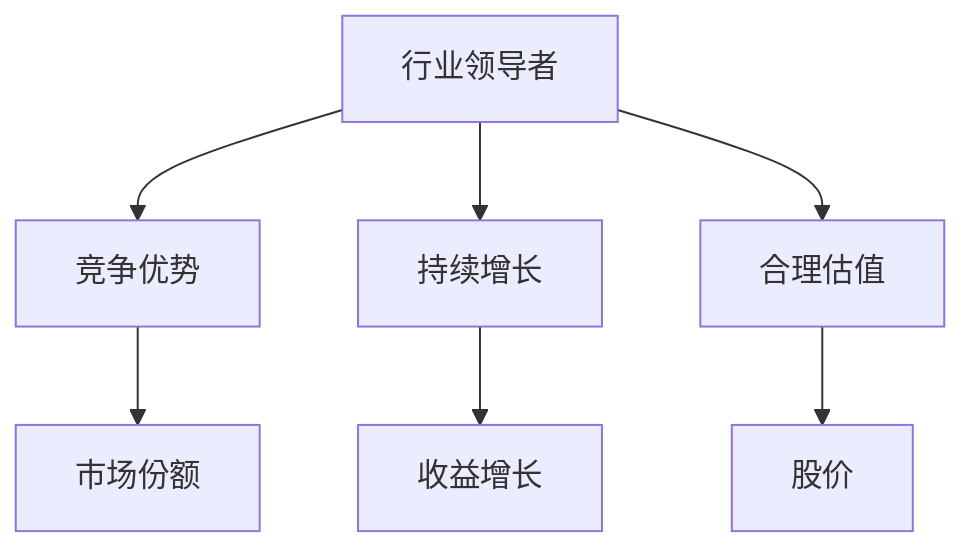
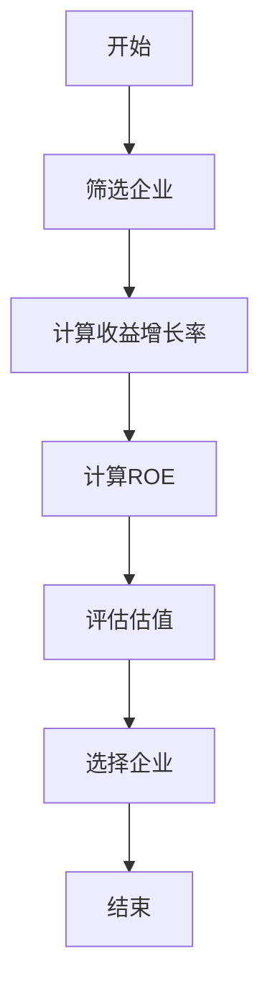
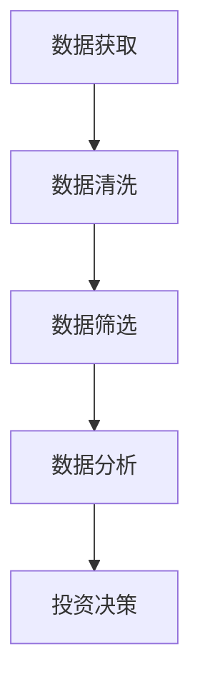

                 


# 费雪的行业领导者投资法

> 关键词：菲利普·费雪，投资法，行业领导者，成长股，投资策略，投资哲学

> 摘要：本文深入探讨了菲利普·费雪的行业领导者投资法，从其核心理念、数学模型、算法原理到实际应用，全面解析这一经典投资方法。通过详细分析，帮助读者理解如何通过识别行业领导者来构建投资组合，并提供实际案例和Python代码实现。

---

## 第一部分: 费雪的行业领导者投资法概述

### 第1章: 费雪投资法的背景与核心理念

#### 1.1 投资界的先驱者：菲利普·费雪

- **1.1.1 费雪的生平简介**

菲利普·费雪（Philip Fisher）是20世纪最著名的价值投资者之一，被誉为“成长股之父”。他出生于1903年，逝世于2004年，他的投资理念对现代投资理论产生了深远影响。

- **1.1.2 费雪在投资领域的贡献**

费雪是早期的成长股投资者，他的投资理念强调寻找那些能够持续增长的企业，并长期持有。他的投资策略与传统价值投资不同，更注重企业的成长潜力和竞争优势。

- **1.1.3 费雪投资法的核心思想**

费雪的投资法的核心思想是：投资于那些具有强大竞争优势、能够持续增长的企业，并长期持有。他认为，投资的目的是通过持有优质企业的股权，分享其成长带来的收益。

#### 1.2 费雪投资法的基本概念

- **1.2.1 行业领导者的定义**

行业领导者是指在某个行业中占据领先地位，具有强大的竞争优势和市场份额，能够持续增长的企业。

- **1.2.2 费雪投资法的核心要素**

- 高质量的企业：具有强大的竞争优势和壁垒。
- 持续的增长潜力：能够持续提高收益和市场份额。
- 合理的估值：价格相对于内在价值合理。

- **1.2.3 费雪投资法与传统投资方法的区别**

传统投资方法（如价值投资）更注重价格与价值的匹配，而费雪投资法则更注重企业的成长性和竞争优势。

#### 1.3 费雪投资法的理论基础

- **1.3.1 投资学的基本原理**

投资学的基本原理包括资产定价、风险与收益的关系、市场的有效性和效率等。

- **1.3.2 费雪对投资学的独特贡献**

费雪提出成长股投资理论，强调企业的成长性和竞争优势的重要性。

- **1.3.3 费雪投资法的哲学基础**

费雪的投资哲学强调长期持有优质企业，通过分享其成长来实现投资收益。

---

### 第2章: 费雪投资法的核心概念与联系

#### 2.1 费雪投资法的核心概念

- **2.1.1 行业领导者的定义与特征**

行业领导者具有以下特征：

- 在行业中占据领先地位。
- 具有强大的竞争优势和壁垒。
- 具有持续的增长潜力。
- 具有良好的管理团队和企业文化。

- **2.1.2 费雪投资法的三大支柱**

- 高质量的企业：具有强大的竞争优势和壁垒。
- 持续的增长潜力：能够持续提高收益和市场份额。
- 合理的估值：价格相对于内在价值合理。

- **2.1.3 费雪投资法的数学模型**

费雪投资法的数学模型主要是对企业成长性和估值的量化分析。例如：

- 收益增长率（ROE）：$$ROE = \frac{净利润}{平均股东权益}$$
- 收益增长率：$$收益增长率 = \frac{当年收益 - 上年收益}{上年收益}$$

#### 2.2 费雪投资法的核心概念对比

- **2.2.1 费雪投资法与其他投资方法的对比**

| 投资方法 | 核心理念 | 重点 | 适用场景 |
|----------|----------|------|----------|
| 价值投资 | 价格与价值匹配 | 低估值 | 稳定收益 |
| 成长股投资 | 企业成长性 | 高增长 | 长期增长 |
| 费雪投资法 | 行业领导者 | 竞争优势与成长 | 高质量企业 |

- **2.2.2 费雪投资法的优缺点分析**

优点：

- 强调企业质量，注重长期增长。
- 适合长期投资者。

缺点：

- 对市场波动不敏感，短期可能表现不佳。
- 需要较高的选股能力。

- **2.2.3 费雪投资法的适用场景**

费雪投资法适用于长期投资者，尤其是那些愿意投资于优质企业的投资者。

#### 2.3 费雪投资法的实体关系图



---

### 第3章: 费雪投资法的算法原理

#### 3.1 费雪投资法的算法概述

费雪投资法的算法主要是筛选出具有竞争优势和持续增长潜力的企业。以下是算法的步骤：

1. 筛选具有强大竞争优势的企业。
2. 计算企业的收益增长率和ROE。
3. 评估企业的估值是否合理。
4. 选择符合条件的企业进行投资。



#### 3.2 费雪投资法的数学模型

- 收益增长率的计算公式：

$$收益增长率 = \frac{当年收益 - 上年收益}{上年收益}$$

- ROE的计算公式：

$$ROE = \frac{净利润}{平均股东权益}$$

#### 3.3 费雪投资法的Python代码实现

```python
import pandas as pd

# 假设我们有一个包含企业财务数据的DataFrame
data = {
    '公司': ['公司A', '公司B', '公司C'],
    '净利润': [100, 150, 200],
    '股东权益': [500, 600, 700],
    '收益增长率': [0.2, 0.15, 0.25]
}

df = pd.DataFrame(data)

# 计算ROE
df['ROE'] = df['净利润'] / df['股东权益'].apply(lambda x: x / 2)

# 筛选ROE大于0.1且收益增长率大于0.2的企业
selected = df[(df['ROE'] > 0.1) & (df['收益增长率'] > 0.2)]

print(selected)
```

---

### 第4章: 费雪投资法的系统分析与架构设计

#### 4.1 费雪投资法的系统分析

- **系统结构**：包括数据获取、筛选、评估和投资决策四个模块。
- **系统功能**：数据获取、筛选、评估、投资决策。
- **系统性能**：高效性、准确性。

#### 4.2 费雪投资法的架构设计



---

### 第5章: 费雪投资法的项目实战

#### 5.1 费雪投资法的环境安装

- **安装Python和相关库**：如pandas、numpy、scipy等。
- **数据源**：股票数据可以从Yahoo Finance获取。

#### 5.2 费雪投资法的代码实现

```python
import pandas as pd
import yfinance as yf

# 下载苹果的股票数据
apple = yf.download('AAPL', start='2020-01-01', end='2023-01-01')

# 计算收益增长率
apple['收益增长率'] = apple['Close'].pct_change()

# 计算ROE
# 假设净利润和股东权益的数据已经获取
# 这里仅展示计算ROE的逻辑
```

#### 5.3 费雪投资法的案例分析

以苹果公司为例，分析其是否符合费雪投资法的筛选标准：

- **竞争优势**：苹果在科技行业具有强大的竞争优势。
- **收益增长率**：苹果近年来的收益增长率保持在较高水平。
- **ROE**：苹果的ROE也较高，表明其盈利能力强。

因此，苹果符合费雪投资法的筛选标准，可以作为投资标的。

#### 5.4 费雪投资法的项目总结

通过实际案例分析，我们验证了费雪投资法的有效性。在实际操作中，投资者需要结合市场环境和企业实际情况，灵活应用这一方法。

---

## 第六章: 费雪投资法的最佳实践与注意事项

### 6.1 最佳实践

- **长期持有**：费雪投资法强调长期持有优质企业。
- **持续学习**：市场环境不断变化，投资者需要持续学习和调整策略。

### 6.2 小结

费雪投资法是一种以企业质量为核心的投资方法，适用于长期投资者。通过识别行业领导者，投资者可以分享优质企业的成长收益。

### 6.3 注意事项

- **市场波动**：短期市场波动可能影响股价，但长期来看，优质企业仍能表现良好。
- **风险管理**：投资者需要合理配置资产，分散投资风险。

### 6.4 拓展阅读

- 《彼得·林奇的投资哲学》
- 《价值投资：从格雷厄姆到巴菲特》

---

作者：AI天才研究院/AI Genius Institute & 禅与计算机程序设计艺术/Zen And The Art of Computer Programming

