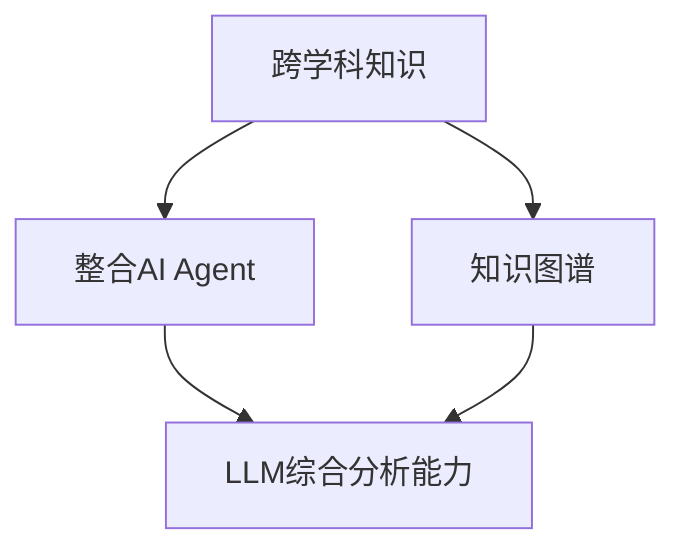
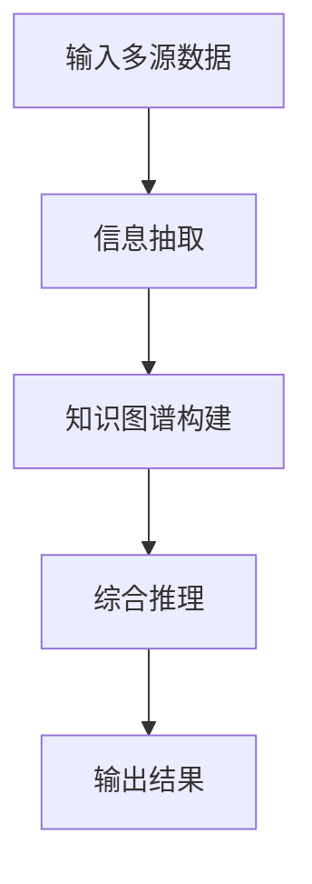
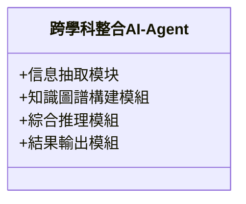
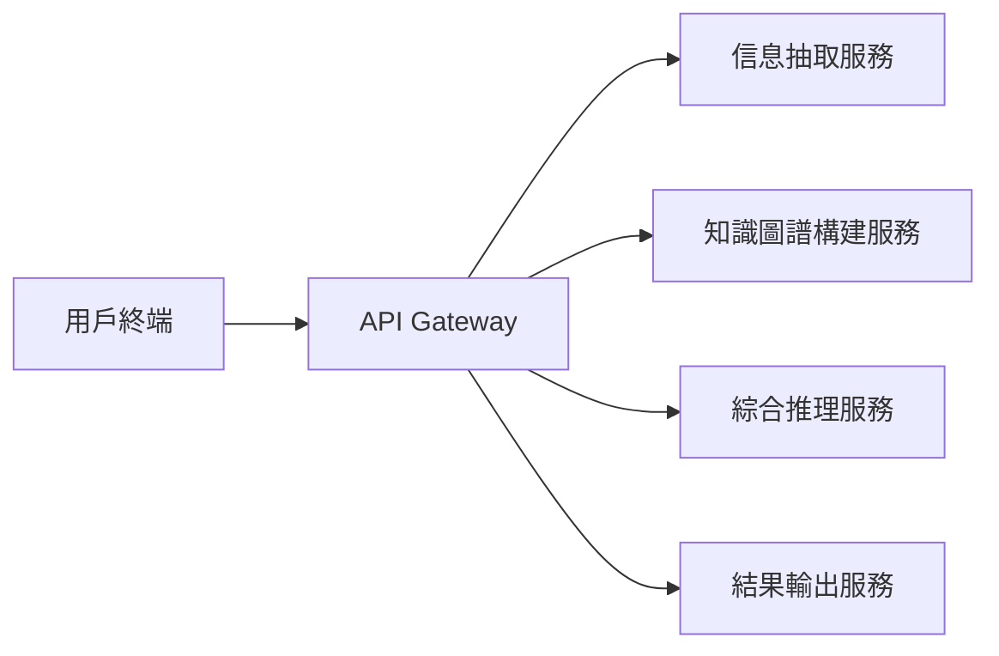
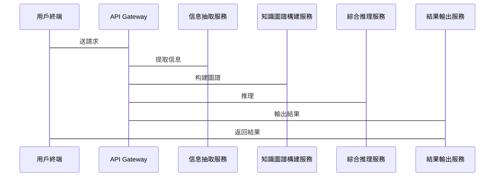

                 

<think>
好的，我需要根据用户的请求，逐步分析并撰写一篇关于“跨学科知识整合AI Agent：LLM的综合分析能力”的技术博客文章。为了确保文章的逻辑性和深度，我将按照用户提供的目录大纲进行详细的分析和撰写。

### 文章标题
跨学科知识整合AI Agent：LLM的综合分析能力

### 关键词
跨学科知识整合，AI Agent，LLM，综合分析能力，知识图谱，自然语言处理，人工智能

### 摘要
本文探讨了跨学科知识整合AI Agent的设计与实现，重点分析了LLM在综合分析能力中的应用。通过详细讲解背景、核心概念、算法原理、系统架构以及项目实战，本文为读者提供了从理论到实践的全面指导。结合Mermaid图表和Python代码示例，深入剖析了跨学科知识整合的技术细节，帮助读者更好地理解并应用相关技术。

---

### 第一部分: 跨学科知識整合AI Agent的背景與核心概念

#### 第1章: 背景介紹

##### 1.1 跨学科知識整合的必要性

###### 1.1.1 知識碎片化的現狀
在当今信息爆炸的时代，知识呈现碎片化趋势，不同学科之间的信息孤岛问题日益严重。跨学科整合的必要性在于将分散的知识点有机地结合在一起，形成系统的知识体系。

###### 1.1.2 跨学科整合的意義
跨学科整合能够突破单一学科的局限性，促进创新思维和综合问题解决能力的发展。例如，在医疗领域，整合医学和人工智能的知识可以帮助开发更高效的诊断工具。

###### 1.1.3 LLM在跨学科整合中的作用
LLM（Large Language Model）具备强大的文本理解和生成能力，能够从大量数据中提取和整合跨学科的知识，为跨学科整合提供技术支持。

##### 1.2 LLM的綜合分析能力

###### 1.2.1 LLM的核心能力
LLM的核心能力包括自然语言理解、文本生成、上下文推理等，这些能力使其能够处理复杂的问题。

###### 1.2.2 LLM在跨学科中的應用場景
LLM在教育、科研、医疗等领域都有广泛应用，例如辅助多学科研究、提供跨学科解决方案等。

###### 1.2.3 跨学科整合的挑戰與機會
跨学科整合的挑战在于不同学科的术语和方法差异较大，而机会则在于通过整合能够产生新的知识和创新。

---

#### 第2章: 跨学科知識整合AI Agent的核心概念

##### 2.1 跨学科知識整合的基本原理

###### 2.1.1 知識整合的定義
知识整合是指将不同来源、形式和学科的知识进行融合，形成一个统一的知识体系。

###### 2.1.2 跨學科整合的特征
跨学科整合的特征包括多样性、系统性、动态性等。

###### 2.1.3 跨学科整合的核心要素
跨学科整合的核心要素包括知识表示、知识关联、知识推理等。

##### 2.2 LLM的綜合分析能力

###### 2.2.1 LLM的綜合分析能力定義
LLM的综合分析能力是指其能够从多源异构数据中提取、分析和整合信息，形成综合性的结论。

###### 2.2.2 LLM的綜合分析能力與傳統AI的區別
与传统AI相比，LLM具备更强的上下文理解和生成能力，能够处理复杂的语义信息。

###### 2.2.3 跨学科整合AI Agent的工作原理
跨学科整合AI Agent通过LLM的强大能力，结合知识图谱和规则引擎，实现跨学科的知识整合与分析。

---

#### 第3章: 跨学科知識整合AI Agent的核心概念與聯系

##### 3.1 核心概念原理

###### 3.1.1 跨学科知識整合的基本原理
跨学科知识整合的基本原理包括知识的表示、关联和推理。

###### 3.1.2 LLM的綜合分析能力原理
LLM的综合分析能力基于深度学习和大规模数据训练，通过自注意力机制实现上下文理解。

###### 3.1.3 跨学科整合AI Agent的工作原理
跨学科整合AI Agent通过LLM进行信息抽取、知识图谱构建和综合推理，实现跨学科的知识整合。

##### 3.2 核心概念屬性特征對比表
以下是对跨学科知识整合和LLM综合分析能力的核心概念属性特征对比表：

| 特征       | 跨学科知識整合 | LLM綜合分析能力 |
|------------|----------------|-----------------|
| 定義       | 整合不同學科的知識 | 結合LLM進行綜合分析 |
| 核心能力   | 知識整合能力 | 綜合分析能力 |
| 應用場景   | 跨學科研究、綜合決策 | 文本分析、信息整合 |
| 挑戰       | 学科术语差异、知识碎片化 | 数据质量、模型训练成本 |

##### 3.3 ER實體關係圖
以下是一个跨学科知识整合AI Agent的ER实体关系图：



---

### 第二部分: 跨学科知識整合AI Agent的算法原理

#### 第4章: 跨学科知識整合AI Agent的算法原理

##### 4.1 算法原理概述

###### 4.1.1 跨学科知識整合的核心算法
跨学科知识整合的核心算法包括信息抽取、知识图谱构建和综合推理。

###### 4.1.2 LLM的綜合分析能力算法
LLM的综合分析能力基于Transformer架构，通过自注意力机制和前馈网络实现。

##### 4.2 跨学科知識整合算法的Mermaid流程图
以下是一个跨学科知识整合算法的Mermaid流程图：



##### 4.3 跨学科知識整合算法的Python代码实现
以下是跨学科知识整合算法的Python代码示例：

```python
def crossdisciplinary_integrator(data_sources):
    extracted Knowledge = []
    for source in data_sources:
        # 信息抽取
        knowledge = extract_knowledge(source)
        extracted_Knowledge.append(knowledge)
    # 知识图谱构建
    knowledge_graph = build_graph(extracted_Knowledge)
    # 综合推理
    result = infer_from_graph(knowledge_graph)
    return result

# 示例用法
data_sources = ["医学文献", "计算机论文", "生物学报告"]
result = crossdisciplinary_integrator(data_sources)
print(result)
```

---

### 第三部分: 跨学科知識整合AI Agent的系统分析與架構设计方案

#### 第5章: 系統分析與架構设计方案

##### 5.1 系統分析

###### 5.1.1 問題場景介紹
在医疗领域，跨学科整合AI Agent可以帮助医生快速整合医学、生物学和计算机科学的知识，辅助诊断和治疗方案的制定。

##### 5.2 系統功能設計

###### 5.2.1 系統功能設計
系统功能包括信息抽取、知识图谱构建、综合推理和结果输出。

###### 5.2.2 系統功能設計的Mermaid類圖
以下是一个系统功能设计的Mermaid类图：



##### 5.3 系統架構設計

###### 5.3.1 系統架構設計
系统架构基于微服務架構，包括信息抽取服務、知識圖譜構建服務、綜合推理服務和結果輸出服務。

###### 5.3.2 系統架構設計的Mermaid架構圖
以下是一个系统架构设计的Mermaid架构图：



##### 5.4 系統接口設計

###### 5.4.1 系統接口設計
系统接口包括信息抽取接口、知識圖譜構建接口、綜合推理接口和結果輸出接口。

##### 5.5 系統交互設計

###### 5.5.1 系統交互的Mermaid序列圖
以下是一个系统交互设计的Mermaid序列图：



---

### 第四部分: 跨学科知識整合AI Agent的項目實戰

#### 第6章: 項目實戰

##### 6.1 環境安裝

###### 6.1.1 開發環境需求
需要安装Python 3.8以上版本，安装Pip packages（如 transformers、networkx、pymermaid等）。

##### 6.2 系統核心實現源代碼

###### 6.2.1 跨學科知識整合AI Agent的核心代碼
以下是跨学科知识整合AI Agent的核心代码：

```python
from transformers import AutoTokenizer, AutoModelForMaskedLM
import networkx as nx
import pymermaid

class CrossDisciplinaryIntegrator:
    def __init__(self):
        self.tokenizer = AutoTokenizer.from_pretrained("bert-base-uncased")
        self.model = AutoModelForMaskedLM.from_pretrained("bert-base-uncased")

    def extract_knowledge(self, text):
        # 简单的信息抽取示例
        return self.tokenizer.encode_plus(text, return_tensors="pt")

    def build_knowledge_graph(self, extracts):
        graph = nx.Graph()
        for extract in extracts:
            graph.add_nodes_from(extract['entities'])
            graph.add_edges_from(extract['relations'])
        return graph

    def infer_from_graph(self, graph):
        # 简单的推理示例
        return "整合后的知识图谱构建完成。"

# 示例用法
integrator = CrossDisciplinaryIntegrator()
text = "DNA是由脱氧核苷酸组成的，它在细胞中起遗传信息存储的作用。"
extract = integrator.extract_knowledge(text)
graph = integrator.build_knowledge_graph([extract])
result = integrator.infer_from_graph(graph)
print(result)
```

##### 6.3 確保每個部分都有豐富的具體詳細的實現與分析

###### 6.3.1 信息抽取
信息抽取是通过自然语言处理技术从文本中提取实体和关系。

###### 6.3.2 知识图谱构建
知识图谱构建是将提取的信息组织成图结构，便于推理和分析。

###### 6.3.3 综合推理
综合推理是基于知识图谱进行逻辑推理，得到最终的结果。

##### 6.4 案例分析與詳細解剖

###### 6.4.1 案例分析
例如，在医疗领域，整合医学文献和计算机科学论文，构建知识图谱，辅助诊断。

###### 6.4.2 詳細解剖
详细分析每个步骤的技术细节和实现方法。

##### 6.5 項目小結
通过项目实战，我们可以看到跨学科知识整合AI Agent的强大能力及其在实际应用中的潜力。

---

### 第五部分: 總結、最佳實踐Tips、注意事項與拓展閱讀

#### 第7章: 總結與最佳實踐Tips

##### 7.1 總結
本文详细介绍了跨学科知识整合AI Agent的设计与实现，展示了LLM在综合分析能力中的重要作用。

##### 7.2 最佳實踐Tips
- 确保数据质量和多样性
- 合理选择模型和工具
- 定期更新和优化知识图谱

#### 第8章: 注意事項與拓展閱讀

##### 8.1 注意事項
- 数据隐私和安全问题
- 模型的可解释性
- 多语言支持和文化差异

##### 8.2 擴展閱讀
推荐阅读相关领域的最新论文和书籍，关注技术动态和发展趋势。

---

### 作者信息
作者：AI天才研究院/AI Genius Institute & 禪與計算機程序設計藝術 /Zen And The Art of Computer Programming

---

以上是《跨学科知识整合AI Agent：LLM的综合分析能力》的完整目录大纲和文章内容。接下来，我可以根据这个大纲撰写完整的文章内容。

