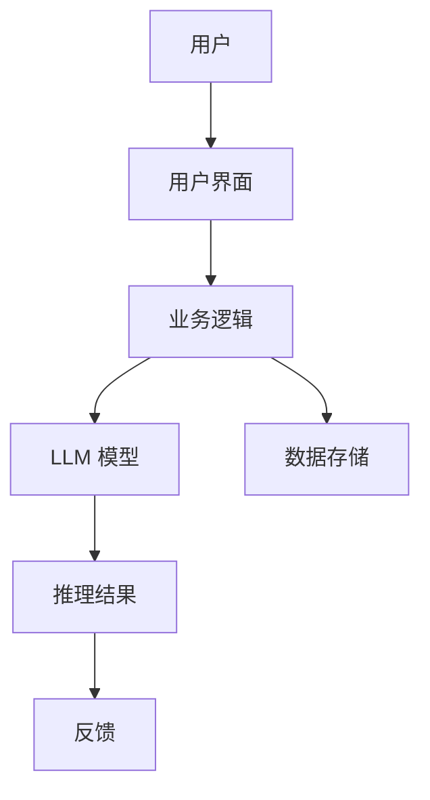

                 


# 跨平台 AI Agent：LLM 在多种终端设备上的部署

## 关键词
跨平台 AI Agent, LLM, 大语言模型, 多终端部署, 跨平台适配, 通信协议

## 摘要
随着人工智能技术的快速发展，跨平台 AI Agent 的应用越来越广泛。大型语言模型（LLM）在多种终端设备上的部署需求日益增长，如何实现跨平台的高效部署成为技术挑战。本文从背景介绍、核心概念、算法原理、系统架构设计到项目实战，全面解析跨平台 AI Agent 的部署过程，结合实际案例和最佳实践，为读者提供深入的技术指导。

---

## 第一部分: 跨平台 AI Agent 的背景与概念

### 第1章: 跨平台 AI Agent 概述

#### 1.1 AI Agent 的基本概念
- **什么是 AI Agent**  
  AI Agent 是一种智能体，能够感知环境、自主决策并执行任务。它具备学习、推理、规划和自适应能力。
  
- **AI Agent 的核心特征**  
  | 特征 | 描述 |  
  |------|------|  
  | 感知能力 | 通过传感器或数据源获取环境信息。 |  
  | 决策能力 | 基于感知信息做出最优决策。 |  
  | 执行能力 | 执行决策并反馈结果。 |  
  | 自适应能力 | 根据反馈调整行为策略。 |

- **跨平台 AI Agent 的定义与特点**  
  跨平台 AI Agent 是一种能够在多种操作系统、硬件设备和应用场景下运行的智能体，具备高度的兼容性和灵活性。

#### 1.2 LLM 的技术背景
- **大语言模型的定义与技术原理**  
  LLM 是一种基于深度学习的自然语言处理模型，通过大量数据训练，能够理解并生成人类语言。其核心是Transformer架构，包含编码器和解码器。

- **LLM 在 AI Agent 中的作用**  
  LLM 作为 AI Agent 的核心模块，负责处理自然语言输入，生成智能回答，执行任务指令。

- **跨平台部署的必要性**  
  随着移动设备、物联网设备的普及，AI Agent 需要支持多种终端设备，包括手机、平板、智能音箱、机器人等。

#### 1.3 跨平台部署的背景与意义
- **当前 AI 技术的跨平台需求**  
  随着技术的发展，AI 应用场景越来越多样化，需要支持多种操作系统（如 Android、iOS、Windows、Linux）和硬件架构（如 x86、ARM）。

- **跨平台部署的挑战与机遇**  
  - **挑战**：不同平台的硬件性能、API 接口、资源限制差异大。  
  - **机遇**：跨平台部署能够提升模型的通用性和适用性，降低开发成本。

- **跨平台部署对企业的价值**  
  跨平台部署能够降低开发和维护成本，提升用户体验，拓展市场。

---

### 第2章: 跨平台 AI Agent 的核心概念

#### 2.1 跨平台 AI Agent 的核心要素
- **跨平台适配性**  
  能够在不同平台上运行，支持多种硬件架构和操作系统。

- **LLM 的模型适配**  
  根据目标平台的性能和资源限制，优化模型参数和计算效率。

- **跨平台通信机制**  
  设备之间的数据交互和协同工作，支持多种通信协议和接口。

#### 2.2 跨平台部署的关键技术
- **API 调用与协议适配**  
  不同平台之间的 API 接口可能差异较大，需要进行适配和封装。

- **模型轻量化与优化**  
  通过模型压缩、剪枝、蒸馏等技术，降低模型体积和计算复杂度，适配低性能设备。

- **多设备协同与数据同步**  
  设备之间需要协同工作，保持数据一致性，支持实时通信和任务调度。

---

### 第3章: 跨平台 AI Agent 的核心原理

#### 3.1 跨平台通信原理
- **跨平台通信协议的选择**  
  根据应用场景选择合适的协议，如 HTTP、WebSocket、MQTT 等，确保兼容性和性能。

- **跨平台消息传递机制**  
  使用中间件或适配层实现不同平台之间的消息传递，支持异构环境下的通信。

- **跨平台数据同步策略**  
  通过数据一致性算法，确保多设备之间的数据同步和版本控制。

#### 3.2 LLM 在不同终端设备上的适配
- **不同设备的硬件特性分析**  
  - **移动设备**：计算能力有限，注重资源优化。  
  - **PC 端**：计算能力较强，适合复杂任务。  
  - **物联网设备**：资源受限，需要轻量化的模型。  

- **LLM 在不同设备上的性能优化**  
  - **模型蒸馏**：将大模型的知识迁移到小模型，减少计算量。  
  - **量化技术**：降低模型权重的精度，减少存储和计算开销。  

- **跨设备模型共享与协作**  
  设备之间共享模型参数，协同训练和推理，提升整体性能。

---

### 第4章: 跨平台 AI Agent 的系统架构设计

#### 4.1 跨平台 AI Agent 的系统架构
- **分层架构设计**  
  从下至上分别为数据层、服务层、应用层，各层之间通过接口通信。

- **组件化设计**  
  每个功能模块独立开发，便于维护和扩展。

- **高可用性设计**  
  通过冗余和负载均衡，确保系统在故障情况下仍能正常运行。

#### 4.2 系统功能设计
- **用户交互层**  
  提供友好的用户界面，支持多平台的交互方式。

- **业务逻辑层**  
  处理用户的请求，调用 LLM 进行推理，返回结果。

- **数据存储与管理**  
  统一管理设备数据，支持分布式存储和数据同步。

#### 4.3 系统架构图（Mermaid）



---

### 第5章: 跨平台 AI Agent 的算法原理

#### 5.1 跨平台通信算法
- **跨平台消息传递算法**  
  使用队列和栈结构实现消息的高效传递。

- **跨平台数据同步算法**  
  通过一致性哈希和分布式锁实现数据的高效同步。

- **跨平台任务调度算法**  
  使用负载均衡算法，合理分配任务到不同设备。

#### 5.2 LLM 在跨平台部署中的优化算法
- **模型压缩与剪枝算法**  
  通过剪枝算法移除模型中冗余的参数，降低模型体积。

- **模型蒸馏与迁移学习**  
  使用小模型模仿大模型的行为，提升小模型的性能。

- **跨平台性能优化算法**  
  根据设备的硬件特性，动态调整模型的计算参数。

---

### 第6章: 跨平台 AI Agent 的项目实战

#### 6.1 项目环境搭建
- **开发工具**：选择支持多平台开发的工具，如 VS Code、Android Studio、Xcode。
- **依赖管理**：使用包管理工具（如 npm、pip）管理第三方库。

#### 6.2 核心代码实现
- **API 接口适配**  
  ```python
  def adapt_api(api_type):
      if api_type == 'android':
          return AndroidAPI()
      elif api_type == 'ios':
          return IOSAPI()
      else:
          return DefaultAPI()
  ```

- **模型优化与部署**  
  使用模型压缩工具（如 TensorFlow Lite）将大模型优化为适合移动设备的轻量模型。

#### 6.3 案例分析与解读
- **实际案例**：在手机、平板和机器人上部署同一 LLM 模型，展示不同设备上的性能差异和优化效果。

---

## 第七部分: 最佳实践与总结

### 7.1 最佳实践
- **模块化设计**：将系统划分为独立模块，便于维护和扩展。
- **性能监控**：实时监控设备性能，动态调整模型参数。
- **容错设计**：设计容错机制，确保系统在异常情况下仍能部分功能正常运行。

### 7.2 小结
跨平台 AI Agent 的部署需要综合考虑硬件性能、通信协议、模型优化等多个方面。通过合理的系统设计和算法优化，可以实现高效、稳定的跨平台部署。

### 7.3 注意事项
- **设备兼容性**：确保设备间的通信和数据交互兼容。
- **性能调优**：根据设备特性进行针对性优化。
- **安全问题**：确保跨平台通信的安全性，防止数据泄露。

### 7.4 拓展阅读
- 推荐书籍：《深度学习》、《分布式系统：概念与设计》。
- 推荐博客：技术博客平台上的相关文章。

---

## 作者信息

作者：AI天才研究院/AI Genius Institute & 禅与计算机程序设计艺术 /Zen And The Art of Computer Programming

---

以上是文章的完整结构和内容，希望对您有所帮助！

