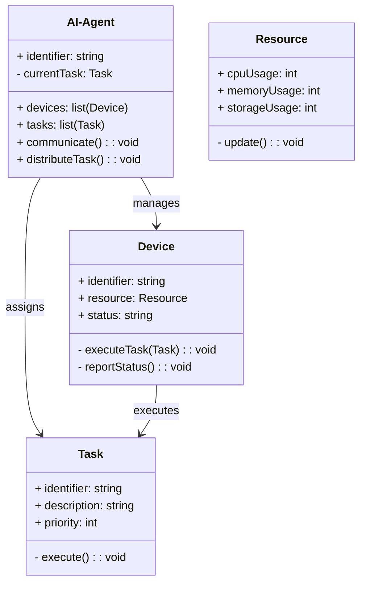
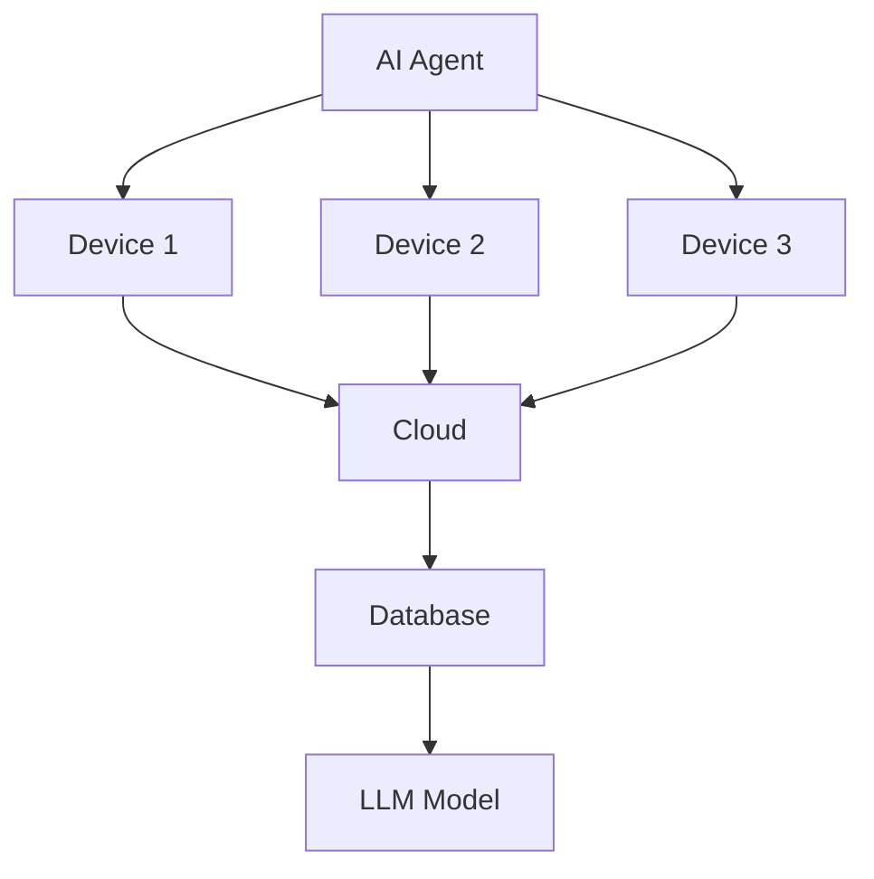
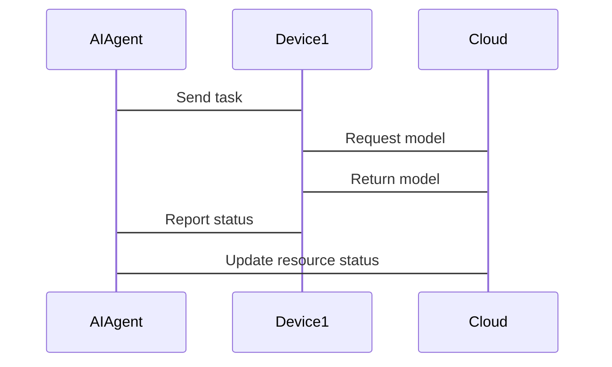

                 


# 跨平台AI Agent：LLM在多种终端设备上的部署

## 关键词：跨平台AI Agent, 大语言模型, LLM, 终端设备部署, 跨平台通信, 資源优化, 设备协作

## 摘要：  
随着人工智能技术的快速发展，大语言模型（LLM）在各种终端设备上的部署变得越来越重要。然而，不同终端设备的硬件能力和计算资源存在显著差异，这给跨平台部署带来了巨大挑战。本文将深入探讨如何在多种终端设备上高效部署LLM，分析跨平台通信机制、资源优化策略以及设备间的协作机制。通过详细的技术分析和实际案例，本文将为读者提供一套完整的跨平台AI Agent部署方案，帮助开发者更好地理解和实现这一目标。

---

# 第一部分: 跨平台AI Agent背景与基础

## 第1章: 跨平台AI Agent概述

### 1.1 AI Agent的基本概念

#### 1.1.1 AI Agent的定义与特点  
AI Agent（智能体）是指能够感知环境、自主决策并执行任务的智能系统。它具有以下特点：  
- **自主性**：能够独立决策，无需外部干预。  
- **反应性**：能够实时感知环境并做出响应。  
- **目标导向性**：以实现特定目标为导向。  
- **社交能力**：能够与其他设备或系统进行协作。  

#### 1.1.2 跨平台AI Agent的定义  
跨平台AI Agent是指能够在多种不同平台（如手机、智能手表、智能家居等）上运行，并能够通过跨平台通信机制实现设备间协作的智能系统。  

#### 1.1.3 跨平台AI Agent的应用场景  
跨平台AI Agent的应用场景包括但不限于：  
- 智能助手：为用户提供跨设备的统一交互入口。  
- 智慧城市：实现不同设备间的协同工作。  
- 智能家居：通过跨设备协作提升用户体验。  

### 1.2 大语言模型（LLM）的基本原理

#### 1.2.1 LLM的定义与核心特点  
大语言模型是一种基于深度学习的自然语言处理模型，具有以下核心特点：  
- **大规模训练数据**：通常使用数百万条训练数据。  
- **多任务能力**：能够处理多种语言任务（如翻译、问答、文本生成等）。  
- **上下文理解能力**：能够理解上下文并生成连贯的回复。  

#### 1.2.2 LLM在AI Agent中的作用  
LLM作为AI Agent的核心模块，负责处理用户的自然语言输入并生成相应的输出。它能够为AI Agent提供强大的自然语言理解与生成能力，使其能够与用户进行自然交互。  

#### 1.2.3 跨平台部署的必要性  
随着AI Agent的应用场景不断扩展，其需要在多种终端设备上运行。由于不同设备的硬件能力和计算资源存在差异，LLM的跨平台部署变得尤为重要。  

### 1.3 跨平台部署的挑战与机遇

#### 1.3.1 跨平台部署的核心问题  
- **硬件差异**：不同设备的CPU、GPU等硬件性能存在差异。  
- **计算资源限制**：部分设备的计算能力有限，难以直接运行大型模型。  
- **通信延迟**：设备间的通信可能存在延迟，影响实时性。  

#### 1.3.2 跨平台部署的潜在优势  
- **统一交互入口**：用户可以通过一个入口与多个设备进行交互。  
- **设备协作能力**：通过设备间的协作，实现更复杂的任务。  
- **资源优化**：通过合理分配任务，提高整体系统的资源利用率。  

#### 1.3.3 当前技术发展现状  
当前，跨平台AI Agent的部署技术正在快速发展，但仍然面临诸多挑战。例如，如何在资源受限的设备上高效运行LLM，如何实现设备间的高效通信等。

---

## 第2章: 跨平台AI Agent的核心技术

### 2.1 跨平台通信机制

#### 2.1.1 跨平台通信的定义  
跨平台通信是指不同设备之间通过某种协议或接口进行数据交换的过程。  

#### 2.1.2 跨平台通信的主要技术  
- **WebSocket**：支持实时双向通信。  
- **HTTP/HTTPS**：适用于非实时的请求-响应模式。  
- **蓝牙/ZigBee**：适用于短距离设备间的通信。  

#### 2.1.3 跨平台通信的实现方式  
通过统一的API接口或协议，实现设备间的通信。例如，使用WebSocket协议建立设备间的实时通信通道。

### 2.2 跨平台资源管理与优化

#### 2.2.1 資源分配的基本原则  
- **负载均衡**：合理分配任务，避免资源浪费。  
- **优先级调度**：根据任务的重要性进行优先级排序。  
- **动态调整**：根据实时资源使用情况动态调整任务分配。  

#### 2.2.2 資源优化的核心算法  
- **模型压缩算法**：如蒸馏、剪枝等，用于降低模型的计算需求。  
- **量化算法**：通过降低模型参数的精度，减少模型的存储和计算开销。  

#### 2.2.3 資源监控与动态调整  
通过实时监控设备的资源使用情况，动态调整任务分配策略，以提高资源利用率。

### 2.3 跨平台设备间的协作机制

#### 2.3.1 设备协作的基本概念  
设备协作是指不同设备之间协同工作，共同完成某个任务的过程。  

#### 2.3.2 设备协作的实现方式  
- **任务分配**：根据设备的能力和资源情况，将任务分解并分配给不同的设备。  
- **结果汇总**：将各设备的处理结果汇总，形成最终的输出。  

#### 2.3.3 设备协作的优化策略  
- **任务并行化**：通过并行处理提高任务执行效率。  
- **设备间负载均衡**：避免设备过载或资源浪费。  

---

## 第3章: 跨平台AI Agent的算法原理

### 3.1 跨平台模型压缩算法

#### 3.1.1 模型压缩的基本原理  
模型压缩是指通过各种技术手段，减少模型的大小和计算需求，使其能够在资源受限的设备上运行。  

#### 3.1.2 常用模型压缩算法对比  
| 算法名称 | 核心思想 | 优缺点 |  
|----------|----------|--------|  
| 蒸馏 | 知识蒸馏，通过教师模型指导学生模型学习 | 适用于大规模模型压缩，但需要教师模型 |  
| 剪枝 | 删除模型中冗余的参数或神经元 | 简单易实现，但可能导致模型精度下降 |  
| 量化 | 降低模型参数的精度（如从浮点数降到整数） | 显著减少模型大小，但可能影响模型精度 |  

#### 3.1.3 模型压缩的实现步骤  
1. 选择合适的模型压缩算法。  
2. 对原始模型进行压缩，生成压缩后的模型。  
3. 在目标设备上部署压缩后的模型，验证其性能。  

### 3.2 跨平台模型优化算法

#### 3.2.1 模型优化的核心思想  
模型优化是指通过对模型结构和参数进行调整，使其在目标设备上运行得更快、更高效。  

#### 3.2.2 常用模型优化算法分析  
- **层聚类**：将相似的层进行聚类，减少计算量。  
- **网络剪枝**：去除模型中冗余的层或节点。  

#### 3.2.3 模型优化的实现细节  
通过自动化的工具（如TensorFlow Lite、ONNX）对模型进行优化，生成适合目标设备运行的模型文件。  

### 3.3 跨平台模型推理算法

#### 3.3.1 模型推理的基本流程  
1. 接收用户的输入（如自然语言查询）。  
2. 对输入进行预处理（如分词、向量化）。  
3. 将处理后的输入输入到模型中进行推理。  
4. 根据推理结果生成输出。  

#### 3.3.2 模型推理的优化策略  
- **本地推理**：在设备本地完成推理，减少网络延迟。  
- **云边协同推理**：将部分推理任务Offload到云端，减轻设备负担。  

---

## 第4章: 跨平台AI Agent的系统架构与设计

### 4.1 系统功能设计

#### 4.1.1 领域模型（领域模型类图）  


#### 4.1.2 系统架构设计（架构图）  


#### 4.1.3 系统交互设计（交互序列图）  


---

## 第5章: 跨平台AI Agent的项目实战

### 5.1 环境配置

#### 5.1.1 系统环境  
- 操作系统：Linux/Windows/MacOS  
- 依赖库：Python 3.8+, TensorFlow, PyTorch, FastAPI  

#### 5.1.2 安装依赖  
```bash
pip install numpy
pip install pandas
pip install tensorflow
pip install torch
pip install fastapi
pip install uvicorn
```

### 5.2 核心实现

#### 5.2.1 模型压缩与优化  
```python
import torch
from torch import nn

class Llama(nn.Module):
    def __init__(self):
        super().__init__()
        self.layers = nn.Sequential(...)
    
    def forward(self, x):
        return x

# 压缩模型
compressed_model = compress_model(llama_model, method='quantization')
```

#### 5.2.2 跨平台通信接口  
```python
import websockets
import asyncio

async def agent_communication():
    async with websockets.connect("ws://localhost:8000") as websocket:
        await websocket.send("Hello")
        response = await websocket.recv()
        print(response)
```

#### 5.2.3 资源监控与动态调整  
```python
import psutil

def get_cpu_usage():
    return psutil.cpu_percent()

def get_memory_usage():
    return psutil.virtual_memory().percent
```

### 5.3 测试与优化

#### 5.3.1 性能测试  
- **推理速度**：每秒处理的请求量。  
- **资源占用**：CPU、内存的使用情况。  
- **通信延迟**：设备间的通信时延。  

#### 5.3.2 优化策略  
- **模型量化**：进一步降低模型的精度，减少计算开销。  
- **任务并行**：通过多线程或多进程提高任务处理效率。  

### 5.4 实际案例分析

#### 5.4.1 案例背景  
在智能家居场景中，AI Agent需要协调多个设备（如智能音箱、智能灯泡、智能门锁）共同完成任务。  

#### 5.4.2 案例实现  
1. 用户通过智能音箱发送指令（如“打开灯泡”）。  
2. AI Agent接收指令并分配任务给智能灯泡。  
3. 智能灯泡执行任务并反馈结果。  
4. AI Agent汇总结果并返回给用户。  

#### 5.4.3 案例优化  
通过动态调整任务分配策略，提高设备间的协作效率，减少通信延迟。  

### 5.5 项目小结  
通过本项目，我们验证了跨平台AI Agent的可行性，并总结了实际部署中需要注意的关键点。

---

## 第6章: 跨平台AI Agent的最佳实践

### 6.1 关键技术总结  
- **模型压缩与优化**：确保模型能够在资源受限的设备上运行。  
- **跨平台通信**：选择合适的通信协议，保证设备间的高效协作。  
- **资源监控与动态调整**：实时监控设备资源使用情况，动态调整任务分配策略。  

### 6.2 开发注意事项  
- **设备兼容性**：确保模型能够在不同设备上运行。  
- **通信可靠性**：设计可靠的通信机制，避免数据丢失。  
- **安全性**：保护用户数据和设备的安全性。  

### 6.3 未来发展方向  
- **模型轻量化**：进一步优化模型，使其在更多设备上运行。  
- **多模态交互**：支持更丰富的交互方式（如语音、视觉等）。  
- **边缘计算**：结合边缘计算技术，提高系统的实时性和响应速度。  

---

## 作者：AI天才研究院/AI Genius Institute & 禅与计算机程序设计艺术 /Zen And The Art of Computer Programming

---

以上是《跨平台AI Agent：LLM在多种终端设备上的部署》的技术博客文章大纲及部分具体内容，您可以根据需要进一步扩展各章节的内容，确保每个部分都详尽具体，逻辑清晰，条理分明。

