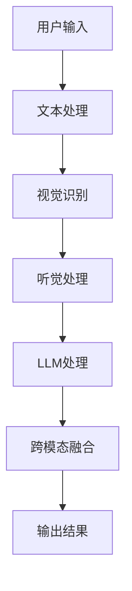
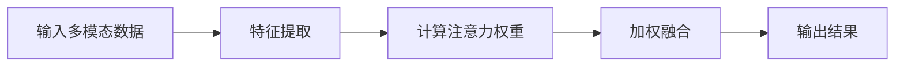
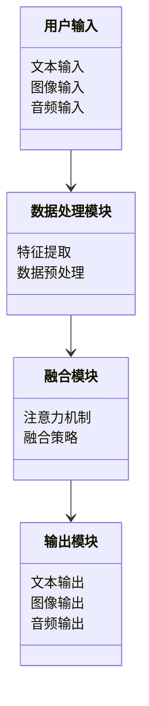
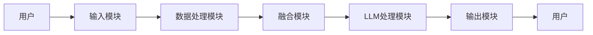
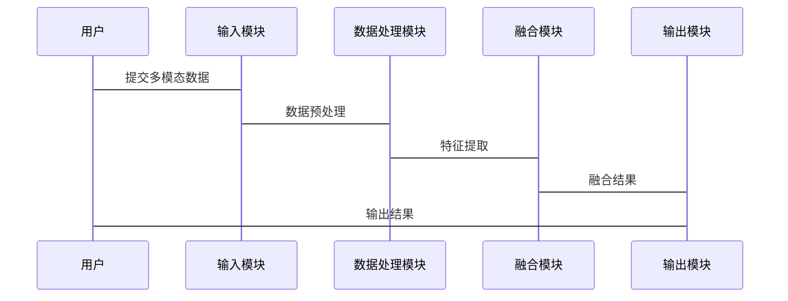

                 


# 跨模态AI Agent：LLM与多种感知输入的融合

> **关键词**：跨模态AI Agent、大语言模型、多模态数据、感知输入融合、注意力机制、系统架构

> **摘要**：本文详细探讨了跨模态AI Agent的构建，重点分析了如何将大语言模型（LLM）与多种感知输入（如视觉、听觉）进行融合。文章从背景、原理到系统架构，再到项目实战，全面解析了跨模态AI Agent的设计与实现，旨在为读者提供系统化的知识和实践指导。

---

## 第一部分: 跨模态AI Agent概述

### 第1章: 跨模态AI Agent的背景与概念

#### 1.1 跨模态AI Agent的定义与背景

- **1.1.1 多模态数据的定义与特点**
  多模态数据是指结合了多种感知方式（如视觉、听觉、触觉等）的数据形式。与单一模态数据相比，多模态数据能够提供更全面的信息，帮助AI系统更好地理解复杂场景。例如，图像和文本的结合可以提供丰富的语境信息。

- **1.1.2 大语言模型（LLM）的崛起**
  大语言模型（如GPT-3、GPT-4）凭借其强大的文本生成和理解能力，已经在自然语言处理领域取得了显著成果。然而，LLM在处理多模态数据时仍面临挑战，需要与其他感知输入进行深度融合。

- **1.1.3 跨模态AI Agent的提出背景**
  随着AI技术的发展，单模态处理已无法满足复杂场景的需求。跨模态AI Agent通过整合多种感知数据，能够更全面地理解用户需求，提供更智能的服务。

- **1.1.4 跨模态AI Agent的应用场景与边界**
  跨模态AI Agent广泛应用于智能客服、机器人控制、增强现实等领域。其边界在于如何高效地处理多模态数据，并在不同场景下实现最优的融合策略。

#### 1.2 跨模态AI Agent的核心问题

- **1.2.1 多模态数据的融合挑战**
  多模态数据的异质性（不同模态数据的特征差异）和模态间的关联性问题需要有效的处理方法。

- **1.2.2 LLM与感知输入的结合难点**
  LLM需要处理不同模态的数据，同时保持其强大的文本处理能力，这在技术上是一个难点。

- **1.2.3 跨模态交互的实现路径**
  跨模态交互需要设计高效的融合策略，确保不同模态的数据能够协同工作，提升系统的智能性。

#### 1.3 跨模态AI Agent的核心概念与联系

- **1.3.1 多模态数据的特征对比表格**

| 模态类型 | 特征描述 | 示例 |
|----------|----------|------|
| 视觉     | 图像、颜色、形状 | 图片、视频 |
| 听觉     | 音频、语调、音量 | 音频文件、语音 |
| 文本     | 字符、语义、上下文 | 文本、对话 |
| 触觉     | 压力、温度、材质 | 触感反馈 |

- **1.3.2 跨模态融合的ER实体关系图（Mermaid流程图）**



---

### 第2章: 跨模态AI Agent的核心原理

#### 2.1 跨模态数据的处理与融合

- **2.1.1 多模态数据的编码与解码**
  不同模态的数据需要转换为统一的表示形式（如向量）以便进行融合。编码器负责将原始数据转换为向量，解码器则将向量转换回目标形式。

- **2.1.2 跨模态注意力机制的原理**
  注意力机制能够捕捉不同模态数据之间的关联性，帮助模型关注重要的信息。跨模态注意力机制可以同时处理多个模态的数据，提升融合效果。

- **2.1.3 多模态编码器的设计与实现**
  多模态编码器需要将多种数据类型编码为统一的向量形式，例如使用深度学习模型（如Transformer）进行特征提取。

#### 2.2 LLM在跨模态融合中的作用

- **2.2.1 LLM的输入处理方式**
  LLM可以接收多种模态的数据，例如将图像描述为文本输入模型进行处理。

- **2.2.2 LLM的跨模态推理能力**
  LLM能够根据多模态输入进行推理，生成符合上下文的输出。

- **2.2.3 LLM与感知输入的协同工作**
  LLM与感知输入模块协同工作，确保模型能够理解和处理多种数据类型。

#### 2.3 跨模态AI Agent的算法原理

- **2.3.1 多模态编码器的数学模型**

$$
\text{编码器}：x \rightarrow z \\
z = f(x; \theta)
$$

- **2.3.2 跨模态注意力机制的实现流程（Mermaid流程图）**



- **2.3.3 跨模态融合的数学公式**

$$
\text{融合}：z_1, z_2 \rightarrow y \\
y = g(z_1, z_2; \phi)
$$

---

### 第3章: 跨模态AI Agent的系统架构

#### 3.1 系统功能设计

- **3.1.1 功能模块**
  - 数据输入模块：接收多种模态的数据。
  - 数据处理模块：对数据进行预处理和特征提取。
  - 融合模块：将不同模态的特征进行融合。
  - 输出模块：生成最终的输出结果。

- **3.1.2 领域模型（Mermaid类图）**



#### 3.2 系统架构设计

- **3.2.1 系统架构图（Mermaid架构图）**



- **3.2.2 系统接口设计**
  - 输入接口：接收多种模态的数据。
  - 输出接口：生成融合后的输出结果。

- **3.2.3 系统交互流程（Mermaid序列图）**



---

### 第4章: 跨模态AI Agent的项目实战

#### 4.1 环境安装与配置

- 需要安装的库：TensorFlow、PyTorch、OpenCV、SpeechRecognition等。

#### 4.2 核心代码实现

- **数据预处理代码**

```python
import cv2
import speech_recognition as sr

def preprocess_image(image_path):
    # 读取图像并进行预处理
    image = cv2.imread(image_path)
    # 转换为RGB格式
    image = cv2.cvtColor(image, cv2.COLOR_BGR2RGB)
    return image

def preprocess_audio(audio_path):
    # 读取音频并进行预处理
    r = sr.Recognizer()
    audio_file = sr.AudioFile(audio_path)
    with audio_file as source:
        audio = r.record(source)
    return audio
```

- **模型训练代码**

```python
import torch
import torch.nn as nn

class MultiModalEncoder(nn.Module):
    def __init__(self, image_features, text_features):
        super().__init__()
        self.image_encoder = nn.Linear(image_features, 512)
        self.text_encoder = nn.Linear(text_features, 512)
        self.attention = nn.MultiheadAttention(512, 8)

    def forward(self, image_features, text_features):
        image_embed = self.image_encoder(image_features)
        text_embed = self.text_encoder(text_features)
        combined = torch.cat([image_embed, text_embed], dim=1)
        output, _ = self.attention(combined.permute(1, 0, 2), combined.permute(1, 0, 2), combined.permute(1, 0, 2))
        return output.permute(1, 0, 2)
```

- **模型推理代码**

```python
def inference(model, image_input, text_input):
    with torch.no_grad():
        encoded_output = model(image_input, text_input)
        return encoded_output
```

#### 4.3 实际案例分析

- 案例1：图像和文本的融合
  - 输入：一张图片和一段描述文字。
  - 输出：生成与图片和文字相关的文本描述。

- 案例2：音频和文本的融合
  - 输入：一段音频和一段文本。
  - 输出：生成与音频内容相关的文本描述。

---

### 第5章: 总结与展望

#### 5.1 总结

- 跨模态AI Agent通过融合多种感知输入，能够更全面地理解和处理复杂场景。
- 本文详细介绍了其背景、原理、系统架构和实现方法，为读者提供了系统的知识体系。

#### 5.2 未来研究方向

- 更高效的跨模态融合方法。
- 多模态数据的实时处理与优化。
- 跨模态AI Agent在更多领域的应用探索。

#### 5.3 小结与注意事项

- 在实际应用中，需要注意数据质量、模型调优和隐私保护等问题。
- 未来的研究可以结合边缘计算和分布式系统，提升跨模态AI Agent的实时性和可扩展性。

---

## 附录: 相关资源

- **相关论文**
  - "多模态数据融合的方法研究"。
  - "基于大语言模型的跨模态交互系统设计"。

- **工具与库**
  - OpenCV：用于图像处理。
  - SpeechRecognition：用于语音识别。
  - Hugging Face：用于大语言模型的调用。

---

## 作者

**作者：AI天才研究院/AI Genius Institute & 禅与计算机程序设计艺术 /Zen And The Art of Computer Programming**

---

**本文内容遵循MIT License协议，可自由分享与传播，转载请注明出处。**

