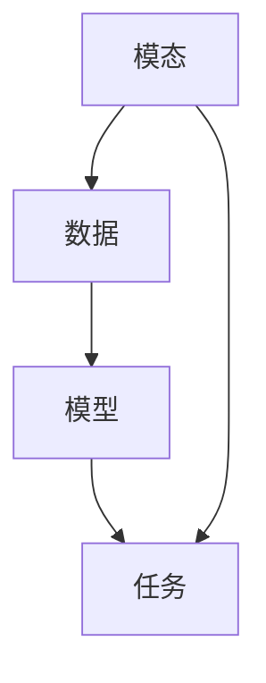
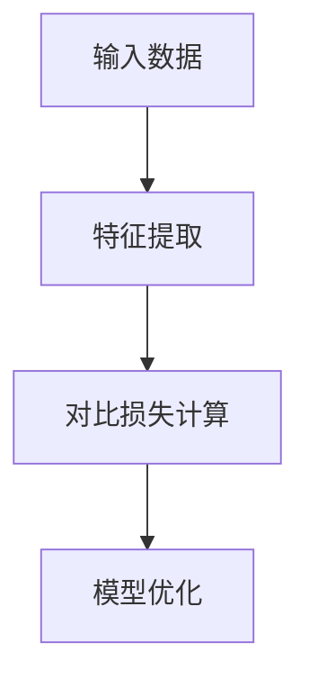
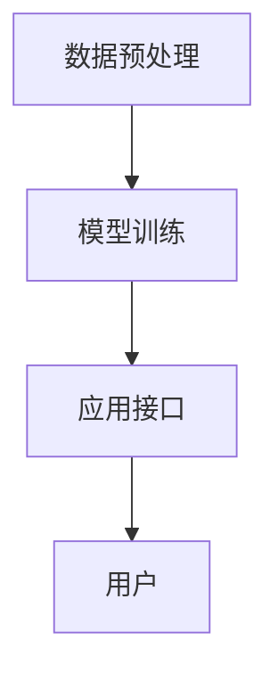
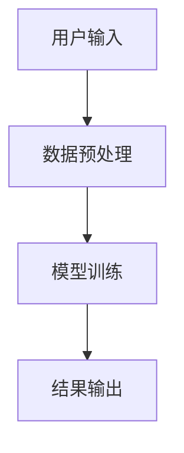
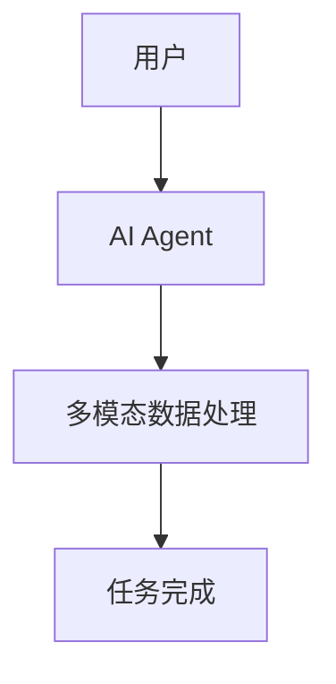

                 


# 跨模态学习：增强AI Agent的理解能力

> 关键词：跨模态学习, AI Agent, 多模态数据, 对比学习, 自监督学习

> 摘要：跨模态学习是一种结合多种数据模态（如文本、图像、语音等）进行信息处理和理解的技术，旨在提升AI Agent的多维感知和决策能力。本文从跨模态学习的核心概念、算法原理、系统设计到项目实战，全面探讨如何通过跨模态学习增强AI Agent的理解能力，帮助读者从理论到实践掌握这一前沿技术。

---

# 第一部分：跨模态学习的背景与概述

## 第1章：跨模态学习的背景与目标

### 1.1 多模态数据的定义与背景

#### 1.1.1 多模态数据的定义
多模态数据是指由多种数据类型组成的复杂数据集合，例如文本、图像、语音、视频、传感器数据等。这些数据类型各自承载不同的信息，通过结合多种模态，可以更全面地理解现实世界。

#### 1.1.2 跨模态学习的背景
在人工智能领域，传统的单模态学习方法在处理单一类型数据时表现出色，但在面对多模态数据时往往力不从心。跨模态学习通过结合多种数据类型，能够显著提升模型的理解能力，使其在复杂场景中表现更优。

#### 1.1.3 跨模态学习的目标与意义
跨模态学习的目标是通过不同数据模态之间的关联性，提升AI Agent的感知和决策能力。其意义在于能够处理更复杂的问题，提供更丰富的交互体验，并在多个领域（如医疗、教育、交通等）展现出广泛的应用潜力。

### 1.2 跨模态学习的应用场景

#### 1.2.1 计算机视觉与自然语言处理的结合
跨模态学习在计算机视觉和自然语言处理的结合中发挥重要作用，例如图像描述生成、文本到图像生成等任务。

#### 1.2.2 联网AI Agent的多模态交互需求
联网AI Agent需要通过多种模态进行交互，例如通过语音识别用户的指令，结合视觉数据进行场景理解，从而提供更智能的服务。

#### 1.2.3 跨模态学习在智能助手中的应用
在智能助手领域，跨模态学习能够帮助AI更好地理解用户的意图，结合语音、文本、图像等多种数据，提供更精准的服务。

---

## 第2章：跨模态学习的核心概念与联系

### 2.1 跨模态学习的核心概念

#### 2.1.1 模态的定义与分类
- **模态**：数据的类型，例如文本、图像、语音、视频等。
- **分类**：
  - 单模态：单一数据类型。
  - 多模态：多种数据类型结合。

#### 2.1.2 跨模态对齐的定义与方法
- **跨模态对齐**：将不同模态的数据进行关联和对齐，例如将图像中的物体与文本描述对齐。
- **方法**：
  - 特征对齐：基于特征的对齐方法。
  - 语义对齐：基于语义的对齐方法。

#### 2.1.3 跨模态学习的三要素
- 数据：多模态数据输入。
- 模型：跨模态学习模型。
- 任务：目标任务，如分类、生成等。

### 2.2 跨模态学习的模型对比

#### 2.2.1 多模态编码器模型
- **多模态编码器**：将多种模态的数据编码为统一的表示。
- **对比**：
  | 模型 | 输入 | 输出 | 优势 |
  |------|------|------|------|
  | 单模态编码器 | 单一模态数据 | 编码表示 | 简单，适合单一任务 |
  | 多模态编码器 | 多种模态数据 | 统一编码表示 | 跨模态关联，适合多任务 |

#### 2.2.2 对比学习模型
- **对比学习**：通过对比不同模态的数据，学习其相似性或差异性。
- **对比学习与自监督学习**：
  | 方法 | 特点 |
  |------|------|
  | 对比学习 | 基于对比损失函数，学习数据的相似性 |
  | 自监督学习 | 利用数据本身的信息，无监督学习 |

#### 2.2.3 联结模型与生成模型
- **联结模型**：将不同模态的数据进行关联，例如图像到文本的生成。
- **生成模型**：如GAN、VAE等，用于跨模态数据的生成。

### 2.3 跨模态学习的ER实体关系图



---

# 第二部分：跨模态学习的算法原理

## 第3章：跨模态学习的算法原理

### 3.1 多模态编码器

#### 3.1.1 多模态编码器的结构
- **输入**：多种模态的数据。
- **输出**：统一的编码表示。

#### 3.1.2 多模态编码器的训练方法
- **联合训练**：同时训练多种模态的数据。
- **预训练**：利用大规模数据进行预训练，提升编码能力。

#### 3.1.3 多模态编码器的优缺点
- **优点**：能够结合多种模态的信息。
- **缺点**：训练复杂，计算资源需求高。

### 3.2 对比学习

#### 3.2.1 对比学习的基本原理
- **对比损失函数**：衡量不同模态数据的相似性。

#### 3.2.2 跨模态对比学习的流程


#### 3.2.3 对比学习的损失函数
$$ L = \frac{1}{N} \sum_{i=1}^{N} \log\left(\frac{e^{sim(x_i, y_i)}}{e^{sim(x_i, y_j)}}\right) $$

### 3.3 自监督学习

#### 3.3.1 自监督学习的定义
- **自监督学习**：利用数据本身的信息，无监督学习。

#### 3.3.2 跨模态自监督学习的实现
- **实现流程**：
  1. 输入多模态数据。
  2. 提取特征。
  3. 对比学习，更新模型。

#### 3.3.3 自监督学习的优势
- **优点**：不需要大量标注数据，能够利用未标注数据进行学习。

---

## 第4章：跨模态学习的数学模型与公式

### 4.1 多模态编码器的数学模型

#### 4.1.1 多模态编码器的输入输出公式
- **输入**：$x_1, x_2, ..., x_n$（多种模态数据）。
- **输出**：$z$（统一编码表示）。

$$ z = f(x_1, x_2, ..., x_n) $$

#### 4.1.2 多模态编码器的损失函数
$$ L = \frac{1}{n} \sum_{i=1}^{n} (y_i - z_i)^2 $$

### 4.2 对比学习的数学模型

#### 4.2.1 对比学习的损失函数
$$ L_{contrast} = -\frac{1}{n} \sum_{i=1}^{n} \log\left(\frac{e^{sim(z_i, z_j)}}{e^{sim(z_i, z_k)}}\right) $$

---

# 第三部分：跨模态学习的系统架构设计

## 第5章：跨模态学习的系统架构设计

### 5.1 项目需求与功能设计

#### 5.1.1 项目需求
- **目标**：设计一个跨模态学习系统，用于提升AI Agent的理解能力。

#### 5.1.2 系统功能设计
- **模块划分**：
  - 数据预处理模块。
  - 模型训练模块。
  - 应用接口模块。

### 5.2 系统架构设计

#### 5.2.1 系统架构图


### 5.3 系统接口设计

#### 5.3.1 接口定义
- **输入接口**：多模态数据输入。
- **输出接口**：统一编码表示输出。

#### 5.3.2 接口交互流程


### 5.4 系统交互设计

#### 5.4.1 交互流程图


---

## 第6章：跨模态学习的项目实战

### 6.1 环境安装与配置

#### 6.1.1 安装Python环境
- **推荐版本**：Python 3.8+。

#### 6.1.2 安装必要的库
```bash
pip install numpy torch matplotlib
```

### 6.2 系统核心实现

#### 6.2.1 多模态编码器实现
```python
import torch

class MultimodalEncoder(torch.nn.Module):
    def __init__(self, input_dim, hidden_dim):
        super().__init__()
        self.encoder = torch.nn.Sequential(
            torch.nn.Linear(input_dim, hidden_dim),
            torch.nn.ReLU(),
            torch.nn.Linear(hidden_dim, hidden_dim)
        )
    
    def forward(self, x):
        return self.encoder(x)
```

#### 6.2.2 对比学习实现
```python
def contrastive_loss(z1, z2, temperature=0.1):
    z = torch.cat([z1, z2], dim=0)
    similarity = torch.mm(z1, z2.T) / temperature
    loss = torch.nn.CrossEntropyLoss()(similarity, torch.arange(len(z1)).long().cuda())
    return loss
```

### 6.3 案例分析与总结

#### 6.3.1 案例分析
- **案例**：图像与文本的跨模态对齐。
- **实现步骤**：
  1. 数据预处理。
  2. 模型训练。
  3. 任务应用。

#### 6.3.2 项目总结
- **总结**：跨模态学习能够显著提升AI Agent的理解能力，通过多模态数据的结合，实现更智能的服务。

---

## 第7章：跨模态学习的最佳实践与小结

### 7.1 最佳实践

#### 7.1.1 数据预处理
- **建议**：对数据进行标准化和归一化处理。

#### 7.1.2 模型优化
- **建议**：采用预训练和微调策略，提升模型性能。

### 7.2 小结

#### 7.2.1 跨模态学习的核心
- **核心**：多模态数据的结合与对齐。

#### 7.2.2 跨模态学习的未来
- **未来**：在更多领域中的应用，如元宇宙、智能城市等。

### 7.3 注意事项

#### 7.3.1 数据隐私
- **注意**：在处理多模态数据时，需注意数据隐私和安全。

#### 7.3.2 模型选择
- **建议**：根据具体任务选择合适的模型和算法。

### 7.4 拓展阅读

#### 7.4.1 推荐书籍
- 《Deep Learning》—— Ian Goodfellow。

#### 7.4.2 推荐论文
- "Contrastive Learning of Joint Audio-Visual Representations"。

---

# 作者：AI天才研究院/AI Genius Institute & 禅与计算机程序设计艺术 /Zen And The Art of Computer Programming

