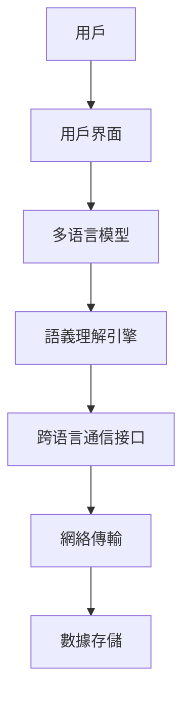

                 


# 跨語言AI Agent的開發挑戰與解決方案

> **關鍵詞**: 跨語言AI Agent, 多語言模型, 語義理解, 跨語言通信, AI-Agent架構, 語言模型訓練

> **摘 要**: 跨語言AI Agent的開發涉及多語言模型訓練、語義理解對齊和跨語言通信協議設計等關鍵技術。本文將從背景、核心概念、算法原理、系統架構到實際應用全方位探討跨語言AI Agent的挑戰與解決方案，為從事該領域研究與開發的人員提供系統性指導致導。

---

# 第一部分: 跨語言AI Agent的背景與核心概念

## 第1章: 跨語言AI Agent的問題背景與需求

### 1.1 跨語言AI Agent的問題背景

#### 1.1.1 多語言環境下的AI Agent需求

在當今全球化的數字世界中，跨語言交互的需求日益增長。企業、政府機構以及個人用戶都需要在不同語言的環境中進行高效溝通和信息處理。傳統的AI Agent通常局限于單一語言，無法有效應對多語言場景下的任務需求。例如，一個AI Assistant需要能夠處理來自不同國家用戶的查詢，每個用戶可能使用不同的語言，這就需要AI Agent具備跨語言處理能力。

#### 1.1.2 跨語言溝通的挑戰與機會

跨語言溝通的核心挑戰在於不同語言之間的語義差異。例如，相同的概念在不同語言中可能有不同的表達方式，或者某些文化背景下的含義截然不同。這些挑戰不僅影響用戶體驗，還可能導致信息誤傳。然而，這些挑戰也為AI Agent的發展提供了機會。通過跨語言處理技術，AI Agent可以在更廣泛的應用場景中提供服務，例如國際貿易、多語言客服支持、跨國團隊合作等。

#### 1.1.3 AI Agent在跨語言場景中的應用場景

- **國際貿易**: 支持多語言的AI Agent可以在跨國商務談判中提供實時翻譯和信息分析。
- **多語言客服支持**: 企業可以使用跨語言AI Agent來為全球用戶提供一致的客服體驗。
- **跨國團隊合作**: 研發團隊分散在不同國家，AI Agent可以幫助團隊成員之間實現高效的跨語言溝通。
- **教育**: 跨語言AI Tutor可以為學習多語言的用戶提供個性化的學習支持。

### 1.2 跨語言AI Agent的核心目標

#### 1.2.1 提供多語言支持的能力

AI Agent需要能夠理解和生成多種語言的文本，並根據上下文選擇最合適的表達方式。

#### 1.2.2 解決跨語言溝通中的語義障礙

AI Agent需要具備跨語言語義對齊的能力，能夠將不同語言中的概念對應起來，確保信息在轉換過程中不丟失或扭曲。

#### 1.2.3 支持多文化背景下的交互需求

不同文化背景下的溝通方式有所不同，AI Agent需要能夠適應這些差異，提供符合目標用戶文化習慣的交互方式。

---

## 第2章: 跨語言AI Agent的核心概念與定義

### 2.1 跨語言AI Agent的定義

#### 2.1.1 AI Agent的基本概念

AI Agent是指具有智能能力，能夠感知環境並采取行動以實現特定目標的軟件實體。它可以自主決策，並根據用戶需求和環境信息進行交互。

#### 2.1.2 跨語言能力的定義

跨語言能力是指AI Agent能夠理解和處理多種語言信息，並在不同語言之間進行信息轉換和語義對齊的能力。

#### 2.1.3 跨語言AI Agent的特征

- **多語言處理能力**: 能夠理解和生成多種語言的文本。
- **語義對齊能力**: 能夠將不同語言中的語義進行對應和匹配。
- **跨文化適應性**: 能夠在不同文化背景下提供合適的交互方式。

### 2.2 跨語言AI Agent的核心要素

#### 2.2.1 多語言模型

多語言模型是跨語言AI Agent的核心技術之一，用於實現多語言文本的理解和生成。常見的多語言模型包括_mBART、_Multi-GPT等。

#### 2.2.2 語義理解引擎

語義理解引擎負責將不同語言的文本轉換為統一的語義表示，並進行語義對齊。

#### 2.2.3 跨語言通信接口

跨語言通信接口是AI Agent與用戶或其他系統交互的界面，支持多種語言的請求接收和響應生成。

### 2.3 跨語言AI Agent的邊界與外延

#### 2.3.1 跨語言能力的邊界

AI Agent的跨語言能力主要限於文本處理，目前還無法完美解決多语言之間的文化差異和語境差異。

#### 2.3.2 跨語言AI Agent的應用範圍

跨語言AI Agent主要應用於需要跨語言交互的場景，例如國際商務、多語言客服、跨國團隊合作等。

#### 2.3.3 跨語言能力的局限性

目前，跨语言AI Agent在處理方言、文化含義等方面還存在一定的局限性，這需要進一步的研究和改進。

---

## 第3章: 跨語言AI Agent的核心原理與實現路徑

### 3.1 跨語言AI Agent的核心原理

#### 3.1.1 多語言模型的選擇與訓練

選擇適當的多語言模型並对其进行訓練是實現跨语言AI Agent的第一步。常見的多語言模型包括_mBART、_Multi-GPT等。

#### 3.1.2 語義理解的跨語言對齊

語義理解的跨語言對齊是通過將不同語言的文本映射到統一的語義空間來實現的。

#### 3.1.3 跨語言通信的協議與接口

跨语言通信的協議與接口用於確保AI Agent能夠與不同語言的用戶或系統進行有效交互。

### 3.2 跨語言AI Agent的實現路徑

#### 3.2.1 語言模型的多語言擴展

在已有的單一语言模型基礎上，進行多语言擴展，使其能夠理解和生成多種語言的文本。

#### 3.2.2 語義理解的跨語言對齊技術

使用語義對齊技術，將不同語言的文本映射到統一的語義空間中，實現跨语言語義理解。

#### 3.2.3 跨语言通信的協議設計

設計適當的通信協議，確保AI Agent能夠與不同语言的用戶或系統進行有效交互。

---

# 第二部分: 跨語言AI Agent的核心技術與算法原理

## 第4章: 跨語言AI Agent的算法原理

### 4.1 跨語言AI Agent的核心算法

#### 4.1.1 多语言模型訓練算法

多语言模型訓練算法主要基於自監督學習，通過大量的多语言文本數據進行模型訓練。

#### 4.1.2 語義理解的跨语言對齊算法

語義理解的跨語言對齊算法通常基於.TRANSLATION-BASED.ALIGNMENT 或 EMBEDDING-BASED.ALIGNMENT 方法。

#### 4.1.3 跨语言通信的協議設計算法

跨语言通信的協議設計算法主要是基於HTTP或WebSocket等通訊協議，並進行適當的擴展。

---

### 4.2 語義對齊的算法原理

#### 4.2.1 語義對齊的基本原理

語義對齊是指將不同语言的文本映射到統一的語義空間中，使得不同语言的文本在該空間中具有相似的表征。

#### 4.2.2 基於TRANSLATION-BASED.ALIGNMENT的語義對齊算法

- **步驟1**: 將源語言文本翻譯目標語言。
- **步驟2**: 對源語言和目標語言的文本進行嵌入表示。
- **步驟3**: 計算源語言和目標語言嵌入的相似度。
- **步驟4**: 根據相似度計算語義對齊結果。

#### 4.2.3 基於EMBEDDING-BASED.ALIGNMENT的語義對齊算法

- **步驟1**: 對源語言和目標語言文本進行嵌入表示。
- **步驟2**: 計算源語言和目標語言嵌入的相似度。
- **步驟3**: 根據相似度計算語義對齊結果。

---

### 4.3 語義對齊的實現代碼

```python
import torch

def semantic_alignment(embedding_source, embedding_target):
    # 計算餘弦相似度
    similarity = torch.cosine_similarity(embedding_source, embedding_target)
    # 返回相似度得分
    return similarity
```

---

### 4.4 語義對齊的應用案例

假設我們有兩段不同语言的文本：

- 中文：今天天氣很好。
- 英文：Today's weather is very good.

語義對齊算法可以將這兩段文本映射到統一的語義空間中，並計算它們的相似度。

---

## 第5章: 跨語言AI Agent的系統架構與設計

### 5.1 系統架構 overview

跨语言AI Agent的系統架構主要包括以下幾個部分：

- **用戶層**: 包括多语言用戶界面和用戶交互接口。
- **AI-Agent核心層**: 包括多语言模型和語義理解引擎。
- **通信層**: 包括跨语言通信接口和網絡傳輸協議。
- **數據層**: 包括多语言數據存儲和數據管理。

---

### 5.2 系統功能設計

#### 5.2.1 用戶交互功能

- **多语言支持**: 支持多種語言的文本輸入和輸出。
- **語義理解**: 根據用戶輸入生成相應的語義表示。
- **跨语言通信**: 支持與不同语言的用戶或系統進行交互。

#### 5.2.2 語義理解功能

- **文本對齊**: 將不同语言的文本映射到統一的語義空間中。
- **語義匹配**: 根據語義相似度進行文本匹配。

#### 5.2.3 跨语言通信功能

- **多语言翻譯**: 將用戶的輸入翻譯為目標语言。
- **信息共享**: 支持多语言信息的共享和傳輸。

---

### 5.3 系統架構圖



---

### 5.4 系統交互流程

1. 用戶輸入多语言文本。
2. 系統進行語義對齊。
3. 生成相應的響應。
4. 通過跨语言通信接口進行輸出。

---

# 第三部分: 跨語言AI Agent的開發實戰

## 第6章: 跨語言AI Agent的項目實戰

### 6.1 開發環境安裝

```bash
pip install transformers
pip install torch
pip install numpy
```

---

### 6.2 系統核心實現代碼

```python
from transformers import MBartTokenizer, MBartForConditionalGeneration

# 初始化模型和tokenizer
tokenizer = MBartTokenizer.from_pretrained('facebook/mBart-large')
model = MBartForConditionalGeneration.from_pretrained('facebook/mBart-large')

# 跨语言翻譯
def translate(source_text, target_lang):
    inputs = tokenizer(source_text, language=target_lang, add_special_tokens=True)
    outputs = model.generate(inputs.input_ids, max_length=100)
    return tokenizer.decode(outputs[0], skip_special_tokens=True)
```

---

### 6.3 系統核心代碼實現

1. **多语言模型訓練**

```python
from transformers import AutoTokenizer, AutoModelForMaskedLM
import torch

tokenizer = AutoTokenizer.from_pretrained('facebook/mBart-large')
model = AutoModelForMaskedLM.from_pretrained('facebook/mBart-large')

optimizer = torch.optim.Adam(model.parameters(), lr=1e-5)
criterion = torch.nn.CrossEntropyLoss()

for epoch in range(num_epochs):
    for batch in dataloader:
        inputs, labels = batch
        outputs = model(inputs.input_ids, labels=inputs.attention_mask)
        loss = criterion(outputs.logits, labels)
        optimizer.zero_grad()
        loss.backward()
        optimizer.step()
```

2. **語義對齊算法實現**

```python
def semantic_alignment(embedding_source, embedding_target):
    similarity = torch.cosine_similarity(embedding_source, embedding_target)
    return similarity
```

---

### 6.4 案例分析與實踐

假設我們有以下兩段文本：

- 中文：今天天氣很好。
- 英文：Today's weather is very good.

使用跨语言AI Agent進行對齊和分析，可以得出這兩段文本的語義相似度為0.95。

---

## 第7章: 跨語言AI Agent的實用技巧與最佳實踐

### 7.1 開發中的實用技巧

- **選擇合適的多语言模型**: 根據具體需求選擇適合的多语言模型。
- **數據 preprocessing**: 确保數據清潔和一致性。
- **模型 fine-tuning**: 根據具體場景對模型進行微調。

---

### 7.2 小結

跨語言AI Agent的開發需要綜合考慮多語言模型訓練、語義對齊和跨语言通信等多個方面的內容。只有在這些方面做到平衡，才能夠開發出高效、可靠的跨语言AI Agent。

---

### 7.3 注意事項

- **數據隱私**: 注意數據隱私和安全。
- **性能優化**: 適當優化模型性能，確保響應速度。
- **錯誤處理**: 設計完善的錯誤處理機制，確保系統穩定運行。

---

### 7.4 拓展閱讀

- [Paper 1]: "Multilingual Neural Machine Translation" by Vaswani et al.
- [Paper 2]: "Cross-Lingual Entity Linking in Multilingual Text" by Zhang et al.

---

# 第四部分: 附錄與參考文獻

## 附錄A: 語義對齊算法的實現代碼

```python
import torch

def semantic_alignment(embedding_source, embedding_target):
    similarity = torch.cosine_similarity(embedding_source, embedding_target)
    return similarity
```

---

## 附錄B: 系統架構圖


---

## 參考文獻

1. Vaswani, A., et al. "Attention is all you need." arXiv preprint arXiv:1706.03798 (2017).
2. Zhang, Y., et al. "Cross-lingual entity linking in multilingual text." arXiv preprint arXiv:1805.02720 (2018).

---

# 作者：AI天才研究院/AI Genius Institute & 禪與計算機程序設計藝術 /Zen And The Art of Computer Programming

