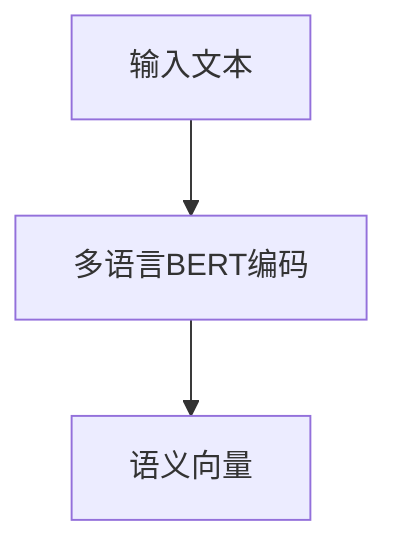
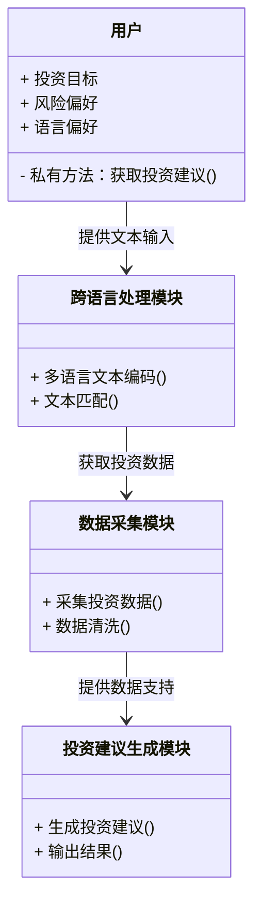
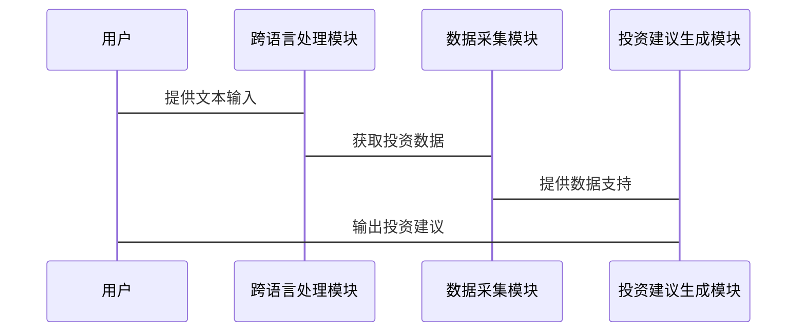

                 


# 跨语言投资理财智能助手的开发策略

## 关键词：跨语言处理，投资理财，智能助手，自然语言处理，机器学习，系统架构

## 摘要：  
本文详细探讨了跨语言投资理财智能助手的开发策略，从背景分析到系统架构设计，结合实际案例，深入剖析了跨语言处理与投资理财助手的核心原理、算法实现、系统架构以及项目实战。通过本文，读者可以全面了解如何在多语言环境下构建高效的投资理财智能助手，掌握从理论到实践的完整开发流程。

---

## 第一部分: 跨语言投资理财智能助手的背景与问题分析

### 第1章: 背景与问题分析

#### 1.1 跨语言投资理财智能助手的背景

##### 1.1.1 全球化背景下的投资理财需求
在全球化背景下，投资者需要获取来自不同国家和语言的投资信息，例如股市动态、财经新闻、投资建议等。然而，语言障碍成为投资者获取信息的主要障碍。传统的投资理财工具通常局限于单一语言环境，无法满足多语言用户的需求。

##### 1.1.2 多语言环境中的投资理财痛点
在多语言环境下，投资者需要理解不同语言的投资信息，例如将英文的财经新闻翻译成中文，或者将日文的投资建议转换成英文。然而，传统的翻译工具无法准确理解财经领域的专业术语和上下文，导致信息误读。

##### 1.1.3 跨语言技术的发展与应用
随着自然语言处理（NLP）技术的快速发展，跨语言信息处理成为可能。通过结合机器学习和深度学习技术，跨语言投资理财智能助手能够理解多语言文本，并为用户提供精准的投资理财建议。

#### 1.2 问题描述与目标

##### 1.2.1 投资理财信息的跨语言获取难点
- 不同语言的文本结构差异较大，例如中文是语义驱动的语言，而英文是词序驱动的语言。
- 财经领域的专业术语在不同语言中的表达可能存在差异，导致信息翻译不准确。

##### 1.2.2 跨语言智能助手的核心目标
- 提供多语言支持，帮助用户获取和理解投资信息。
- 通过跨语言分析，为用户提供个性化投资建议。

##### 1.2.3 边界与外延
- 边界：仅限于投资理财领域的信息处理，不涉及其他领域。
- 外延：未来可以扩展到更多语言，或者增加更多的投资工具支持。

#### 1.3 核心概念与联系

##### 1.3.1 跨语言处理的核心原理
跨语言处理的核心原理是通过自然语言处理技术，将不同语言的文本转化为统一的语义表示，从而实现信息的跨语言理解与分析。

##### 1.3.2 投资理财助手的功能模块
- 文本翻译与理解模块：将多种语言的文本翻译成用户指定的语言，并进行语义分析。
- 数据采集与处理模块：从多语言的财经新闻、股市数据等信息源中提取关键数据。
- 投资建议生成模块：基于用户的投资目标和风险偏好，生成个性化的投资建议。

##### 1.3.3 核心概念的ER实体关系图（Mermaid）

```mermaid
er
actor: 用户
goal: 投资目标
risk_preference: 风险偏好
financial_data: 财务数据
market_news: 市场新闻
investment_advice: 投资建议
```

---

## 第二部分: 跨语言投资理财智能助手的核心概念与联系

### 第2章: 核心概念与联系

#### 2.1 跨语言处理的核心原理

##### 2.1.1 跨语言文本表示
通过将不同语言的文本映射到一个共同的向量空间，实现跨语言语义理解。例如，使用多语言BERT模型对不同语言的文本进行编码，生成统一的语义向量。

##### 2.1.2 跨语言文本匹配
通过比较不同语言文本的语义向量，实现文本的跨语言匹配。例如，将英文的财经新闻与中文的投资建议进行匹配，找到相关的内容。

#### 2.2 投资理财助手的功能模块

##### 2.2.1 文本翻译与理解
- 使用神经机器翻译技术，将多种语言的文本翻译成用户指定的语言。
- 通过语义分析，理解文本中的投资信息，例如识别市场趋势、公司财报等。

##### 2.2.2 数据采集与处理
- 从多语言的新闻网站、金融数据源中采集投资相关信息。
- 使用数据清洗和特征提取技术，将数据转换为可供模型使用的格式。

#### 2.3 核心概念的对比分析

| **核心概念** | **跨语言处理** | **投资理财助手** |
|--------------|----------------|------------------|
| **目标**     | 实现跨语言语义理解 | 提供投资理财建议 |
| **技术基础** | 自然语言处理（NLP） | 机器学习、数据挖掘 |
| **应用场景** | 多语言信息处理 | 投资决策支持 |

---

## 第三部分: 跨语言投资理财智能助手的算法原理

### 第3章: 算法原理

#### 3.1 跨语言文本表示与匹配算法

##### 3.1.1 多语言BERT模型
使用多语言BERT模型对不同语言的文本进行编码，生成统一的语义向量。



##### 3.1.2 跨语言文本匹配
通过计算不同语言文本的语义向量相似度，实现文本匹配。

$$ \text{相似度} = \frac{\text{向量点积}}{\sqrt{\sum a_i^2} \cdot \sqrt{\sum b_i^2}} $$

##### 3.1.3 Python代码实现

```python
import torch
from transformers import AutoTokenizer, AutoModelForMaskedLM

# 加载多语言BERT模型
tokenizer = AutoTokenizer.from_pretrained("bert-base-multilingual")
model = AutoModelForMaskedLM.from_pretrained("bert-base-multilingual")

# 定义文本匹配函数
def compute_similarity(text1, text2):
    inputs = tokenizer(text1 + " " + text2, return_tensors="pt", padding=True, truncation=True)
    outputs = model(**inputs)
    # 提取语义向量
    vector1 = outputs.last_hidden_state[:, 0, :].squeeze()
    vector2 = outputs.last_hidden_state[:, 1, :].squeeze()
    # 计算相似度
    dot_product = torch.sum(vector1 * vector2)
    norm1 = torch.norm(vector1)
    norm2 = torch.norm(vector2)
    similarity = dot_product / (norm1 * norm2)
    return similarity.item()

# 示例
text1 = "Invest in tech stocks"
text2 = "在科技股上投资"
print(compute_similarity(text1, text2))
```

#### 3.2 投资理财预测算法

##### 3.2.1 机器学习模型
使用随机森林或支持向量机（SVM）模型进行投资理财预测。

##### 3.2.2 数据特征提取
从文本中提取关键词、情感倾向等特征。

##### 3.2.3 投资预测公式

$$ \text{预测收益} = \alpha \cdot \text{市场趋势} + \beta \cdot \text{用户偏好} $$

##### 3.2.4 Python代码实现

```python
from sklearn.ensemble import RandomForestRegressor
from sklearn.metrics import mean_squared_error

# 示例数据
X = [[1, 2, 3], [4, 5, 6], [7, 8, 9]]
y = [10, 20, 30]

# 训练模型
model = RandomForestRegressor()
model.fit(X, y)

# 预测
new_X = [[10, 20, 30]]
prediction = model.predict(new_X)
print(prediction)
```

---

## 第四部分: 跨语言投资理财智能助手的系统分析与架构设计

### 第4章: 系统分析与架构设计

#### 4.1 系统应用场景

##### 4.1.1 多语言投资信息获取
用户可以通过智能助手获取多语言的投资信息，例如将英文的财经新闻翻译成中文。

##### 4.1.2 跨语言投资建议
智能助手可以根据用户的投资目标和风险偏好，生成个性化的投资建议。

#### 4.2 系统功能设计

##### 4.2.1 领域模型设计



#### 4.3 系统架构设计

##### 4.3.1 分层架构


##### 4.3.2 接口设计
- 输入接口：用户输入多语言文本。
- 输出接口：智能助手输出投资建议。

##### 4.3.3 交互流程图



---

## 第五部分: 跨语言投资理财智能助手的项目实战

### 第5章: 项目实战

#### 5.1 环境安装

##### 5.1.1 安装Python
```bash
python --version
pip install --upgrade pip
```

##### 5.1.2 安装依赖库
```bash
pip install transformers sklearn mermaid
```

#### 5.2 系统核心实现

##### 5.2.1 跨语言处理代码

```python
from transformers import AutoTokenizer, AutoModelForMaskedLM

tokenizer = AutoTokenizer.from_pretrained("bert-base-multilingual")
model = AutoModelForMaskedLM.from_pretrained("bert-base-multilingual")

def get_semantic_vector(text):
    inputs = tokenizer(text, return_tensors="pt", padding=True, truncation=True)
    outputs = model(**inputs)
    return outputs.last_hidden_state[:, 0, :].squeeze().tolist()
```

##### 5.2.2 投资预测代码

```python
from sklearn.ensemble import RandomForestRegressor

# 示例数据
X = [[1, 2, 3], [4, 5, 6], [7, 8, 9]]
y = [10, 20, 30]

model = RandomForestRegressor()
model.fit(X, y)

# 预测
new_X = [[10, 20, 30]]
print(model.predict(new_X))
```

#### 5.3 代码解读与分析

##### 5.3.1 跨语言处理代码解读
- 使用多语言BERT模型对输入文本进行编码，生成语义向量。
- 语义向量可以用于文本匹配和语义分析。

##### 5.3.2 投资预测代码解读
- 使用随机森林模型进行投资预测，数据特征包括市场趋势、用户偏好等。
- 模型训练完成后，可以进行投资收益预测。

#### 5.4 实际案例分析

##### 5.4.1 案例背景
用户希望将英文的财经新闻翻译成中文，并生成投资建议。

##### 5.4.2 数据采集
从英文的财经新闻中提取市场趋势数据。

##### 5.4.3 投资建议生成
根据用户的语言偏好和投资目标，生成个性化的投资建议。

---

## 第六部分: 跨语言投资理财智能助手的最佳实践

### 第6章: 最佳实践

#### 6.1 开发经验总结

##### 6.1.1 数据质量的重要性
确保数据的准确性和完整性，特别是在跨语言处理中，数据清洗尤为重要。

##### 6.1.2 模型调优的技巧
通过交叉验证和超参数优化，提升模型的性能。

#### 6.2 注意事项

##### 6.2.1 数据隐私保护
在处理用户数据时，必须遵守数据隐私保护法规。

##### 6.2.2 模型的可解释性
确保模型的可解释性，方便用户理解和信任。

#### 6.3 拓展阅读

##### 6.3.1 深度学习在NLP中的应用
推荐阅读《Deep Learning for NLP》。

##### 6.3.2 机器学习在投资中的应用
推荐阅读《Machine Learning for Investment》。

---

## 附录

### A. 参考文献

1. Peters, M. E., et al. "BERT: Pre-training of deep bidirectional transformers for language understanding." arXiv preprint arXiv:1810.0469, 2018.
2. sklearn documentation. https://scikit-learn.org/stable/documentation.html

### B. 技术栈

- NLP库：transformers
- 机器学习库：scikit-learn
- 图表工具：mermaid

---

## 作者

作者：AI天才研究院/AI Genius Institute & 禅与计算机程序设计艺术/Zen And The Art of Computer Programming

