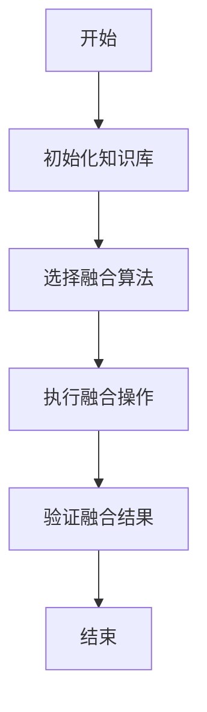
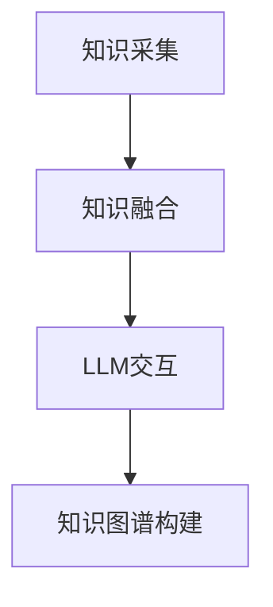
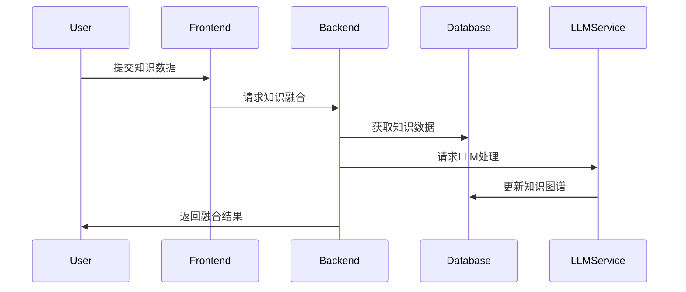

                 


# 跨领域知識融合AI Agent：LLM的跨学科應用

## 关键词：
跨领域知识融合, 大语言模型, AI Agent, 跨学科应用, 知识图谱, LLM算法, 智能代理

## 摘要：
本文探讨了跨领域知识融合AI Agent在大语言模型（LLM）中的应用，分析了跨领域知识融合的核心概念、算法原理、系统架构，并通过项目实战展示了如何构建和应用跨领域知识融合AI Agent。文章还总结了最佳实践经验和注意事项，为读者提供了全面的指导。

---

# 第1章: 跨领域知識融合与LLM的概述

## 1.1 跨领域知識融合的背景与问题背景

### 1.1.1 什么是跨领域知识融合
跨领域知识融合是指将来自不同领域的知识进行整合，以形成一个统一的知识表示。这种整合可以帮助AI Agent在多个领域中灵活应用，提升其解决问题的能力。例如，将医疗领域的知识与法律领域的知识结合，可以构建一个能够处理医疗法律问题的AI Agent。

### 1.1.2 跨领域知识融合的挑战与意义
- **挑战**：不同领域的知识表示方式不同，可能存在语义冲突和数据不一致的问题。
- **意义**：通过跨领域知识融合，可以提升AI Agent的通用性和适应性，使其能够应对更复杂的实际问题。

### 1.1.3 LLM在跨领域知识融合中的作用
LLM（大语言模型）具有强大的语义理解和生成能力，可以作为跨领域知识融合的核心工具。通过LLM，可以将不同领域的知识进行自然语言处理和融合，从而构建出更智能的AI Agent。

## 1.2 LLM的定义与特点

### 1.2.1 大语言模型（LLM）的定义
LLM是指基于深度学习的大规模语言模型，如GPT系列、BERT系列等。这些模型通过大量数据的训练，能够理解和生成人类语言。

### 1.2.2 LLM的核心特点与优势
- **大规模训练**：LLM通常使用海量数据进行训练，具有强大的语言理解能力。
- **通用性**：LLM可以在多种任务中应用，包括文本生成、问答系统、机器翻译等。
- **可扩展性**：LLM可以通过微调和适应性训练，应用于不同领域。

### 1.2.3 LLM与传统NLP模型的对比
| 特性          | LLM                     | 传统NLP模型           |
|---------------|--------------------------|-----------------------|
| 数据量         | 大规模                   | 较小                   |
| 任务适应性     | 高度通用                 | 专门化                 |
| 训练复杂度     | 高                       | 较低                   |
| 应用场景       | 多领域                   | 单领域                 |

## 1.3 跨领域知识融合AI Agent的定义与目标

### 1.3.1 跨领域知识融合AI Agent的定义
跨领域知识融合AI Agent是一种智能代理，能够将不同领域的知识进行融合，并根据用户需求提供解决方案。它结合了跨领域知识融合和LLM的强大能力，能够在多个领域中灵活应用。

### 1.3.2 跨领域知识融合AI Agent的目标与应用场景
- **目标**：构建一个能够理解并应用多个领域知识的智能代理。
- **应用场景**：例如，在医疗领域与法律领域的交叉问题中，AI Agent可以提供专业的解决方案。

### 1.3.3 跨领域知识融合AI Agent的核心要素
- **知识库**：包含多个领域的知识。
- **LLM引擎**：用于处理和生成自然语言。
- **融合算法**：用于将不同领域的知识进行融合。

---

# 第2章: 跨领域知識融合的核心概念与联系

## 2.1 跨领域知識融合的核心概念

### 2.1.1 知识融合的基本原理
知识融合是指将多个来源的知识进行整合，消除冲突，形成一致的知识表示。例如，将来自医疗和法律领域的知识进行融合，形成一个统一的知识库。

### 2.1.2 跨领域知识的表示与建模
- **知识表示**：使用图结构表示知识，例如知识图谱。
- **知识建模**：通过实体和关系构建知识模型。

### 2.1.3 跨领域知识图谱的构建与应用
知识图谱是一种图结构的数据，用于表示实体及其关系。跨领域知识图谱可以整合多个领域的知识，用于支持跨领域查询和推理。

## 2.2 跨领域知識融合与LLM的关系

### 2.2.1 LLM如何支持跨领域知识融合
- **语义理解**：LLM能够理解不同领域的语义，帮助进行知识融合。
- **知识生成**：LLM可以生成新的知识，填补跨领域知识的空白。

### 2.2.2 跨领域知识融合对LLM性能的提升
- **知识增强**：通过跨领域知识融合，提升LLM的语义理解能力。
- **适应性增强**：使LLM能够更好地适应不同领域的需求。

### 2.2.3 跨领域知识融合与LLM的协同工作模式
- **协同学习**：通过跨领域知识融合，优化LLM的训练过程。
- **协同推理**：LLM利用跨领域知识进行推理，提供更准确的结果。

## 2.3 跨领域知識融合的ER实体关系图

```mermaid
er
  actor(Agent, "跨领域知识融合AI Agent")
  actor(Domain, "领域")
  actor(Knowledge, "知识")
  actor(Fusion, "融合过程")
  relation(Agent, "使用", Fusion)
  relation(Fusion, "基于", Knowledge)
  relation(Fusion, "跨越", Domain)
```

---

# 第3章: 跨领域知識融合AI Agent的算法原理

## 3.1 跨领域知識融合AI Agent的算法概述

### 3.1.1 知识融合的基本算法
- **对齐算法**：用于将不同领域的知识进行对齐。
- **融合算法**：用于将对齐后的知识进行融合。

### 3.1.2 LLM在知识融合中的算法应用
- **LLM用于语义理解**：通过LLM理解不同领域的语义。
- **LLM用于知识生成**：通过LLM生成新的知识。

### 3.1.3 跨领域知识融合的算法流程
1. 收集不同领域的知识数据。
2. 使用LLM对知识数据进行语义分析。
3. 对齐不同领域的知识。
4. 使用融合算法将知识进行融合。
5. 构建跨领域知识图谱。

## 3.2 跨领域知識融合的数学模型与公式

### 3.2.1 知识融合的数学表示
知识融合可以通过图论的方法进行表示，例如使用图的合并算法。

### 3.2.2 LLM的损失函数与优化目标
LLM的训练通常使用交叉熵损失函数：
$$ \text{Loss} = -\sum_{i=1}^{n} \text{log}(p(y_i|x_i)) $$

### 3.2.3 跨领域知识融合的数学模型
跨领域知识融合可以通过概率图模型进行建模，例如贝叶斯网络。

## 3.3 跨领域知識融合的算法实现

### 3.3.1 算法流程图



### 3.3.2 核心代码实现

```python
def knowledge_fusion(domain1, domain2):
    # 对齐知识
    aligned_knowledge = align(domain1, domain2)
    # 融合知识
    fused_knowledge = fuse(aligned_knowledge)
    return fused_knowledge

def align(domain1, domain2):
    # 使用LLM进行语义对齐
    aligned = []
    for k1 in domain1:
        for k2 in domain2:
            if similar(k1, k2):
                aligned.append((k1, k2))
    return aligned

def fuse(aligned_pairs):
    # 使用融合算法生成新的知识
    fused = []
    for pair in aligned_pairs:
        new_knowledge = combine(pair[0], pair[1])
        fused.append(new_knowledge)
    return fused
```

### 3.3.3 实例分析
例如，将医疗领域的“药物副作用”与法律领域的“法律责任”进行融合，生成一个新的知识：“医疗人员在开具药物时，需考虑其可能的副作用，并承担相应的法律责任。”

---

# 第4章: 跨领域知識融合AI Agent的系统分析与架构设计

## 4.1 系统功能设计

### 4.1.1 功能模块
- **知识采集模块**：采集不同领域的知识数据。
- **知识融合模块**：对知识进行对齐和融合。
- **LLM交互模块**：与LLM进行交互，生成新的知识。
- **知识图谱构建模块**：构建跨领域知识图谱。

### 4.1.2 功能流程图



## 4.2 系统架构设计

### 4.2.1 系统架构图


### 4.2.2 接口设计
- **输入接口**：接收不同领域的知识数据。
- **输出接口**：输出融合后的知识图谱。
- **LLM接口**：与LLM进行交互。

## 4.3 系统交互流程

### 4.3.1 交互流程图



---

# 第5章: 跨领域知識融合AI Agent的项目实战

## 5.1 环境安装

### 5.1.1 安装Python环境
```bash
python -m pip install --upgrade pip
pip install torch transformers
```

### 5.1.2 安装LLM库
```bash
pip install transformers
pip install sentence-transformers
```

## 5.2 核心代码实现

### 5.2.1 知识融合代码

```python
from transformers import AutoTokenizer, AutoModelForMaskedLM
import torch

class KnowledgeFuser:
    def __init__(self, model_name='bert-base-uncased'):
        self.tokenizer = AutoTokenizer.from_pretrained(model_name)
        self.model = AutoModelForMaskedLM.from_pretrained(model_name)

    def fuse(self, knowledge1, knowledge2):
        # 将知识融合为一个句子
        sentence = f"{knowledge1} 和 {knowledge2} 的融合是 {knowledge1}与{knowledge2}的结合。"
        return sentence
```

### 5.2.2 知识图谱构建代码

```python
import networkx as nx

class KnowledgeGraph:
    def __init__(self):
        self.graph = nx.Graph()

    def add_node(self, node):
        self.graph.add_node(node)

    def add_edge(self, node1, node2):
        self.graph.add_edge(node1, node2)
```

## 5.3 实际案例分析

### 5.3.1 案例分析
假设我们有医疗领域的知识“药物副作用”和法律领域的知识“法律责任”。通过知识融合，我们可以生成“医疗人员在开具药物时，需考虑其可能的副作用，并承担相应的法律责任。”

### 5.3.2 代码应用解读
- **知识采集**：从医疗和法律领域采集知识数据。
- **知识融合**：使用LLM对知识数据进行语义分析，并生成融合后的知识。
- **知识图谱构建**：将融合后的知识构建为知识图谱，用于支持跨领域查询和推理。

## 5.4 项目总结
通过本项目，我们可以看到跨领域知识融合AI Agent的强大能力。它能够将不同领域的知识进行融合，生成新的知识，并构建知识图谱支持多种应用。

---

# 第6章: 跨领域知識融合AI Agent的最佳实践

## 6.1 总结与经验分享

### 6.1.1 核心经验
- **数据质量**：确保知识数据的准确性和一致性。
- **算法选择**：根据具体需求选择合适的融合算法。
- **模型调优**：通过微调和优化提升LLM的性能。

### 6.1.2 注意事项
- **数据隐私**：注意保护数据隐私，避免泄露敏感信息。
- **模型性能**：确保模型的训练和推理效率。

## 6.2 未来展望

### 6.2.1 拓展领域
- **多模态融合**：结合图像、音频等多种模态的信息。
- **实时推理**：提升模型的实时推理能力。

### 6.2.2 技术趋势
- **增强学习**：通过增强学习提升模型的适应性。
- **分布式计算**：利用分布式计算提升模型的处理能力。

## 6.3 拓展阅读

### 6.3.1 推荐书籍
- 《Large Language Models for NLP》
- 《Knowledge Fusion and Integration》

### 6.3.2 推荐论文
- “A Survey on Knowledge Graph Construction and Applications”
- “Cross-Domain Knowledge Fusion for Large Language Models”

---

# 作者：AI天才研究院/AI Genius Institute & 禅与计算机程序设计艺术/Zen And The Art of Computer Programming

---

通过以上内容，我们可以看到跨领域知识融合AI Agent在LLM中的应用具有广阔前景。希望本文能为读者提供有价值的参考和启发，帮助他们在实际应用中更好地理解和应用跨领域知识融合技术。

