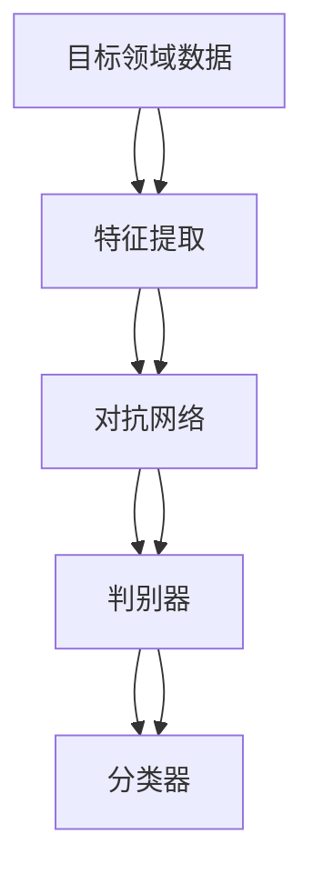

                 


# 迁移学习在AI Agent领域适应中的应用

## 关键词：迁移学习、AI Agent、领域适应、算法实现、应用案例

## 摘要：  
本文探讨了迁移学习在AI Agent适应新环境中的应用，通过分析迁移学习的核心概念、算法原理和实际案例，展示了如何利用迁移学习提升AI Agent的环境适应能力和任务执行效率。文章从基础概念出发，逐步深入，结合数学公式、算法实现和系统设计，为读者提供了全面的知识框架和实践指南。

## 第4章: 迁移学习算法的数学模型与公式

### 4.1 迁移学习的数学模型

迁移学习的目标是将源领域知识迁移到目标领域，数学模型通常涉及特征表示和分布差异的最小化。

#### 4.1.1 基于特征表示的迁移学习
在特征表示中，源领域和目标领域的特征通过一个共享的特征空间进行映射。

$$
f_{source}(x_i) = y_i
$$  
$$
f_{target}(x_j) = y_j
$$  

共享特征表示可以表示为：
$$
x_i = \phi_{source}(x_i)
$$  
$$
x_j = \phi_{target}(x_j)
$$  

其中，$\phi$ 是共享的特征映射函数。

#### 4.1.2 分布匹配的迁移学习
分布匹配的目标是最小化源领域和目标领域的数据分布差异。这可以通过优化目标领域数据的分布，使其接近源领域数据分布。

$$
P_{source}(x) \approx P_{target}(x)
$$  

分布匹配可以通过将目标领域数据映射到源领域数据的分布空间来实现。

### 4.2 常见迁移学习算法的公式推导

#### 4.2.1 Domain Adversarial Network (DANN)

DANN通过引入对抗网络来学习领域不变的特征表示。

$$
L_{dis} = \mathbb{E}_{x_i \sim source}[\log D(f(x_i))] + \mathbb{E}_{x_j \sim target}[\log (1 - D(f(x_j)))]
$$  

其中，$D$是判别器，$f$是特征提取网络。

分类损失：
$$
L_{cls} = \mathbb{E}_{x_i \sim source}[\log C(f(x_i))] + \mathbb{E}_{x_j \sim target}[\log C(f(x_j))]
$$  

总损失：
$$
L = L_{cls} + \lambda L_{dis}
$$  

#### 4.2.2 Maximum Mean Discrepancy (MMD)

MMD通过最大化源领域和目标领域的数据均值之间的距离来实现分布匹配。

$$
\text{MMD}(P_{source}, P_{target}) = \mathbb{E}_{x_i, x_j}[k(x_i, x_j)] - \mathbb{E}_{x_i, x_l}[k(x_i, x_l)] - \mathbb{E}_{x_j, x_l}[k(x_j, x_l)] + \mathbb{E}_{x_j, x_l}[k(x_j, x_l)]
$$  

其中，$k$是核函数。

### 4.3 举例说明：使用 Mermaid 流程图展示算法步骤



## 第5章: 迁移学习算法的实现与优化

### 5.1 迁移学习算法的实现

迁移学习的实现步骤包括数据预处理、特征提取、模型训练和模型评估。

#### 5.1.1 数据预处理

数据预处理是迁移学习的关键步骤，包括数据清洗和特征选择。

- 数据清洗：去除噪声数据，处理缺失值。
- 特征选择：选择对任务重要的特征，降低维度。

#### 5.1.2 特征提取

特征提取可以通过无监督学习或监督学习实现。

- 无监督学习：使用聚类或降维方法提取特征。
- 监督学习：使用标注数据训练特征提取器。

#### 5.1.3 模型训练

模型训练包括源领域和目标领域的数据，通常采用分阶段训练方法。

- 阶段一：在源领域数据上训练模型。
- 阶段二：在目标领域数据上微调模型，减少领域差异。

#### 5.1.4 模型评估

模型评估使用交叉验证或测试集进行性能评估。

- 准确率：分类任务的正确预测比例。
- F1分数：综合考虑精确率和召回率。

### 5.2 算法实现的代码示例

以下是一个简单的迁移学习实现代码示例：

```python
import torch
import torch.nn as nn
import torch.optim as optim

class FeatureExtractor(nn.Module):
    def __init__(self):
        super(FeatureExtractor, self).__init__()
        self.conv = nn.Conv2d(1, 32, kernel_size=3, padding=1)
        self.relu = nn.ReLU()
        
    def forward(self, x):
        x = self.conv(x)
        x = self.relu(x)
        return x

class Classifier(nn.Module):
    def __init__(self, num_classes):
        super(Classifier, self).__init__()
        self.fc = nn.Linear(32, num_classes)
        
    def forward(self, x):
        x = x.view(-1, 32)
        x = self.fc(x)
        return x

def train_model(model, criterion, optimizer, source_loader, target_loader, num_epochs=100):
    for epoch in range(num_epochs):
        model.train()
        for inputs, labels in source_loader:
            outputs = model(inputs)
            loss = criterion(outputs, labels)
            loss.backward()
            optimizer.step()
            optimizer.zero_grad()
        for inputs, labels in target_loader:
            outputs = model(inputs)
            loss = criterion(outputs, labels)
            loss.backward()
            optimizer.step()
            optimizer.zero_grad()
    return model

# 示例使用
feature_extractor = FeatureExtractor()
classifier = Classifier(10)
criterion = nn.CrossEntropyLoss()
optimizer = optim.Adam(torch.cat([feature_extractor, classifier]).parameters(), lr=0.001)

model = train_model(feature_extractor, classifier, criterion, optimizer, source_loader, target_loader)
```

### 5.3 迁移学习的优化策略

优化策略包括数据增强、模型集成和领域适应。

- 数据增强：通过数据扩展增加数据多样性。
- 模型集成：使用多个模型进行投票或加权平均，提高预测准确性。
- 领域适应：通过调整模型参数，减少源领域和目标领域的分布差异。

## 第6章: 迁移学习在AI Agent中的应用

### 6.1 迁移学习在AI Agent中的应用场景

AI Agent在多个领域应用迁移学习，提升适应能力。

#### 6.1.1 智能对话系统

通过迁移学习，对话系统可以在不同领域间共享知识，提升对话质量。

#### 6.1.2 自动驾驶

迁移学习帮助自动驾驶系统在不同交通环境中快速适应。

#### 6.1.3 个性化推荐系统

通过迁移学习，推荐系统可以在用户行为变化时快速调整推荐策略。

### 6.2 迁移学习在AI Agent中的实现

实现步骤包括环境感知、知识迁移和任务执行。

#### 6.2.1 环境感知

AI Agent通过传感器或数据接口感知环境，获取源领域和目标领域的数据。

#### 6.2.2 知识迁移

通过迁移学习算法，将源领域知识迁移到目标领域。

#### 6.2.3 任务执行

AI Agent根据迁移后的知识执行任务，实现环境适应。

### 6.3 迁移学习在AI Agent中的系统设计

系统设计包括感知层、决策层和执行层。

#### 6.3.1 感知层

负责数据采集和特征提取。

#### 6.3.2 决策层

负责任务规划和策略选择。

#### 6.3.3 执行层

负责任务执行和效果评估。

## 第7章: 总结与展望

### 7.1 总结

迁移学习在AI Agent中的应用显著提升了其环境适应能力和任务执行效率。通过迁移学习，AI Agent可以在不同领域间共享知识，快速适应新环境。

### 7.2 未来展望

未来，迁移学习在AI Agent中的应用将更加广泛，可能出现以下趋势：

- 更加高效的学习算法，减少计算成本。
- 更加智能的知识表示，提升迁移效果。
- 更加多样化的迁移学习应用，如边缘计算和物联网。

### 7.3 最佳实践 tips

- 在选择迁移学习算法时，需根据具体任务和数据特点进行选择。
- 数据预处理和特征提取是关键步骤，需充分考虑数据质量和特征重要性。
- 模型评估需使用多种指标，全面评估模型性能。

## 作者：AI天才研究院 & 禅与计算机程序设计艺术

---

这篇文章详细探讨了迁移学习在AI Agent中的应用，通过理论分析、算法实现和实际案例，为读者提供了全面的知识框架和实践指南。希望这篇文章能帮助读者更好地理解和应用迁移学习在AI Agent中的应用。

