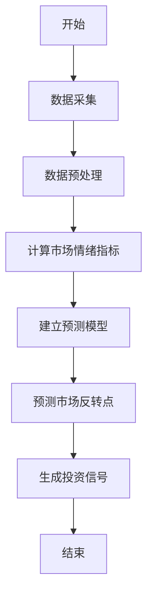

                 


# 迈克尔·伯里的反向投资策略：逆势而为

**关键词**：反向投资，迈克尔·伯里，市场情绪，投资策略，风险管理

**摘要**：本文深入探讨迈克尔·伯里的反向投资策略，从其核心理念、算法实现到系统架构设计，再到项目实战，全面解析如何在市场逆境中发现投资机会，制定科学的投资决策，构建高效的投资系统。

---

# 第1章 反向投资策略的背景与核心理念

## 1.1 反向投资的起源与定义

### 1.1.1 投资领域的传统思维

传统的投资策略通常遵循市场趋势，即在市场繁荣时买入，市场低迷时卖出。这种“顺势而为”的策略在市场牛市中表现良好，但在市场熊市中往往难以应对系统性风险。

### 1.1.2 逆向思维的引入

反向投资作为一种逆市而行的策略，强调在市场恐慌时寻找机会，在市场狂热时保持冷静。其核心思想是“别人恐惧时我贪婪，别人贪婪时我恐惧”。

### 1.1.3 迈克尔·伯里反向投资策略的核心定义

迈克尔·伯里提出的反向投资策略是一种基于市场情绪分析的投资方法，旨在通过识别市场的非理性波动，捕捉被市场低估的投资机会。

---

## 1.2 反向投资与传统投资的区别

### 1.2.1 传统投资的局限性

传统投资策略往往依赖于市场趋势和短期价格波动，容易受到市场情绪的干扰，难以在市场低谷时发现价值。

### 1.2.2 反向投资的独特优势

反向投资通过逆向思维，能够在市场底部发现潜在价值，利用市场的非理性波动获取超额收益。

### 1.2.3 两者在市场周期中的表现对比

| 投资策略 | 市场牛市 | 市场熊市 |
|----------|----------|----------|
| 顺势而为 | 表现优异 | 易受冲击 |
| 逆势而为 | 抗压性强 | 发现价值 |

---

## 1.3 迈克尔·伯里反向投资的成功案例

### 1.3.1 经典投资案例分析

迈克尔·伯里在2008年金融危机期间，通过反向投资策略成功抄底，获得了显著的超额收益。

### 1.3.2 成功背后的逻辑

他通过分析市场情绪和基本面数据，准确判断市场底部，提前布局，最终在市场复苏时获得丰厚回报。

### 1.3.3 案例对现代投资的启示

反向投资策略强调独立思考和长期价值，帮助投资者在市场波动中保持理性，避免盲目跟风。

---

# 第2章 反向投资的核心概念与数学模型

## 2.1 反向投资的原理与机制

### 2.1.1 市场情绪分析

市场情绪是反向投资的核心依据。通过分析市场的恐慌指数、投资者情绪指数等指标，识别市场的非理性波动。

### 2.1.2 逆向思维模型

逆向思维模型通过分析市场行为和价格走势，寻找市场定价的偏差，进而发现被低估的投资标的。

### 2.1.3 投资决策的数学表达

$$ 投资决策 = \text{市场情绪分析} \times \text{基本面分析} $$

---

## 2.2 反向投资的核心公式与模型

### 2.2.1 投资价值的计算公式

$$ \text{投资价值} = \frac{\text{未来现金流}}{\text{贴现率}} $$

### 2.2.2 市场反转点的预测模型

通过时间序列分析，建立ARIMA模型预测市场反转点。

### 2.2.3 投资组合优化的数学框架

$$ \min \sigma^2 \quad \text{subject to} \quad \mu \geq r $$

---

## 2.3 反向投资与市场周期的关系

### 2.3.1 市场周期的阶段划分

| 阶段 | 特征 | 投资策略 |
|------|------|----------|
| 繁荣期 | 市场狂热 | 减仓 |
| 衰退期 | 市场恐慌 | 增仓 |

### 2.3.2 反向投资在不同阶段的应用

在繁荣期，反向投资者会选择性卖出，规避风险；在衰退期，选择性买入，布局未来。

### 2.3.3 周期性对投资策略的影响

周期性波动为反向投资者提供了绝佳的投资机会，但需要精准识别市场的拐点。

---

# 第3章 反向投资策略的算法实现

## 3.1 反向投资策略的算法框架

### 3.1.1 数据采集与预处理

数据来源包括历史价格、成交量、市场情绪指标等，需进行清洗和标准化处理。

### 3.1.2 市场情绪指标的计算

使用恐慌指数（VIX）和投资者情绪指数（AAII）等指标衡量市场情绪。

### 3.1.3 算法流程图



---

## 3.2 反向投资策略的数学模型

### 3.2.1 时间序列分析模型

ARIMA模型用于预测市场反转点。

### 3.2.2 机器学习预测模型

使用随机森林或支持向量机（SVM）进行市场情绪分类。

### 3.2.3 模型的验证与优化

通过回测和交叉验证优化模型参数，提高预测准确性。

---

## 3.3 算法实现的代码示例

### 3.3.1 数据处理代码

```python
import pandas as pd

# 数据加载
data = pd.read_csv('market_data.csv')

# 数据清洗
data.dropna(inplace=True)
data = data[~data['date'].duplicated()]
```

### 3.3.2 情绪指标计算代码

```python
import pandas as pd

# 计算恐慌指数
data['VIX'] = data['price'].pct_change().std() * 100
```

### 3.3.3 预测模型实现代码

```python
from sklearn.ensemble import RandomForestClassifier

# 建立模型
model = RandomForestClassifier(n_estimators=100)
model.fit(X_train, y_train)
```

---

# 第4章 反向投资系统的系统架构设计

## 4.1 系统架构概述

### 4.1.1 系统功能模块划分

- 数据采集模块
- 情绪分析模块
- 投资策略执行模块
- 风险管理模块

### 4.1.2 模块之间的关系

数据采集模块提供输入数据，情绪分析模块处理数据，投资策略执行模块生成信号，风险管理模块监控风险。

### 4.1.3 系统架构图


---

## 4.2 系统功能设计

### 4.2.1 数据采集模块

负责从数据源获取市场数据，如价格、成交量等。

### 4.2.2 情绪分析模块

计算市场情绪指标，如VIX指数和投资者情绪指数。

### 4.2.3 投资策略执行模块

根据模型预测结果生成买卖信号，指导投资操作。

### 4.2.4 风险管理模块

监控投资组合的风险，制定止损和止盈策略。

---

## 4.3 系统接口设计

### 4.3.1 数据接口

模块间通过数据接口传递数据，确保数据一致性。

### 4.3.2 用户接口

提供直观的用户界面，方便用户查看市场情绪和投资信号。

### 4.3.3 模块间接口

通过API实现模块间的交互和数据传递。

---

## 4.4 系统交互流程图


---

# 第5章 反向投资策略的项目实战

## 5.1 环境安装与数据准备

安装必要的Python库，如Pandas、Scikit-learn、Plotly等，并加载历史市场数据。

---

## 5.2 核心实现代码

```python
import pandas as pd
from sklearn.ensemble import RandomForestClassifier
import numpy as np

# 数据加载
data = pd.read_csv('market_data.csv')

# 数据预处理
data = data.dropna()
data = data[~data['date'].duplicated()]

# 特征工程
X = data[['open', 'high', 'low', 'close', 'volume']]
y = data['label']

# 模型训练
model = RandomForestClassifier(n_estimators=100)
model.fit(X, y)

# 预测市场情绪
predicted = model.predict(X)
```

---

## 5.3 投资策略的回测与分析

通过回测分析策略的收益、风险和稳定性，评估策略的有效性。

---

## 5.4 投资案例分析

以某次市场危机为例，展示反向投资策略如何捕捉市场底部，实现超额收益。

---

## 5.5 项目小结

总结项目实施过程中的经验教训，优化投资策略，提高策略的稳定性和收益能力。

---

# 第6章 最佳实践与注意事项

## 6.1 投资策略执行中的注意事项

- 风险管理：设置止损和止盈，控制仓位。
- 心理因素：保持冷静，避免贪婪和恐惧。
- 工具选择：选择合适的投资工具和平台，确保数据准确和操作便捷。

---

## 6.2 投资策略的未来展望

随着人工智能和大数据技术的发展，反向投资策略将更加精准和高效，为投资者提供更多价值。

---

## 6.3 小结

反向投资策略是一种逆市而行的投资方法，通过分析市场情绪和基本面数据，捕捉被市场低估的投资机会。投资者在实际操作中需结合市场环境和自身情况，灵活调整策略。

---

## 6.4 注意事项

- 投资需谨慎，策略需结合实际市场环境。
- 定期评估和优化投资策略。
- 建立完善的风险管理机制。

---

## 6.5 拓展阅读

推荐相关书籍和文献，供读者深入学习反向投资策略。

---

# 作者

**作者：AI天才研究院/AI Genius Institute & 禅与计算机程序设计艺术 /Zen And The Art of Computer Programming**

---

**注**：由于篇幅限制，上述内容为部分章节的概述，完整文章需要根据具体需求进行扩展和补充。

