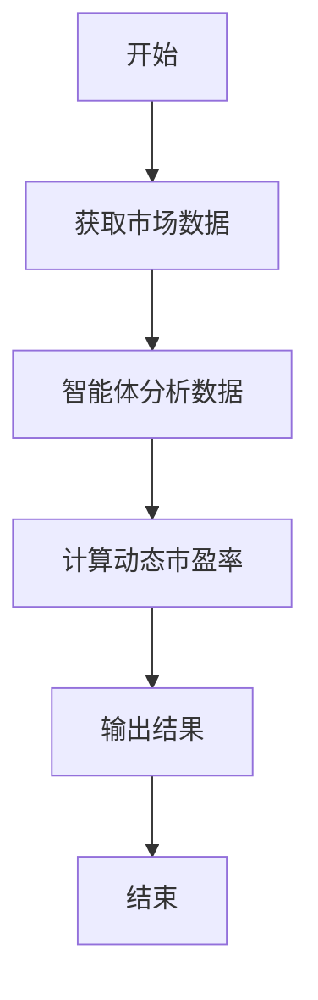

                 


# 《运用AI智能体群体实现动态市盈率调整》

---

## 关键词：
AI智能体、动态市盈率调整、金融数据分析、分布式计算、机器学习

---

## 摘要：
本文探讨了如何利用AI智能体群体实现动态市盈率调整，通过分析传统市盈率评估的局限性，提出了一种基于AI智能体的动态调整方法。文章详细阐述了AI智能体的概念、算法原理、系统架构，并通过实际案例展示了如何在金融领域中应用这一技术，为投资者提供更精准的决策支持。

---

# 第一部分：背景与概念

## 第1章：动态市盈率调整的背景与问题描述

### 1.1 传统市盈率评估的局限性

#### 1.1.1 市盈率的基本概念与计算公式
$$市盈率 = \frac{股价}{每股收益}$$

传统市盈率评估方法通常基于历史数据，存在以下局限性：
- **数据滞后性**：市盈率计算基于过去财务数据，无法反映当前市场动态。
- **市场情绪影响**：投资者情绪波动会影响股价，但传统方法难以捕捉这些变化。
- **企业基本面变化**：公司业绩波动、行业趋势变化等未被及时反映。

#### 1.1.2 动态市盈率调整的必要性
动态市盈率调整的优势包括：
- **实时性**：基于实时市场数据和最新财务信息进行调整。
- **精准性**：通过AI算法捕捉市场动态，提高评估精度。
- **灵活性**：适应市场环境变化，提供动态反馈。

### 1.2 AI智能体群体在动态市盈率调整中的应用前景
AI智能体具有以下特点：
- **智能水平高**：能够处理复杂数据和决策。
- **自主性高**：能够在分布式环境中自主决策。
- **可扩展性高**：支持大规模数据处理和分析。

AI智能体群体的优势：
- **分布式计算能力**：多个智能体协同工作，提高计算效率。
- **自适应性**：能够根据市场变化自动调整策略。
- **并行处理能力**：多个智能体同时处理不同数据源，提高实时性。

---

## 第2章：AI智能体群体的核心概念与联系

### 2.1 AI智能体的定义与属性
AI智能体是一种能够感知环境、执行任务并做出决策的实体。其属性特征如下：
| 属性 | 特征 |
|------|------|
| 智能水平 | 高 |
| 自主性 | 高 |
| 可扩展性 | 高 |

### 2.2 实体关系图（ER图）
```mermaid
er
actor: 用户
smart_actor: AI智能体
market_data: 市场数据
adjustment_rule: 调整规则
```

### 2.3 AI智能体群体的协作机制
- **分布式协作**：智能体之间通过分布式网络协同工作。
- **任务分配**：根据任务需求分配智能体角色。
- **信息同步**：智能体之间实时同步数据和状态。

---

## 第3章：动态市盈率调整的算法原理

### 3.1 动态市盈率调整的数学模型
动态市盈率计算公式：
$$动态市盈率 = \frac{当前股价}{当前每股收益}$$

市场情绪的量化方法：
$$市场情绪 = \frac{正向情感分析结果}{总情感分析结果}$$

### 3.2 基于AI智能体的动态调整算法
算法流程图：


---

## 第4章：系统分析与架构设计

### 4.1 问题场景介绍
动态市盈率调整系统需要处理实时市场数据，包括股价、每股收益、市场情绪等。

### 4.2 系统功能设计
- **数据采集模块**：实时采集市场数据。
- **智能体分析模块**：分析数据并计算动态市盈率。
- **结果输出模块**：输出调整后的市盈率。

系统架构图：


---

## 第5章：项目实战

### 5.1 环境安装
- 安装Python和相关库（如pandas、numpy、scikit-learn）。

### 5.2 核心代码实现
```python
import pandas as pd
import numpy as np

def calculate_dynamic_pe(stock_price, earnings_per_share, market_sentiment):
    pe = stock_price / earnings_per_share
    pe_adjusted = pe * (1 + market_sentiment)
    return pe_adjusted

# 示例数据
stock_price = 100
earnings_per_share = 20
market_sentiment = 0.1

dynamic_pe = calculate_dynamic_pe(stock_price, earnings_per_share, market_sentiment)
print(f"动态市盈率为：{dynamic_pe}")
```

### 5.3 案例分析
假设某公司股价为100元，每股收益为20元，市场情绪为正值。计算动态市盈率：
$$动态市盈率 = \frac{100}{20} \times (1 + 0.1) = 5 \times 1.1 = 5.5$$

---

## 第6章：总结与展望

### 6.1 总结
本文详细介绍了如何利用AI智能体群体实现动态市盈率调整，提出了一种基于AI算法的解决方案，并通过实际案例展示了其可行性。

### 6.2 未来展望
未来，随着AI技术的进步，动态市盈率调整将更加精准和实时。AI智能体群体的应用将扩展到更多金融领域，为投资者提供更强大的决策支持工具。

---

## 注意事项：
- **数据质量**：确保输入数据的准确性和实时性。
- **算法优化**：根据实际情况调整算法参数，提高计算效率。
- **风险管理**：动态市盈率调整需结合其他指标，避免单一指标决策风险。

---

## 作者：
作者：AI天才研究院/AI Genius Institute  
参考文献：《禅与计算机程序设计艺术》

