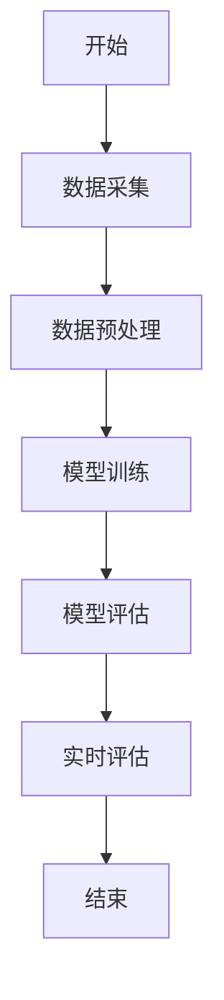

                 


# 运用AI智能体群体实现动态行业吸引力评估

## 关键词：AI智能体，动态评估，行业吸引力，多智能体系统，协同学习

## 摘要：本文探讨如何利用AI智能体群体进行动态行业吸引力评估，通过构建智能体协同机制、设计动态评估模型、实现系统架构，提供了一种创新的解决方案，能够实时捕捉行业动态变化，为企业决策提供支持。

---

# 第一部分: 背景与概念

## 第1章: AI智能体群体与动态行业吸引力评估概述

### 1.1 问题背景

#### 1.1.1 行业吸引力评估的传统方法

传统的行业吸引力评估主要依赖于静态数据分析，例如财务指标、市场份额和历史趋势。这种方法虽然在一定程度上能够反映行业状况，但无法捕捉实时动态变化。例如，市场环境、消费者行为和技术进步等因素的变化往往无法及时反映在评估结果中。

#### 1.1.2 AI智能体群体的优势

AI智能体群体能够通过协同工作实时处理数据，捕捉动态变化。每个智能体负责特定任务，如数据采集、分析和预测，从而提供更精准的行业吸引力评估。此外，智能体的自主性和学习能力使其能够适应复杂多变的市场环境。

#### 1.1.3 动态评估的必要性

在快速变化的商业环境中，企业需要及时了解行业吸引力的变化，以便快速调整战略。动态评估能够提供实时反馈，帮助企业在竞争中占据优势。

### 1.2 问题描述

#### 1.2.1 行业吸引力的核心要素

行业吸引力评估的核心要素包括市场规模、竞争强度、增长潜力、政策环境和技术创新。这些因素相互影响，构成了行业的整体吸引力。

#### 1.2.2 动态变化的驱动因素

驱动行业吸引力变化的因素包括市场趋势、消费者行为、政策调整和技术进步。这些因素的变化往往具有突发性和复杂性，需要动态评估模型实时捕捉。

#### 1.2.3 智能体群体的协同机制

智能体群体通过信息共享、任务分配和协同决策来实现动态评估。每个智能体负责特定任务，如数据采集、分析和预测，协同工作以提供全面的评估结果。

### 1.3 问题解决思路

#### 1.3.1 智能体群体的构建

构建智能体群体需要明确每个智能体的功能、通信机制和协作规则。例如，数据采集智能体负责实时收集行业数据，分析智能体负责处理数据并生成评估结果。

#### 1.3.2 动态评估模型的设计

动态评估模型需要能够实时更新评估结果，基于最新的数据和市场变化。例如，可以使用马尔可夫链模型来描述行业的动态变化。

#### 1.3.3 数据采集与处理方法

数据采集可以通过多种渠道进行，如API接口、网络爬取和数据库查询。处理方法包括数据清洗、特征提取和模型训练。

### 1.4 核心概念与系统架构

#### 1.4.1 AI智能体的定义与属性

AI智能体是指能够感知环境、自主决策并执行任务的实体。其主要属性包括自主性、协作性和学习能力。

#### 1.4.2 行业吸引力的评估指标

评估指标包括市场规模、竞争强度、增长潜力、政策环境和技术创新。这些指标需要量化处理，以便智能体进行计算和分析。

#### 1.4.3 系统架构的ER实体关系图

ER实体关系图展示了智能体、行业数据和评估指标之间的关系。智能体与行业数据相关联，行业数据与评估指标相关联。

---

## 第2章: AI智能体群体的核心概念与联系

### 2.1 核心概念原理

#### 2.1.1 智能体的自主性与协作性

智能体的自主性使其能够独立执行任务，而协作性使其能够与其他智能体协同工作，共同完成复杂的评估任务。

#### 2.1.2 动态评估的实时性与准确性

动态评估需要实时更新，以反映最新的市场变化。准确性是评估结果的关键，需要智能体协同工作以确保数据的准确性和完整性。

#### 2.1.3 数据流的处理与分析

数据流的处理与分析是动态评估的核心。智能体需要高效处理大量数据，提取关键信息，并生成评估结果。

### 2.2 概念属性特征对比表格

| 概念       | 属性       | 特征                               |
|------------|------------|------------------------------------|
| 智能体     | 自主性     | 独立决策                           |
| 行业吸引力 | 动态性     | 实时变化                           |
| 评估模型   | 复杂性     | 多因素分析                         |

### 2.3 ER实体关系图

```mermaid
er
actor: 智能体
actor ||-->> entity: 行业数据
entity ||-->> entity: 评估指标
```

---

# 第二部分: 算法原理

## 第3章: 动态行业吸引力评估模型的算法原理

### 3.1 算法原理概述

#### 3.1.1 基于马尔可夫链的动态模型

马尔可夫链模型用于描述行业的动态变化。每个状态代表行业的某个阶段，状态之间的转移概率反映了变化的可能性。

#### 3.1.2 智能体协同的博弈论分析

智能体之间的协同可以通过博弈论进行建模。每个智能体的目标是优化整体评估结果，同时追求自身利益的最大化。

#### 3.1.3 多因素加权评估方法

多因素加权评估方法将多个评估指标加权求和，以生成最终的行业吸引力评分。权重反映了每个指标的重要性。

### 3.2 算法实现步骤

#### 3.2.1 数据采集与预处理

1. 通过API接口采集行业数据。
2. 清洗数据，去除异常值和缺失值。
3. 提取特征，如市场规模、竞争强度等。

#### 3.2.2 模型训练与评估

1. 使用马尔可夫链模型训练动态变化的模型。
2. 通过博弈论分析智能体之间的协同关系。
3. 训练多因素加权模型，评估权重。

#### 3.2.3 实时评估与更新

1. 实时采集最新的行业数据。
2. 更新动态模型，反映最新的变化。
3. 生成实时评估结果，提供给用户。

### 3.3 算法流程图



### 3.4 数学模型与公式

#### 3.4.1 马尔可夫链模型

状态转移概率矩阵P，其中P[i][j]表示从状态i转移到状态j的概率。

$$ P = \begin{bmatrix} p_{11} & p_{12} & \cdots & p_{1n} \\ p_{21} & p_{22} & \cdots & p_{2n} \\ \vdots & \vdots & \ddots & \vdots \\ p_{n1} & p_{n2} & \cdots & p_{nn} \end{bmatrix} $$

#### 3.4.2 多因素加权评估

总评分S为各指标加权求和：

$$ S = \sum_{i=1}^{m} w_i x_i $$

其中，$w_i$是第i个指标的权重，$x_i$是第i个指标的评分。

---

## 第4章: 动态评估算法的优化与实现

### 4.1 算法优化策略

#### 4.1.1 状态转移概率的自适应调整

根据最新的数据动态调整马尔可夫链的状态转移概率，以提高模型的准确性。

#### 4.1.2 多智能体协作的效率优化

通过优化智能体之间的通信和任务分配，提高系统的整体效率。

### 4.2 算法实现细节

#### 4.2.1 数据流的处理

1. 数据采集模块实时获取行业数据。
2. 数据预处理模块清洗数据并提取特征。
3. 模型训练模块训练动态评估模型。

#### 4.2.2 系统接口设计

提供API接口，供其他系统调用评估结果。

---

## 第5章: 动态行业吸引力评估系统的实现

### 5.1 系统功能设计

#### 5.1.1 数据采集模块

负责实时采集行业数据，如市场规模、竞争强度等。

#### 5.1.2 数据处理模块

对数据进行清洗和特征提取，为评估模型提供输入。

#### 5.1.3 评估模块

基于训练好的模型，生成实时的行业吸引力评估结果。

### 5.2 系统架构设计

#### 5.2.1 分层架构

系统分为数据采集层、数据处理层和评估层。

#### 5.2.2 接口设计

提供RESTful API，供其他系统调用评估结果。

---

## 第6章: 项目实战

### 6.1 环境配置

1. 安装Python和相关库，如numpy、pandas、scikit-learn。

### 6.2 核心代码实现

```python
import numpy as np
import pandas as pd

# 数据采集
data = pd.read_csv('industry_data.csv')

# 数据预处理
data_clean = data.dropna()
data_feature = data_clean[['market_size', 'competition']]

# 模型训练
from sklearn.linear_model import LinearRegression
model = LinearRegression()
model.fit(data_feature, data_clean['attractiveness'])

# 实时评估
new_data = pd.DataFrame({'market_size': [1000], 'competition': [0.8]})
predicted_score = model.predict(new_data)
print(predicted_score)
```

### 6.3 实际案例分析

以科技行业为例，实时评估其吸引力变化，帮助企业在动态市场中做出决策。

---

## 第7章: 系统优化与展望

### 7.1 系统优化策略

1. 提高数据处理速度，优化算法的计算效率。
2. 引入机器学习模型，增强评估的准确性。

### 7.2 未来展望

1. 结合更多数据源，如社交媒体数据和新闻数据。
2. 引入预测模型，预测未来的行业吸引力变化。

---

## 附录

### 附录A: 完整代码实现

```python
import numpy as np
import pandas as pd

# 数据采集
data = pd.read_csv('industry_data.csv')

# 数据预处理
data_clean = data.dropna()
data_feature = data_clean[['market_size', 'competition']]

# 模型训练
from sklearn.linear_model import LinearRegression
model = LinearRegression()
model.fit(data_feature, data_clean['attractiveness'])

# 实时评估
new_data = pd.DataFrame({'market_size': [1000], 'competition': [0.8]})
predicted_score = model.predict(new_data)
print(predicted_score)
```

### 附录B: 参考文献

1. Russell, S.和Norvig, P., 2010.《人工智能:一种现代的方法》
2. Bishop, C.M., 2006.《模式识别与机器学习》

---

# 作者：AI天才研究院  
#  禅与计算机程序设计艺术

