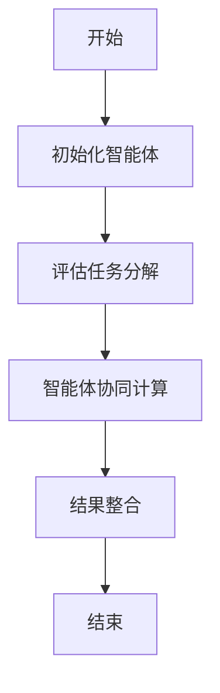
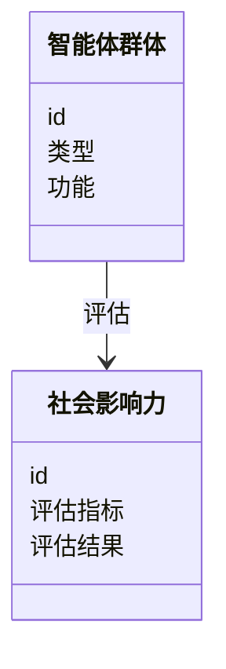
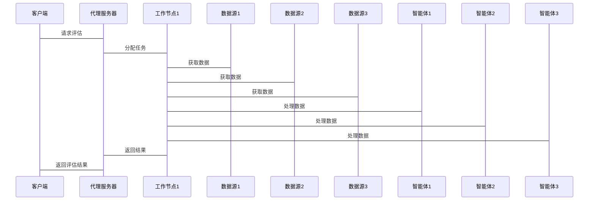

                 


# 运用AI智能体群体评估公司的社会影响力

## 关键词
AI智能体, 社会影响力评估, 群体智能, 算法原理, 系统架构, 项目实战

## 摘要
在当今快速发展的数字经济时代，企业的社会影响力评估变得日益重要。传统的评估方法往往依赖于主观判断和静态数据，难以捕捉动态变化中的企业影响力。本文提出运用AI智能体群体的方法，通过多维度的数据分析和智能化的算法，构建一个实时、动态的企业社会影响力评估体系。文章详细探讨了智能体的概念、算法原理、系统架构以及实际应用案例，为企业的社会影响力评估提供了新的思路和方法。

---

## 第一部分: 背景介绍

### 第1章: 问题背景与概念结构

#### 1.1 问题背景
##### 1.1.1 企业社会影响力的重要性
企业的社会影响力是指企业在社会经济发展、环境保护、社会责任履行等方面所产生的正面或负面影响。随着全球化和数字化的深入发展，企业的社会影响力不仅影响着企业的声誉和品牌形象，还关系到社会的可持续发展。例如，一家企业如果在环保方面表现突出，可能会赢得消费者的信任和支持；反之，如果在社会责任方面表现不佳，可能会导致公众形象受损。

##### 1.1.2 当前评估方法的局限性
传统的社会影响力评估方法通常依赖于问卷调查、专家评分或简单的数据统计。这些方法存在以下问题：
- **主观性**：评估结果往往受到评估者主观判断的影响，缺乏客观性。
- **静态性**：评估结果通常是静态的，难以反映企业在动态环境中的变化。
- **数据维度有限**：传统方法往往只关注企业的财务数据或公开报道，无法充分利用多源异构数据。

##### 1.1.3 AI智能体群体的应用潜力
AI智能体群体是一种基于人工智能技术的分布式计算模型，具有以下优势：
- **数据驱动**：能够从海量数据中提取有价值的信息。
- **实时性**：可以实时分析数据，提供动态评估结果。
- **智能化**：通过机器学习算法，能够自动优化评估模型。

#### 1.2 问题描述
##### 1.2.1 社会影响力评估的核心要素
社会影响力评估的核心要素包括：
- 经济贡献：企业在经济上的产值、就业机会等。
- 社会责任：企业在环保、公益等方面的表现。
- 品牌形象：企业在市场中的声誉和公众认知度。

##### 1.2.2 智能体群体在评估中的作用
智能体群体可以通过以下方式提升社会影响力评估的准确性和实时性：
- **数据采集**：智能体可以从多个数据源（如社交媒体、新闻报道、企业财报等）采集数据。
- **数据处理**：通过分布式计算和机器学习算法，智能体可以对数据进行清洗、融合和分析。
- **结果输出**：智能体可以将分析结果实时反馈给评估系统，供决策者参考。

##### 1.2.3 问题解决的边界与外延
智能体群体评估社会影响力的应用场景包括：
- **企业自我评估**：帮助企业识别自身在社会影响力方面的优势和不足。
- **投资者决策支持**：为投资者提供企业的社会影响力数据，帮助其做出投资决策。
- **政策制定参考**：为政府制定相关政策提供数据支持。

#### 1.3 概念结构与核心要素
##### 1.3.1 核心概念组成
- **智能体**：具备感知、决策和行动能力的实体。
- **社会影响力**：企业在社会经济发展中的综合影响。
- **群体智能**：通过多个智能体协同工作实现复杂任务的能力。

##### 1.3.2 智能体与社会影响力的关系
智能体通过分析多源数据，量化企业的社会影响力。例如，智能体可以通过分析企业的碳排放数据、社会责任报告等，评估企业在环保方面的表现。

##### 1.3.3 智能体群体的特征分析
智能体群体具有以下特征：
- **分布式**：多个智能体协同工作，分布在不同的数据源和计算节点。
- **自适应**：智能体能够根据环境变化调整自身的行为。
- **协作性**：智能体之间可以通过通信协议进行协作，共同完成复杂的评估任务。

---

### 第2章: 核心概念与联系

#### 2.1 核心概念原理
##### 2.1.1 智能体的定义与属性
智能体是一种具备以下属性的实体：
- **自主性**：能够在没有外部干预的情况下自主决策。
- **反应性**：能够感知环境并实时调整行为。
- **协作性**：能够与其他智能体协同工作。

##### 2.1.2 社会影响力评估的维度
社会影响力评估可以从以下几个维度进行：
- **经济贡献**：企业的产值、就业机会等。
- **社会责任**：企业在环保、公益等方面的表现。
- **品牌形象**：企业的声誉和公众认知度。

##### 2.1.3 智能体群体的协同机制
智能体群体通过以下方式协同工作：
- **数据共享**：智能体之间共享数据，提高评估的准确性。
- **任务分配**：根据智能体的能力和当前任务需求，动态分配任务。
- **结果整合**：将多个智能体的评估结果整合，形成最终的评估报告。

#### 2.2 概念属性对比表格
表2-1展示了智能体与传统评估方法的对比：

| 对比维度 | 智能体评估 | 传统评估 |
|----------|------------|----------|
| 数据来源 | 多源异构数据 | 单一数据源 |
| 处理方式 | 分布式计算 | 人工分析 |
| 实时性    | 实时评估 | 非实时评估 |
| 精度      | 高 | 低 |

#### 2.3 ER实体关系图
以下是社会影响力评估系统的ER图：

```mermaid
er
    entity 智能体群体 {
        id
        类型
        功能
    }
    entity 社会影响力 {
        id
        评估指标
        评估结果
    }
    智能体群体 --> 社会影响力: 评估
```

---

## 第二部分: 算法原理讲解

### 第3章: 算法原理

#### 3.1 算法原理
##### 3.1.1 基于智能体的评估算法
智能体评估算法的核心思想是通过多个智能体协同工作，从多源数据中提取信息，评估企业的社会影响力。

##### 3.1.2 群体智能算法的数学模型
以下是一个简化的数学模型：

$$ S = \sum_{i=1}^{n} w_i \cdot a_i $$

其中：
- $S$ 表示社会影响力。
- $w_i$ 表示智能体权重。
- $a_i$ 表示智能体评估值。

##### 3.1.3 算法流程图
以下是一个算法流程图：



#### 3.2 数学模型与公式
##### 3.2.1 智能体评估模型
社会影响力评估模型如下：

$$ S = \sum_{i=1}^{n} w_i \cdot a_i $$

其中，$w_i$ 是智能体权重，$a_i$ 是智能体评估值。

##### 3.2.2 算法实现
以下是算法实现的伪代码：

```python
def assess_social_impact(enterprise_data):
    # 初始化智能体
    agents = initialize_agents()
    # 分解评估任务
    tasks = decompose_tasks(enterprise_data)
    # 智能体协同计算
    results = []
    for task in tasks:
        result = compute_task(task, agents)
        results.append(result)
    # 整合结果
    final_result = aggregate_results(results)
    return final_result
```

#### 3.3 代码实现
##### 3.3.1 环境安装
```bash
pip install numpy
pip install matplotlib
```

##### 3.3.2 核心代码
```python
import numpy as np
import matplotlib.pyplot as plt

def initialize_agents():
    # 初始化智能体
    return np.random.rand(10, 3)

def decompose_tasks(data):
    # 分解任务
    return [data[i:i+2] for i in range(0, len(data), 2)]

def compute_task(task, agents):
    # 计算任务
    return np.mean(task * agents)

def aggregate_results(results):
    # 整合结果
    return np.sum(results)

# 示例数据
enterprise_data = np.random.rand(20)
# 调用评估函数
final_result = assess_social_impact(enterprise_data)
# 可视化结果
plt.hist(final_result)
plt.show()
```

---

## 第三部分: 系统分析与架构设计

### 第4章: 系统分析与架构设计

#### 4.1 问题场景介绍
企业社会影响力评估系统需要处理海量数据，包括文本、图像、视频等多种数据类型。

#### 4.2 项目介绍
本项目旨在构建一个基于AI智能体群体的企业社会影响力评估系统，实现对企业社会影响力的实时、动态评估。

#### 4.3 系统功能设计
##### 4.3.1 领域模型
以下是领域模型：



#### 4.4 系统架构设计
##### 4.4.1 架构图
以下是系统架构图：


#### 4.5 系统接口设计
##### 4.5.1 接口描述
- **输入接口**：接受企业数据，包括财务数据、社会责任报告等。
- **输出接口**：输出社会影响力评估结果，包括经济贡献、社会责任和品牌形象三部分。

##### 4.5.2 交互流程
以下是交互流程图：



---

## 第四部分: 项目实战

### 第5章: 项目实战

#### 5.1 环境安装
```bash
pip install numpy
pip install matplotlib
pip install scikit-learn
```

#### 5.2 核心代码实现
##### 5.2.1 数据预处理
```python
import pandas as pd
import numpy as np

def preprocess_data(data):
    # 删除缺失值
    data = data.dropna()
    # 标准化数据
    from sklearn.preprocessing import StandardScaler
    scaler = StandardScaler()
    data_scaled = scaler.fit_transform(data)
    return data_scaled
```

##### 5.2.2 模型训练
```python
from sklearn.cluster import KMeans

def train_model(data):
    # 训练K-means模型
    model = KMeans(n_clusters=3)
    model.fit(data)
    return model
```

##### 5.2.3 结果分析
```python
def analyze_results(model, data):
    # 可视化结果
    from sklearn.decomposition import PCA
    pca = PCA(n_components=2)
    data_pca = pca.fit_transform(data)
    plt.scatter(data_pca[:, 0], data_pca[:, 1], c=model.labels_)
    plt.show()
```

#### 5.3 案例分析
##### 5.3.1 数据来源
假设我们有以下数据：

| 企业名称 | 营业收入 | 利润率 | 环保投入 | 社会责任得分 |
|----------|----------|--------|----------|-------------|
| 企业A    | 100      | 20%    | 50       | 80          |
| 企业B    | 150      | 25%    | 30       | 60          |
| 企业C    | 120      | 22%    | 80       | 90          |

##### 5.3.2 数据预处理
```python
data = pd.DataFrame({
    '营业收入': [100, 150, 120],
    '利润率': [20, 25, 22],
    '环保投入': [50, 30, 80],
    '社会责任得分': [80, 60, 90]
})
data_scaled = preprocess_data(data)
```

##### 5.3.3 模型训练
```python
model = train_model(data_scaled)
```

##### 5.3.4 结果分析
```python
analyze_results(model, data_scaled)
```

#### 5.4 项目小结
通过以上步骤，我们可以看到，智能体群体在企业社会影响力评估中的应用是可行的。通过多源数据的分析和机器学习算法的应用，可以实现对企业社会影响力的动态评估。

---

## 第五部分: 最佳实践

### 第6章: 最佳实践

#### 6.1 小结
本文详细探讨了运用AI智能体群体评估企业社会影响力的方法，包括核心概念、算法原理、系统架构和项目实战。

#### 6.2 注意事项
- 数据来源的多样性和准确性直接影响评估结果。
- 智能体的设计需要考虑数据处理能力和协同能力。
- 系统的实时性和稳定性需要通过优化设计来保证。

#### 6.3 未来展望
未来的研究方向包括：
- 更高效的分布式计算算法。
- 更智能的数据融合方法。
- 更精准的社会影响力评估模型。

#### 6.4 拓展阅读
- 《群体智能：算法与应用》
- 《人工智能与社会影响》
- 《分布式系统与算法》

---

## 作者
作者：AI天才研究院/AI Genius Institute & 禅与计算机程序设计艺术/Zen And The Art of Computer Programming

---

以上是《运用AI智能体群体评估公司的社会影响力》的完整目录大纲和详细内容。希望对您有所帮助！

