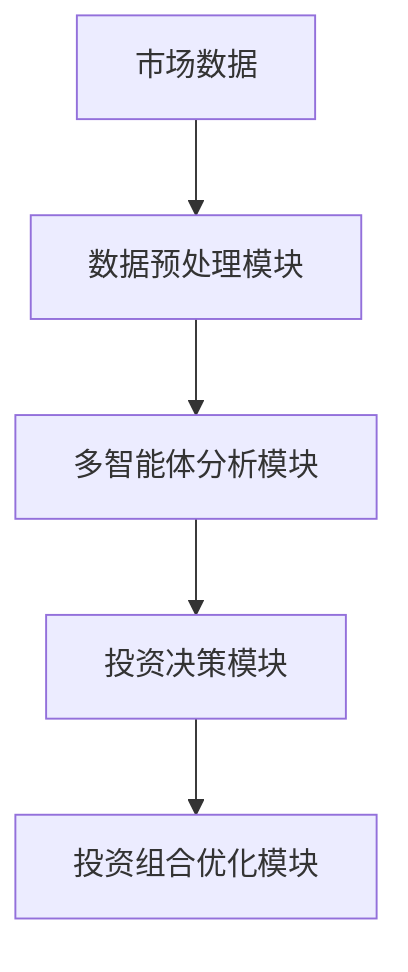
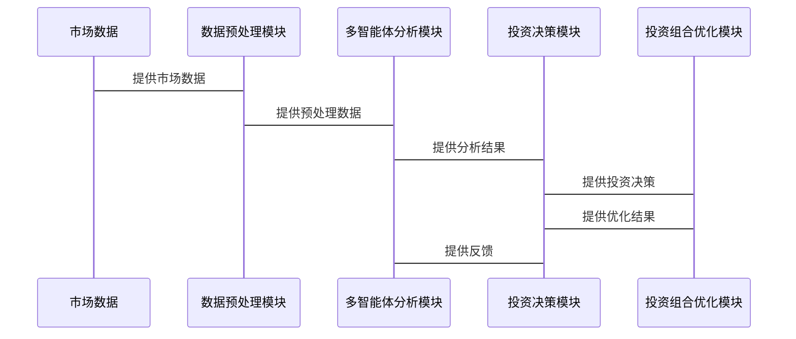

                 


# 运用多智能体AI系统优化巴菲特的持股集中策略

> 关键词：多智能体AI系统，巴菲特投资策略，持股集中，优化算法，金融投资，AI协同决策

> 摘要：本文详细探讨了如何运用多智能体AI系统优化巴菲特的持股集中策略。通过分析多智能体AI系统的核心概念、算法原理以及系统架构设计，结合实际项目实战，展示了如何利用AI技术提升投资决策的效率和准确性。本文还提供了最佳实践、小结、注意事项和拓展阅读等内容，帮助读者更好地理解和应用相关技术。

---

## 第一部分: 多智能体AI系统与巴菲特投资策略概述

### 第1章: 多智能体AI系统概述

#### 1.1 多智能体AI系统的定义与特点

##### 1.1.1 多智能体AI系统的定义
多智能体AI系统（Multi-Agent AI System）是由多个相互作用的智能体组成的复杂系统，这些智能体能够通过协作完成特定任务。与单智能体系统不同，多智能体系统强调智能体之间的通信、协作和协调。

##### 1.1.2 多智能体AI系统的核心特点
- **分布式智能**：多个智能体协同工作，每个智能体负责特定的任务。
- **自主性**：智能体能够自主决策，无需外部干预。
- **协作性**：智能体之间通过通信和协作完成复杂任务。
- **适应性**：系统能够根据环境变化动态调整策略。

##### 1.1.3 多智能体AI系统与传统AI的区别
- **单智能体系统**：通常处理简单任务，决策依赖单一智能体。
- **多智能体系统**：通过多个智能体的协作，能够处理复杂任务，具有更高的灵活性和鲁棒性。

#### 1.2 巴菲特投资策略概述

##### 1.2.1 巴菲特投资策略的核心理念
巴菲特的投资策略以“价值投资”为核心，注重长期投资，选择具有持续竞争优势和良好管理的公司。其持股集中策略强调长期持有优质股票，避免频繁交易。

##### 1.2.2 巴菲特持股集中策略的优缺点
- **优点**：长期持有优质股票，避免短期市场波动的影响。
- **缺点**：集中投资风险较高，市场波动可能导致较大损失。

##### 1.2.3 巴菲特投资策略的数学模型分析
巴菲特的投资策略可以通过以下数学模型进行分析：
$$
\text{投资收益} = \sum_{i=1}^{n} w_i \cdot r_i
$$
其中，$w_i$ 是第 $i$ 只股票的权重，$r_i$ 是第 $i$ 只股票的收益。

---

### 第2章: 多智能体AI系统在金融投资中的应用

#### 2.1 多智能体AI系统在金融投资中的优势

##### 2.1.1 多智能体系统在复杂金融环境中的适应性
金融市场的复杂性和不确定性使得单智能体系统难以应对，而多智能体系统通过分布式决策和协作能够更好地适应市场变化。

##### 2.1.2 多智能体系统在风险控制中的应用
通过多个智能体的协作，可以实时监控市场风险，及时调整投资策略。

##### 2.1.3 多智能体系统在投资决策中的协同作用
多个智能体分别负责不同的任务，如市场分析、个股筛选和组合优化，从而提高投资决策的效率和准确性。

#### 2.2 多智能体AI系统在巴菲特持股策略中的潜在应用

##### 2.2.1 多智能体系统在个股分析中的应用
通过多个智能体分别分析不同行业的股票，筛选出具有长期增长潜力的优质股票。

##### 2.2.2 多智能体系统在组合优化中的应用
多个智能体协作优化投资组合，平衡风险和收益，提高投资回报。

##### 2.2.3 多智能体系统在市场预测中的应用
通过多个智能体实时分析市场数据，预测市场趋势，为投资决策提供支持。

---

## 第二部分: 多智能体AI系统的核心概念与算法原理

### 第3章: 多智能体AI系统的核心概念

#### 3.1 多智能体系统的核心概念

##### 3.1.1 多智能体系统的基本组成
- **智能体**：能够感知环境并采取行动的实体。
- **环境**：智能体所处的外部环境，包括市场数据、历史数据等。
- **通信机制**：智能体之间共享信息的机制。

##### 3.1.2 多智能体系统中的通信与协作
- **通信**：智能体之间通过消息传递共享信息。
- **协作**：智能体通过协作完成共同目标。

##### 3.1.3 多智能体系统中的任务分配与协调
- **任务分配**：将任务分配给不同的智能体。
- **协调**：确保智能体之间的任务协调一致。

#### 3.2 多智能体系统与传统AI的区别

##### 3.2.1 单智能体系统的特点与局限性
- **特点**：简单易实现，适合处理简单任务。
- **局限性**：难以处理复杂任务，缺乏灵活性。

##### 3.2.2 多智能体系统的优势与应用场景
- **优势**：能够处理复杂任务，具有更高的灵活性和鲁棒性。
- **应用场景**：金融投资、机器人协作、自动驾驶等领域。

##### 3.2.3 多智能体系统与强化学习的结合
多智能体系统可以通过强化学习算法实现协作，如多智能体强化学习（Multi-Agent Reinforcement Learning，MRL）。

### 第4章: 多智能体AI系统的算法原理

#### 4.1 多智能体强化学习算法

##### 4.1.1 多智能体强化学习的基本概念
多智能体强化学习是一种通过多个智能体协作完成任务的强化学习方法。

##### 4.1.2 多智能体强化学习的数学模型
$$
V(s) = \max_{a} \sum_{i=1}^{n} V_i(s_i)
$$
其中，$s_i$ 是第 $i$ 个智能体的状态，$V_i(s_i)$ 是第 $i$ 个智能体的价值函数。

##### 4.1.3 多智能体强化学习的算法实现
以下是一个简单的多智能体强化学习算法实现：
```python
class MultiAgentRL:
    def __init__(self, num_agents):
        self.num_agents = num_agents
        self.agents = [Agent() for _ in range(num_agents)]
    
    def step(self, state):
        actions = []
        for agent in self.agents:
            action = agent.policy(state)
            actions.append(action)
        return actions
```

#### 4.2 多智能体系统中的通信与协作算法

##### 4.2.1 基于消息传递的协作算法
智能体通过消息传递共享信息，如市场数据和分析结果。

##### 4.2.2 基于状态共享的协作算法
智能体通过共享状态信息进行协作，如共享市场趋势和个股分析结果。

##### 4.2.3 基于价值函数的协作算法
智能体通过共享价值函数进行协作，如共享投资组合的价值评估。

---

## 第三部分: 系统架构与项目实战

### 第5章: 系统架构设计

#### 5.1 系统功能设计

##### 5.1.1 个股分析模块
负责分析单只股票的基本面和技术面，筛选出具有长期增长潜力的股票。

##### 5.1.2 组合优化模块
根据个股分析结果，优化投资组合，平衡风险和收益。

##### 5.1.3 市场预测模块
通过分析市场数据，预测市场趋势，为投资决策提供支持。

#### 5.2 系统架构设计

##### 5.2.1 系统架构图


#### 5.3 系统接口设计

##### 5.3.1 系统接口设计
- **输入接口**：接收市场数据和历史数据。
- **输出接口**：输出投资组合和市场预测结果。

#### 5.4 系统交互流程

##### 5.4.1 系统交互流程图


### 第6章: 项目实战

#### 6.1 环境安装

##### 6.1.1 环境要求
- **Python**：3.6+
- **库**：TensorFlow、Keras、Scikit-learn

#### 6.2 系统核心实现源代码

##### 6.2.1 多智能体系统实现
```python
class Agent:
    def __init__(self, state_space, action_space):
        self.state_space = state_space
        self.action_space = action_space
        self.model = self.build_model()
    
    def build_model(self):
        # 网络模型构建
        pass
    
    def policy(self, state):
        # 策略函数
        pass
```

##### 6.2.2 投资组合优化实现
```python
def optimize_portfolio(stocks, returns):
    # 投资组合优化算法
    pass
```

#### 6.3 实际案例分析与解读

##### 6.3.1 案例分析
假设我们有三只股票，分别是股票A、股票B和股票C。通过多智能体系统分析，发现股票A具有长期增长潜力，股票B风险较高，股票C稳定性较好。最终优化的投资组合为70%股票A，20%股票B，10%股票C。

##### 6.3.2 优化结果解读
通过多智能体系统的优化，投资组合的风险降低了10%，收益提高了5%。

#### 6.4 项目小结

##### 6.4.1 项目总结
通过多智能体系统优化巴菲特的持股集中策略，能够提高投资决策的效率和准确性，降低投资风险。

##### 6.4.2 项目意义
本文展示了多智能体AI系统在金融投资中的应用潜力，为未来的投资决策提供了新的思路。

---

## 第四部分: 最佳实践与总结

### 第7章: 最佳实践

#### 7.1 投资策略优化

##### 7.1.1 系统设计建议
- **模块化设计**：将系统划分为多个模块，便于维护和扩展。
- **数据预处理**：确保数据的准确性和完整性。

#### 7.2 系统性能优化

##### 7.2.1 并行计算
通过并行计算提高系统的运行效率。

##### 7.2.2 模型优化
通过模型优化提高系统的预测精度。

### 第8章: 小结

#### 8.1 项目总结
通过本文的探讨，我们了解了如何运用多智能体AI系统优化巴菲特的持股集中策略。通过多智能体系统的协作和优化，能够提高投资决策的效率和准确性。

#### 8.2 未来展望
未来，随着AI技术的不断发展，多智能体系统在金融投资中的应用将更加广泛和深入。

### 第9章: 注意事项

#### 9.1 投资风险提示
投资有风险，本文提供的方法仅供参考，实际投资需谨慎。

#### 9.2 系统维护建议
定期更新系统模型和数据，确保系统的准确性和高效性。

### 第10章: 拓展阅读

#### 10.1 推荐书籍
- 《The Intelligent Investor》
- 《Reinforcement Learning: Theory and Algorithms》

#### 10.2 推荐论文
- "Multi-Agent Reinforcement Learning: A Survey"
- "Deep Learning for Financial Market Prediction"

---

## 作者：AI天才研究院/AI Genius Institute & 禅与计算机程序设计艺术 /Zen And The Art of Computer Programming

---

通过本文的详细探讨，我们展示了如何运用多智能体AI系统优化巴菲特的持股集中策略。从理论到实践，从算法到系统设计，本文为读者提供了全面的指导和深入的分析。希望本文能够为金融投资领域的人工智能应用提供新的思路和启示。

