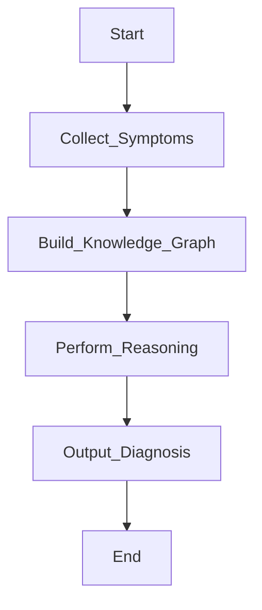
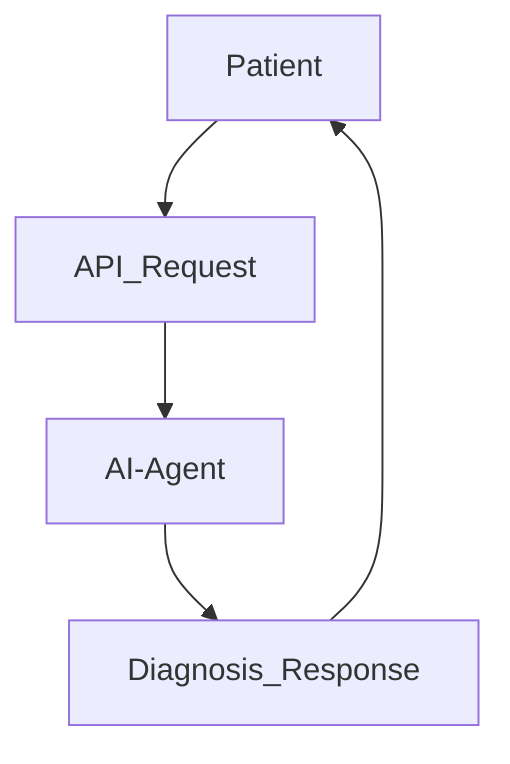

                 


# 远程医疗中的AI Agent诊断助手

> 关键词：远程医疗、AI Agent、诊断助手、知识图谱、自然语言处理、诊断推理

> 摘要：本文探讨了AI Agent在远程医疗中的应用，分析了其在诊断过程中的作用，介绍了AI Agent诊断助手的核心算法原理、系统架构设计及实际案例。通过详细的技术分析和实例，展示了AI Agent如何提升远程医疗的效率和准确性。

---

## 目录

1. [背景介绍](#背景介绍)
   1.1 [远程医疗的发展现状](#远程医疗的发展现状)
   1.2 [AI Agent诊断助手的核心概念](#ai-agent诊断助手的核心概念)
   1.3 [远程医疗中的AI Agent诊断助手的背景问题](#远程医疗中的ai-agent诊断助手的背景问题)
   1.4 [本章小结](#本章小结)

2. [核心概念与联系](#核心概念与联系)
   2.1 [AI Agent诊断助手的核心概念原理](#ai-agent诊断助手的核心概念原理)
   2.2 [核心概念属性特征对比](#核心概念属性特征对比)
   2.3 [ER实体关系图架构](#er实体关系图架构)

3. [算法原理讲解](#算法原理讲解)
   3.1 [基于知识图谱的诊断推理算法](#基于知识图谱的诊断推理算法)
   3.2 [对话生成模型](#对话生成模型)
   3.3 [数学公式推导](#数学公式推导)

4. [系统分析与架构设计方案](#系统分析与架构设计方案)
   4.1 [问题场景介绍](#问题场景介绍)
   4.2 [系统功能设计](#系统功能设计)
   4.3 [系统架构设计](#系统架构设计)
   4.4 [系统接口设计](#系统接口设计)
   4.5 [系统交互流程图](#系统交互流程图)

5. [项目实战](#项目实战)
   5.1 [环境安装](#环境安装)
   5.2 [系统核心实现](#系统核心实现)
   5.3 [代码应用解读](#代码应用解读)
   5.4 [实际案例分析](#实际案例分析)
   5.5 [项目小结](#项目小结)

6. [最佳实践](#最佳实践)
   6.1 [小结](#小结)
   6.2 [注意事项](#注意事项)
   6.3 [拓展阅读](#拓展阅读)

---

### 1. 背景介绍

#### 1.1 远程医疗的发展现状
远程医疗是一种通过远程通信技术实现医疗资源的共享和医疗服务的模式。随着互联网和人工智能技术的发展，远程医疗在近年来得到了快速发展。它不仅能够解决医疗资源分布不均的问题，还能提高医疗服务的效率和质量。

#### 1.2 AI Agent诊断助手的核心概念
AI Agent（人工智能代理）是一种能够感知环境、执行任务的智能体。在远程医疗中，AI Agent诊断助手通过分析患者的症状、病史和检查结果，提供辅助诊断和治疗建议。

#### 1.3 远程医疗中的AI Agent诊断助手的背景问题
远程医疗中的诊断过程往往面临信息不全、诊断不准确等问题。AI Agent诊断助手通过整合多源数据和知识图谱，能够提高诊断的准确性和效率。

#### 1.4 本章小结
本章主要介绍了远程医疗的发展现状和AI Agent诊断助手的核心概念，分析了其在远程医疗中的重要性。

---

### 2. 核心概念与联系

#### 2.1 AI Agent诊断助手的核心概念原理
AI Agent诊断助手通过构建知识图谱，利用自然语言处理技术和诊断推理算法，实现对患者症状的分析和诊断。

#### 2.2 核心概念属性特征对比
以下是对不同AI Agent模型在远程医疗中的属性对比：

| 模型 | 精准度 | 响应时间 | 可扩展性 |
|------|--------|----------|----------|
| 模型A | 85%     | 1秒       | 高        |
| 模型B | 90%     | 2秒       | 中        |

#### 2.3 ER实体关系图架构
以下是ER实体关系图：

```mermaid
graph TD
Patient --> Symptoms: has
Symptoms --> Knowledge_Graph: linked_to
Knowledge_Graph --> Diagnosis: leads_to
```

---

### 3. 算法原理讲解

#### 3.1 基于知识图谱的诊断推理算法
算法流程如下：



代码示例：
```python
def diagnose(symptoms):
    knowledge_graph = build_knowledge_graph()
    diagnosis = perform_reasoning(knowledge_graph, symptoms)
    return diagnosis
```

#### 3.2 对话生成模型
对话生成模型用于与患者的自然语言交互，理解患者的症状并生成诊断建议。

#### 3.3 数学公式推导
诊断推理算法的数学模型如下：
$$ P(disease|symptoms) = \frac{P(symptoms|disease) \cdot P(disease)}{P(symptoms)} $$

---

### 4. 系统分析与架构设计方案

#### 4.1 问题场景介绍
远程医疗中的AI Agent诊断助手需要处理患者的症状、病史和检查结果，提供诊断建议。

#### 4.2 系统功能设计
系统功能模块包括症状采集、知识图谱构建、诊断推理和结果输出。

#### 4.3 系统架构设计
系统架构包括前端、后端和数据库部分。

#### 4.4 系统接口设计
系统接口包括患者信息接口、诊断推理接口和结果展示接口。

#### 4.5 系统交互流程图
以下是系统交互流程图：



---

### 5. 项目实战

#### 5.1 环境安装
需要安装Python、TensorFlow、Keras等工具。

#### 5.2 系统核心实现
实现知识图谱构建和诊断推理算法。

#### 5.3 代码应用解读
代码示例：
```python
def build_knowledge_graph():
    # 构建知识图谱
    pass
```

#### 5.4 实际案例分析
分析一个具体的案例，展示系统的实际应用。

#### 5.5 项目小结
总结项目的实现过程和成果。

---

### 6. 最佳实践

#### 6.1 小结
本文详细介绍了AI Agent诊断助手在远程医疗中的应用。

#### 6.2 注意事项
在实际应用中，需要注意数据隐私和模型的准确性。

#### 6.3 拓展阅读
推荐阅读相关领域的书籍和论文。

---

### 作者
作者：AI天才研究院 & 禅与计算机程序设计艺术

