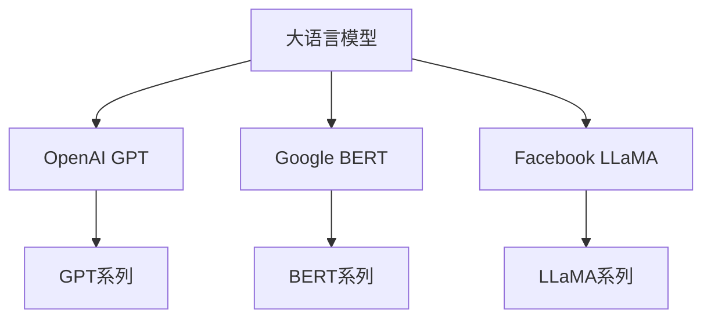
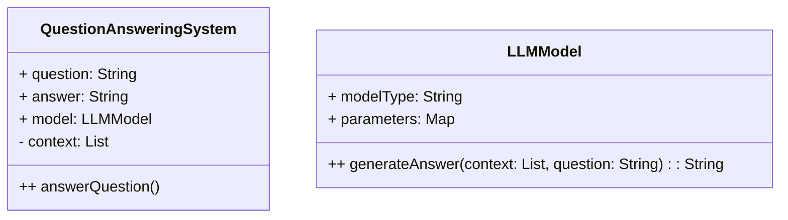
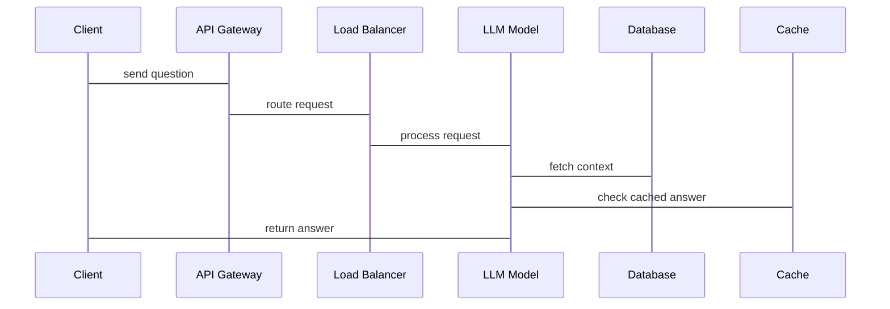

                 


# 选择合适的LLM：OpenAI GPT vs. Google BERT vs. Facebook LLaMA

## 关键词：大语言模型，LLM，OpenAI GPT，Google BERT，Facebook LLaMA，模型选择，NLP，自然语言处理

## 摘要：本文深入分析了OpenAI GPT、Google BERT和Facebook LLaMA三大主流大语言模型（LLM）的特点、技术原理、应用场景和优劣势，并通过详细的对比分析和实际案例，帮助读者理解如何根据具体需求选择合适的LLM模型。文章从背景介绍、算法原理、系统架构到实际应用，全面解析了这三种模型的异同，为读者提供了清晰的选型思路和实用建议。

---

# 第一部分：选择合适的LLM背景与基础

## 第1章：大语言模型（LLM）概述

### 1.1 什么是大语言模型
大语言模型（Large Language Model，LLM）是指基于深度学习技术训练的大型神经网络模型，能够理解和生成人类语言。LLM的核心目标是通过大量数据的训练，模拟人类的自然语言处理能力，从而在多种任务中表现出色。

#### 1.1.1 大语言模型的定义
- LLM是一种基于Transformer架构的模型，通常由数百万甚至更多的参数组成。
- LLM能够处理多种自然语言处理任务，包括文本生成、问答、翻译、文本摘要等。
- LLM的关键在于其大规模的训练数据和强大的上下文理解能力。

#### 1.1.2 大语言模型的核心特点
- **大规模训练数据**：LLM通常使用海量的文本数据进行训练，包括书籍、网页、学术论文等。
- **Transformer架构**：基于自注意力机制（self-attention），能够捕捉文本中的长距离依赖关系。
- **生成与理解并重**：LLM不仅可以生成文本，还可以通过微调（fine-tuning）适应多种理解任务。

#### 1.1.3 大语言模型与传统语言模型的区别
- **规模**：传统语言模型通常参数较少，训练数据量有限，而LLM规模大，参数数量多。
- **能力**：传统语言模型主要专注于特定任务，而LLM具有通用性，能够处理多种任务。
- **应用**：传统语言模型多用于垂直领域，而LLM适用于广泛的应用场景。

### 1.2 LLM的主要应用场景
- **文本生成**：内容生成、对话系统、自动回复。
- **问答系统**：智能客服、知识问答。
- **文本摘要**：新闻摘要、会议记录。
- **机器翻译**：跨语言交流。
- **情感分析**：舆情监控、用户反馈分析。
- **文本分类**：垃圾邮件识别、内容推荐。

### 1.3 选择合适的LLM的重要性
- **任务需求匹配**：不同的LLM在生成、理解和推理能力上有差异。
- **性能与成本平衡**：高性能模型通常需要更高的计算资源和成本。
- **实际应用场景**：某些场景可能需要特定的优化，如实时响应、多语言支持等。

---

## 第2章：OpenAI GPT、Google BERT与Facebook LLaMA的背景

### 2.1 OpenAI GPT的发展历程
- **GPT系列**：从GPT到GPT-3，再到GPT-4，OpenAI不断优化模型的生成能力和通用性。
- **技术特点**：基于Transformer的生成式模型，注重文本生成能力，参数量大，训练数据多样。
- **应用场景**：内容生成、对话系统、自动写作等。

### 2.2 Google BERT的发展历程
- **BERT系列**：从原始BERT到BERT-Base、BERT-Large，再到多语言BERT。
- **技术特点**：基于Transformer的双向编码器，擅长文本理解和上下文分析。
- **应用场景**：文本分类、问答系统、实体识别等。

### 2.3 Facebook LLaMA的发展历程
- **LLaMA系列**：开源的大语言模型，参数量从7B到70B不等。
- **技术特点**：基于Transformer的开源模型，注重生成与理解能力的平衡。
- **应用场景**：生成式任务、对话系统、文本摘要等。

---

## 第3章：选择合适的LLM的核心概念与联系

### 3.1 核心概念原理
- **生成式模型**：GPT的核心是生成式模型，通过预测下一个词来生成文本。
- **双向编码器**：BERT的核心是双向编码器，通过同时理解上下文来捕捉文本的语义。
- **开源模型**：LLaMA的优势在于开源，用户可以根据需求进行二次开发。

### 3.2 核心概念对比表格
| 模型名称 | 开发机构 | 核心特点 | 适用场景 | 优缺点 |
|--------|--------|--------|--------|--------|
| GPT    | OpenAI | 基于Transformer的生成式模型 | 生成文本、对话系统 | 生成能力强，但理解能力较弱 |
| BERT    | Google | 基于Transformer的双向编码器 | 文本分类、问答系统 | 理解能力强，生成能力较弱 |
| LLaMA   | Facebook | 基于Transformer的开源模型 | 生成与理解兼备 | 开源优势明显，但商业支持较少 |

### 3.3 ER实体关系图架构


---

# 第二部分：LLM的算法原理与数学模型

## 第4章：GPT的算法原理与数学模型

### 4.1 GPT的算法原理
- **自注意力机制**：通过计算词与词之间的相关性，生成上下文相关的输出。
- **解码器架构**：基于Transformer的解码器，逐词生成文本。

#### 4.1.1 GPT的数学模型
GPT的核心是Transformer的解码器部分，其自注意力机制的公式如下：
$$
\text{Attention}(Q, K, V) = \text{softmax}\left(\frac{QK^T}{\sqrt{d_k}}\right)V
$$
其中，$Q$、$K$、$V$分别是查询（Query）、键（Key）、值（Value）矩阵，$d_k$是维度。

---

## 第5章：BERT的算法原理与数学模型

### 5.1 BERT的算法原理
- **双向Transformer**：BERT同时处理输入的词向量和位置信息，捕捉文本的双向依赖关系。
- **Masked Language Model**：通过遮蔽部分词汇，预测被遮蔽的词汇，实现文本理解能力。

#### 5.1.1 BERT的数学模型
BERT的双向Transformer架构如下：
$$
\text{BERT}(x) = \text{LayerNorm}(\text{Dropout}(x))
$$
每个层包括多头注意力（multi-head attention）和前馈网络（feed-forward network）。

---

## 第6章：LLaMA的算法原理与数学模型

### 6.1 LLaMA的算法原理
- **开源架构**：LLaMA基于开源的Transformer架构，支持生成与理解任务。
- **多语言支持**：LLaMA可以处理多种语言，适合全球化应用场景。

#### 6.1.1 LLaMA的数学模型
LLaMA的架构与GPT类似，采用生成式模型：
$$
P(\text{下一个词} | \text{当前词序列}) = \text{softmax}(W_{\text{output}}h)
$$
其中，$h$是最后一个Transformer层的隐藏状态。

---

## 第7章：系统分析与架构设计方案

### 7.1 系统分析
- **问题场景**：假设我们需要构建一个智能问答系统，选择合适的LLM模型。
- **项目介绍**：设计一个支持多轮对话的问答系统。

#### 7.1.1 系统功能设计（领域模型）


#### 7.1.2 系统架构设计（架构图）
```mermaid
graph LR
    Client --> API Gateway
    API Gateway --> Load Balancer
    Load Balancer --> [LLM Model]
    [LLM Model] --> Database
    Database --> Cache
```

#### 7.1.3 系统接口设计（API）
- **输入**：用户问题（question）和上下文（context）。
- **输出**：生成答案（answer）。

#### 7.1.4 系统交互（序列图）


---

## 第8章：项目实战

### 8.1 环境安装
- **Python 3.8+**
- **TensorFlow或PyTorch**
- **Hugging Face库**

### 8.2 核心实现
```python
from transformers import GPT2LMHeadModel, GPT2Tokenizer

model_name = "gpt2"
model = GPT2LMHeadModel.from_pretrained(model_name)
tokenizer = GPT2Tokenizer.from_pretrained(model_name)

def generate_text(prompt, max_length=50):
    inputs = tokenizer.encode(prompt, return_tensors='pt')
    outputs = model.generate(inputs, max_length=max_length, do_sample=True)
    return tokenizer.decode(outputs[0], skip_special_tokens=True)
```

### 8.3 应用案例分析
- **任务**：生成一段新闻标题。
- **输入**：提供新闻内容，生成标题。
- **输出**：生成标题并进行优化。

---

## 第9章：小结与最佳实践

### 9.1 小结
- **GPT**：生成能力强，适合文本生成任务。
- **BERT**：理解能力强，适合文本分类、问答系统。
- **LLaMA**：开源优势明显，适合二次开发和定制化需求。

### 9.2 最佳实践Tips
- **明确任务需求**：根据具体任务选择合适的模型。
- **评估模型性能**：通过实验验证模型的效果。
- **考虑资源成本**：权衡模型的计算资源需求和实际预算。

### 9.3 未来展望
- **模型优化**：更高效、更小的模型。
- **多模态发展**：结合视觉、听觉等多模态信息。
- **伦理与安全**：关注模型的伦理和安全问题。

---

# 结语
选择合适的LLM需要综合考虑模型的技术特点、应用场景和实际需求。通过本文的分析，读者可以更好地理解这三种主流模型的优势和劣势，从而做出更明智的选择。

---

# 作者
作者：AI天才研究院/AI Genius Institute  
作者：禅与计算机程序设计艺术/Zen And The Art of Computer Programming

