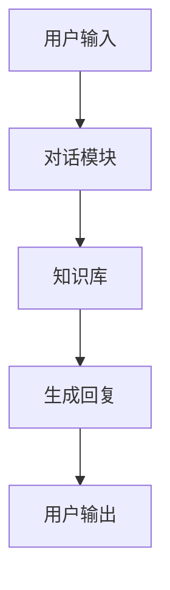
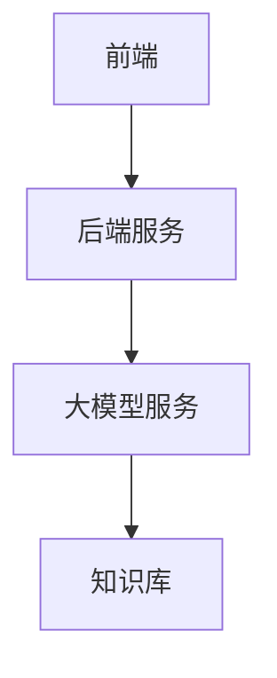

                 


# 选择适合企业的AI Agent平台

---

## 关键词：
AI Agent, 企业应用, 技术架构, 平台选型, 项目实战

---

## 摘要：
随着人工智能技术的快速发展，AI Agent（智能体）作为企业数字化转型的重要工具，正在成为企业提升效率和竞争力的关键技术。本文系统地介绍了AI Agent的核心概念、技术架构、分类与选型、算法原理以及实际项目中的应用。通过详细的技术分析和案例分享，帮助企业在选择和部署AI Agent平台时做出明智决策。

---

## 第1章: AI Agent的概述

### 1.1 AI Agent的基本概念
AI Agent是一种能够感知环境、自主决策并执行任务的智能实体。它结合了自然语言处理、大模型技术和多模态交互能力，能够在企业中承担多种角色，如客服助手、智能推荐系统等。

### 1.2 AI Agent的技术特点
- **基于大模型的对话能力**：通过大语言模型实现多轮对话，提供更自然的交互体验。
- **多模态交互**：支持文本、语音、图像等多种输入输出方式，提升用户体验。
- **自主决策能力**：AI Agent能够根据上下文和目标自主选择最优行动方案。

### 1.3 企业应用场景与价值
- **客户支持**：通过智能客服提供24/7的高效服务。
- **流程自动化**：优化企业内部流程，提升效率。
- **数据驱动决策**：利用数据分析提供个性化建议。

---

## 第2章: AI Agent的分类与选型

### 2.1 AI Agent的分类
- **通用任务型**：适用于多种场景，如问答、导航等。
- **垂直领域型**：专注于特定领域，如医疗、金融。
- **个性化定制型**：根据企业需求定制功能和交互方式。

### 2.2 选型标准与案例分析
- **需求分析**：明确企业目标和应用场景。
- **性能对比**：评估平台的响应速度、准确率等指标。
- **案例分享**：通过实际案例展示不同平台的优缺点。

---

## 第3章: AI Agent的技术架构

### 3.1 架构模块
- **对话交互模块**：负责处理用户输入和生成输出。
- **知识库管理模块**：存储和检索相关信息。
- **任务执行模块**：根据指令执行具体操作。

### 3.2 算法原理
- **大模型驱动**：利用预训练模型生成自然语言回复。
- **多轮对话机制**：通过上下文记忆保持对话连贯性。

#### 代码示例：
```python
def generate_response(input_text):
    # 使用大模型生成回复
    response = model.generate(input_text)
    return response
```

### 3.3 数据流程图


---

## 第4章: AI Agent平台的功能设计

### 4.1 功能模块划分
- **对话交互模块**：支持多种输入方式，如文本、语音。
- **知识库管理模块**：提供知识的存储、检索和更新功能。

### 4.2 用例分析
- **客服场景**：用户咨询问题，AI Agent根据知识库提供答案。

#### 用例代码：
```python
class Agent:
    def __init__(self, knowledge_base):
        self.knowledge_base = knowledge_base

    def process_query(self, query):
        response = self.knowledge_base.retrieve(query)
        return response
```

---

## 第5章: AI Agent平台的系统架构设计

### 5.1 系统架构图


### 5.2 接口设计
- **REST API**：提供标准接口供前端调用。
- **WebSocket**：支持实时通信。

---

## 第6章: AI Agent平台的部署与运营

### 6.1 环境搭建
- **云服务器**：推荐使用AWS、Azure等云平台。
- **依赖安装**：安装Python、TensorFlow等必要库。

### 6.2 监控维护
- **日志监控**：实时监控系统运行状态。
- **性能优化**：定期更新模型，提升响应速度。

---

## 第7章: 项目实战

### 7.1 环境搭建
```bash
pip install flask tensorflow
```

### 7.2 核心代码实现
```python
from flask import Flask
import tensorflow as tf

app = Flask(__name__)

@app.route('/')
def home():
    return "AI Agent Platform"
```

---

## 第8章: 总结与展望

### 8.1 总结
本文详细探讨了AI Agent的核心概念、技术架构和实际应用，为企业选择合适的平台提供了指导。

### 8.2 未来展望
随着技术进步，AI Agent将更加智能化，应用场景也将进一步扩展。

---

## 作者：AI天才研究院 & 禅与计算机程序设计艺术

---

通过以上思考和撰写，我希望能够提供一篇结构清晰、内容详实的技术博客文章，帮助读者全面了解AI Agent平台的选择与应用。

