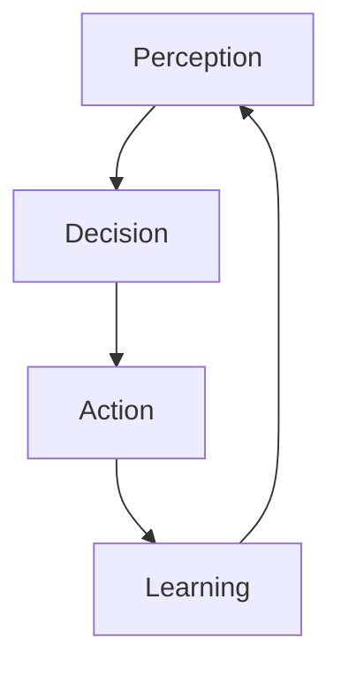
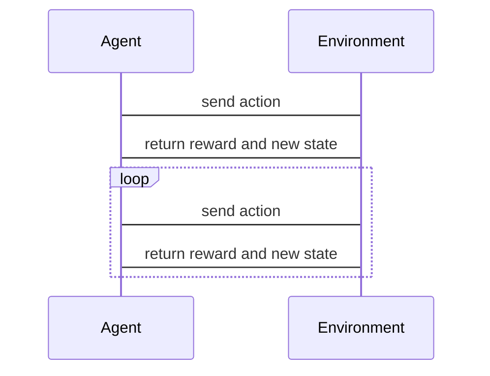

                 


# 选择适合的技术栈：构建高效AI Agent

## 关键词：AI Agent，技术栈，算法，系统架构，项目实战

## 摘要：  
本文将详细介绍如何选择适合的技术栈来构建高效的AI Agent。从AI Agent的基本概念到核心算法，从系统架构设计到项目实战，我们将一步步深入探讨，帮助读者掌握AI Agent的核心技术及其实际应用。通过本文，读者将能够理解AI Agent的工作原理，掌握选择技术栈的关键因素，并通过实际案例学习如何高效地构建AI Agent系统。

---

# 第1章: AI Agent概述

## 1.1 AI Agent的基本概念

### 1.1.1 什么是AI Agent

AI Agent（人工智能代理）是一种能够感知环境并采取行动以实现特定目标的智能实体。它可以是一个软件程序，也可以是一个物理设备，通过传感器和执行器与环境交互。AI Agent的核心在于其自主性、反应性和目标导向性。

### 1.1.2 AI Agent的核心特点

- **自主性**：AI Agent能够自主决策，无需外部干预。
- **反应性**：能够实时感知环境变化并做出反应。
- **目标导向性**：通过目标驱动行为，优化决策过程。
- **学习能力**：能够通过经验改进性能。

### 1.1.3 AI Agent的应用领域

AI Agent广泛应用于多个领域，包括：

- **自动驾驶**：如自动驾驶汽车中的路径规划和决策系统。
- **智能助手**：如Siri、Alexa等语音助手。
- **机器人控制**：工业机器人和家庭服务机器人。
- **游戏AI**：在电子游戏中实现智能对手或队友。

## 1.2 选择适合技术栈的重要性

### 1.2.1 技术栈选择的背景

随着AI技术的快速发展，选择合适的技术栈对于构建高效AI Agent至关重要。不同的应用场景需要不同的技术组合，选择合适的工具和框架可以显著提升系统的性能和开发效率。

### 1.2.2 技术栈选择的关键因素

- **性能需求**：根据任务的复杂度选择计算能力。
- **开发效率**：选择易于使用的框架和工具。
- **社区支持**：选择有活跃社区的技术栈，便于解决问题。
- **可扩展性**：确保系统能够适应未来的扩展需求。

### 1.2.3 技术栈选择的挑战与机遇

- **挑战**：技术栈的多样性和快速变化，增加了选择的难度。
- **机遇**：丰富的工具和框架为开发者提供了更多可能性。

## 1.3 本章小结

通过本章的介绍，我们了解了AI Agent的基本概念、核心特点以及其在多个领域的应用。同时，我们还讨论了选择适合技术栈的重要性及其面临的挑战与机遇，为后续章节的深入探讨奠定了基础。

---

# 第2章: AI Agent的核心算法与数学模型

## 2.1 状态空间与动作选择

### 2.1.1 状态空间的定义与表示

状态空间是AI Agent所处环境的所有可能状态的集合。每个状态可以表示为一个向量，描述环境的当前情况。

### 2.1.2 动作选择的算法原理

动作选择是AI Agent根据当前状态和目标选择最优动作的过程。常用的算法包括贪心算法和强化学习算法。

---

## 2.2 奖励机制与目标函数

### 2.2.1 奖励机制的设计

奖励机制是强化学习中的关键部分，用于指导AI Agent的行为。奖励函数通常定义为$ R(s, a) $，表示在状态$s$下执行动作$a$所获得的奖励。

### 2.2.2 目标函数的数学模型

目标函数通常表示为$ J(\theta) $，其中$\theta$是模型参数。通过优化目标函数，我们可以训练出最优的AI Agent。

---

## 2.3 算法流程图

以下是强化学习算法的流程图：

```mermaid
graph TD
    A[开始] --> B[初始化参数]
    B --> C[环境感知]
    C --> D[选择动作]
    D --> E[执行动作]
    E --> F[获得奖励和新状态]
    F --> G[更新参数]
    G --> H[判断是否结束]
    H --> H[继续] 或 H --> A[结束]
```

## 2.4 本章小结

通过本章的讲解，我们了解了AI Agent的核心算法和数学模型，包括状态空间、动作选择和奖励机制。这些内容为后续章节的系统架构设计和项目实现奠定了理论基础。

---

# 第3章: AI Agent的系统架构设计

## 3.1 系统模块划分

### 3.1.1 模块划分的原则

系统模块划分应遵循高内聚、低耦合的原则，确保每个模块的功能单一且明确。

### 3.1.2 各模块的功能描述

- **感知模块**：负责从环境中获取信息。
- **决策模块**：负责根据感知信息选择最优动作。
- **执行模块**：负责执行决策模块选择的动作。
- **学习模块**：负责通过经验优化模型参数。

---

## 3.2 系统架构图

以下是AI Agent系统的架构图：



---

## 3.3 接口设计与交互流程

### 3.3.1 系统接口的设计

系统接口设计应遵循RESTful API的原则，确保接口的易用性和可扩展性。

### 3.3.2 系统交互的Mermaid序列图

以下是系统交互的序列图：



---

## 3.4 本章小结

通过本章的讲解，我们了解了AI Agent系统的模块划分、架构设计和接口设计。这些内容为后续章节的项目实战奠定了基础。

---

# 第4章: AI Agent的项目实战

## 4.1 环境安装与配置

### 4.1.1 开发环境的选择

推荐使用Python作为开发语言，安装Anaconda环境。

### 4.1.2 开发工具的安装

安装必要的库，如NumPy、Pandas、TensorFlow和Keras。

---

## 4.2 核心算法实现

### 4.2.1 算法实现的代码

以下是强化学习算法的Python代码示例：

```python
import numpy as np

class AI_Agent:
    def __init__(self, state_space, action_space):
        self.state_space = state_space
        self.action_space = action_space
        # 初始化模型参数
        self.theta = np.random.randn(state_space, 1)

    def感知(self, state):
        # 从环境中感知状态
        return state

    def 决策(self, state):
        # 根据当前状态选择动作
        action = np.argmax(self.theta.T.dot(state))
        return action

    def 执行(self, action):
        # 执行动作并获得奖励和新状态
        reward = self._计算奖励(action)
        new_state = self._更新状态(action)
        return reward, new_state

    def 学习(self, reward, new_state):
        # 通过经验更新模型参数
        self.theta += self._优化算法(reward, new_state)
```

---

## 4.3 系统功能实现

### 4.3.1 功能模块的实现

- **感知模块**：通过传感器获取环境信息。
- **决策模块**：基于感知信息选择最优动作。
- **执行模块**：根据决策结果执行动作并获得反馈。
- **学习模块**：通过反馈优化模型参数。

---

## 4.4 实际案例分析

### 4.4.1 案例背景介绍

以一个简单的迷宫导航问题为例，AI Agent需要从起点导航到终点。

### 4.4.2 案例实现过程

1. 初始化AI Agent。
2. AI Agent感知当前状态。
3. 选择最优动作。
4. 执行动作并获得奖励和新状态。
5. 更新模型参数。

---

## 4.5 项目小结

通过本章的项目实战，我们了解了AI Agent系统的实际实现过程，包括环境配置、算法实现和系统功能设计。这些内容为我们提供了宝贵的实践经验。

---

# 第5章: 最佳实践与未来展望

## 5.1 技术栈选择的注意事项

### 5.1.1 常见问题与解决方案

- **性能不足**：选择更高性能的硬件或优化算法。
- **开发效率低下**：选择成熟且易于使用的框架。

### 5.1.2 开发中的注意事项

- **模块化设计**：确保系统模块的独立性和可维护性。
- **测试与调试**：进行全面的测试和调试，确保系统稳定运行。

---

## 5.2 系统优化与维护

### 5.2.1 系统优化策略

- **算法优化**：通过改进算法提高系统性能。
- **硬件优化**：选择更高性能的硬件设备。

### 5.2.2 系统维护方法

- **定期更新**：根据新需求和技术发展，定期更新系统。
- **故障排查**：建立完善的故障监控和排查机制。

---

## 5.3 未来发展趋势

### 5.3.1 技术发展的预测

- **多模态AI**：AI Agent将具备处理多种数据类型的能力。
- **边缘计算**：AI Agent将更多地运行在边缘设备上。

### 5.3.2 未来应用场景展望

- **智能家居**：AI Agent将更加智能化，能够处理更多的家庭事务。
- **医疗健康**：AI Agent将在医疗诊断和治疗中发挥更大作用。

---

## 5.4 本章小结

通过本章的讲解，我们了解了AI Agent系统在开发和维护中的注意事项，以及未来的发展趋势。这些内容为读者提供了宝贵的指导和启示。

---

# 第6章: 总结与展望

## 6.1 全书总结

### 6.1.1 核心内容回顾

- AI Agent的基本概念和核心算法。
- 系统架构设计和项目实战。

### 6.1.2 重要知识点总结

- 状态空间、动作选择和奖励机制。
- 系统模块划分和接口设计。

---

## 6.2 未来学习方向

### 6.2.1 进一步学习的建议

- 深入学习强化学习算法。
- 关注AI Agent在各个领域的最新应用。

### 6.2.2 技术发展的建议

- 关注多模态AI和边缘计算的发展。
- 参与开源项目，积累实践经验。

---

## 6.3 致谢

感谢读者的耐心阅读，感谢所有在AI Agent领域辛勤工作的研究人员和开发者。

---

作者：AI天才研究院/AI Genius Institute & 禅与计算机程序设计艺术 /Zen And The Art of Computer Programming

