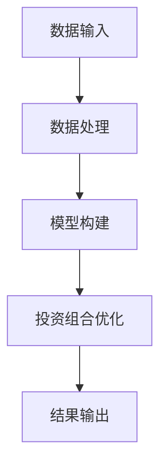

                 

# 通胀保值投资：实物资产在投资组合中的角色

> 关键词：通胀保值、实物资产、投资组合、资产配置、风险管理

> 摘要：本文深入探讨通胀保值投资中实物资产的角色，分析其在投资组合中的重要性，结合数学模型和实际案例，提供系统的投资策略和风险管理方法。

---

## 第一部分：通胀保值投资基础

### 第1章：通胀的定义与影响

#### 1.1 通胀的定义与影响
- 通胀的定义
- 通胀对个人和企业的影响
- 通胀对投资组合的影响

#### 1.2 实物资产的基本概念
- 实物资产的定义
- 实物资产的类型
- 实物资产在投资中的作用

---

## 第二部分：核心概念与数学模型

### 第2章：通胀保值的核心概念

#### 2.1 通胀保值的定义与目标
- 通胀保值的定义
- 通胀保值的目标
- 通胀保值与投资回报的关系

#### 2.2 实物资产在通胀保值中的角色
- 实物资产作为通胀对冲工具
- 实物资产的长期保值能力
- 实物资产与其他资产类别的对比

### 第3章：实物资产的投资策略

#### 3.1 实物资产配置的基本原则
- 资产配置的重要性
- 实物资产在投资组合中的比例
- 风险与收益的平衡

#### 3.2 实物资产的选择与评估
- 不同类型实物资产的优缺点
- 实物资产的流动性分析
- 实物资产的市场波动性

---

## 第三部分：算法原理与数学模型

### 第4章：资产配置的数学模型

#### 4.1 现代投资组合理论（MPT）
- 均值-方差优化模型
- 投资组合的有效边界
- 马科维茨的均值-方差优化模型公式

$$\text{目标函数：} \quad \min \sum_{i=1}^n \sum_{j=1}^n \omega_i \omega_j \sigma_{ij}$$

$$\text{约束条件：} \quad \sum_{i=1}^n \omega_i = 1$$

#### 4.2 实物资产回报率的预测与分析
- 时间序列分析方法
- 回归分析在预测中的应用
- 实物资产回报率的波动性模型

---

## 第四部分：系统架构设计

### 第5章：实物资产投资系统的架构设计

#### 5.1 系统概述
- 系统目标
- 系统功能模块
- 系统架构图（Mermaid）

#### 5.2 数据流与交互设计
- 数据来源与处理流程
- 系统接口设计
- 用户交互流程

---

## 第五部分：项目实战与案例分析

### 第6章：项目实战——实物资产投资组合优化

#### 6.1 项目背景与目标
- 项目背景
- 项目目标
- 项目范围

#### 6.2 项目实施步骤
- 数据收集与处理
- 模型构建与优化
- 投资组合模拟与分析

#### 6.3 实物资产投资组合优化案例
- 选择房地产作为实物资产
- 计算其在投资组合中的权重
- 监控和调整策略

---

## 第六部分：最佳实践与注意事项

### 第7章：最佳实践与小结

#### 7.1 投资策略的实施建议
- 定期评估和调整投资组合
- 分散投资以降低风险
- 结合市场动态进行调整

#### 7.2 风险管理与注意事项
- 实物资产的流动性风险
- 市场波动对实物资产的影响
- 政治和经济环境的变化

#### 7.3 拓展阅读与进一步学习
- 推荐书籍和资源
- 关注经济指标和市场趋势
- 参加专业培训和研讨会

---

## 作者

**作者：AI天才研究院/AI Genius Institute & 禅与计算机程序设计艺术 /Zen And The Art of Computer Programming**

---

这篇文章通过系统的结构和详细的内容，帮助读者全面理解通胀保值投资中实物资产的角色，结合理论与实践，提供实用的投资策略和风险管理方法。

