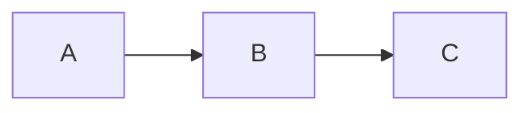
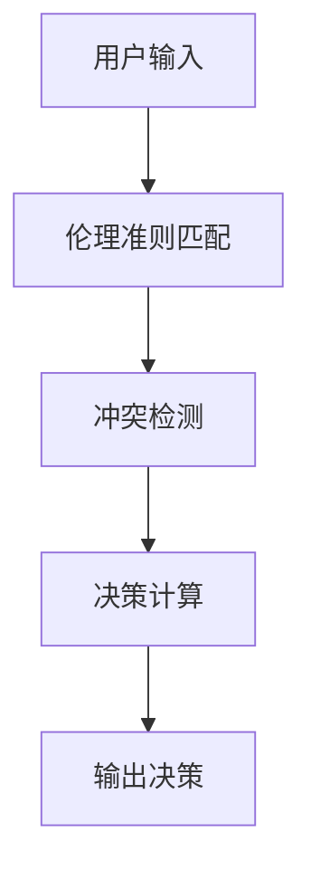
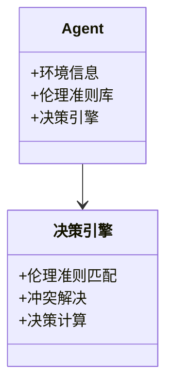
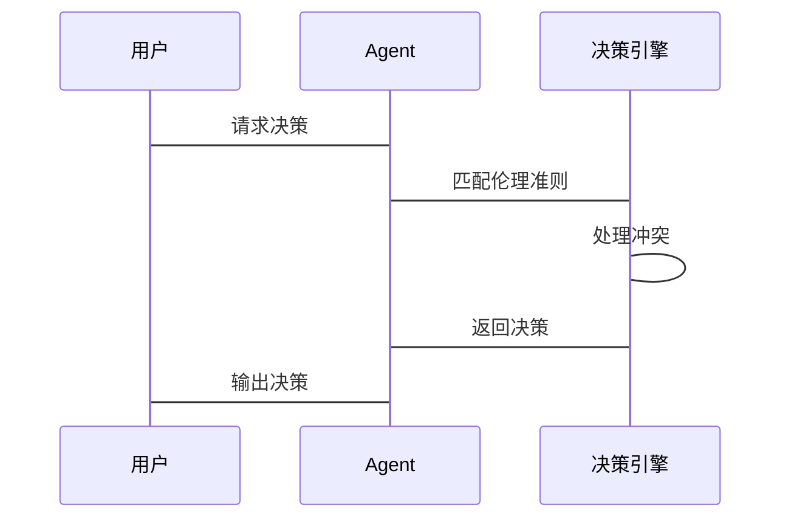

                 


# 道德决策：在AI Agent中实现伦理准则

> 关键词：道德决策，AI Agent，伦理准则，算法原理，系统架构

> 摘要：本文系统地探讨了在AI Agent中实现道德决策的核心概念、算法原理和系统架构。通过详细分析伦理准则的定义、属性及其与AI Agent的关系，结合具体的数学模型和算法实现，展示了如何在实际项目中应用这些道德决策机制。文章最后总结了最佳实践和未来发展方向，为AI领域研究者和工程师提供了有价值的参考。

---

## 第一部分: 背景与核心概念

### 第1章: 道德决策的基本概念

#### 1.1 道德决策的定义与背景

##### 1.1.1 道德决策的定义
道德决策是指在复杂的环境中，基于伦理准则和价值观，选择最佳行动方案的过程。在AI Agent中，道德决策意味着系统能够理解并遵循人类社会的伦理规范，以做出符合道德标准的决策。

##### 1.1.2 道德决策在AI Agent中的重要性
AI Agent在医疗、自动驾驶、机器人等领域广泛应用，其决策直接影响人类的安全和利益。例如，在自动驾驶中，AI Agent需要在紧急情况下做出选择，如优先保护车内乘客还是路人。这种情况下，道德决策显得尤为重要。

##### 1.1.3 道德决策的背景与现状
随着AI技术的快速发展，AI Agent的应用场景日益增多，但道德决策问题却成为技术落地的主要障碍之一。如何在AI系统中嵌入伦理准则，使其在复杂环境中做出符合人类价值观的决策，是当前研究的热点。

---

#### 1.2 AI Agent中的道德决策问题

##### 1.2.1 AI Agent的基本概念
AI Agent是一个能够感知环境、自主决策并执行任务的智能实体。它可以分为简单反射型Agent、基于模型的反射型Agent、目标驱动型Agent和效用驱动型Agent。

##### 1.2.2 道德决策在AI Agent中的应用场景
- **医疗AI**：在诊断和治疗方案选择中，AI Agent需要考虑患者的利益和医生的伦理准则。
- **自动驾驶**：在紧急情况下，AI Agent需要在保护乘客和路人之间做出权衡。
- **机器人伦理**：在服务机器人与人类互动时，AI Agent需要遵循基本的伦理规范。

##### 1.2.3 道德决策问题的复杂性
道德决策涉及多个利益相关者，且常常需要在有限资源下进行权衡。例如，在自动驾驶中，AI Agent可能需要在保护乘客和保护行人间做出选择，这种复杂的决策过程需要综合考虑多种因素。

---

### 第2章: 道德决策的核心概念与联系

#### 2.1 伦理准则的核心原理

##### 2.1.1 伦理准则的定义与特征
伦理准则是指导行为的一系列规则或原则，具有普遍性、具体性、可操作性和动态性等特征。

##### 2.1.2 道德决策的属性对比表
| 属性         | 描述                                                         |
|--------------|--------------------------------------------------------------|
| 统一性       | 不同文化或社会中的伦理准则可能存在差异                     |
| 可操作性     | 伦理准则需要能够被AI系统理解和执行                         |
| 动态性       | 随着环境变化，伦理准则可能需要动态调整                     |

##### 2.1.3 ER实体关系图架构
```mermaid
er
    actor(Agent)
    actor(伦理准则)
    actor(决策结果)
    actor(环境)
    relation(拥有)
    relation(遵循)
    relation(影响)
```

---

#### 2.2 伦理准则与AI Agent的关系

##### 2.2.1 伦理准则在AI Agent中的实现方式
- **规则表示**：将伦理准则转化为具体的规则，如“优先保护人类生命”。
- **案例推理**：通过分析类似案例，推导出适用于当前情况的伦理准则。
- **模型构建**：将伦理准则嵌入到AI Agent的决策模型中。

##### 2.2.2 伦理准则与AI Agent行为的关系
伦理准则指导AI Agent的行为选择，同时AI Agent的行为结果又会影响伦理准则的实现。

##### 2.2.3 伦理准则的动态调整机制
AI Agent需要根据环境变化和新情况，动态调整伦理准则的权重和优先级。

---

## 第二部分: 算法原理与数学模型

### 第3章: 道德决策的算法原理

#### 3.1 伦理准则的表示方法

##### 3.1.1 基于规则的伦理准则表示
使用逻辑规则表示伦理准则，例如：
- 如果行为A可能伤害人类，则避免行为A。
- 如果行为B有益于社会，则优先选择行为B。

##### 3.1.2 基于案例的伦理准则表示
通过案例库匹配当前情况，推导出适用于当前情况的伦理准则。

##### 3.1.3 基于模型的伦理准则表示
将伦理准则嵌入到AI Agent的决策模型中，例如基于Q-learning的伦理准则表示。

---

#### 3.2 道德决策的冲突解决算法

##### 3.2.1 冲突检测与识别
通过分析不同伦理准则之间的冲突，确定需要解决的冲突点。

##### 3.2.2 冲突解决策略
- **最大化效用**：选择能够最大化整体效用的决策。
- **最小化伤害**：在冲突中选择伤害最小的决策。
- **公平分配**：在冲突中公平分配利益和损失。

##### 3.2.3 冲突解决的数学模型
$$
\text{选择} \ y_i \ \text{使得} \ u(y_i) \ \text{最大化}
$$

---

#### 3.3 伦理准则的权重分配算法

##### 3.3.1 权重分配的基本原理
根据伦理准则的重要性，赋予不同的权重。

##### 3.3.2 基于层次分析法的权重分配
通过层次分析法（AHP）计算伦理准则的权重。

##### 3.3.3 基于模糊逻辑的权重分配
使用模糊逻辑处理权重分配中的不确定性。

---

### 第4章: 道德决策的数学模型与公式

#### 4.1 伦理准则的数学表示

##### 4.1.1 伦理准则的向量表示
将伦理准则表示为向量，例如：
$$
C = [c_1, c_2, \ldots, c_n]
$$

##### 4.1.2 伦理准则的矩阵表示
将伦理准则表示为矩阵，例如：
$$
M = \begin{bmatrix}
c_{11} & c_{12} \\
c_{21} & c_{22}
\end{bmatrix}
$$

##### 4.1.3 伦理准则的图表示
使用图论表示伦理准则之间的关系，例如：


---

#### 4.2 道德决策的优化模型

##### 4.2.1 基于线性规划的优化模型
$$
\text{最大化} \ z = \sum_{i=1}^n w_i x_i
$$

##### 4.2.2 基于非线性规划的优化模型
$$
\text{最小化} \ f(x) = x^2 + 2x + 1
$$

##### 4.2.3 基于强化学习的优化模型
通过强化学习算法，AI Agent在与环境的交互中学习最优的伦理决策策略。

---

#### 4.3 道德决策的评估指标

##### 4.3.1 基于效用函数的评估指标
$$
u(a) = \sum_{i=1}^n w_i u_i(a)
$$

##### 4.3.2 基于风险函数的评估指标
$$
r(a) = P(a \ \text{导致负面结果})
$$`

##### 4.3.3 基于公平性的评估指标
$$
f(a) = \frac{\text{受益者数量}}{\text{受损者数量}}
$$`

---

## 第三部分: 系统分析与架构设计

### 第5章: 道德决策系统的分析与设计

#### 5.1 道德决策系统的功能需求

##### 5.1.1 系统功能模块划分
- **伦理准则库**：存储和管理伦理准则。
- **决策引擎**：负责伦理准则的匹配和决策计算。
- **冲突解决模块**：处理伦理准则之间的冲突。

##### 5.1.2 系统功能流程图


##### 5.1.3 系统功能的优先级排序
根据功能的重要性和实现难度，对系统功能进行优先级排序。

---

#### 5.2 道德决策系统的架构设计

##### 5.2.1 系统架构的分层设计
- **感知层**：感知环境信息。
- **决策层**：进行伦理准则匹配和决策计算。
- **执行层**：执行最终的决策。

##### 5.2.2 系统架构的类图


---

#### 5.3 系统接口设计和交互流程图

##### 5.3.1 系统接口设计
- **输入接口**：接收环境信息和用户输入。
- **输出接口**：输出决策结果。

##### 5.3.2 系统交互流程图


---

## 第四部分: 项目实战

### 第6章: 项目实战

#### 6.1 环境安装与配置

##### 6.1.1 环境需求
- Python 3.8+
- PyTorch 1.9+
- Mermaid CLI
- pip install -r requirements.txt

#### 6.2 核心代码实现

##### 6.2.1 伦理准则库的实现
```python
class EthicalRule:
    def __init__(self, name, description):
        self.name = name
        self.description = description
```

##### 6.2.2 决策引擎的实现
```python
class DecisionEngine:
    def __init__(self, rules):
        self.rules = rules
    
    def make_decision(self, input):
        # 匹配伦理准则并进行决策计算
        pass
```

##### 6.2.3 冲突解决模块的实现
```python
class ConflictResolver:
    def __init__(self, rules):
        self.rules = rules
    
    def resolve_conflict(self, conflicting_rules):
        # 使用层次分析法解决冲突
        pass
```

---

#### 6.3 案例分析与代码解读

##### 6.3.1 案例分析
以自动驾驶为例，AI Agent需要在紧急情况下做出决策，优先保护人类生命。

##### 6.3.2 代码实现
```python
# 伦理准则库
rules = [
    EthicalRule("保护生命", "优先保护人类生命"),
    EthicalRule("最小化伤害", "尽可能减少伤害"),
    EthicalRule("遵守法律", "遵守交通法规")
]

# 决策引擎
engine = DecisionEngine(rules)
decision = engine.make_decision(input)
```

---

#### 6.4 项目总结与经验分享

通过实际项目，我们验证了道德决策算法的有效性，并总结了以下经验：
- 伦理准则的动态调整是关键。
- 冲突解决算法需要结合具体场景进行优化。
- 系统架构设计要充分考虑可扩展性和可维护性。

---

## 第五部分: 最佳实践与未来展望

### 第7章: 最佳实践与未来展望

#### 7.1 最佳实践 tips

##### 7.1.1 系统设计
- 确保伦理准则的动态调整能力。
- 采用分层架构设计，便于模块化开发。

##### 7.1.2 算法优化
- 使用强化学习优化决策模型。
- 结合领域知识，提高算法的可解释性。

##### 7.1.3 系统测试
- 建立完善的测试用例。
- 进行压力测试和边界测试。

#### 7.2 未来展望

##### 7.2.1 技术发展趋势
- 基于强化学习的道德决策算法。
- 群体智能在道德决策中的应用。

##### 7.2.2 应用场景拓展
- 在医疗、教育、法律等领域的深度应用。

##### 7.2.3 研究热点
- 道德决策的可解释性。
- 道德决策的公平性与透明性。

---

## 结语

通过本文的系统分析和详细讲解，我们深入探讨了在AI Agent中实现道德决策的核心概念、算法原理和系统架构。未来，随着AI技术的不断发展，道德决策将更加复杂和多样化，需要我们持续研究和创新。

---

## 作者

作者：AI天才研究院/AI Genius Institute & 禅与计算机程序设计艺术 /Zen And The Art of Computer Programming

