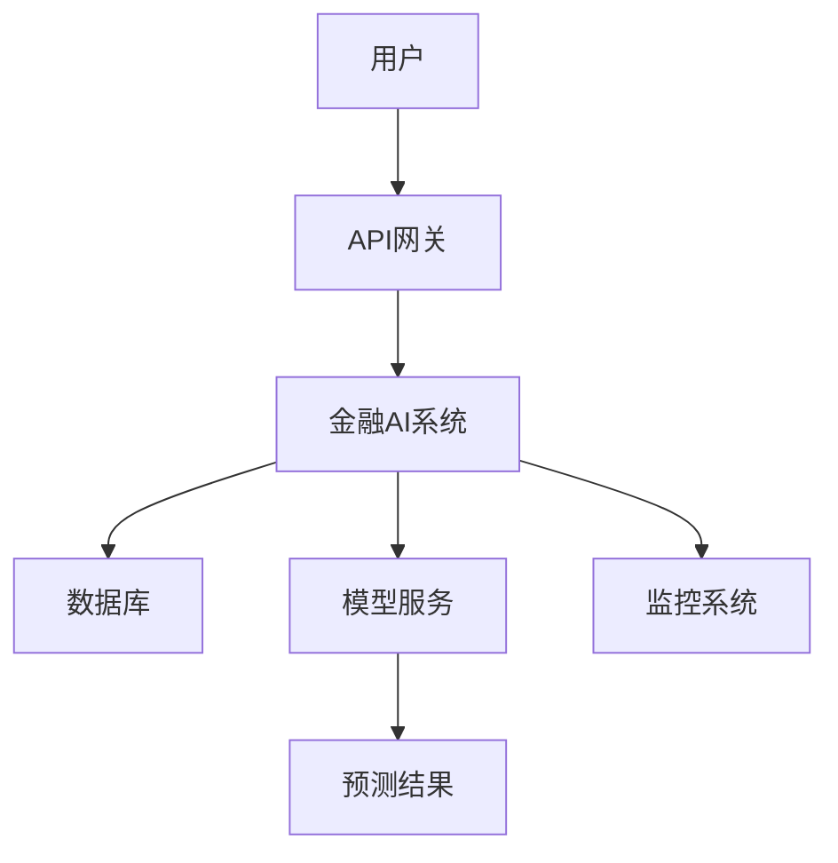
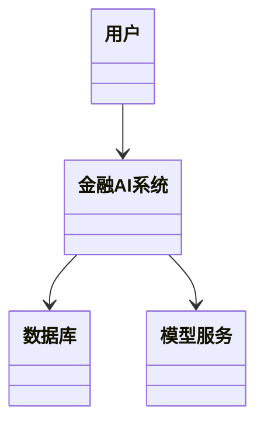
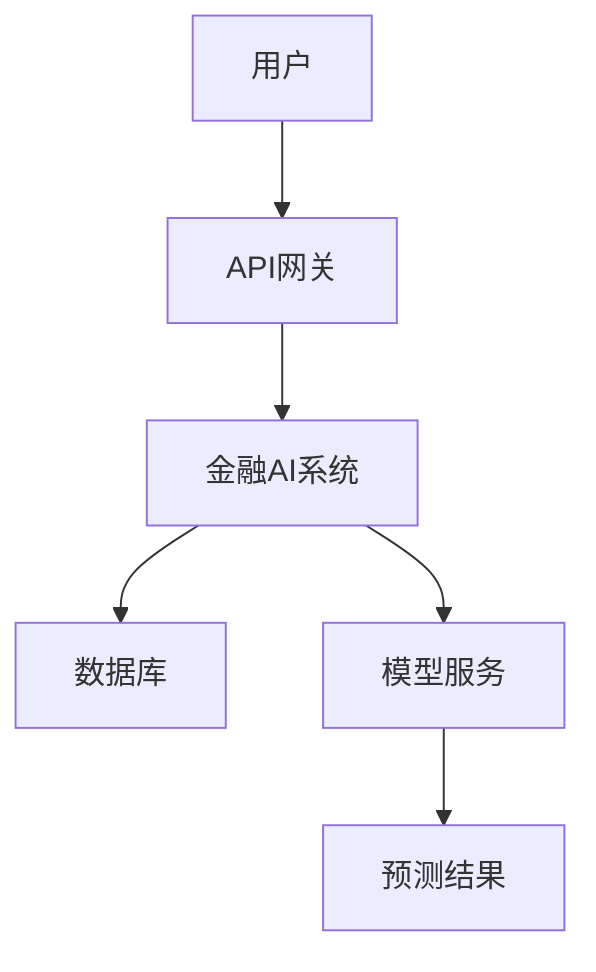
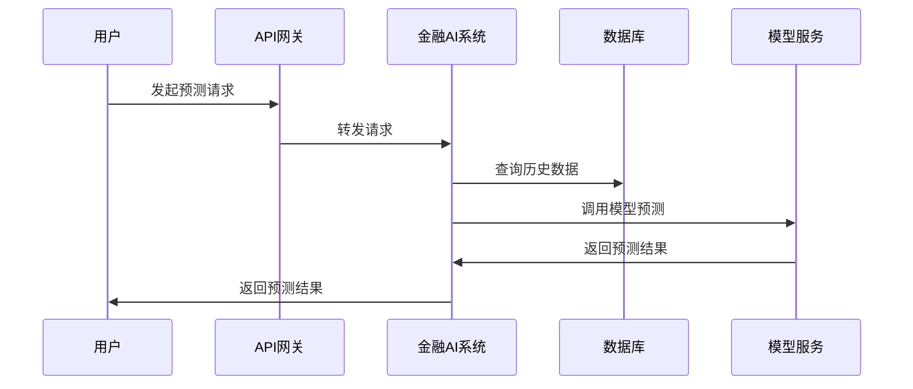

                 


# 《金融AI应用的全面测试与质量保证策略》

## 关键词：金融AI, 测试策略, 质量保证, 系统架构, 数学模型

## 摘要：  
本文旨在全面探讨金融AI应用的测试与质量保证策略，从核心概念到算法原理，再到系统架构和项目实战，结合具体案例和数学模型，深入剖析金融AI应用的测试方法与质量保障体系，为金融AI系统的开发和应用提供理论支持和实践指导。

---

# 第1章: 金融AI应用的背景与现状

## 1.1 问题背景与问题描述  
### 1.1.1 金融行业数字化转型的现状  
随着人工智能技术的快速发展，金融行业正在经历数字化转型。从智能投顾、风险评估到 fraud detection，AI 已经渗透到金融的方方面面。然而，金融AI系统的复杂性也在不断增加，系统的稳定性和安全性成为关键问题。  

### 1.1.2 AI在金融领域的应用痛点  
- 数据隐私与安全问题：金融数据的敏感性要求系统必须具备高度的安全性。  
- 模型的可解释性：AI 模型的“黑箱”特性使得其在金融领域的应用受到限制。  
- 测试与质量保证的挑战：金融AI系统的复杂性使得传统的测试方法难以满足需求。  

### 1.1.3 金融AI应用的核心问题与边界  
金融AI系统的质量保证需要解决以下核心问题：  
1. 模型的准确性与稳定性。  
2. 系统的可解释性与透明性。  
3. 数据的安全性与隐私保护。  
4. 系统的实时性与容错性。  

## 1.2 金融AI应用的核心概念  
### 1.2.1 金融AI应用的定义与特征  
金融AI应用是指利用人工智能技术，对金融数据进行分析、预测和决策的系统。其核心特征包括：  
1. 数据驱动性：依赖大量金融数据进行模型训练。  
2. 实时性：需要快速响应金融市场的变化。  
3. 可解释性：用户需要理解模型的决策过程。  

### 1.2.2 测试与质量保证的核心目标  
- 确保AI模型的准确性与稳定性。  
- 保证系统的可解释性与透明性。  
- 防范数据泄露与隐私风险。  

### 1.2.3 金融AI应用的系统架构与流程  
金融AI系统的架构通常包括数据层、模型层、服务层和用户层。其流程如下：  
1. 数据采集：从金融市场获取实时数据。  
2. 数据处理：清洗、特征提取与预处理。  
3. 模型训练：训练AI模型并进行优化。  
4. 系统部署：将模型部署到生产环境。  
5. 模型监控：实时监控模型性能并进行调优。  

## 1.3 本章小结  
本章介绍了金融AI应用的背景与现状，分析了其在金融行业中的应用痛点，并提出了质量保证的核心目标与系统架构。  

---

# 第2章: 金融AI应用的核心概念原理

## 2.1 AI在金融领域的核心应用  
### 2.1.1 金融分类与预测的原理  
金融分类（如欺诈检测）和预测（如股价预测）是AI在金融领域的两大核心应用。分类任务通常使用决策树、随机森林等算法，而预测任务则依赖于ARIMA、LSTM等时间序列模型。  

### 2.1.2 金融数据的特征与处理  
金融数据通常具有以下特征：  
1. 时间序列性：数据具有时序特性，需要考虑趋势与周期性。  
2. 高维度性：涉及多个特征变量。  
3. 非线性：数据之间的关系可能非线性。  

### 2.1.3 金融AI模型的训练与优化  
模型训练过程包括以下步骤：  
1. 数据预处理：清洗、归一化、特征选择。  
2. 模型选择：选择适合任务的算法。  
3. 模型训练：使用训练数据优化模型参数。  
4. 模型评估：通过验证集评估模型性能。  

## 2.2 核心概念属性对比  
### 2.2.1 传统金融系统与AI金融系统的对比  
| 属性 | 传统金融系统 | AI金融系统 |  
|------|----------------|------------|  
| 决策方式 | 基于规则 | 基于数据驱动 |  
| 处理速度 | 较慢 | 较快 |  
| 可扩展性 | 较低 | 较高 |  

### 2.2.2 AI模型的可解释性与不可解释性  
- 可解释性：如线性回归模型，用户可以理解模型的决策过程。  
- 不可解释性：如深度学习模型（如神经网络），用户难以理解模型的决策逻辑。  

### 2.2.3 金融数据的实时性与稳定性  
- 实时性：金融市场数据变化迅速，要求系统具备实时响应能力。  
- 稳定性：金融数据的波动性较低，适合模型的长期稳定性。  

## 2.3 ER实体关系图  
```mermaid
er
    actor: 用户
    system: 金融AI系统
    database: 金融数据库
    actor --> system: 用户请求
    system --> database: 数据查询
    database --> system: 数据返回
    system --> actor: 结果返回
```

## 2.4 本章小结  
本章详细讲解了AI在金融领域的核心应用，分析了金融数据的特征与处理方法，并通过ER图展示了金融系统的实体关系。  

---

# 第3章: 金融AI模型的算法原理

## 3.1 模型训练与优化  
### 3.1.1 损失函数与优化器  
损失函数是衡量模型预测值与真实值之间差距的函数，常用的损失函数包括均方误差（MSE）和交叉熵损失。  
优化器用于最小化损失函数，常用的方法包括随机梯度下降（SGD）和Adam优化器。  

### 3.1.2 模型训练流程  
1. 数据预处理：清洗数据并提取特征。  
2. 模型选择：选择适合任务的算法。  
3. 模型训练：使用训练数据优化模型参数。  
4. 模型评估：通过验证集评估模型性能。  
5. 模型调优：调整超参数以提高模型性能。  

### 3.1.3 优化器的数学公式  
Adam优化器的更新公式如下：  
$$ \theta_{t+1} = \theta_t - \eta \frac{m_t}{v_t + \epsilon} $$  
其中，$\eta$ 是学习率，$m_t$ 是梯度的移动平均，$v_t$ 是梯度平方的移动平均，$\epsilon$ 是防止除零的小量。  

## 3.2 算法实现与优化  
### 3.2.1 算法实现  
以下是使用Python实现的简单线性回归模型：  
```python
import numpy as np
from sklearn.linear_model import LinearRegression

# 生成数据
X = np.array([[1], [2], [3], [4], [5]])
y = np.array([2, 4, 5, 4, 6])

# 训练模型
model = LinearRegression()
model.fit(X, y)

# 预测
print(model.predict([[6]]))  # 输出：[[7.8]]
```

### 3.2.2 算法优化  
- 参数调整：通过交叉验证选择最优超参数。  
- 模型集成：使用集成学习（如随机森林、梯度提升）提高模型性能。  

## 3.3 本章小结  
本章详细讲解了金融AI模型的训练与优化过程，分析了损失函数与优化器的数学公式，并通过代码示例展示了模型的实现过程。  

---

# 第4章: 金融AI系统的系统分析与架构设计

## 4.1 系统分析  
### 4.1.1 问题场景介绍  
以股票价格预测为例，用户需要一个能够实时预测股票价格的AI系统。  

### 4.1.2 系统功能设计  
系统功能包括：  
1. 数据采集：从金融数据库获取股票数据。  
2. 数据处理：清洗数据并提取特征。  
3. 模型训练：训练股票价格预测模型。  
4. 系统部署：将模型部署到生产环境。  
5. 模型监控：实时监控模型性能并进行调优。  

### 4.1.3 系统架构设计  


## 4.2 系统架构设计  
### 4.2.1 领域模型类图  


### 4.2.2 系统架构图  


### 4.2.3 系统接口设计  
1. 数据接口：提供数据查询和插入的功能。  
2. 模型接口：提供模型训练和预测的功能。  
3. 监控接口：提供模型性能监控的功能。  

### 4.2.4 系统交互序列图  


## 4.3 本章小结  
本章通过系统分析与架构设计，展示了金融AI系统的整体结构和交互流程，为后续的开发与测试提供了理论基础。  

---

# 第5章: 金融AI应用的项目实战

## 5.1 环境安装与配置  
### 5.1.1 Python环境搭建  
安装Python 3.8+，并安装必要的库：  
```bash
pip install numpy pandas scikit-learn tensorflow
```

### 5.1.2 数据集准备  
使用公开的股票数据集，如Yahoo Finance的数据。  

## 5.2 系统核心实现  
### 5.2.1 数据预处理  
```python
import pandas as pd
import numpy as np

# 读取数据
df = pd.read_csv('stock_data.csv')

# 数据清洗
df.dropna(inplace=True)
df = df[['date', 'open', 'high', 'low', 'close']]

# 特征提取
df['label'] = df['close'].shift(-1)
df = df[:-1]  # 删除最后一个无标签的样本
```

### 5.2.2 模型训练与优化  
```python
from sklearn.model_selection import train_test_split
from sklearn.linear_model import LinearRegression
from sklearn.metrics import mean_squared_error

# 划分数据集
X = df[['open', 'high', 'low']]
y = df['label']
X_train, X_test, y_train, y_test = train_test_split(X, y, test_size=0.2)

# 训练模型
model = LinearRegression()
model.fit(X_train, y_train)

# 模型评估
y_pred = model.predict(X_test)
print(mean_squared_error(y_test, y_pred))  # 输出均方误差
```

### 5.2.3 模型部署与监控  
使用Flask框架部署模型，并使用Prometheus监控模型性能。  

## 5.3 案例分析与详细解读  
以股票价格预测为例，详细分析了模型的训练过程、评估指标和部署流程。  

## 5.4 本章小结  
本章通过项目实战，展示了金融AI应用的开发与测试过程，为读者提供了实际操作的经验。  

---

# 第6章: 金融AI应用的质量保证策略

## 6.1 最佳实践 tips  
### 6.1.1 数据质量保证  
- 数据清洗：确保数据的完整性和准确性。  
- 数据隐私保护：遵守数据隐私法规，如GDPR。  

### 6.1.2 系统测试策略  
- 单元测试：测试模型的各个组件。  
- 集成测试：测试系统整体功能。  
- 性能测试：测试系统的响应时间和吞吐量。  

### 6.1.3 模型监控与调优  
- 实时监控：监控模型的性能和数据分布。  
- 自动调优：根据监控结果自动调整模型参数。  

## 6.2 本章小结  
本章总结了金融AI应用的质量保证策略，提出了数据质量保证、系统测试策略和模型监控与调优的最佳实践。  

---

# 作者：AI天才研究院/AI Genius Institute & 禅与计算机程序设计艺术 /Zen And The Art of Computer Programming

